# 1. Why does policy gradient work?

  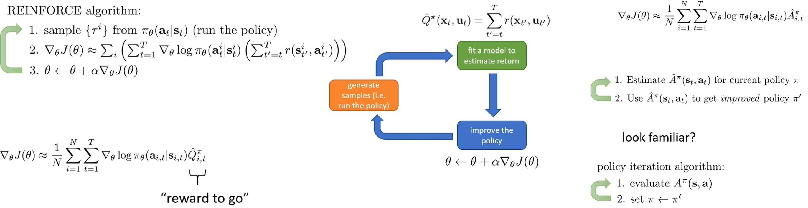

Policy gradient가 어떻게 동작하기에 정책을 개선할 수 있는지에 대해 자세히 살펴보자.
단순하고 명백한 답은 gradient를 계산하고 gradient descent를 하는 것이니까 policy gradient도 작동해야 한다는 것이다.
하지만 이를 좀 더 분석적으로 살펴보자.

Policy gradient는 REINFORCE(Monte Carlo) 또는 Actor-Critic(Bootstarpping: TD learning)을 통해 advantage 값 $\hat{A}$을 추정하고 policy network를 업데이트하였다.
이를 반복하는 과정은 다른 의미로, $\hat{A}$를 추정하고 $\hat{A}$를 사용한 개선하는 2 단계를 번갈아 가며 수행하는 것과 같다.
이는 마치 policy의 value ($V$ 또는 $Q$ 값)을 추정하고 그 추정된 value로 policy를 개선하는 policy iteration 알고리즘과 유사하다.
* Q-learning은 policy iteration와 유사한 model-free value iteration으로, $Q$ 값을 학습하고, greedy하게 policy를 업데이트하고, $\epsilon$-greedy로 exploration한다.

Policy gradient와 policy iteration은 매우 유사한데 주요 차이점 중 하나는 policy iteration에서 policy를 업데이트할 때 argmax를 사용한다는 것이다.
어떤 의미에서는 policy gradient가 advantage 방향으로 조금씩 개선되기 때문에 훨씬 더 부드러운(smooth) update를 한다.
그렇기 때문에 policy gradient를 policy iteration의 부드러운 버전으로 생각할 수 있다.
이는 advantage 추정치가 완벽하지 않을 때 바람직한 방법이다.

본 강의에서 부드러운 policy iteration(policy gradient)이 왜 잘 작동할 것으로 기대되는지 논의한다.

# 2. Policy Gradient as Policy Iteration

  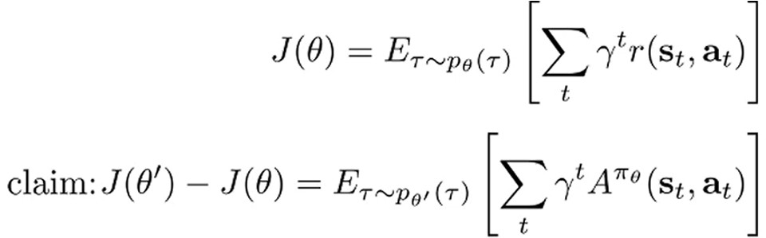

새로운 parameter $\theta^\prime$에 대한 objective function과 이전 parameter에 대한 objective function 차이를 이전 policy에서 계산한 advantage의 expectation 값으로 표현해 policy gradient를 policy iteration으로 재해석해보자.

* $J(\theta)$는 parameter $\theta$를 가지는 policy로 얻을 수 있는 discount factor를 적용한 return의 expectation 값인 RL의 objective function이다.
* $J(\theta^\prime) - J(\theta)$는 RL objective function의 개선을 뜻한다.
  * $\theta^\prime$에 대해 $J(\theta^\prime) - J(\theta)$를 크게 만들고자 할 때, $\theta$와 무관하게 동작한다.
  * 따라서, $\theta^\prime$에 대해 $J(\theta^\prime)$을 최대화하는 것이 $J(\theta^\prime) - J(\theta)$를 최대화하는 것이다.
* 유도의 목표는 $\pi_{\theta^\prime}$ 하에 $\pi_\theta$의 advantage의 expectation을 최대화 하는 것이  $J(\theta^\prime) - J(\theta)$를 최대화하는 것과 같다는 것을 보여주는 것이다.
  * 이는 본질적으로 policy iteration을 하는 것과 같다.
  Policy iteration은 advantage 추정값을 계산하고 그것을 바탕으로 '최대화'로 policy를 업데이트한다.
  * 새로운 policy에 대해 이전 policy의 advantage의 기댓값을 최대화하는 것이 실제로 RL objective function의 개선을 최적화한다는 것을 보여준다면, policy gradient의 이론적 정당성이 보장된다.
    * Policy gradient는 advantage 값에 비례해서 policy의 action 확률을 높이는 방향으로 업데이트를 진행한다.

  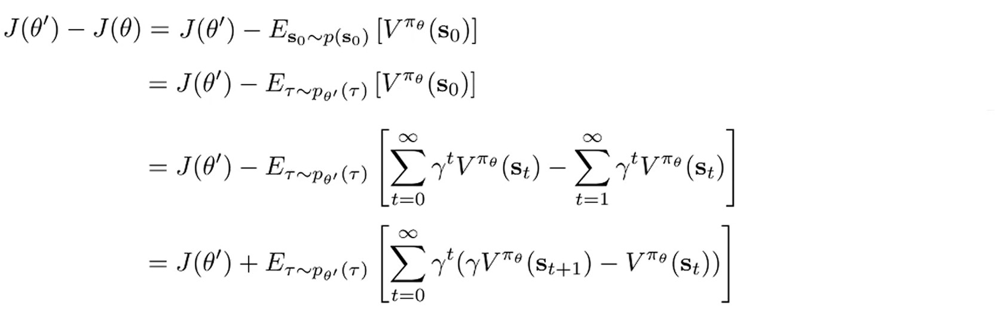

$J(\theta)$는 초기 상태 분포 $p(s_0)$에서 value function의 기댓값으로 표현할 수 있다.
$\theta$에 의존하는 것은 모두 expectation 안에 있고 $p(s_0)$는 $\theta$에 의존하지 않는다.
이는 expectation이 취해지는 분포가 초기 상태에 대한 marginal 분포 $p(s_0)$를 공유하는 어떠한 trajectory 분포($p_\theta(\tau), p_{\theta^\prime}(\tau)$ 등)로든 대체할 수 있음을 의미한다.
궁극적으로 $p_{\theta^\prime}(\tau)$ 하에서의 기댓값으로 바꾼다.
이는 결국 $\gamma^t(\gamma V^{\pi_\theta}(s_{t+1}) - V^{\pi_\theta}(s_t))$의 무한 합으로 표현된다.
이때, 부호가 바뀌는 것을 유념하자.

  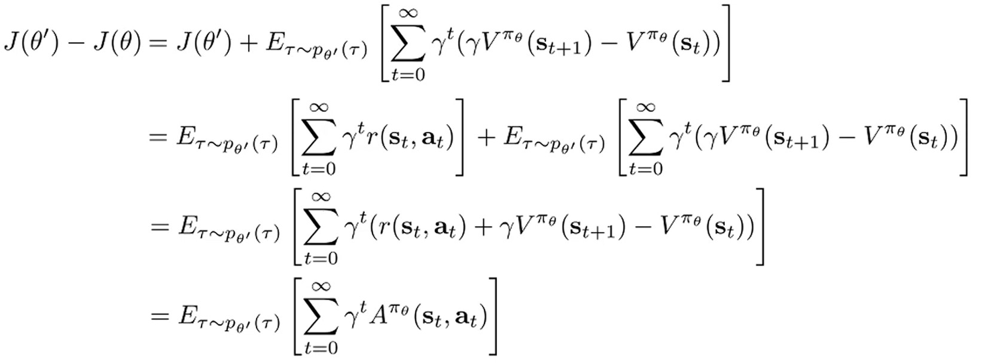

$J(\theta^\prime)$을 정의에 따라 변환하고, expectation의 linearity 성질로 두 항을 결합하면 최종적으로 advantage function과 같은 수식을 얻을 수 있다.
여기서 $V$의 값이 $\pi_\theta$에 대한 것이기 때문에, advantage도 $\pi_\theta$에 관한 추정값이 된다.

결론적으로, 새로운 policy에 대한 trajectories에 대해 이전 policy의 advantage의 expectation 값을 최대화한다면, $J(\theta^\prime)$을 최적화하므로 RL objective function을 최적화하는 것과 같다.
이 증명은 policy iteration이 올바른 일을 한다는 것을 보여준다.

  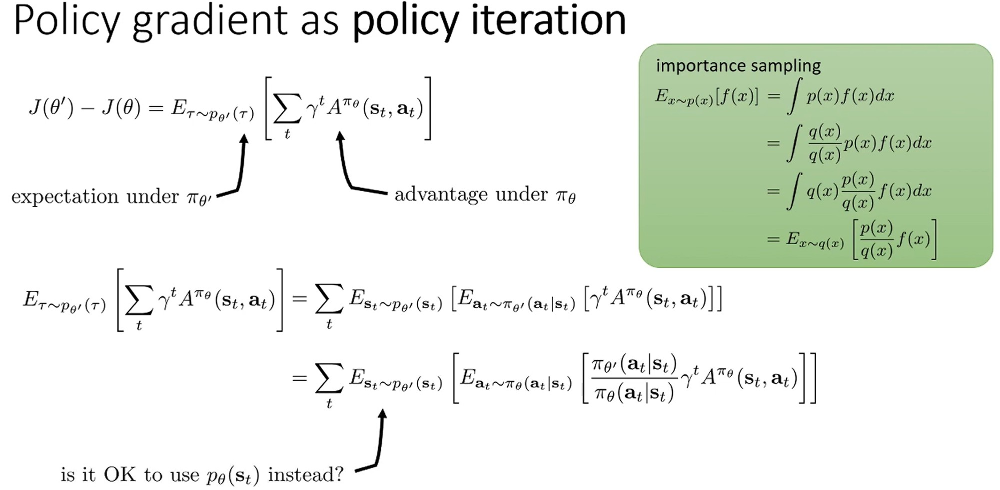

앞에서 유도한 수식이 어떻게 policy gradient와 연결되는지 살펴보자.
$\pi_{\theta^\prime}$에 관해 $\pi_\theta$로 추정한 $\hat{A}$의 expectation 값을 최대화하는 것을 제일 아래 수식과 같이 state-action marginal 분포로 표현할 수 있다.
이 시점에서 policy gradient 절차에 따라 objective function을 최적화하려면 $\hat{A}$가 다른 policy($\pi_\theta$)로 추정한 것이기 때문에 importance sampling이 필요하다.

Policy gradient는 $\theta^\prime \rightarrow \theta$인 순간에 $\theta^\prime$에 대해 미분을 하는 것과 같다.
문제는 아직 state marginal 분포가 $\theta^\prime$에 관한 것 $s_t \sim p_{\theta^\prime}(s_t)$이여서 샘플링을 할 수 없다는 것이다.
이 문제를 해결해야 한다.
* 지금까지 증명한 수식은 $\tau \sim \pi_{\theta^\prime}$가 가능하다는 가정 하에 성립하는 것이다.

# 3. Ignoring distribution mismatch

  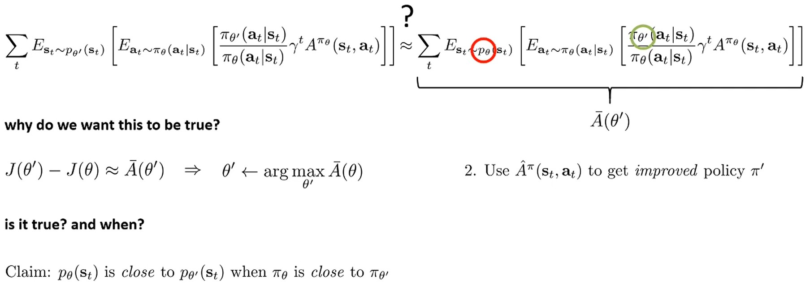

$p_{\theta^\prime}(s_t)$에서 샘플링된 state를 사용해야 한다는 사실을 무시하고, $p_{\theta}(s_t)$에서 샘플링된 state를 사용해서 해결할 수 있다면 좋을 것이다.
만약 state marginal distribution에서 $\theta^\prime$을 제거하면 importance sampling 안에만 $\theta^\prime$이 존재하게 된다.
그리고 미분($\theta^\prime \rightarrow \theta$)을 통해 policy gradient를 복원하여 policy gradient와 policy iteration이 사실상 같다는 것을 보여줄 수 있다.

Policy gradient와 policy iteration이 같다는 사실을 받아들이면, argmax를 통해 $\theta^\prime$을 찾을 수 있게 된다.
* $s_t \sim p_\theta(s_t)$일 때의 값을 $\bar{A}(\theta^\prime)$이라하고, $s_t \sim p_\theta^\prime(s_t)$과 유사하다고 하자.
* 그럼 $\arg\max_{\theta^\prime} \bar{A}(\theta^\prime)$로 policy를 업데이트할 수 있다.
* 이는 $\hat{A}^{\pi_\theta}$를 사용해서 개선된 policy $\pi^\prime$를 얻을 수 있다는 것을 의미하게 된다.

따라서 $J(\theta^\prime) - J(\theta)$가 $\bar{A}(\theta^\prime)$에 근사하여 $\bar{A}(\theta^\prime)$를 최대화하는 것으로 더 나은 새로운 policy를 얻을 수 있다.
이것이 언제 참일까? 
다음 부분에서 $\pi_\theta$가 $\pi_{\theta^\prime}$에 가까울 때 $p_\theta(s_t)$가 $p_{\theta^\prime}(s_t)$에 가깝다는 것을 알아보겠다.
* 다소 명백한 것처럼 보일 수 있지만, 실제로는 비자명한(non-vacuous) 방식으로 증명하기 때문에 그렇게 명백하진 않다.

# 4. Bounding the Distribution Change

  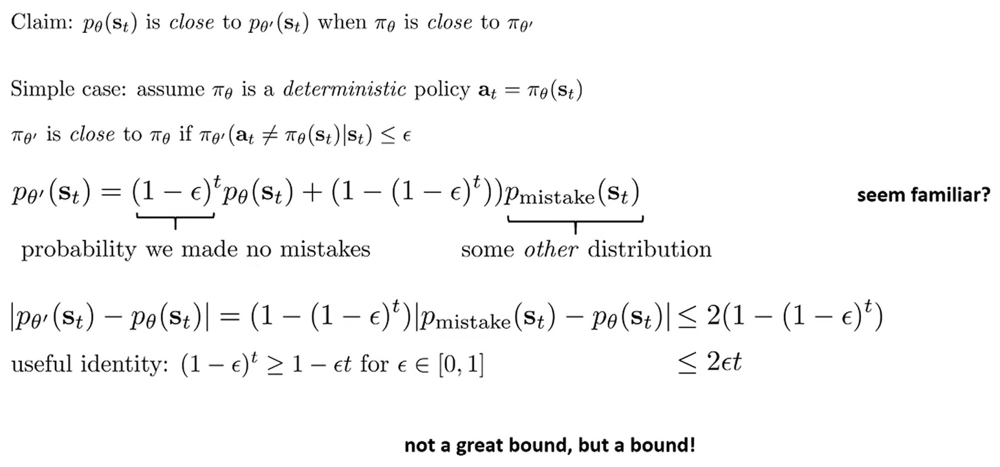

어떤 조건 하에서 distribution mismatch를 무시해 $p_{\theta^\prime}(s_t)$ 대신 $p_{\theta}(s_t)$를 사용할 수 있는지 살펴보자.
즉, $\theta^\prime$에 대한 유일한 의존성이 importance weight 안에만 있도록 한다.
이를 위해서는 $\pi_\theta$와 $\pi_{\theta^\prime}$가 충분히 가까워울 때 $p_\theta(s_t)$가 $p_{\theta^\prime}(s_t)$에 가깝다는 것을 보여야 한다.

간단하게 $\pi_\theta$가 deterministic policy라고 가정하자.
$\pi_{\theta^\prime}$가 $\pi_\theta$에 "가깝다(close)"라는 것은 $\pi_{\theta^\prime}$가 $\pi_\theta$가 선택했을 action이 아닌 다른 action에 할당하는 확률이 $\epsilon$ 이하라는 것이다.
* 본질적으로 $\pi_{\theta^\prime}$이 다른 action을 선택할 bounded된 확률이 있다.
* 이 경우, time step $t$에서 $\theta^\prime$에 대한 state marginal을 두 항의 합으로 쓸 수 있다.
  * 첫 번째 항은 time $t$ 까지의 모든 time step에서 새로운 policy $\pi_{\theta^\prime}$가 $\pi_\theta$와 정확히 같은 것을 한 경우를 의미한다.
  정확히 같을 확률이 $1-\epsilon$이므로 앞에 $(1-\epsilon)^t$의 곱셈자를 가지고, state marginal은 정확히 $p_\theta(s_t)$이다.
  * 두 번재 항은 단순히 나머지 모든 것으로, $1-(1-\epsilon)^t$와 아무것도 모른다고 가정할 다른 state 분포 $(p_\text{mistake})$ 를 곱한다.
    * $p_\text{mistake}$는 적어도 한 번의 실수를 했을 때 얻는 state의 분포로 이것에 대해서 알 수 없다.
    * 이 방식이 behavioral cloning을 분석할 때 가졌던 방정식과 정확히 같다는 것을 인식해야 한다.

이 방정식은 $p_{\theta^\prime}$와 $p_\theta$ 사이의 TV(total variation) divergence를 본질적으로 다른 부분만으로 쓸 수 있다는 것을 의미한다.
* TV Divergence는 두 확률 분포가 얼마나 다른지 측정하는 지표로 $\text{TV}(p_{\theta^\prime}(s_t), p_\theta(s_t)) = |p_{\theta^\prime}(s_t) - p_\theta(s_t)|$로 표현된다.
  *  여기선 pointwise하게 모든 state $s_t$에 대해 $\epsilon$으로 bounded되면 두 분포가 가깝다라고 정의했다.
  실제로는 expecation에 관한 bound를 사용할 수 있지만 이해하기 쉬운 pointwise로 일단 살펴보겠다.
* 직관적으로 $(1-\epsilon)^t \times p_\theta(s_t)$ 부분은 $p_\theta(s_t)$에 대해 zero total variation divergence를 가지므로, 두 번째 항만 부분적으로 divergence에 기여하게 된다.

$$
\begin{aligned}
p_{\theta^\prime}(s_t) &= (1-\epsilon)^t \cdot p_\theta(s_t) + (1-(1-\epsilon)^t) \cdot p_{\text{mistake}} \\
&= p_\theta(s_t) + (1-(1-\epsilon)^t) \cdot (p_{\text{mistake}} - p_\theta(s_t))
\end{aligned}
$$

$$
\begin{aligned}
\text{TV}(p_{\theta^\prime}(s_t), p_\theta(s_t)) &= |p_{\theta^\prime}(s_t) - p_\theta(s_t)| \\
&= |(1-(1-\epsilon)^t) \cdot (p_{\text{mistake}}(s_t) - p_\theta(s_t))| \\
&= (1-(1-\epsilon)^t)|p_{\text{mistake}}(s_t) - p_\theta(s_t)| \\
&= (1-(1-\epsilon)^t) \cdot \text{TV}(p_{\text{mistake}}(s_t), p_\theta(s_t))
\end{aligned}
$$

$p_{mistake}$에 대해 어떤 가정도 하지 않기 때문에 이 TV divergence를 bound할 수 없다. 
* 유일한 bound는 trivial bound로 모든 total variation divergence는 항상 2 이하여야 한다.
  * 일반적으로 $\text{TV}(p, q) = \sum_x |p(x) - q(x)|$이다.
  * 두 개가 완전히 disjoint인 경우, $\text{TV}(p, q) = |1-0| + |0-1| + |0-0| = 1 + 1 + 0 = 2$가 된다.
* 따라서 state marginal 사이의 total variation divergence는 $2 \times (1-(1-\epsilon)^t)$로 bounded된다.
* 이는 Lecture 2 imitation learning 분석과 정확히 같고, 같은 유용한 항등식을 사용한다.
  * $(1-\epsilon)^t \geq 1-\epsilon t$ for $\epsilon \in [0, 1]$
* 이를 통해 bound가 $\epsilon$과 $t$에 선형인 quantity $(2\epsilon t)$로 표현할 수 있다.

따라서 $\pi_\theta$와 $\pi_{\theta^\prime}$가 충분히 가까워울 때 $p_\theta(s_t)$가 $p_{\theta^\prime}(s_t)$에 가까워진다는 것을 증명하였다.

지금까지 determinisitc policy에 대해 살펴보았고 이제 stochastic policy에 대해서 분석해야 한다.
* Trust Region Policy Optimization이라는 논문의 증명을 활용한다.

  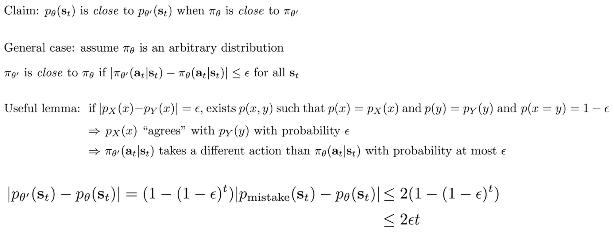

Trust Region Policy Optimization 논문에는 유용한 lemma가 설명되어 있다.
* 같은 변수 $x$에 대한 분포 $p_X(x)$와 $p_Y(x)$가 있고 그들의 TV divergence $|p_X(x) - p_Y(x)|$가 $\epsilon$과 같다면 두 변수에 대한 joint distribution $p(x,y)$을 구성할 수 있고 $p(x=y) = 1 - \epsilon$이다.

이 lemma가 유용한 이유는 policy가 stochastic일 때도 $\pi_{\theta^\prime}$이 $\pi_\theta$와 같은 action을 선택할 확률이 $1-\epsilon$이라는 가정을 일반화할 수 있기 때문이다.
* 즉, stochastic 분포에 대해 $p_X(x)$가 $p_Y(y)$와 확률 $1-\epsilon$으로 일치한다는 것을 의미하고, 이는 $\pi_{\theta^\prime}$이 $\pi_\theta$와 다른 action을 선택할 확률이 최대 $\epsilon$이라는 것을 의미한다.
  * > 강의 노트에 'agree' with $\epsilon \rightarrow 1-\epsilon$ 오타??

이를 통해 stochastic policy에 대해서도 이전과 같은 결론을 낼 수 있다.
* $\pi_\theta$와 $\pi_{\theta^\prime}$가 충분히 가까워울 때 $p_\theta(s_t)$가 $p_{\theta^\prime}(s_t)$에 가까워진다.

# 5. Bounding The Objective Value

  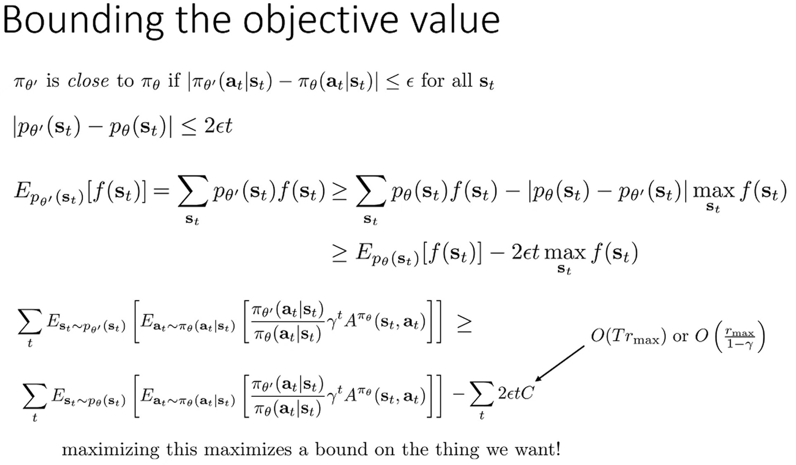

이제 $|p_{\theta^\prime}(s_t) - p_\theta(s_t)| \leq 2\epsilon t$를 objective values 차이 $J(\theta^\prime) - J(\theta)$와 연결지어야 한다.

TV variance가 bounded일 때, 분포 $p_{\theta^\prime}$에 대한 특정 함수 $f(x)$의 기댓값을 위의 수식과 같이 분포 $p_\theta$에 대한 기댓값과 TV variance와 관련해 bound할 수 있다.
* $p_{\theta^\prime} =  p_\theta + p_{\theta^\prime} - p_\theta \geq p_\theta - |p_{\theta^\prime} - p_\theta|$
* $f(s_t)$의 max값은 클 수 있지만, 앞에 $\epsilon$이 곱해진다는 것을 기억하자. 
그래서 두 policy가 가까울수록 두 번째 항을 항상 작게 유지할 수 있다.
만약 $\epsilon$이 매우 크다면, $\theta^\prime$의 improvement를 보장할 수 없다.

이를 바탕으로 $f(s_t)$를 이전에 살펴본 $A^{\pi_\theta}$ 수식으로 사용하면, $J(\theta^\prime) - J(\theta)$를 $p_\theta(s_t)$에 대한 기댓값으로 lower bound할 수 있다.
* 상수 $C$는 $f(s_t)$의 최대값이다.
$f(s_t)$의 대부분이 확률로 이뤄져 있고, 확률은 1로 합쳐진다.
그렇기 때문에 $f(s_t)$는 advantage function의 어떤 기댓값으로 생각할 수 있다.
* 모든 importance weight와 모든 기댓값은 1로 합쳐져 있고, advantage function은 시간에 따른 reward의 합으로 이뤄져 있기 때문에 $C$가 취할 수 있는 가장 큰 값은 가능한 최대 reward $\times$ time step의 수이다.
* 따라서, $C$는 time step 수 $T \times r_{max}$에 근사하고, 무한 time step일 때 discount를 고려하면 discount 값들이 기하급수를 형성하므로 $\frac{1}{1-\gamma}$로 합쳐진다.
  * 강화학습에서 $\frac{1}{1-\gamma}$는 주로 effective time horizon, 즉 효과적인 time step의 수를 나타낸다.
  * $\gamma = 0.9$ → $\frac{1}{1-0.9} = 10$ steps
  * $\gamma = 0.99$ → $\frac{1}{1-0.99} = 100$ steps

$$J(\theta^\prime) - J(\theta) \geq \bar{A}(\theta^\prime) - 2\epsilon t C$$

결론적으로, 위 수식의 우측 항을 최대화하는 것이 policy gradient가 하는 것이고 이게 결국 RL objective를 최대화하는 것과 같다는 게 증명되었다.
* 주의해야 할 것은 $\epsilon t \times C$에 비례하는 오차 항이 있다는 것이다.
* 오차 항의 모든 것은 상수 ($C$) 이고 $\epsilon$ 은 새로운 policy와 이전 policy 사이의 total variation divergence이다.
* 즉, 새로운 policy가 old policy와 가까우면 ($\epsilon$이 작으면), 간단한 objective $\bar{A}$를 최대화하는 것이 진짜 RL objective를 최대화하는 것과 거의 같다.
* 이것은 좋은 성능을 얻고 싶다면 사용해야 하는 강화학습 알고리즘의 종류에 대해 무언가를 암시한다.
  * Policy를 크게 업데이트 $\rightarrow$ $\epsilon$ 커짐 $\rightarrow$ 오차 항 커짐 $\rightarrow$ 근사가 나빠짐 $\rightarrow$ 성능 보장 없음
  * 이를 고려해 제안된 알고리즘이 TRPO (Trust Region Policy Optimization)와 PPO (Proximal Policy Optimization)이다.
    * TRPO: "Trust region" 안에서만 업데이트
    * PPO: Policy가 너무 많이 바뀌면 페널티, Clipping으로 안전하게 업데이트

  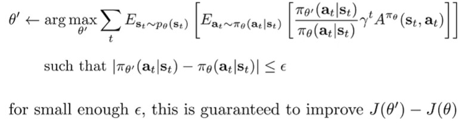

지금까지 살펴 본 것은 기본적으로 $p_\theta$ 하에서의 기댓값, importance weight가 적용된 advantage의 $\pi_\theta$에 대한 기댓값이 RL objective를 최대화하는 좋은 방법이라는 것이다
* 단, $\pi_{\theta^\prime}$가 total variation divergence 측면에서 $\pi_\theta$에 가까울 때만 그렇다.
* $\theta^\prime$를 $\theta$로부터 너무 멀리 가지 않도록 제한하면, 다루기 쉬운 objective를 최대화하는 것이 진짜 RL objective를 최대화하는 것과 같아진다.
* 이 objective는 $\theta^\prime$에 대해 미분을 취해 최대화한다.
그리고 $\theta^\prime$는 importance weight 안에만 나타나므로, 미분을 취하면 정확히 policy gradient를 얻게 된다.
  * $\bar{A}(\theta^\prime) > 0$이고 (새 policy가 평균적으로 더 좋고) $\epsilon$이 충분히 작다면 (policy 변화가 작다면) $\bar{A}(\theta^\prime) > 2\epsilon t C$이므로 $J(\theta^\prime) > J(\theta)$가 보장된다.

이제 이를 구체화하기 위해 제약 조건이 있는 policy gradient를 실제로 어떻게 구현할 수 있는지 살펴보자.

# 6. Policy Gradients with Constraints

  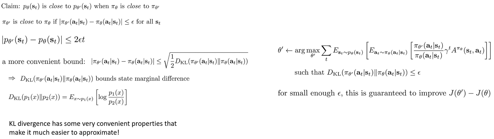

일부 policy class에 대해서 TV divergence 제약 조건을 부과하는 것이 어렵기 때문에 더 편리한 bound인 KL divergence를 고려한다.
$\pi_{\theta^\prime}$와 $\pi_\theta$ 사이의 KL divergence를 bound하면 TV divergence도 bound된다.
* KL divergence는 많은 continuous 분포들에 대해 다루기 쉬운 closed form 해를 가지고 있기 때문에 편리하다.
또한 TV divergence는 절대값을 포함하기 때문에 모든 곳에서 미분 가능하지 않지만, KL divergence는 두 분포가 같은 support를 가지는 한 미분 가능하다.
  * Support란 확률론에서 확률이 0보다 큰 random variables의 집합을 의미한다.
  * log가 있기 때문에 $p(x) > 0$이면 $q(x) > 0$가 보장되어야 한다.
* $|\pi_{\theta^\prime} - \pi_\theta| \leq \sqrt{\frac{1}{2}D_{KL}(\pi_{\theta^\prime},\pi_\theta)}$
* 따라서 $\sqrt{\frac{1}{2}D_{KL}(\pi_{\theta^\prime},\pi_\theta)} \leq \epsilon$으로 bound하면 $J(\theta^\prime) - J(\theta)$의 성능 향상을 보장한다.

  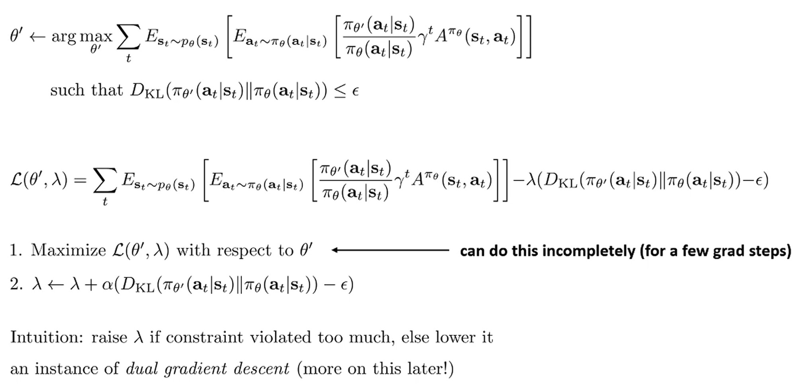

KL divergence constraint 조건을 사용하는 방법 중 하나는 Largrangian으로 objective function을 설정하는 것이다.
Lagrangian은 constraint 조건의 좌변($D_{KL}$)에서 우변($\epsilon$)을 뺀 것에 Lagrange multiplier($\lambda$)를 곱하여 형성된다.
이제 primal 변수($\theta^\prime$)와 dual 변수($\lambda$)에 대해 gradient descent step을 번갈아 수행하여 constraint 최적화 문제를 해결한다.
* 직관적으로 constraint 조건이 너무 많이 위반되면 $\lambda$를 높이고, 그렇지 않으면 낮춘다.
* 이를 dual gradient descent라 하며 이후 강의에서 dual gradient descent에 대해 더 자세히 다룰 것이다.
* 지금은 점근적으로 올바른 Lagrange multiplier를 찾아 contraint 최적화 문제를 풀 것이라는 점만 알고 있으면 된다.
* Heuristic하게 $\lambda$ 값을 수동으로 선택하고 KL divergence를 일종의 regularizer로 취급하는 것도 매우 합리적이다.

최종적으로 $\theta^\prime$에 대해 미분을 진행하여 importance sampled policy gradient 형태를 진행할 수 있고, KLD의 gradient도 간단하게 구할 수 있다.
* 이 아이디어의 변형을 사용하는 여러 알고리즘(Guided Policy Search, PPO)가 있고 잘 작동하는 경향이 있다.

# 7. Natural Gradient

Constraint 조건을 부과하는 또 다른 방법인 Natural Gradient를 살펴보자.
더 근사적이지만 (정확도가 떨어지지만) 간단한 알고리즘으로 이뤄져있다.

  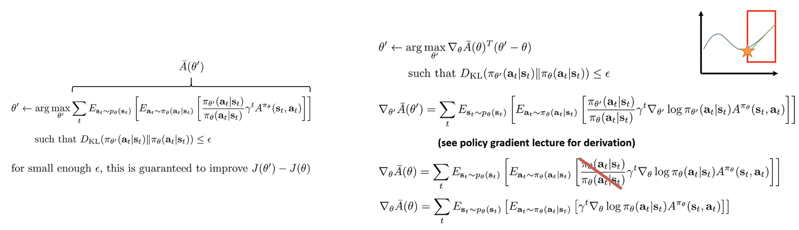

지금까지 $D_{KL}(\pi_{\theta^\prime},\pi_\theta)$가 충분히 작은 $\epsilon$에 bound된다는 제약 조건이 있으면, $J(\theta^\prime) - J(\theta)$를 개선하는 것이 보장된다는 것을 보았다.
그리고 Lagrangian을 통해 일종의 penalty가 있는 objective로 최적화하여 새로운 policy parameter를 찾았다.

이제 constraint 최적화를 수행하는 더 근사적인 방법에 대해 알아보자.
처음에는 많은 근사를 할 것이기 때문에 조금 더 나빠 보일 수 있지만, 추가적인 penalty가 필요 없고 단순히 표준 policy gradient에 선형 변환을 적용하는 매우 간단한 방법을 복원할 수 있기 때문에 바람직한 방법론이다.

$\bar{A}(\theta^\prime)$ objective에 대해 gradient descent step을 적용하는 것은 first-order Taylor expansion을 최적화하는 것으로 해석할 수 있다.
* $\bar{A}(\theta^\prime) = \bar{A}(\theta) - \nabla \bar{A}(\theta)^\top(\theta^\prime - \theta)$

First-order Taylor expansion이 gradient descent와 같은 의미이지만, 일반적인 gradient descent와 다른 점은 constraint 조건 (trust region)이 존재한다는 것이다.
* Constraint가 없다면 Taylor expansion으로 근사한 녹샌 선이 양의 무한대 또는 음의 무한대로가기 때문에, 녹색 선이 파란색 선을 근사하는 정도를 신뢰하는 영역(trust region: 빨간색 상자)인 constraint가 필요하다.
* 빨간 색 상자 내에서 녹샌 선의 최적값을 찾으면 파란색 곡선도 개선할 것이라고 기대하는 것이다.

복잡한 비선형 함수를 first-order Taylor expansion(선형 함수)로 근사하여 개선을 할 수 있지만, constraint 조건이 여전히 복잡하다.
따라서 constraint 조건을 다루기 쉬운 방식으로 근사하는 방법을 살펴볼 것이다.
* 해당 방법은 $\theta^\prime$에 대한 closed form solution을 제공한다.
즉, Lagrangian 처럼 여러 gradient step을 수행할 필요 없이, policy gradient의 단일 step으로 constraint 최적화 문제를 해결할 것이다.

이런 방식으로 단순화해도 RL objective에 잘 동작하고, 이를 통해 gradient $\nabla_{\theta^\prime} \bar{A}(\theta^\prime)$가 importance sampled policy gradient가 된다.
이때, $\theta^\prime = \theta$인 지점에서 평가하면 importance weight가 상쇄되기 때문에 표준 policy gradient 방정식만 남게 된다.
* 어떤 advantage estimator $A^{\pi_\theta}$를 선택할 건지만 고민하면 된다.

  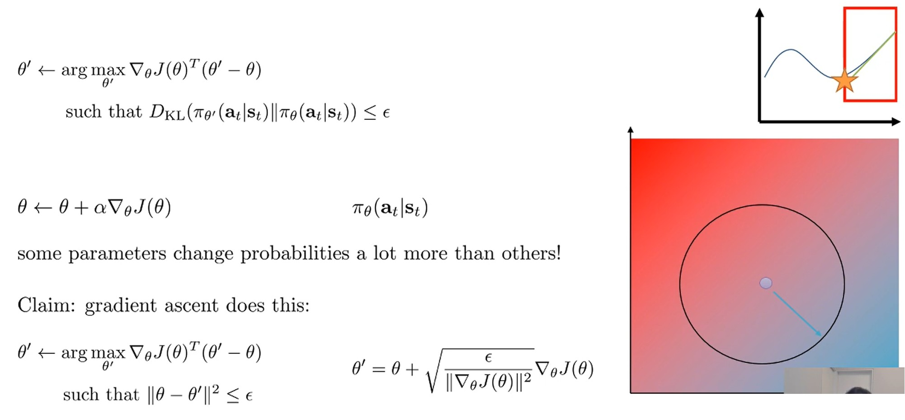

RL objective는 $\nabla_\theta J(\theta)^T \theta^\prime$이다.
이때, gradient ascent를 적용하면 할 때 KLD constraint 조건을 고려하지 않게 된다.
* $\theta \leftarrow \theta + \alpha \nabla_\theta J(\theta)$에서 $\theta$를 아주 조금만 변경하여도 확률에 매우 매우 큰 영향을 미칠 수 있기 때문이다.

Gradient ascent는 실제로 constraint 최적화 문제를 푸는 거지만, 잘못된 constraint 조건을 고려한다.
RL objective의 constraint는 분포 공간 $D_{KL}(\pi_{\theta^\prime}, \pi_\theta)$ 을 고려하고 이고, gradient ascent에서 constraint는 parameter 공간 $L_2(\theta^\prime, \theta)$ 을 고려한다.
* 기하학적으로 생각하면 gradient ascent에서 parameter spoace는 2개의 축(2개의 policy 파라미터)을 가진 2D 영역으로 표현된다.
* RL objective를 선형화(first-order Taylor expansion)하여 색상 gradient로 시각화할 수 있다. 오른쪽 아래가 더 좋은 값, 왼쪽 위가 나쁜 값
* Gradient ascent에서 constraint는 circle에 해당한다.
중심의 점에서 $\epsilon$ 거리에 있는 모든 점들이 제약 조건을 만족한다.
* RL objective가 선형이고 제약이 원이므로, 해는 항상 $\nabla J(\theta)$ 방향으로 원의 표면에 위치한다.
* Gradient ascent의 learning rate는 constraint의 Lagrange multiplier(closed form)로 얻을 수 있다.
Learning rate를 $\alpha = \sqrt{\frac{\epsilon}{||\nabla J||^2}}$로 설정하면 제약 조건을 정확히 만족함을 증명할 수 있다.
  * $||\theta^\prime - \theta||^2 \leq \epsilon$
  * $||\theta + \alpha \nabla_\theta J(\theta) - \theta||^2 \leq \epsilon$
  * $||\alpha \nabla_\theta J(\theta)||^2 \leq \epsilon$
  * $\alpha^2 ||\nabla_\theta J(\theta)||^2 \leq \epsilon$ 
  * $\left(\sqrt{\frac{\epsilon}{||\nabla_\theta J(\theta)||^2}}\right)^2 ||\nabla_\theta J(\theta)||^2 \leq \epsilon$
  * $\frac{\epsilon}{||\nabla_\theta J(\theta)||^2} \cdot ||\nabla_\theta J(\theta)||^2 \leq \epsilon$
  * $\epsilon \leq \epsilon$

  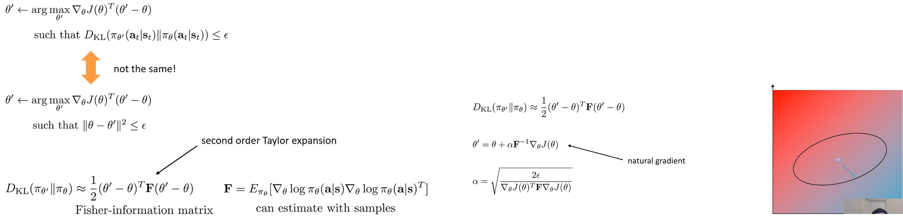

RL objective가 원하는 constraint는 일종의 타원이다.
확률에 큰 변화를 일으키는 $\theta$ 방향에서는 더 엄격한 constraint를 원하는 것처럼 타원이 민감도가 높은 방향을 따라 압축되고 민감도가 낮은 방향으로 늘어나기를 원한다.
따라서 gradient ascent의 constraint를 KLD constraint에 대한 다루기 쉬운 근사로 구성해야 한다.

이를 수행하는 방법은 objective에 했던 것과 동일한 작업을 constraint에도 수행하는 것이다. Objective에 대해서는 first-order Taylor expansion을 계산했다. 
Constraint에 대해서는 $\theta^\prime = \theta$ 지점 주변에서 second-order Taylor expansion을 사용할 것이다.

First-order Taylor expansion을 사용하지 않은 이유는 KL divergence가 $\theta^\prime = \theta$에서 미분값이 0이고 2차 미분은 0이 아니기 때문이다. 
Second-order Taylor expansion은 어떤 행렬 F를 가진 이차 형식(quadratic form)이고, 거기에 들어가는 행렬이 Fischer Information Matrix(FIM)라고 불리는 것으로 밝혀졌다.
* Lecture 5 policy gradient에서 본 것과 같지만, 다른 시각으로 살펴보는 것이다.

FIM는 $\pi_\theta$ 하에서 $\nabla_\theta \log \pi_\theta$들의 외적(outer product)의 기댓값이다.
* FIM에 대한 매우 편리한 점 중 하나는 샘플을 사용하여 근사할 수 있다는 것이다.
* Policy gradient를 계산할 때 수집한 sample을 재사용할 하여 Monte Calro를 통해 FIM을 근사하면 된다.

Second-order Taylor expansion으로 KL divergence constraint의 근사한 FIM을 사용한다면, gradient ascent도 second-order constraint $(\theta - \theta')^2$를 가지게 된다.
* $(\theta' - \theta)^T \times I \times (\theta' - \theta) = (\theta - \theta')^2$
* 이때, 항등 행렬 대신 샘플로 추정한 FIM을 사용한다.
* 시각적으로 생각하면 원(circle)을 어떤 타원(ellipse)으로 바꾸는 것으로 생각할 수 있으며, 타원의 모양은 행렬 $F$에 의해 결정된다.
* 행렬 $F$는 기본적으로 $\theta$ 지점 주변의 theta 공간에서 어떤 방향이 확률의 큰 변화를 가져오고 어떤 방향이 작은 변화를 가져오는지를 설명한다.

Policy gradient를 수행할 때, $||\theta - \theta^\prime||^2 \leq \epsilon$ 대신 $\frac{1}{2}(\theta^\prime - \theta)^\top F(\theta^\prime - \theta) \leq \epsilon$ 으로 Lagrangian을 적용한다면, $\theta^\prime = \theta + \alpha F^{-1}\nabla_\theta J(\theta)$ 형태가 된다.
* 선형 항 $\nabla J(\theta)^\top$와 KLD에 의해 주어지는 이차 항을 가질 때 Lagrangian 문제를 풀면 이차 항의 역행렬과 선형 항의 곱을 사용하는 closed form 해를 가지기 때문이다.
* Closed form 해의 구조를 바탕으로 constranit에 대입하면, constraint를 만족하는 step size를 얻을 수 있다.

$\theta^\prime = \theta + \alpha F^{-1}\nabla_\theta J(\theta)$을 Natural Gradient라고 한다.

  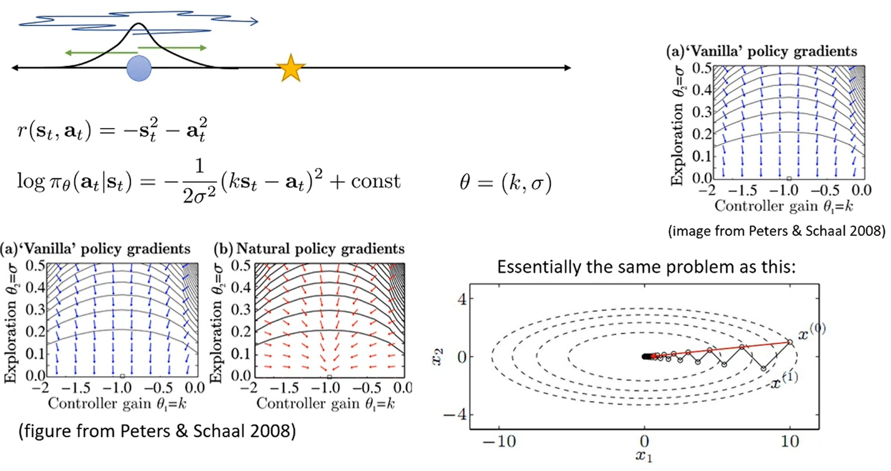

일반적인 policy gradient가 가지는 constraint가 좋을 수 있지만, 올바른 방식이 아닐 수 있다는 것을 기억하자.
* Lecture 5 policy gradient 후반부의 예시를 생각해라.
* 왼쪽이나 오른쪽으로 갈 수 있는 action이 있고, reward는 -s² - a²로 주어진다.
* 두 개의 policy parameter ($k, \sigma$)가 있고 action의 확률은 정규분포 $\mathcal{N}(k \times s, \sigma)$를 따른다고 가정한다.
* 수식적으로 $\sigma$가 감소함에 따라 $\sigma$에 대한 gradient가 $k$에 대한 gradient보다 훨씬 더 커진다.
* 즉, 최적 해가 $k = -1$에 있더라도, $\sigma$를 감소시키는 데만 gradient가 dominant되어 있어 그 최적 해에 절대 도달하지 못할 수 있다.
* 직관적으로 이런 일이 발생하는 이유는 $k$와 $\sigma$가 확률에 서로 다른 정도로 영향을 미치기 때문이다.
* 이러한 문제는 continuous distributuion일 때 더욱 두드러진다.

Natural policy gradient는 F의 역행렬을 곱해, $\sigma$가 parameter에 훨씬 더 많은 영향을 미친다는 사실을 올바르게 고려해 문제를 해결한다.
* 실제로 $k$를 더 우선시하여 parameter를 업데이트하여 올바른 방향의 점을 얻게 된다.
* Natural gradient는 훨씬 더 well-conditioned된 gradient 방향을 제공하고, learning rate를 조정하는 것을 훨씬 더 쉽게 만든다.

# 8. Practical Methods and Notes

  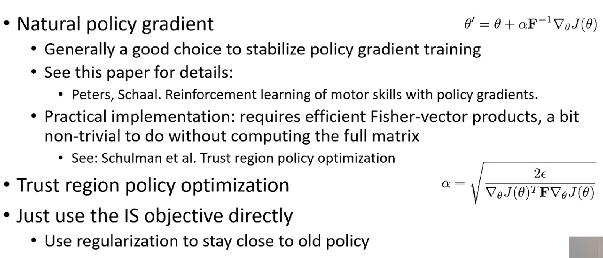

Natural policy gradient를 위한 유용한 trick을 소개하겠다.
* Trust Region Policy Optimization 논문
  * $F$의 역행렬을 구하는 것은 cost가 많이 들기 때문에 CG(Conjugate Gradient) 방법을 사용해 $F^{-1}\nabla J$를 계산한다.
  * 이 과정에서 Step size $\alpha$를 $\epsilon$을 반영한 것으로 대체해, $\alpha$ 대신 $\epsilon$을 hyper-parameter로 둔다.
* Proximal Policy Optimization 논문
  * Dual gradient descent와 같은 것으로 importance sampled objective를 직접 사용할 수도 있다.
  * Lagrange multiplier를 휴리스틱하게 선택할 수도 있다.
  * 꽤 잘 동작한다.