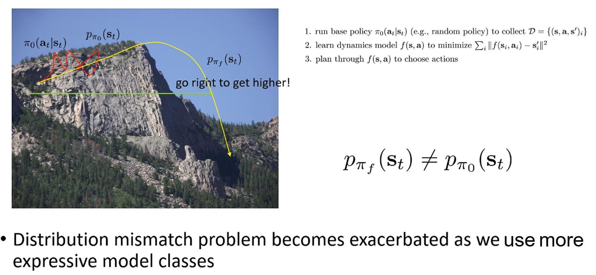
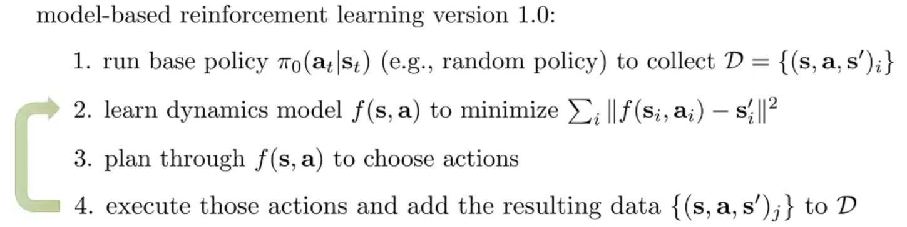
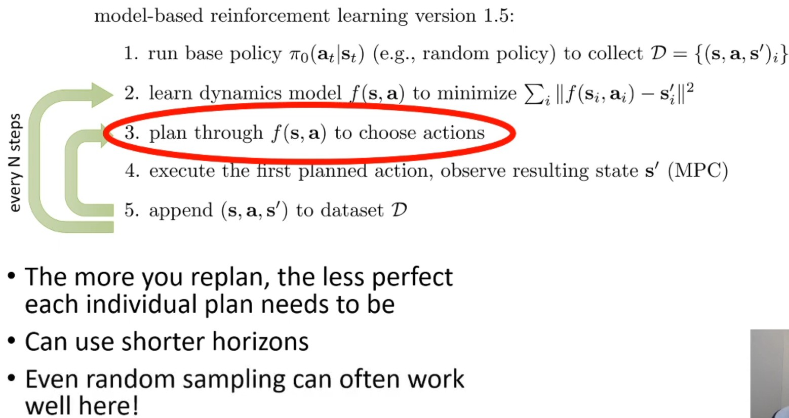

# 1. Learning the Model

이전 강의에서는 dynamics $f(s_t, a_t) = s_{t+1}$이 주어진 상황에서, LQR 등의 tool을 이용해 planning을 수행했다.
Stochastic인 경우 $p(s_{t+1}|s_t,a_t)$에도 deterministic과 유사한 방법이 적용되었다.

이번 강의에서는 dynamics $f(s_t, a_t) = s_{t+1}$를 학습하고, lecture 10에서 배웠던 tool을 이용해 planning(optimal control)을 하는 방법을 알아볼 것이다.
Stochatsic인 경우(dynamics의 확률 모델을 추정)도 유사한 방법을 사용할 수 있는데, 구분이 필요할 때는 명시를 할 것이다.

직관적으로 생각할 수 있는 가장 간단한 버전(model-based RL version 0.5라고 부르자)은 아래와 같다.
1. run base policy $\pi_0(a_t|s_t)$ (e.g. random policy) to collect $\mathcal{D} = \{(s, a, s^\prime)\}$
2. learn dynamics model $f(s,a)$ to minimize with supervised learning $\sum_i||f(s_i, a_i) - s_i^\prime||^2$
    * 일반적으로 state가 discrete이면 cross-entorpy loss를 사용할 것이고, continuous이면 squared error loss (Gaussian일 때 negative log likelihood)를 사용할 것이다.
3. plan through $f(s,a)$ ㅅto choose actions

해당 방법은 classical robotics에서 system identification이 작동하는 본질적인 원리이다.
Robotics에서 System ideitification이란, 수집된 데이터로 dynamics model의 unknown parameter를 식별하는 문제이다.
식별되는 parameter는 DNN의 weight가 아니라, 알려진 physics model의 unknown parameter를 뜻한다.
이러한 접근법은 물리학 지식을 사용해 dynamics representation을 설계할 수 있으면 상대적으로 적당한(적은) 수의 parameter만 fitting하면 되기 때문에 효과적이다.
* 예를 들어 로봇의 운동 방정식은 알고 있지만 질량이나 다양한 부품의 마찰 계수를 모를 때 이를 활용한다.
운동 방정식이란 입력(힘/토크)가 주어지면 로봇의 다음 상태(위치, 속도 등)을 구할 수 있는 방정식을 의미한다.

주의해야 할 점은 좋은 base policy를 설계해야 한다는 것이다.
좋은 policy란 시스템의 다양한 상태를 탐색해 어떻게 반응하는지 데이터를 수집하는 것을 의미한다.
만약 방문하지 않은 큰 영역이 있다면, 그 영역을 고려하지 못하는(모델링하지 못하는) 잘못된 parameter를 사용할 수 있기 때문이다.

# 2. Distirubiton Shift

  

하지만, DNN과 같이 high-capacity model에서는 잘 작동하지 않는다.
* 산 정상에 도달하는 예시를 들어보자.
* 알고리즘에 따르면 무작위 보행($\pi_0$)를 통해 데이터를 수집했을 때, 오른쪽으로 가면 높이 올라간다고 추론하는 것은 합리적이다.
* 하지만, 계속 오른쪽으로 가면 낭떠러지로 가기 때문에 결코 좋지 않다.

Distirubtion shift 문제로 이러한 현상이 발생한다.
* Policy $\pi_0$로 유도된 state 분포를 $p_{\pi_0}(s_t)$라고 했을 때, 이 분포로 계획한 policy를 $\pi_f$라 하자.
* $\pi_f$는 데이터를 수집하면서 등장한 state, 즉 $p_{\pi_0}(s_t)$에서 높은 확률을 가지는 state에 대해서만 유효하다.
* 계획 과정에서 $\pi_f$에 따라 높은 reward (높이 올라가는 것)를 주는 action을 선택했을 때의 state 분포를 $p_{\pi_f}(s_t)$라 하자.
* 이때, $p_{\pi_f} \neq p_{\pi_0}$이기 때문에 경험하지 못하는 state가 나올 확률이 매우 크다.
* Planning할 때 보지 못한 state, 즉 $p_{\pi_0}(s_t)$에서 낮은 확률을 가지는 state이기 때문에 잘못된 action을 선택할 확률이 높다.
* 이것이 반복되면 결국 좋지 못한 state에 도달하게 된다.
* State $s_t$의 분포, 즉 dynamics model의 분포가 shift 되었기 때문에 planning한 것이 최적의 결과를 보여주지 않는 것이다.

이것은 이전에 imitation learning에서 살펴본 것과 유사한 문제이다.
* 전체 궤적 분포: $p(s_1, a_1, s_2, a_2, ...) = p(s_1)\pi(a_1|s_1)p(s_2|s_1,a_1)\pi(a_2|s_2)p(s_3|s_2,a_2)...$
  * Imitation learning: policy $\pi$가 달라져 분포 이동 발생
  * Model-based RL: dynamics $p(s_{t+1}|s_t,a_t)$가 달라져 분포 이동 발생

Distribution shift 문제는 expressive한 model class(DNN 등)을 사용할 때 더욱 두드러진다.
Expressive한 model은 수집된 데이터(학습 데이터) 영역에 더욱 과적합되기 때문이다.

  

Distribution shift 문제를 완화할 수 있는 방법 중 하나는 imitation learning에서 DAgger와 비슷하게 데이터를 추가로 수집하는 것이다.
DAgger는 전문가를 통해 정답 label(최적의 행동)을 수집해야 했지만, model-based RL은 특정 state에서 action을 한 결과만 관찰하면 된다.
데이터를 추가로 수집하는 procedure를 추가한 것은 일반적으로 작동하는 가장 간단한 model-based RL이기 때문에 model-based RL version 1.0이라 부르자.

Model-based RL version 1.0은 잘 동작하지만, 실수를 했을 때 그것을 깨닫는 시점이 느리다는 문제가 있다.
* 자율주행 자동차를 학습할 때, model이 핸들을 왼쪽으로 2도 정도 꺾으면 직진한다고 잘못 알고 있다고 가정하자.
* 복잡한 dynamics model system에서 크지 않는 실수처럼 보일 수 있으나 계속해서 왼쪽으로 가기 때문에 결국 사고가 날 것이다.

  

데이터를 지속적으로 수집하면서 전체 model이 업데이트되면서 점진적으로 문제가 해결될 수 있지만, 실수가 발생했을 때 즉시 re-planning함으로써 더 빨리 문제를 해결할 수 있다.
이를 model-based RL version 1.5라고 부를 것이다.
Paper에서는 종종 MCP(Model Predictive Control)이라고 부른다.
* Dynamics model을 통해 planning한 것 중 첫 번째 action만 선택하고 다시 planning을 하기 때문에 computation cost가 늘어난다.
* 하지만, 이를 통해 훨씬 더 나쁜 model로도 훨씬 더 잘할 수 있다.

마지막으로 어떻게 re-plan을 하는지 살펴보자.
* 직관적으로 re-plan을 많이 할수록, 각 step에서의 planning이 부정확해도 된다는 것이다.
  * 각 step에서 planning이 부정확해도 re-plan에서 수정될 수 있기 때문에 실수에 관대하다.
* 이러한 특징 덕분에 version 1.5를 구현할 때 일반적으로 표준 open loop planning을 할 때보다 훨씬 더 짧은 horizon(더 적은 dataset)을 사용한다.
  * Random shooting은 긴 open loop planning에서는 잘 작동하지 않을 수 있지만, version 1.5에서는 random sampling이 종종 잘 작동할 수 있다.

