# 1. Exploration Problem

Atari 게임에서 breakout 등 RL로 잘 풀리는 문제가 있고, Montezuma's Revenge 처럼 RL로 잘 안 풀리는 문제가 있다.

핵심은 reward가 게임의 진행 방향을 안내해주지 않는다는 점이다.

  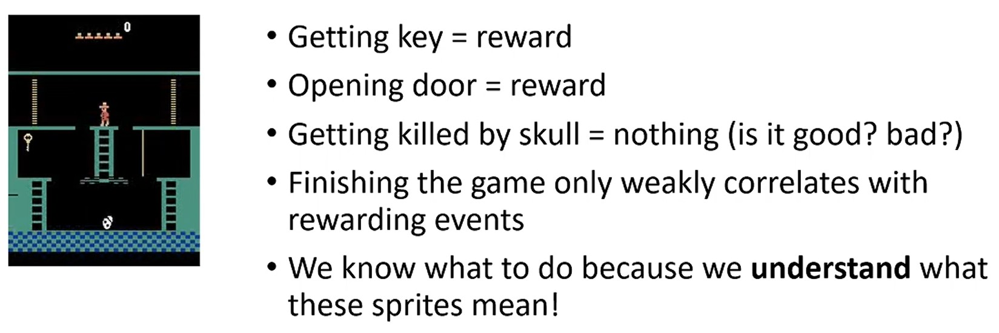

* Montezuma's Revenge에서는 열쇠를 얻어서 문을 열면 게임이 완료된다.
* 그렇기 때문에 1) 열쇠를 얻고 2) 문을 열 때 reward를 줄 것이다.
* 우리는 그림의 의미를 유추해 해골에 닿으면 좋지 않다는 것을 알고 있지만, RL은 그렇지 않다.
* RL은 시행 착오를 통해 action을 학습하는 과정에서 해골에 닿아도 목숨을 잃고 다시 시작하기 때문에 이를 negative reward라고 생각 못할 수도 있다.
* 심지어 열쇠로 문을 여는 것보다, 해골에 죽은 후 열쇠를 얻는 과정을 반복하는 게 reward를 얻는 좋은 방법이라고 오해할 수 있다.
* 문제는 올바른 길을 가고 있을 때 작은 reward라도 받지 않는 것이고 잘못된 길을 가고 있을 때 negative reward를 받로록 설계하지 않았다는 것이다.

  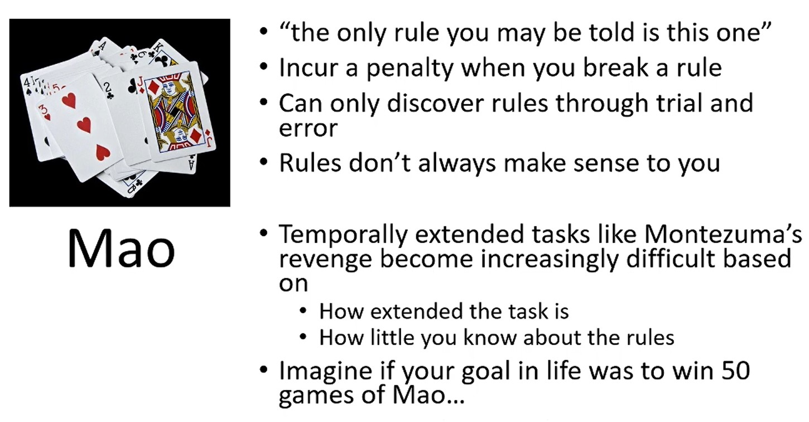

* 좀더 이해하기 쉽게 Mao라는 card 게임을 예로 들자.
* Mao에서는 규칙을 알려주지 않고 게임을 진행한다.
* 이 게임의 전체 요점은 다른 플레이어들이 다소 이상하고 반직관적인 규칙들을 만드는 것이다.
* 규칙을 따르지 않으면 chairman이 플레이어 중 한 명이 규칙을 따르지 않았다고만 지적한다.
* 플레이어는 시행착오를 통해 규칙을 유추해야 한다.
* 규칙을 맞춰야 끝나는 게임으로, 간단한 규칙이라도 상당히 까다로운 게임이다.

이처럼 temporally extended tasks는 1) task가 extend된 정도와 2) 규칙에 대해 얼마나 알고 있는지에 따라 난이도가 달라진다.
* Task가 extend된 정도는 reward까지 필요한 action sequence 길이이다.
  * Breakout은 벽돌을 깨면 reward를 주기 때문에 짧지만, montezuma's Revenge는 길다.

인생을 살면서 Mao 게임을 50번 이기면 100만 달러는 얻는다고 가정해보자.
이 규칙을 모른다면, 일상 생활을 하면서 Mao 게임을 할 확률은 거의 0에 가까울 것이다.
이것은 본질적으로 exploration 문제이다. 

Temporally extended tasks에서는 다음과 같은 이유로 exploration이 어렵다.
* Sparse reward: reward가 희소하여 exploration 방향에 대한 신호가 없음
* Long horizon: reward까지의 action sequence가 길어 어떤 action이 중요한지 파악하기 어려움
* Credit assignment: 최종 reward을 받았을 때 어떤 action이 기여했는지 알기 어려움

  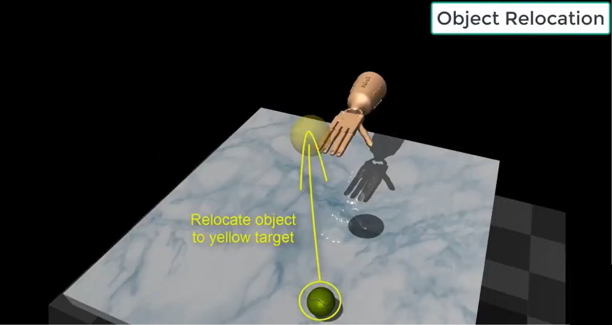

또 다른 예로는 object를 지정된 곳으로 옮기는 것이 있다.
* 지정된 위치에 object를 놓아서 reward를 얻는다는 알기 위해, 손가락의 관절을 무작위로 움직이는 등 시행착오를 겪으며 규칙을 찾아야 한다.
* 또한, 사전에 게임의 규칙을 모르듯이 손은 object를 움직이고 집는 것이 실제고 가능한 일이라는 것을 이해하지 못한다.
* 손이 아는 것은 손가락을 움직일 수 있다는 것뿐이고, reward가 너무 지연되어 object를 실제로 잡는 것에 대한 중간 신호를 거의 받지 못한다.

# 2. Exploration and Exploitation

  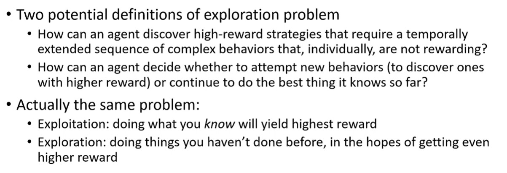

Agent가 개별 action으로는 reward를 얻을 수 없는 temporally extended tasks에서 높은 reward를 주는 전략을 발견하기 위해 exploitation할 건지 exploration할 건지 선택해야 한다.
  * Exploitation은 현재까지 찾은 가장 높은 reward를 얻는 일을 하는 것이다.
  Montezuma's Revenge 게임에서 '열쇠를 얻고 죽는 과정의 반복'을 그 예시로 들었다.
  * Exploration은 더 높은 reward를 얻기를 희망하여 이전에 해보지 않은 것을 하는 것이다.

Exploitation과 exploration은 분리되어 있지는 않다.
Montezuma 게임에서 두 번째 방으로 가는 방법을 알아냈다면, 거기까진 exploitation하고 이후에 exploration을 시도하면 더 좋다.
즉, random으로 exploitation과 exploration을 결정하는 것이 아니라 지속적인 결정을 내려야 한다.

  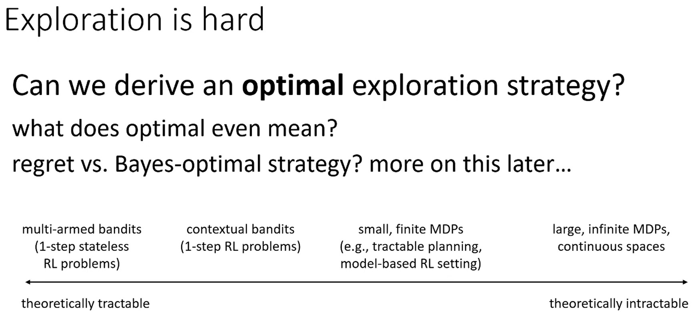

Exploration은 이론적으로나 실용적으로나 어려운 주제이다.
최적의 exploration 전략을 도출하기 위해선, 최적이 무엇을 의미하는 지 이해해야 한다.

한 가지 방법으로, bayes optimal 전략에 관한 regret의 관점으로 최적 exploration을 정의할 수 있다.
* Regret이란 최적 exploration 결과와 현재 exploration 결과의 차이로, 최적 선택을 하지 않았을 때 후회되는 정도를 의미한다.
* Bayes optimal 전략에 관한 reget은 직관적으로 environment의 불확실성을 기반으로 최적 exploration 결정을 내리는 것이다.
* 최적의 bayesian agent란 불확실성을 확률 분포로 표현하여 '미지의 곳을 탐색 하는 것'의 가치를 계산해 언제 exploration 또는 exploitation 할지 결정하는 것이다.

Bayesian agent는 MDP에 대한 복잡한 posterior probability를 추정해야 하기 때문에 계산이 거의 불가능하다.
하지만, Bayesian agent를 gold standard로 사용할 수 있다.
즉, 다른 practical한 exploration 알고리즘의 regret을 측정하여 성능을 평가할 수 있게 해준다.
특정 문제를 이론적으로 다루기 쉽다는 것은 주어진 exploration 전략의 regret을 정량화할 수 있다는 것을 의미한다.
반대로 이론적으로 다루기 어렵다는 것은 regret 추정을 할 수 없다는 것을 의미한다.

이론적으로 가장 다루기 쉬운 문제는 multi-armed bandit이다.
* Multi-armed bandit은 한 번의 action만 취하고 episode가 종료되며 state가 없다. 즉, state가 없는 single time step의 RL 문제로 생각할 수 있다.

그 다음으로 contextual bandit 문제가 있다.
* Contextual bandit은 여전히 single time step이지만, state가 있는 multi-armed bandit 문제이다.
* Action이 reward에만 영향을 미치고 다은 state에는 영향을 미치지 않는다.
* 광고 배치가 contextual bandit 문제 중 하나이다.
  * User에 대한 feature vector가 있고 그 user에게 어떤 광고를 보여줄지 선택(action)해야 한다.

다음 단계로는 small, finite MDP 문제이다.
* Value iteration으로 정확히 풀 수 있는 MDP를 의미한다.

마지막으로 다루기 가장 어려운 것은 large, infinite MDP 문제이다.
* Continuous space 또는 image와 같은 매우 큰 state space를 가지고 deep RL이 필요하다.
* Bandit 문제에서 얻은 exploration 아이디어를 이 문제에 적용하는 것을 고려할 수 있다.

  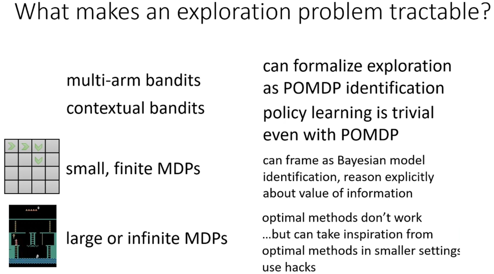

Exploration 문제를 다루기 쉽게 만드는 요소를 살펴 보자.

Multi-armed bandit과 contextual bandit의 경우 exploration 문제를 다른 종류의 MDP(구체적으로는 POMDP)로 형식화한다.
* Multi-armed bandit은 action이 state에 영향을 끼치지 않는 single time step 문제이다.
하지만, 알게 되는 사실에는 영향을 끼치기 때문에 exploration은 multi-step 문제로 볼 수 있다.
* Belief의 evolution을 명시적으로 추론하면 temporal process를 형성하게 되고, 이 temporal process가 POMDP이기 때문에 POMDP 방법을 사용해 풀 수 있다.
  * Bandit들이 단순하기 때문에 POMDP도 다루기 쉽게 풀 수 있다.

Small MDP의 경우 exploration을 Bayesian model indentification으로 프레임화하고 value of information에 대해 명시적으로 추론할 수 있다.
* Bandit 문제와 유사한 아이디어를 확잗ㅇ하는 것이다.

Large MDP의 경우 이론적으로 이러한 방법을 증명할 수 없다.
하지만 경험적으로 실제로 잘 작동한다는 것을 발견할 수 있다.

이번 강의에서는 bandit 또는 small mdp의 아이디어를 large mdp에 적용하고, 잘 작동하도록 만들기 위해 몇 가지 hacks를 사용한다.

# 3. Bandits

여기서 말하는 bandits은 강도가 아니라 미국 구어체인 one-armed bandit machine을 의미한다.
Bandit은 exploration 문제의 drosophila(초파리)이다.
* 생물학자들이 단순한 model organism(유기체)로 초파리를 연구하듯이, RL에서는 단순한 model organism으로 bandit을 연구한다.

Multi-armed bandit은 one-aremd bandit의 집합으로 n개의 기계 중 높은 reward를 주는 machine을 고르는 문제이다.
* 각 bandit machine마다 action에 따른 reward 분포가 다를 것이다.
* 경험을 통해 각 bandit machine의 reward 분포를 추정하고, 가장 높은 reward를 주는 action을 해야 한다.

  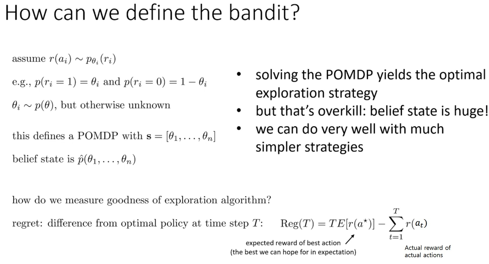

Bandit을 정의하는 방법은 각 action에 대한 reward의 분포라고 할 수 있다.
Action은 bandit을 선택해서 lever를 당기는 것이고, bandit machines는 서로 다른 reward 분포를 가지고 있다.
예를 들어 reward가 0 또는 1이면, 1을 얻을 확률이 $\theta_i$라고 할 수 있다.
Reward가 연속적이라면 $p(r|\theta_i)$는 연속 분포를 가질 것이다.

$\theta_i$를 모르지만 그것의 prior probability $p(\theta)$를 가정할 수 있고 이것이 multi-armed bandit machine을 정의하는 것이다.
* $p(\theta)$는 각 bandit machine의 매개변수 $\theta_i$에 대한 사전 확률 분포이다.
* 각 bandit은 고정된 하지만 미지의 $\theta_i$ 값을 가진다.
* $p(r|\theta_i)$는 bandit $i$의 reward 분포이다.

또한, $p(\theta)$를 exploration을 위한 POMDP를 정의하는 것으로도 볼 수 있다.
* $p(\theta)$가 POMDP에서 state의 분포에 해당한다.
* State $s = [\theta_1, \cdots, \theta_n]$는 $p(\theta)$에서 샘플링된 것으로, 모든 action에 대한 $\theta$의 vector라고 볼 수 있다.

POMDP의 state 분포 $p(\theta)$를 모르지만, 이를 안다면 올바른 action이 무엇인지 알아낼 수 있다.
그래서 state를 정확히 아는 대신 state의 belief $\hat{p}(\theta_1, \cdots, \theta_n)$을 가진다.
Action을 해서 reward를 얻을 때마다, 그 action으로 선택된 bandit의 parameter $\theta_i$의 belief를 업데이트할 수 있다.

POMDP를 풀어서 reward를 최대화하기 위한 올바른 action sequence가 무엇인지 알아낼 수 있다.
불확실성 하에서 POMDP로 최적의 policy를 도출하면 그것이 최적의 exploration 전략이 될 것이다.
* 가능한 최고의 exploration 전략이다.

Belief state에 관해 POMDP를 푼다는 것은 너무 과하다.
* Belief state는 $\theta$의 vector가 아니라 $\theta$ 확률에 대한 vector이다.
  * 간단한 binary reward라도 belief state $s = [0.1, 0.5, 0.42, \cdots]$가 아니라 $s = [\text{Beta}(\alpha_1, \beta_1), \text{Beta}(\alpha_2, \beta_2), \cdots]$처럼 각 element는 확률 분포를 가져야 한다.
  * $\theta$ 사이에 공분산을 가질 수 있으므로 잠재적으로 정말 복잡한 belief state가 된다.

Multi-armed bandit에서 좋은 점은 전체 POMDP를 푸는 대신 더 단순한 전략으로 잘할 수 있다는 것이다.
POMDP를 푸는 것(이론적 최고의 전략)과 Big O 관점에서 차이가 크지 않을 때, 특정 exploration을 최적이라고 말할 수 있다.

Bayes optimal regret으로 exploration 전략의 성능을 정량화할 수 있다.
* Regret은 time step T에서 최적 policy와 현재 전략의 차이를 의미한다.
* 최적 policy의 reward 값은 $T \times \mathbb{E}[r(a^\star)]$로 T step 동안 항상 최적의 선택 $a^\star$을 했을 때 expected reward이다.
* Regret은 최적 policy의 reward과 현재 전략을 실해해서 실제로 얻은 reward의 합 $\sum_{t=1}^Tr(a_t)$ 차이를 의미한다.

# 4. Three Classes of Exploration Methods

Multi-armed bandit에서 POMDP와의 regret을 최소화하는 다루기 쉬운 exploration 전략을 살펴보자.
비교적 간단한 다양한 전략들이 Big O 의미에서 이론적으로 증명가능한 최적의 regret을 얻을 수 있다.
그렇지만 실제 적용할 대 성능은 다소 다를 수 있다.
복잡한 MDP의 exploration 전략들은 이러한 다루기 쉬운 전략에서 영감을 받는다.

이번 강의에서는 UCB (upper confidence bound 또는 optimistic exploration), Thompson sampling (probability matching 또는 posterior sampling), Information Gain class에 대해 살펴본다.

## 4.1. Optimistic Exploration

  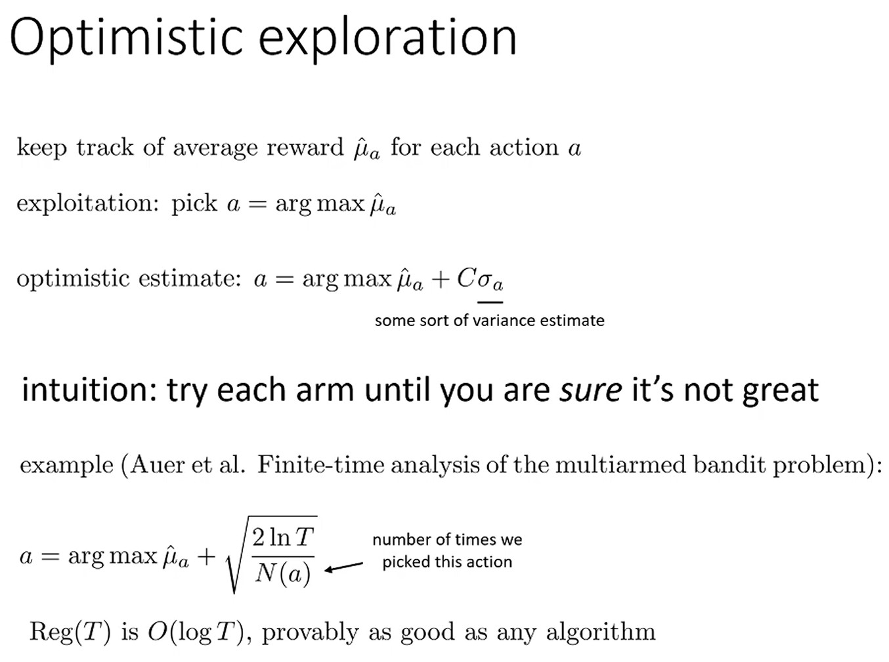

순수하게 exploitation만 한다면, action으로 얻는 평균 reward를 추정하고 그것이 가장 큰 action은 선택하면된다.

여기서 optimistic exploration을 할 수 있다.
* Action의 평균 reward에 상수 $C$에 표준편차 $\sigma_a$를 곱한 것을 더하는 것이다.
* 매우 높은 평균을 가지거나 매우 높은 표준편차를 가진 낮은 평균의 행동을 선택하게 된다.
* 충분히 학습되지 않았다면 불확실성이 높고, 다양한 action이 좋을 수도 있다라고 판단하여 exploration을 다양하게 한다.
* 직관적으로 좋을 것 같다면 exploration하고 나쁘다고 확신하면 exploration을 거의 하지 않는다.

이러한 불확실성을 추정하는 다루기 쉬운 방법들이 많이 있다.
그 중 매우 간단한 방법 중 하나는 단순히 평균에 어떤 양을 더하는 것인데, 이는 팔을 당긴 횟수의 역수로 스케일된다.
* $N(a)$는 bandit arm $a$를 당긴 회수이고, $\ln T$는 time step을 많이 거칠수록 exploration을 덜 하도록 보장하기 위해 있다.
  * $T$는 전체 arm을 당긴 횟수, 즉 time step이 흐른 정도를 의미한다.
  * 특정 arm $a$를 많이 당길수록 그것의 평균 reward에 대한 불확실성이 줄어든다.
  * 좋은 action은 $N(a)$가 $\ln t$보다 빠르게 커져서 exploration 항이 줄어들어 평균 reward에 집중하게 된다.
  * 나쁜 action은 $N(a)$가 멈춰 있어서 분자인 $\ln t$ 때문에 언젠가 다시 exploration한다.
  * 결국 시간이 아주 오래 흐르면, 나쁜 action의 exploration 항(불확실성 보너스)이 커져서 전체적인 값이 제일 높아지는 순간이 온다.
  이때 "혹시 모르니 다시 확인해 보자"며 exploration한다.

이 방법은 이론적으로 $O(\log t)$의 regret을 얻는 것으로 밝혀졌다.
즉, 일반적으로 POMDP를 실제로 푸는 것과 동일한 Big O regret이다.
* $O(\log t)$ regert은 실제로 multi-armed bandit에 대해 점근적으로 할 수 있는 최선이다.
* Deep RL에서도 많은 실용적인 exploration 알고리즘이 optimistic exploration에 기반을 둔다.

## 4.2. Thompson Sampling

  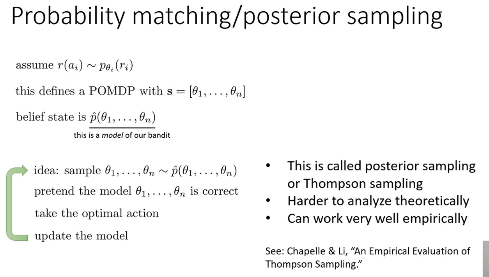

이번엔 probability matching 또는 posterior sampling이라고 부르는 것을 살펴보자.

Optimistic exploration은 model-free 방법으로 점근적으로 최적이지만 실제로 항상 최선의 action을 선택하진 않는다.
* 불확실성을 explicit하게 modeling하지 않는다.
* Time step이 무한대로 가면 최적이지만, 실제론 무한대로 실행할 수 없기 때문에 성능에서 차이가 발생한다.

대안으로 bandits의 parameter $\theta$에 대한 belief state를 유지하고 학습을 통해 belief state를 업데이트 하는 것이다.
* $\theta$에 대해 state $s$를 가진 POMDP(즉, 현재 bandits의 평균 reward를 관찰할 수 있는 환경)가 존재하고, 매우 근사적인 방식으로 $\theta$에 대한 belief를 유지한다.
  * 원래는 각 parameter $\theta_i$끼리 복잡한 관계를 가질 수 있지만, Thompson sampling에서는 근사적으로 모두 서로 독립이라고 가정한다.

$\hat{p}(\theta_i, \cdots, \theta_n)$은 bandit arms의 parameter에 대한 belief 분포이고, thompson sampling은 $\hat{p}$에서 parameter를 샘플링하고 그것이 진짜 MDP인 척하고 최적의 행동을 취한다.
그리고 실제 action을 취하고 그 결과를 얻은 뒤 model $\hat{p}$을 업데이트한다.
* 예를 들어, $\theta_i \sim \text{B}(\alpha=1, \beta=1)$ (uniform distribution)이고 샘플링으로 높은 평균 reward를 얻었다고 하자.
* 실제로 action 후 좋은 선택이었다면 $\alpha$값이 증가하고 아니면 $\beta$ 값이 증가하는 등 model $\hat{p}$를 업데이트 한다.
* Model $\hat{p}$으로는 Q functions, policies 등이 될 수 있다.

어떤 의미에서는 greedy하게 action을 선택하지만, greedy 방법이 좋다는 것이 밝혀졌다.
* 이론적으로 분석하기 어렵지만 경험적으로 잘 작동하는 것을 발견했다.
* 더 궁금한 점은 아래 적혀있는 reference paper를 살펴보자.
* UCB와 동일하게 이론적으로 $O(\log t)$ regert인 것이 밝혀졌다.

## 4.3. Information Gain

  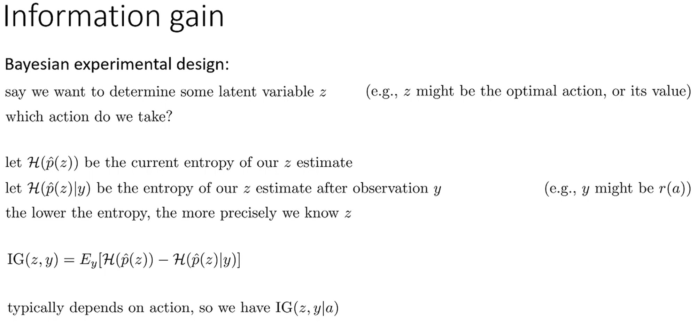

마지막으로 살펴 볼 것은 훨씬 더 explicit하게 uncertainty를 modeling하는 information gain class이다.
이는 Bayesian experimental design에 기반한다.

먼저 Bayesian experimental design에 대해 추상적으로 살펴보자.
정확하게 알고 싶은 latent variable $z$가 있다고 가정하자.
* $z$는 optimal action이거나 optimal action value일 수 있는 알려지지 않은 quantity이다.

$z$를 학습하기 위해 어떤 것을 해야 할까?
추정된 z의 현재 entropy인 $\mathcal{H}(\hat{p}(z))$를 활용할 수 있다.
* $y$를 관찰한 후 추정되는 $z$의 entropy는 $\mathcal{H}(\hat{p}(z)|y)$이다.
* 만약 $y$가 $z$에 대한 정보를 제공한다면, $y$가 주어진 $z$의 이 entropy는 $z$의 entropy보다 낮다.
* $y$는 실제로 관찰한 reward $r(a)$일 수 있다.
이 조건부 entropy가 낮을수록 z를 더 정확하게 알 수 있다.
* 직관적으로 $y$가 주어진 $z$의 조건부 entropy가 가능한 한 낮게 만드는 $y$를 알고 싶을 것이다.

Information gain은 $\mathcal{H}(\hat{p}(z))$와 $\mathcal{H}(\hat{p}(z)|y)$의 차이로 정량화된다.

$$
\text{IG}(z, y) = \mathbb{E}_y[\mathcal{H}(\hat{p}(z)) - \mathcal{H}(\hat{p}(z)|y)]
$$
* 문제는 어떤 $y$를 관찰해야 하는 지 모른다는 것이다.
* 따라서 $y$에 대한 belief를 $\text{IG}(z,y)$로 정량화한다.
* $\text{IG}(z,y)$ 값이 클수록 $y$가 $z$에 대해 많은 것을 알려주는 것으로, IG가 큰 $y$를 관찰하고 싶을 것이다.

일반적으로 exploration은 action에 의존하기 때문에 $a$에 대한 $IG(z,y|a)$ 분포를 계산해야 한다.
* 예를 들어 많이 선택한 action $a$에 대해선 관찰된 reward $y$가 bandit arms의 추정된 reward 분포인 $z$를 많이 변화 시키지 않기 때문에 IG 값이 낮게 나올 것이다.
* 반대로 거의 선택하지 않은 action에 대해선 IG 값이 높게 나온다.

  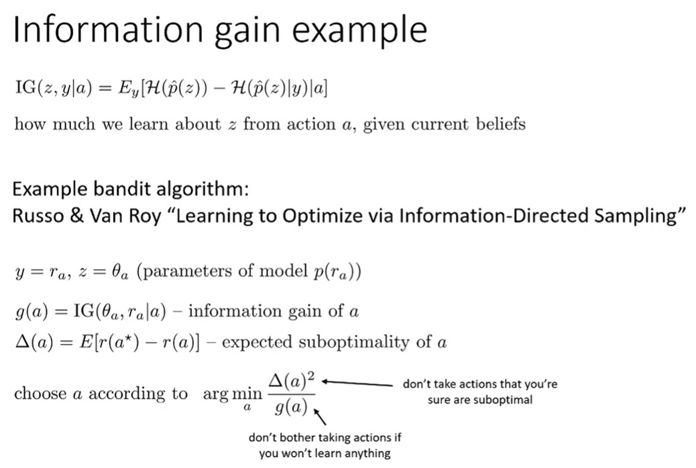

$\text{IG}(z,y|a)$는 주어진 belief에서 action $a$로부터 $z$에 대해 얼마나 알 수 있는지를 나타낸다.
이 알고리즘을 사용하는 예제는 Russo와 Van Roy의 'Learning to Optimize via Information-Directed Sampling'이라는 논문에 설명되어 있다.
* Action $a$를 선택해 reward $r(a)$를 관찰하고, reward 분포 $\theta_a$에 대한 학습이 진행된다.
* $g(a) = \text{IG}$는 action $a$의 $\theta_a$에 대한 정보 이득을 뜻한다.
* 또한 $\Delta(a) = \mathbb{E}[r(a^\star) - r(a)]$라는 action a의 expected suboptimality를 정의한다.
  * $r(a^\star)$는 최적 action을 의미한다.
  * 하지만, $r(a^\star)$를 모르기 때문에 현재 belief state에 대한 기댓값으로 계산한다.
  * $\Delta(a) = \mathbb{E}_{\theta\sim \hat{p}(\theta)}[r(a^\star|\theta) - r(a|\theta)]$
* 논문에서는 $\frac{\Delta(a)^2}{g(a)}$의 최소값의 $a$를 선택한다.
  * 1\) 뭔가를 배울 수 있는, 2) 정보를 제공하는, 3) $g(a)$가 큰 action을 선택한다.
  * 하지만 1) 높은 sub-optimal을 가지는, 2) $\Delta(a)$가 큰, 3) 다른 action 대비 얻을 수 있는 reward가 낮을 확률이 큰 action은 선택하지 않는다.
  * 즉, action을 선택했을 때 얻을 수 있는 정보와 얻을 수 있는 상대적 reward를 고려한다.

특정 조건 하에서 이론적으로 $O(\log t)$ regert인 것이 밝혀졌다.

## 4.4. Wrap-up

  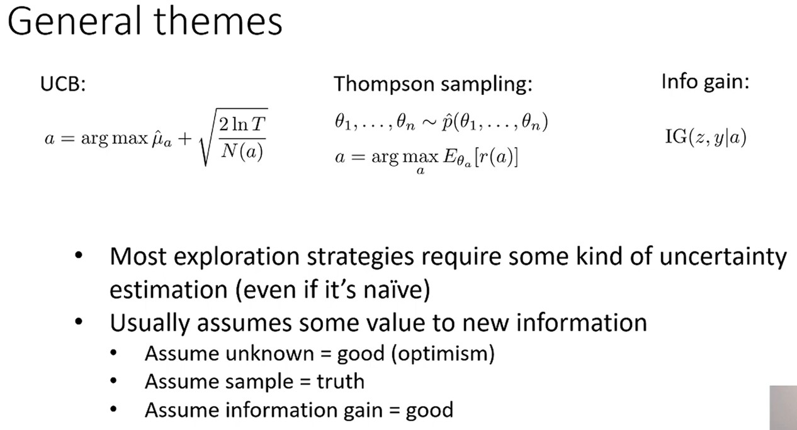

지금까지 UCB, Thomspon sampling, Information gamin 3가지 전략 class를 다뤘다.
3가지 전략의 공통점은 아래와 같다.
* 불확실성을 추정한다.
  * UCB는 취한 action 횟수의 역수로 판단한다.
* 새로운 정보에 대한 가치를 가정한다.
  * 이것이 없다면 항상 exploitation만 할 것이다.
  * 이러한 가정은 다루기 쉬운 bandit에서 각 알고리즘이 이론적으로 최적임($O(\log t)$ regert)을 증명할 수 있게 한다.
  * UCB는 알려지지 않은 것이 좋다고 가정한다.
  * Thompson sampling은 샘플로 학습된 $\hat{p}(\theta)$이 진실이라고 가정한다.
  * Information gain은 정보 이득이 바람직하다고 가정한다.

복잡한 영역에서는 이론적 증명을 할 수 없지만 위의 알고리즘을 바탕으로 직관을 얻을 수 있다.

  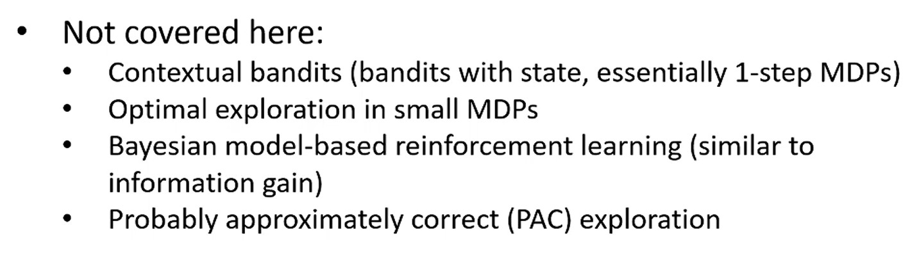

지금까지 multi-armed bandits에 대해 살펴보았지만, 위의 bandit setting에 대해선 따로 살펴보지 않을 것이다.
관심이 있다면 따로 학습하자.

# 5. Exploration in Deep RL

Deep RL에서 실용적으로 사용할 수 있는 exploration을 살펴보자.

## 5.1. UCB

  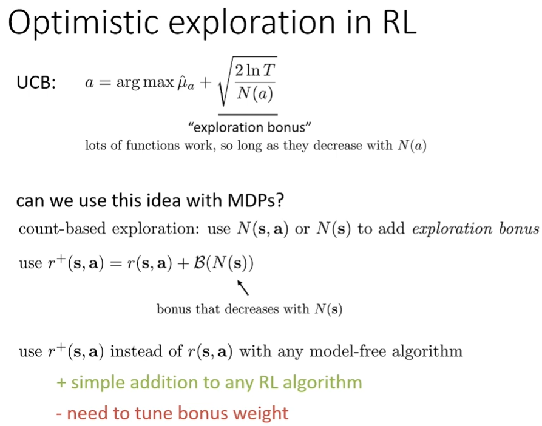

Optimistic exploration의 아이디어를 MDP에 적용하는 방법은, multi-armed bandit 대신 MDP setting으로 확장하고 count-based exploration이라고 불리는 것을 만드는 것이다.
* Arm을 당긴 횟수 $N(a)$를 세는 대신, state-action tuple $(s,a)$ 또는 state $s$를 방문한 횟수를 세고 이를 reward의 exploration bonus로 사용한다.

MDP의 경우에도 reward에 exploration bonus를 더한 것을 사용한다.
* $r^+(s,a) = r(s,a) + \mathcal{B}(N(s))$
* Bonus는 방문 횟수 $N(s,a)$ 또는 $N(a)$에 반비례하는 어떤 함수이다.
* $r^+$는 policy가 변경됨에 따라 변경될 것이다.

이는 UCB 아이디어를 MDP 설정으로 확장하는 합리적인 방법이다.
하지만 이 bonus에 대한 weight를 조정한다.
* 각 MDP 설정에 따라 reward의 scale이 다르기 때문에 bonus가 얼마나 중요한지 결정하는 weight를 도입해야 한다.

  

이제 counting을 어떻게 해야할 지 결정해야 한다.
Count 개념은 small discrete space MDP에서는 의미가 있지만, 더 복잡한 MDP에서는 반드시 의미 있지 않다.
* Montezuma's Revenge에서는 정확히 같은 image를 10보면 그 image의 count가 10이 된다.
  * 해골의 위치가 계속 바뀐다면, 완전히 다른 state가 되고 count 다시 1부터 시작된다.
  * 움직이는 factor가 많을수록 정확히 같은 state를 방문할 확률이 극히 낮아진다.
* 로봇 팔 같은 continuous space에서는 같은 state를 방문할 수 없게 되어 문제가 더 심각해진다.

복잡한 RL 문제에서 '일부 state가 다른 state보다 더 유사하다'라는 개념을 사용해 count을 확장한다.

  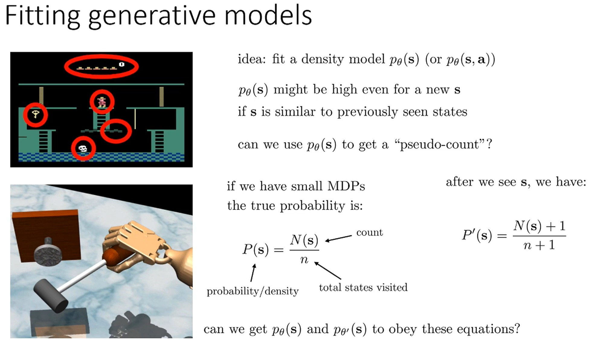

Generative model이나 density estimator를 사용해 state간의 유사성을 활용한다.
Count하고자 하는 것(state or state-action tuple)에 따라 그것의 익숙함을 의미하는 $p_\theta(s)$ 또는 $p_\theta(s,a)$를 어떤 density model로 fitting한다.
* Density model은 간단한 Gaussian이 될 수 있고 복잡한 neural network가 될 수 있다. (자세한 것은 나중에 설명한다)

많이 본 state와 유사하다면 높은 density를 가지고 완전 처음 보는 state라면 density가 낮을 것이다.
* Montezuma's Revenge에서 사람과 해골이 단순히 움직이년 경우, state의 density 값이 높을 것이다.
* 하지만, 열쇠를 처음 먹거나 다른 방으로 간 경우 state의 dennsity 값이 낮을 것이다.
* Density model은 이것을 학습하여 유사한 state를 많이 봤으면 높은 값을 내놓고, 거의 보지 못한 state라면 낮은 값을 내놓는다.

$p_\theta(s)$는 state $s$를 방문했을 확률로 해석하여 pseudo count를 구할 때 활용될 수 있다.
* 실제 count를 추적하는 대신 방문했을 확률 $p_\theta(s)$를 추적하는 것이다.
* 실제 확률은 $\frac{N(s)}{n}$으로 계산하고, 새로운 state $s$를 관찰하면 그것의 확률은 $\frac{N(s)+1}{n+1}$로 업데이트 된다.
* Density estimator로 확률을 추적할 땐, 어떤 state $s$를 관찰하면 $\theta \rightarrow \theta^\prime$으로 model의 parameter를 업데이트한다.
* Pseudo count에서는 $N(s)$와 $n$을 모르기 때문에 $p_\theta$와 $p_{\theta^\prime}$의 값을 적절히 활용해 도출한다. (바로 다음에 자세히 보여준다.)

  

위의 procedure은 pseudo-count로 탐색하는 알고리즘으로 'Unifying Count-Based Exploratioin' 논문에서 제안되었다.
제안된 precedure을 거치면 $p_\theta$와  $p_{\theta^\prime}$를 계산할 수 있게 된다.
이때 이전에 봤던 확률을 구하는 수식을 적절히 활용해 위의 사진 마지막처럼 pseudo count $\hat{N(s)}$를 구할 수 있다.
* Exploration bonus가 곧 pseudo-count가 된다.

  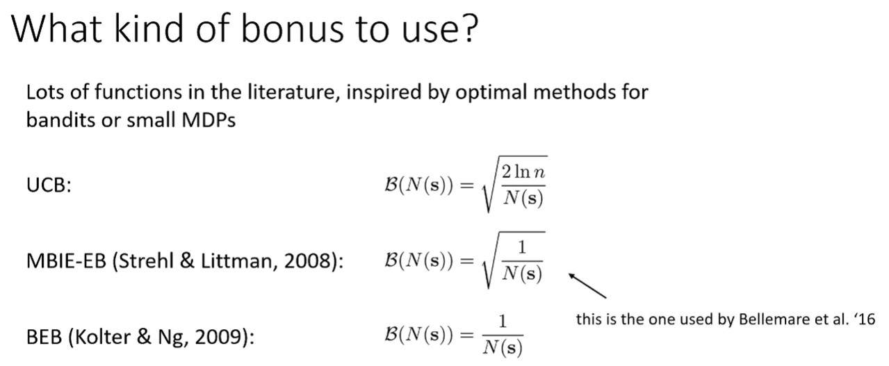

사용할 bonus는 위의 3가지 방법으로 계산할 수 있다.
이는 multi-armed bandits 또는 small MDPs의 아이디어를 사용한 것으로,
복잡한 MDPs에서도 잘 작동한다.

  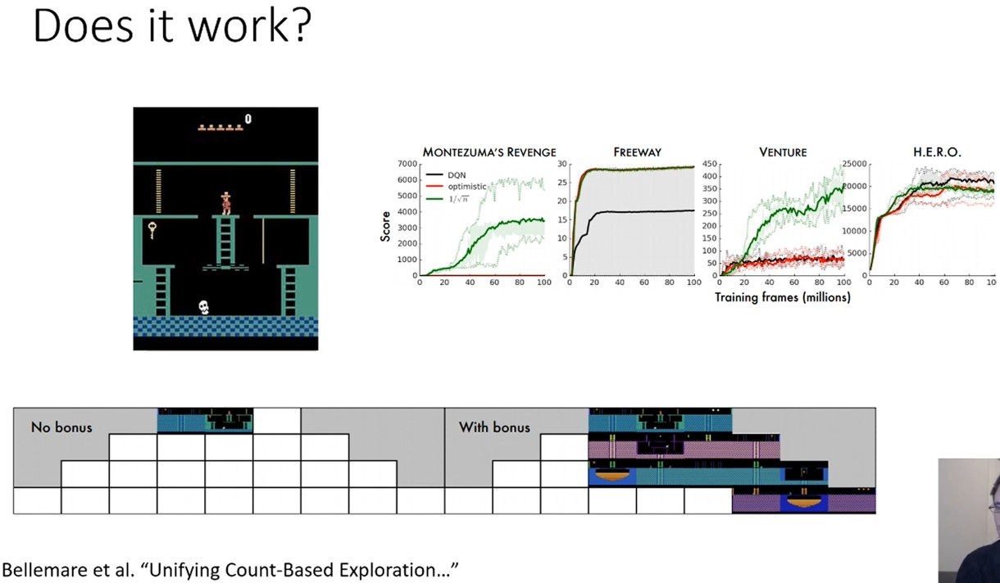

논문에서 제안된 방법의 결과로, 주의 깊게 봐야할 것은 검슨색 곡선 (Q-learning)과 녹색 곡선 (bonus 활용)이다.
* Hero 게임에서는 차이가 거의 없고 일부 게임에서는 약간 차이가 있지만,  Montezuma's Revenge와 같은 게임에서는 엄청난 차이가 발생한다.
* 하단의 그림은 방문한 방을 보여주는 것으로 exploration bonus가 없으면 2개의 방만 방문하고 있으면 절반 이상의 방을 방문한다.

  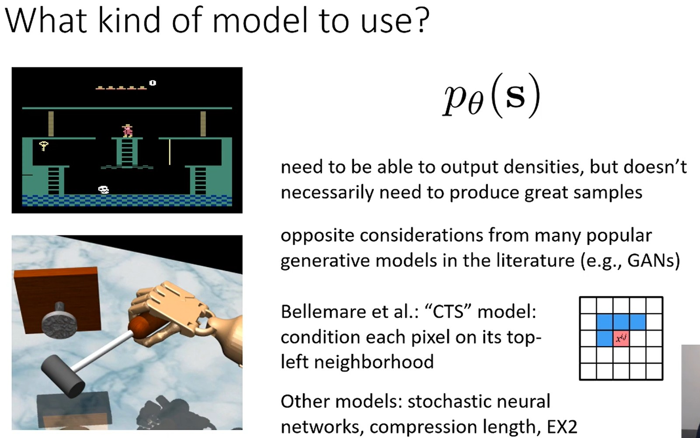

이제 model로 어떤 것을 사용하고 어떻게 fitting하는 지 살펴보자.
Density model과 generative model 중 어떤 것을 선택해야 할까?
일반적으로 두 model은 trade-off를 가진다.
Density model의 경우 샘플을 생성할 필요가 없이 정확한 density만 계산하기 때문에 비교적 부자연스러운 샘플을 생성할 수 있다.
Generative model은 density가 정확도가 낮더라도 자연스러운 샘플을 생성하는 데 초점을 둔다.

Pseudo-count의 경우 실제로 원하는 것은 density score를 생성할 model로, 샘플링할 필요가 없고 score가 정규화될 필요도 없다.
좋은 샘플을 생성하는지 여부에 관계없이 좋은 확률 score를 생성하기만 하면 원하는 모든 density model을 사용할 수 있다.
* State가 더 높은 density를 가질수록 추정된 숫자가 올라가기만 하면 된다.

해당 논문에서는 CTS model을 사용한다.
* 각 pixel의 확률을 위쪽과 왼쪽에 이웃한 pixel의 조건부 확률로 설정한다.
  * $p({i,j}) = p({i, j}|{i-1, j}, {i, j-1})$
* 모든 pixel의 확률을 곱한 것이 곧, 그 state의 density가 된다.

CTS model은 너무 단순하기 때문에 좋은 density model이 아니다.
* 오른쪽, 아래, 대각선 무시 및 장거리 의존성 무시
* 계산이 쉽고 구현이 간단하다는 장점이 있다.

다른 논문에서는 stochastic neural network, compression length, EX2라는 것을 사용한다.
* EX2는 곧 살펴 볼 예정이다.

아래에서 optimism 개념을 활용해 exploration을 개선하는 기법을 간단하게 살펴보자.

  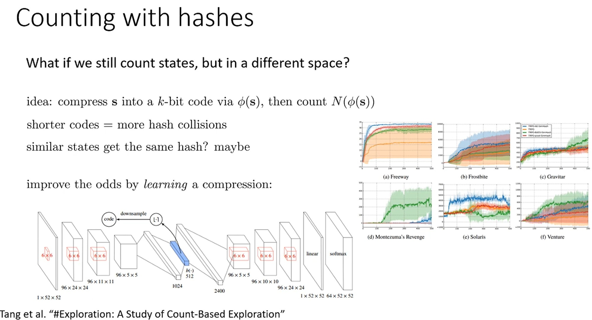

위의 pesudo count를 하는 대신 다른 representation 하에서 실제 count를 수행한다.
* State $s$를 hash를 사용해 다른 representation으로 압축한다.
* 유사한 state는 같은 hash로 mapping될 것이다.

Encoder $\phi(s)$를 사용해 $k$-bit code로 압축하면, $2^k$보다 state 수가 많을 때 일부 states는 같은 code로 압축된다.
* State를 본 횟수가 아니라, $k$-bit code를 본 횟수를 센다.

유사한 state가 같은 code로 mapping되기 위해 hash 충돌을 최소화하는 표준 hash 함수 대신, reconsturct 정확도를 최대화하는 auto-encoder를 사용한다.
* 관찰한 state들로 reconstruction error를 최소화하도록 auto-encoder를 훈련한다.
* 새로운 state가 들어오면 auto-encoder의 bottleneck 구간에서 연속값을 clamping (0/1 binarization) 및 downsampling하여 $k$-bit code를 생성 및 집계한다.

실험을 살펴보면 잘 작동하는 것을 볼 수 있다.

  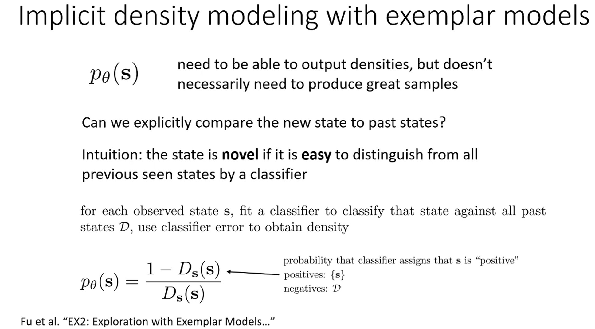

위의 방법은 EX2로, density modeling 대신 classification을 활용해 density score를 얻는다.
* $p_\theta(s)$는 density를 출력할 수 있어야 하지만 훌륭한 샘플을 생성할 필요는 없다.
* EX2는 샘플을 전혀 생성할 수 없지만, 훈련하기 쉽고 합리적인 density를 제공할 수 있는 model class를 활용한다.

EX2 알고리즘의 직관은 새로운 state인지 구별하는 classification을 학습하는 것이다.
* 새로운 state일수록 1에 가까운 값을 출력하는 classification $D_s(s)$를 학습하고, $\frac{1 - D_s(s)}{D_s(s)}$로 density 값을 추정한다.
* $D_s(s)$는 subscript $s$와 입력된 $s$가 같은지 판단하는 classification이다.
  * Subscript $s$은 1(positive)로 분류하고 과거 관찰된 과거 states set $\mathcal{D}$는 0(negative)로 분류하도록 학습한다.
* 기본적으로 입력된 subscript $s$를 positive로 분류하도록 학습되지만, 과거에도 많이 관찰된 것이라 $\mathcal{D}$에 많이 포함되어 있으면 negative로 분류하도록 조정된다.

Count가 항상 1인 큰 continuous space에서 항상 $D_s(s) = 1$일 것 같지만, overfitting을 방지하는 기법으로 인해 실제론 항상 1이 되지 않고 약간 일반화된다.
* 이는 negative에서 유사한 state를 보면 positive에 더 낮은 확률을 할당하는 것이다.
* 실제로 각 state가 unique하면 overfitting 방지를 위해 weight decay 같은 regularization을 수행한다.

  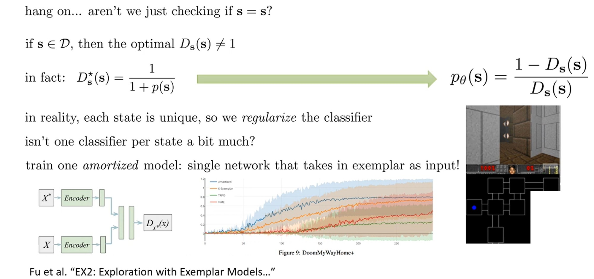

만약 $s \in \mathcal{D}$이면 $D_s(s) \neq 1$이다.
Optimal classifier $D_s^\star(s) = \frac{1}{1+p(s)}$이다.
* Optimal classifier로 $p_\theta(s)$를 구하면 $\frac{1 - D_s(s)}{D_s(s)}$가 된다.
* Classification와 density score 관계에 관한 수학적 도출은 논문을 살펴보자.

지금까지 살펴 본 방법으로는 각 state마다 $D_s(s)$를 학습해야 한다.
이런 비효율을 방직하기 위해 amortized model로 훈련을 진행한다.
모든 단일 state에 하나의 classifier를 훈련하는 대신 분류하는 state에 조건화된 단일 classifier를 훈련한다.
* Amortized model은 exemplar $X^\star$와 분류하려는 state $X$를 입력받는다.
* Exemplar가 $D_s(s)$에서 subscript $s$에 해당한다.
즉, 모든 state $s$에 대해 $D_s(\cdot)$을 학습하는 것이 아닌, exemplar의 값을 상황에 따라 변경하는 단일 classifier를 학습하는 것이다.

이전에 살펴 본 exploration 방법들과 비교해서 성능이 잘 나온다.
그리고 exploration에 사용하는 density model의 유형이 반드시 샘플을 생성할 필요가 없다는 관점을 제공한다.

  

마지막으로 살펴 볼 것은 실제 count는 아니지만 유사한 역할을 하는 quantity를 추정하는 heuristic 방법들을 살펴보자.
* 생각해보면 $p_\theta(s)$가 샘플을 생성할 필요도 없지만 꼭 density를 정확하게 추정해야 하는 것도 아니다.
* 단순히 새로운 state를 구분할 수 있는 추정된 숫자만 존재하면 된다.

State와 action에 대한 sclar 값을 계산하는 어떤 target function $f^\star(s,a)$가 있다고 하자.
해야 할 것은 buffer $\mathcal{D}$를 가지로 $f^\star$와 같아지도록 $\hat{f}_\theta$를 훈련하는 것이다.

Buffer에서 관측된 state action tuple에 대해서는 target function과 error가 작지만, 새로운 state action tuple에 대해선 target function과 차이가 많이 날 것이다.
즉, $\hat{f}$와 $f^\star$의 error를 bonus로 사용한다.

  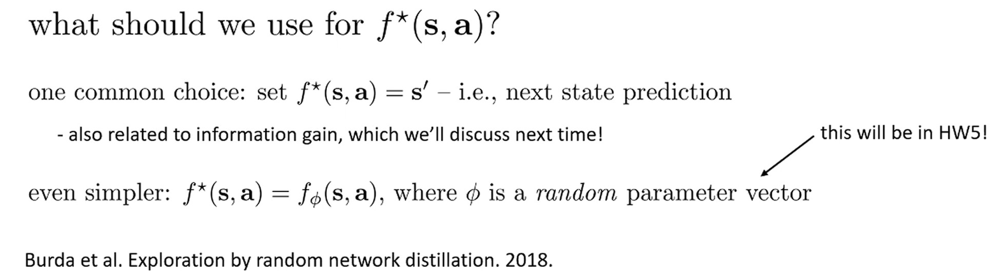

Paper에서 $f^\star$에 대한 탐구가 진행되었고 여러 가지가 존재하지만, 일반적인 선택은 $f^\star$를 dynamics model로 설정하는 것이다.
* $f^\star(s,a) = s^\prime \rightarrow$ Next state prediction

MDP dynamics와 명확하게 관련있는 quantity이기 때문에 매우 편리하고 데이터에서도 next state $s^\prime$을 관찰하기 때문에 $\hat{f}(\cdot)$의 error를 측정할 수 있다.
* 이는 나중에 살펴볼 information gain과도 관련이 있다.

한 가지 더 간단한 방법은 $f^\star$를 무작위 initialize된 parameter $\phi$로 설정할 수 있다.
* 임의적이지만 구조화된 함수를 얻기 위해 무작위로 초기화 한다.
* $f^\star$는 의미있을 필요가 없다.
* $f^\star$는 단순히 $\hat{f}_\theta$가 목표로 사용될 수 있는 무언가이다.
* 이는 실제로 잘 작동할 수 있다.

## 5.2. Thompson Sampling

  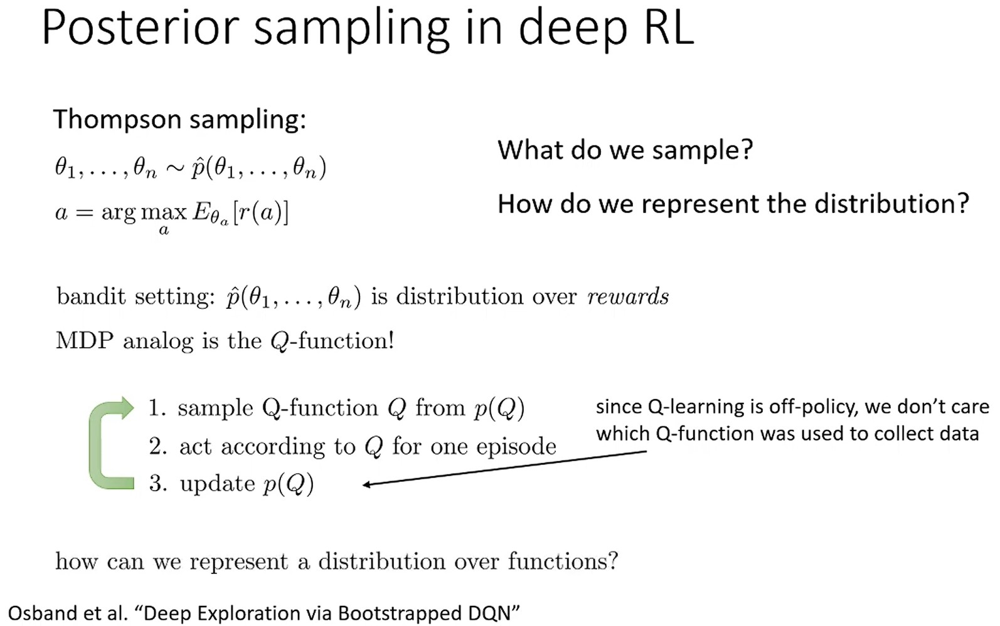

Thompson sampling은 multi-armed bandit에서 각 arm의 parameter를 학습된 $\theta$에 대한 belief의 posterior 분포에서 sampling한다.
Sampling 후 argmax인 action을 취한다.
* Bandits 환경에서는 reward model만 파악하면 되고 이는 단순해서 표현하기 어렵지 않다.

Deep RL에서는 훨씬 더 복잡하다.
Reward model뿐만 아니라 transition model 등을 추가로 알아야 한다.
* Bandits 환겨에서 $\theta$는 reward 분포를 나타낸다.
* MDP에서 유사한 개념은 Q function이 될 것이다.

Bandit에서는 reward의 argmax로 action을 선택하고, MDP에서는 Q function의 argmax로 action을 선택한다.
따라서 Deep RL에 Thompson sampling을 적용하는 가장 간단한 방법은 Q function의 분포에서 Q function을 샘플링하고 한 episode 동한 그 Q function에 따라 행동한 다음 Q function 분포를 업데이트하는 과정을 반복하는 것이다.
* Q function은 off-policy이므로 episode를 수집하는 동안 어떤 Q function이 사용되었는지 중요하지 않다.
* 동일한 dataset으로 모든 Q function 분포를 학습할 수 있다.
  * $Q = (Q_1, \cdots, Q_5)$일 때 $Q_1, \cdots, Q_5$를 동일한 dataset으로 학습할 수 있다.
* 그렇기 때문에 매 episode마다 다른 exploration 전략이나 다른 policy를 사용해도 모든 Q function 분포를 학습할 수 있다.

  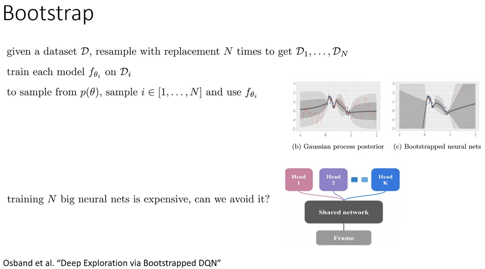

Deep RL에서 Q function 분포를 표현하는 한 가지 방법은 bootstrap ensemble을 사용하는 것이다.
Model-based RL에서 bootstrap ensemble을 사용해 분포를 표현했다.
Dataset $\mathcal{D}$가 주어지면 복원 추출로 N번 re-sampling해서 N개의 dataset을 얻는다.
각 dataset에 대해 Q 함수를 따로 학습하고, 단순히 Q 함수들 중 하나를 무작위로 선택(posterior 분포에서 샘플링)하여 model로 사용한다.
중간 오른쪽 그림은 bootstrap neural network로 추정된 불확실성 구간을 보여준다.

큰 neural network를 N번 학습하는 것은 비용이 많이 든다.
이를 피하기 위해 model-based RL에서 사용했던 방법을 활용한다.
* 복원 추출을 하지 않고 동일한 dataset을 사용한다.
* 여러 head를 가진 하나의 network를 학습한다.
* 자세한 것은 하단 paper를 살펴보자.

정확한 posterior 분포를 추정하는 좋은 방법은 아니지만 각 head가 약간 다른 action을 보장하기에 exploration에 충분히 좋을 수 있다.

  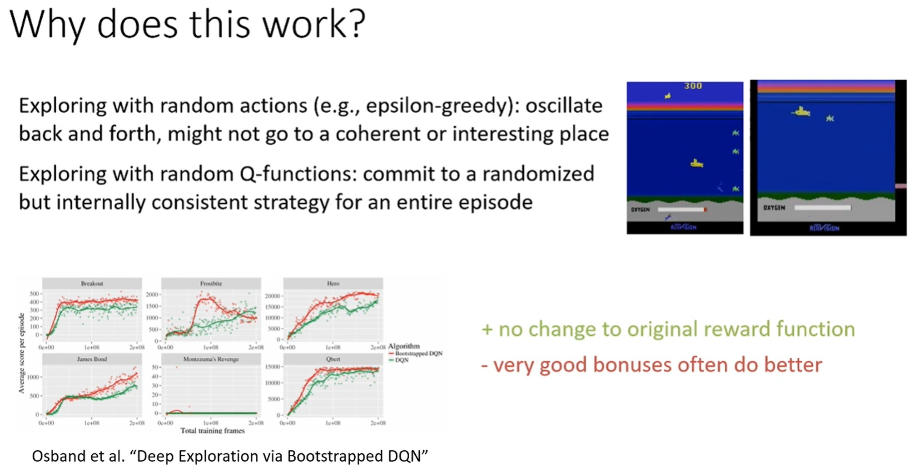

$\epsilon$-greedy처럼 무작위로 exploration을 하면 일관되거나 흥미로운 장소에 도달하지 못한다.
* 물고기를 쏘고 산소가 부족하면 수면 위로 알라가야 하는 Seaquest 게임을 살펴보자.
* 해저 바닥에 있을 때 산소가 부족할 경우 위로 올라가는 버튼을 연속해서 눌러야 하지만, 무작위 exploration을 한다면 수면 위로 올라갈 가능성은 극히 낮아지게 된다.
  * Agent는 수면 위로 올라가면 산소가 채워진다는 사실을 모를 때 exploration을 통해 그 사실을 학습해야 한다.

무작위 Q 함수로 exploration할 때는 전체 episode로 보면 무작위로 exploration하지만, 한 episode 동안엔 일관된 전략에 전념한다.
* Q 함수들은 서로 다른 결론을 내린다.
* 한 Q 함수는 해저로 갈수록 좋다고 결정할 수 있고, 다른 하나는 위로 가는 것이 좋다고 결정할 수 있다.
* 위로 가는 것이 좋다고 결정하는 Q 함수를 사용하면 수면 위로 올라가 산소를 채운다는 경험을 학습하게 된다.

논문의 실험에서 bootstarp이 실제로 일부 게임에서 상당히 도움이 된다는 것을 보여준다.
하지만 다른 게임에서는 그렇지 않다.
* Montezuma's Revenge 게임에서는 bootstrap이 전혀 동작하지 않는다.

Bootstrap이 다른 count/pseudo-count 기반 exploration만큼 잘 동작하지 않지만 몇 가지 장점이 있다.
* 실제로 관찰된 reward 값을 bonus를 더해 변경할 필요가 없다.
* 수렴 시 모든 Q 함수가 꽤 좋을 것으로 예상할 수 있다.
* Exploration과 exploitation을 절충하기 위해 hyper-parameter를 조정할 필요가 없어 간단하고 편리하다.
  * $\epsilon$-greedy의 $\epsilon$, exploration bonus의 weight 등

어려운 exploration 문제가 있다면 bonus를 사용하는 것이 일반적으로 더 잘 작동하여 thomspon sampling을 활용한 exploration을 실제로 많이 사용하진 않는다.
* 하지만 연구가 많이 됐었고, 알아둘 가치가 있는 exploration algorithm class이다.

## 5.3. Information Gain

  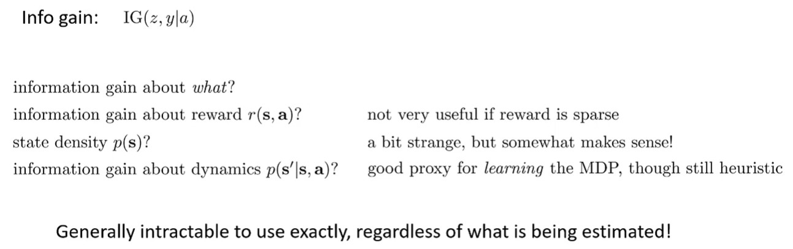

Multi-armed bandit에서 살펴 본 information gain은 관심 변수 $z$에 대해 가장 많은 정보를 제공하는 관찰 $y$를 제공하는 action $a$를 선택하는 것이었다.

Information gain 알고리즘을 구현할 때 '무엇에 대한 information gain'인지부터 정의해야 한다.
* $z$를 reward function으로 설정할 수 있지만, 복잡한 MDP에서 거의 모든 곳에서 reward가 0일 가능성이 높기 때문에 유용하지 않다.
* 그렇기 때문에 state density $p(s)$에 대한 information gain을 구한다.
  * State density에 대한 information gain은 density를 변경하는 action을 선택하고 싶다는 것으로 새로운 action을 선택할 확률이 높다.
* 또 다른 방법은 dynamics model $p(s^\prime|s,a)$에 대한 information gain이다.
  * Dynamics에 대한 information gain은 MDP에 대해 무언가를 배우고 있다는 것을 보여준다.
  * Reward가 거의 모든 곳에서 0이라면 MDP의 dynamics를 배워야 한다.

MDP는 initial state, dynamics model, reward model에 의해 결정된다.
Reward에 대한 정보가 거의 없고, initial state는 결정하기 매우 쉽기 때문에 dynamics에 대한 information gain을 구하는 것이다.
* Dynamics에 대한 information gain은 MDP를 학습하기 위한 좋은 proxy지만 여전히 heuristic이다.

일반적으로 큰 state/action space 경우, 어느 것이든 그것의 information gain을 정확하게 계산하기 어렵다.
따라서 exploration을 위해 information gain을 사용하려면 approximation을 해야 한다.
* Approximation 방법에 따라 알고리즘의 성능과 구현 난이도가 결정된다.

  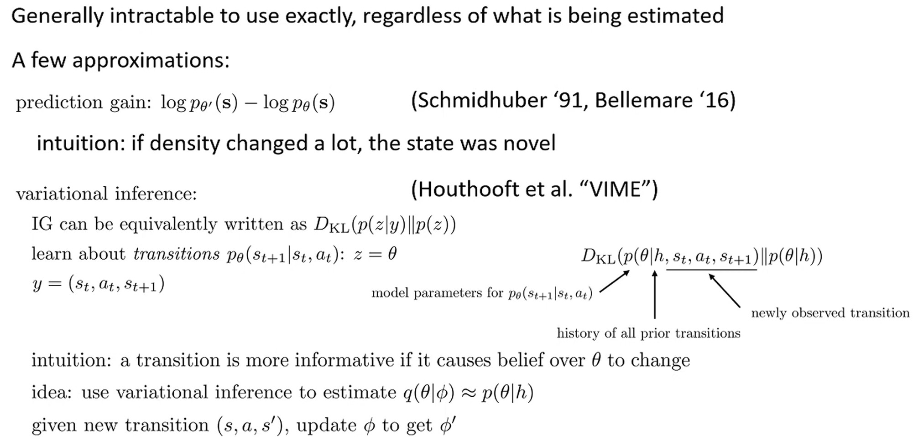

Approximation 방법인 prediction gain과 variational inference를 살펴 보자.

Prediction gain는 다소 조잡한(crude) approximation으로 density가 변한 정도를 계산해 state의 새로움, 즉 information gain을 추정한다.
Prediction gain은 최신 state에 대한 업데이트 전후의 log 확률 차이(density가 변한 정도)를 뜻한다.
* Pseudo counts와 유사할 수 있지만, 명시적으로 pseudo counts를 구하진 않는다.

Variational inference는 이후 lecture에서 자세히 다룰 VIME 논문의 내용으로 dynamics model을 활용해 information gain을 근사한다.

Information gain을 $p(z|y)$와 $p(z)$의 KLD로 계산한다.
* 실제로 KLD와 information gain은 수학적으로 같은 개념이다.

따라서 dynamics model에 대한 KLD을 최대화하고자 하는 information gain으로 설정한다.
Model-based RL에서 논의한 기법들을 사용하면 $p_\theta(s_{t+1}|s_t, a_t)$라는 dynamics model을 학습할 수 있다.
* $z = \theta, y = \text{transition }(s_t, a_t, s_{t+1})$

이러면 $\theta$에 대해 가장 많은 정보를 제공하는 transition을 얻기 위해 취하는 action을 선택하는 문제로 바뀐다.
즉, 새로운 transition이 추가되기 전후의 $p(\theta)$의 KLD를 계산하고 이를 최대화하는 것을 목표로 한다.
* 관찰한 transition이 $\theta$에 대한 belief를 변경시키면 더 정보를 제공한다는 뜻이다.

문제는 parameter의 posterior를 추정하는 것이 일반적으로 다루기 어렵다.
$\theta$가 neural network의 parameter일 경우 정확한 posterior $p(\theta|h)$를 계산할 수 없다.
이를 근사하기 위해 variational inference를 사용해 variational parameter $\phi$가 주어진 $q(\theta|\phi)$로 posterior $p(\theta|h)$를 근사한다.
* 새로운 transition을 관찰하면 variational parameter $\phi$를 업데이트하여 $q(\theta|\phi)$와 $q(\theta|\phi^\prime)$의 분포를 비교한다.

  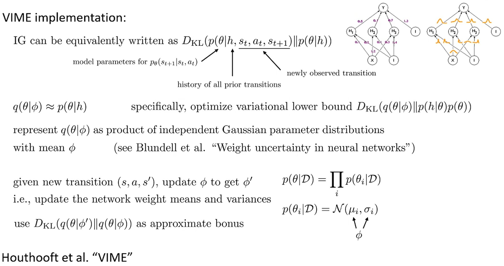

이제 approximate posterior $q(\theta|\phi)$를 훈련하는 방법을 살펴 보자.
* $q(\theta|\phi)$와 $p(\theta|h)$를 가깝게 만들어야 한다.
* 이는 $q(\theta|\phi)$와 $p(h|\theta) \times p(\theta)$ 사이의 KLD를 최소화하는 것과 같다.
  * $p(\theta|h)$에 Bayesian 정리를 활용하고, $p(h)$는 $\theta$와 무관하므로 무시한다.

최종적으로 $D_{KL}(q(\theta|\phi) || p(h|\theta) \times p(\theta))$으로부터 유도되는 variational lower bound (ELBO)를 최대화하도록 $\phi$를 학습힌다.
  * 자세한 유도 과정은 추후 lecture 18에서 살펴볼 것이다.

$q(\theta|\phi)$를 표현하는 방법 중 하나는 독립적인 Gaussian의 곱으로 표현하는 것이다.
* Parameter vector에 대한 평균과 분산을 가진 Gaussian distribution이 있으며, $\phi$는 평균을 나타낸다.
  * $\phi$가 분산도 고려할 수 있지만 지금은 평균만 사용한다고 가정하자.
* 따라서 $p(\theta|\mathcal{D}) = \prod_i p(\theta_i|\mathcal{D})$이다.
* 각 parameter $p(\theta_i|\mathcal{D}) = \mathcal{N}(\mu_i, \sigma_i)$이고 평균과 분산이 $\phi_i$이다.

학습을 통해 $\theta_i$의 분포에 근사하도록 $\mu_i, \sigma_i$를 업데이트 한다.
* Model-based RL에서 살펴 봤듯이 'Weight uncertainty in neural networks'에서 제안하는 reparameterization trick 기반 Bayeisan neural network variational inference로 backpropagation으로 학습한다.

새로운 transition $(s, a, s^\prime)$으로 parameter를 업데이트하기 전후의 KLD $D_{KL}(q(\theta|\phi)||q(\theta|\phi^\prime))$가 곧 information gain으로 approximate bonus이다.
* $r^+ = r + \mathcal{B}(s,a) = r + D_{KL}(q(\theta|\phi)||q(\theta|\phi^\prime))$
* Gaussian 분포에서 KLD는 closed form으로 구할 수 있기 때문에 단순 대입만하면 된다.
* 직관적으로 평균의 변화량과 매우 유사하게 보일 것이다.

  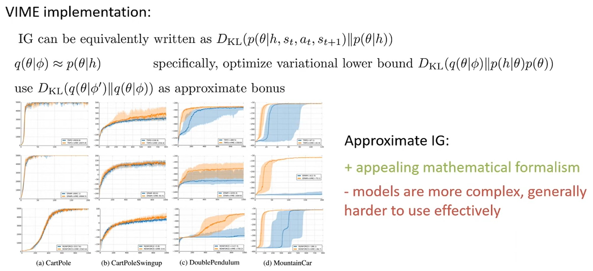

논문에서 실험을 통해 information gain을 추가하면 exploration 성능이 크게 향상된다는 것을 보여줬다.
* 이 방법론의 장점은 수학적으로 유도되었다는 것이다.
* 단점은 model이 다소 복잡하다는 것이다.
  * Bonus를 계산하기 위해 dynamics를 훈련해야 하며, 일반적으로 이를 효과적으로 사용하기 어렵다.
  * 따라서 density를 추정할 수 있다면, 수학적으로 유도되었더라고 pseudo-count를 사용하는 게 더 쉬울 것이다.

  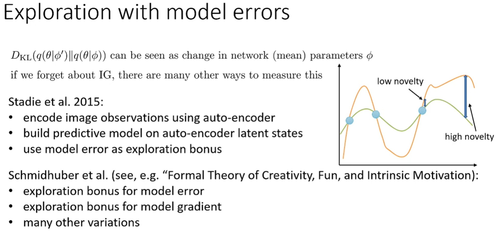

분포의 차이를 계산하는 information gain에서 벗어나 parameter의 변화를 측정한다는 관점으로 바라보면 더욱 다양한 방법을 exploration bonus로 사용할 수 있다.

Information gain은 Bayesian 방법으로 parameter vector의 변화를 측정한다.
이에 국한되지 않고 이전에 살펴본 것처럼 reconsturction error에 기반한 방법 또한 활용할 수 있다.
* Model error, model gradient에 대한 exploration bonus를 사용할 수 있으며 다른 많은 variation이 존재한다.

## 5.4. Recap

  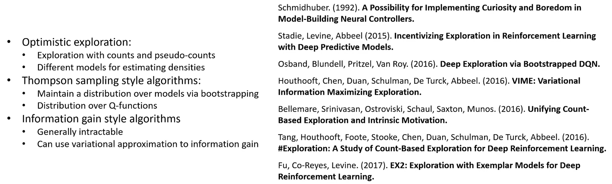

이번 강의에서는 deep RL의 다양한 exploration 전략 class에 대해 살펴보았다.
더 자세한 내용을 알고 싶다면 위의 논문들을 살펴 보자.

