이번 강의에서는 lecture 13에서 본 방법과는 색다른 관점에서 exploration을 바라보는 최신 방법에 대해서 살펴 볼 것이다.

# 1. Unsupervised learning of Diverse behaviors

  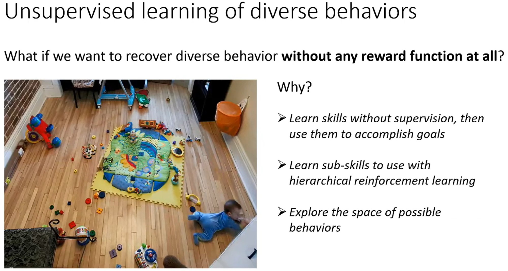

이전에는 delayed reward 혹은 sparse reward를 다뤘다.
만약 reward가 전혀 없다면 어떻게 diverse behavior를 판단하고 선택할 수 있을까?
* 인간 아이들은 특별한 reward 없이도 environment와 상호작용하며 무언가를 얻고 있다.
이는 무작위 행동이 아니라 특별한 목적을 가지고 방향성 없는 탐색을 통해 무언가를 배우고 있다.
즉, 목표가 설정되는/달성되는 어떤 개념이 있고 actions를 통해 뇌에 축척되는 지식 체계가 존재한다.

명시적인 reward 없이 학습하는 것의 장점은 다양한 기술을 습득하고 특정한 목표가 주어졌을 때 그것을 사용할 수 있다는 것이다.
* Hierarchical RL 방식으로 학습한 것을 하위 기술로 사용할 수 있다.
* 다양한 action space을 탐색해 큰 dataset/buffer를 구축한 다음 다른 task를 할 때 활용할 수 있다.
  * 이는 exploration을 다른 관점으로 바라보는 것이다.

전통적으로 exploration은 reward가 있는 state를 찾아야 하는 문제로 생각했지만, 이번 강의에서는 나중에 재사용할수 있는 기술을 습득하는 문제로 생각한다.
* 이를 통해 목표가 주어졌을 때 필요한 기술을 빠르게 습득할 수 있다.

  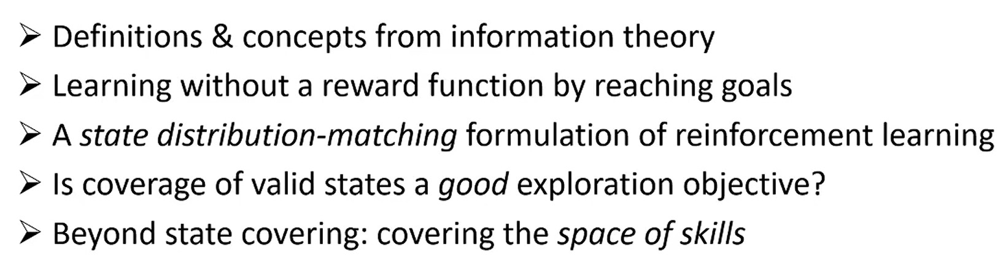

이번 강의에서는 알려진 완벽한 해결책이 없는 최근 연구 영역에 대해서 논의할 것이다.
구체적으로는 위와 같다.

# 2. Information Theory

  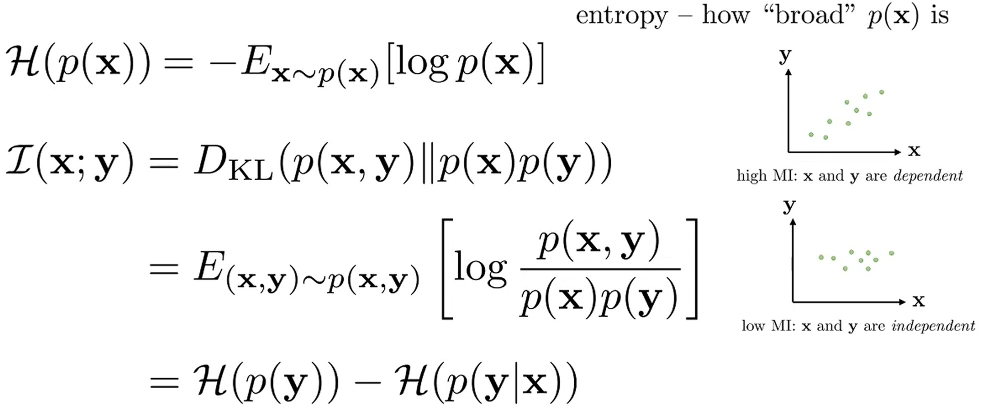

Entropy $\mathcal{H}(p(x))$는 확률 분포 $p(x)$의 퍼진 정도를 나타낸다.
* Uniform distribution에서 entropy는 최대가 되고, 특정 값은 1이고 나머지는 0인 분포에서 entropy는 최소가 된다.

Mutual information $\mathcal{I}(x;y)$는 두 random variable의 joint distribution과 marginal distribution 곱의 KLD로 정의한다.
* ';'로 표기하는 이유는 variable group 사이의 MI를 표현하기 위함이다.
  * $x, z$와 $y$의 MI는 $\mathcal{I}(x, z;y)$로 표기한다.
* $x, y$가 dependent할수록 KLD값이 증가하여 MI 값이 증가한다.
* $x, y$가 independent라면 KLD값이 0이되고 MI 값도 0이 된다.
* MI는 $p(y)$의 entropy - $p(y|x)$의 entropy로 나타낼 수 있다.
  * MI를 $x$를 관찰함으로써 얻는 $y$의 entropy 감소로 생각할 수 있다.
  * 이는 information gain 계산과 같다.
  * 즉, MI는 $x$가 $y$에 대해 얼마나 정보를 제공하는지 알려준다.
  * MI은 대칭적이기 때문에 그 반대도 성립한다.

  

이번 강의에서 사용할 information theoretic quantities를 살펴보자.

$\pi(s)$는 policy $\pi$의 state marginal distribution으로 lecture 13에서 언급한 $p_\theta(s)$와 정확히 같은 것이다.
이것의 entropy $\mathcal{H}(\pi(s))$는 policy $\pi$로 얻는 coverage를 정량화한다고 볼 수 있다.
* 모든 가능한 state를 방문하는 무작위적인 policy라면 $\mathcal{H}(\pi(s))$값이 클 것이다.

MI 관점에서 유용하게 사용되는 것은 empowerment라고 불리는 quantity이다.
* 이것에 대해서 자세히 다루진 않을 것이다.
* Empowerment는 next state와 현재 action 사이의 MI로 정의된다.
* Empowerment의 많은 variation이 존재하며 현재 state가 주어졌을 때 next state와 현재 action 사이의 MI로도 정의될 수 있다.
  
가장 간단한 버전인 next state와 현재 action 사이의 MI로 empowerment를 생각해보자.
* Empowerment가 의미하는 것은 next state entropy에서 현재 action이 주어졌을 때의 next state entropy를 뺀 것이다.
* Empowerment는 사전적으로 얼마나 많음 힘을 가지고 있는지, 목표를 달성할 수 있는 능력이 얼마나 되는지를 의미한다.
* Empowerment가 크다는 것은 next state가 될 수 있는 경우의 수는 매우 많지만, action이 주어지면 next state가 될 수 있는 경우의 수가 적다는 것을 의미한다.
  * 즉, 어떤 state에도 도달할 수 있으면서도 action을 통해 agent의 통제권을 가지는 것을 목표로 하는 것이다.
  * 예를 들어, 방에 로봇이 있을 때 로봇은 방의 중앙에 서서 방의 모든 부분에 결정론적으로 접근하고 싶을 것이다.
* 둘 중 하나의 entropy만 고려한다면 empowerment를 제공하지 못한다.
  * Next state의 entropy가 큰 것만 고려한다면 통제가 될 수 없는 매우 무작위적인 state에 도달할 수도 있다.
  * 현재 action이 주어졌을 때 next state의 음의 entropy만 고려한다면 많은 option을 사용하기를 원한다는 개념을 정량화하지 못한다.
    * 즉, 매우 결정론적인 상황에 자신을 배치할 수 있다.
    * 우물 바닥에 있다면 어떤 행동을 하든 state는 거의 고정이기 때문에 next state는 action과 상관없이 고정될 것이다.

Empowerment는 강화학습에서 information theory 방식으로 control authority의 개념을 정량화하는 것이다.

# 3. Learning without A Reward function by Reaching goals

Unsupervised exploration 문제에 수학적으로 접근하는 관점을 살펴 볼 것이다.
* 자세한 사항은 살펴보지 않을 것이라서 원한다면 논문을 봐야 한다.

  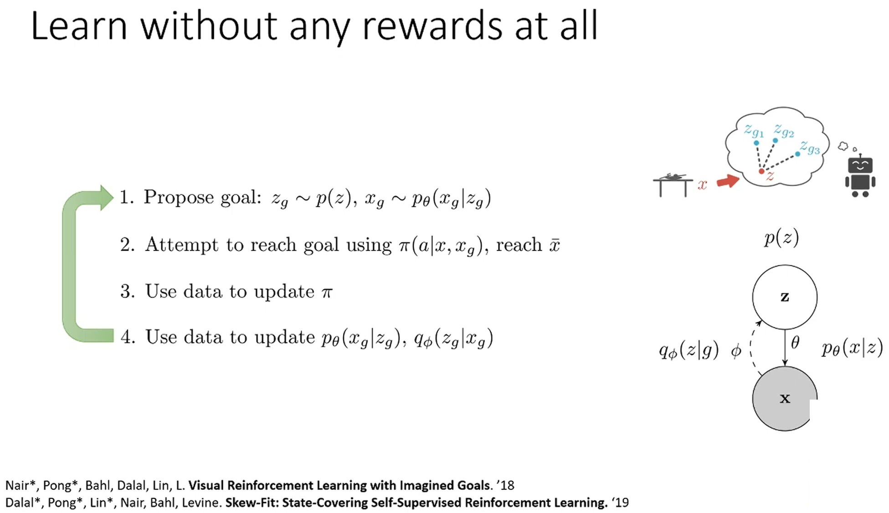

로봇을 부엌에 두고 하루 종일 다양한 기술을 연습하는 상황을 가정하자.
그리고 저녁에 집에 돌아왔을 때 로봇에거 task(설저기 등)을 주면 로봇은 획득한 경험을 활용해 그 task를 수행한다.

먼저 로봇에게 목표를 어떻게 명령할 것인지 정해야 한다.
* 가장 쉬운 비유는 agent가 도달하기 원하는 상황의 image를 보여주는 것이다.
* RL 용어로 말하면 task의 목표를 구성하는 observation이나 state를 제공하는 것이다.
* 우리는 agent가 주어진 어떤 목표든 달성할 수 있도록 무언가를 학습하는 것을 원한다.

Agent는 unsupervised 단계에서 어떤 목표든 도달할 수 있는 policy를 훈련해야 한다.
기술적 세부사항으로 서로 다른 states를 비교하는 mechanism이 필요하다.
고차원이거나 continuous space에서 모든 state가 unique하기 때문에 image 처럼 state가 복잡한 경우 lecture 13에서 본 states 간의 유사성 개념이 필요하다.
* 이 문제를 다루는 다양한 방법이 있지만, 이번 강의에서는 generative model VAE를 훈련한다고 가정한다.

State인 image를 $x$, 그 정보를 압축한 latent vector를 $z$로 표기한다.
* Latent vector는 어느 정도 잘 작동하여 유사한 state들이 latent space에서 가까이 위치할 것이라고 가정한다.

이제 RL agent가 unsupervised 학습 단계를 가져 자체적으로 목표를 제안하고 그것에 도달하도록 여러 시도를 하여, reward 같은 supervisor 없이 제안된 목표에 도달하는 policy를 학습하길 원한다.
* 직관적으로는 latent space에서 목표인 $z_g$를 제안하여 목표 state $x_g$를 얻고, 목표 $x_g$에 도달하려는 시도를 통해 policy를 개선하길 원한다.

VAE generative model을 사용할 때 목표를 제안할 수 있는 한 가지 방법은 latent variable $z$의 prior $p(z)$에서 latent vector $z_g$를 샘플링 하고 $p_\theta(x_g|z_g)$에서 목표 state $x_g$를 샘플링하는 것이다.

그런 다음 현재 state $x$와 목표 state $x_g$가 주어졌을 때, policy $\pi(a|x, x_g)$에 따라 시도를 한 뒤 어떤 state $\bar{x}$에 도달한다.
* $\pi(a|x, x_g)$는 현재 state와 목표 state가 주어졌을 때 action의 분포가 된다.
* Policy를 사용해 목표 도달에 성공할 수도 있고 실패할 수도 있다.
* 이상적으로 $x_g$와 $\bar{x}$가 같길 원하지만 일반적으로 그렇지 않을 수 있다. 심지어 $x_g$가 실제 image가 아닐 수 있고 도달이 불가능할 수도 있다.

Policy를 실행하는 과정에서 얻은 data를 가지고 Q-learning 알고리즘 등을 써서 policy를 업데이트 한다.
그리고 generative model도 관찰된 data로 업데이트 한다.
* 목표 도달을 시도하는 과정에서 이전에 보지 못한 image들을 보았다면 그 data를 통합하여 generative model을 업데이트 한다.

이 두 가지의 상호작용이 목표를 제안하고 도달하려고 시도하게 만든다.

  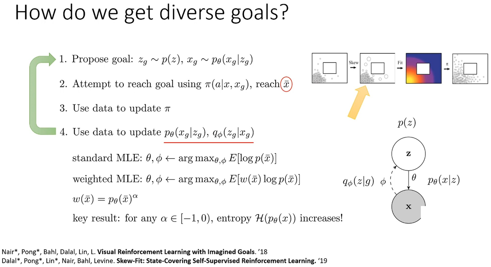

이때, generative model은 관찰된 data로 훈련되기 때문에 관찰된 data와 매우 유사한 image를 생성 한다는 문제가 있다.

2D 내비게이션 시나리오가 있다고 가정하자.
우측 상단 그림에서 작은 원들은 방문한 state를 나타낸다.
해야 할 것은 dataset을 어떤 방식으로 왜곡(skew)하여 본 적이 없는 state을 생성하는 확률을 높이도록 parameter를 학습하는 것이다.
이는 lecture 13에서 논의한 exploration과 매우 유사하다.
* 이를 통해 rare한 state에 더 많이 방문하여 도달할 수 있는 state를 확장하게 된다.

Step 4에서 이를 고려한 학습을 진행해야 한다.
* 관찰한 데이터를 맹목적으로 사용하는 대신 rare한 데이터에 가중치를 부여한다.
* Generative model은 일반적으로 maximum likelihood로 학습되기 때문에 관찰한 state를 생성하는 $p(\bar{x})$ 확률을 높인다.
* Weighted maximum likelihood는 어떤 weight function $w(\bar{x})$로 가중치를 부여한다.
직관적으로 드물게 본 states에 높은 weight를 부여해 생성하는 확률을 더 높인다.

Weight function $w(\bar{x})$는 rare한 정도를 정량화해야 한다.
Generative model은 lecture 13에서 살펴본 것과 같이 density score를 제공한다.
한 가지 방법은 weight를 $p_\theta(\bar{x})^\alpha$로 설정하는 것이다.
* $\alpha \in [-1, 0)$으로 설정한다.
* 논문에는 negative 지수를 사용하면 $p_\theta(x)$의 entropy가 증가한다는 수학적 증명이 있으니 원하면 살펴 보자.

Loop를 돌 때마다 $p_\theta(\bar{x})$의 entropy가 증가하게 된다.
Entropy가 항상 증가한다면 결국 최대 entorpy 분포로 수렴하게 된다.
즉, $p_\theta(\cdot)$은 유효한 state에 대한 uniform distribution이 된다.
* VAE에서 $p_\theta(\cdot) \ge ELBO$로 학습된다.

이것은 count/pseudo-count 기반 exploration에서 본 것과 매우 유사하다.
* Count 기반 exploration에서 bonus는 $N(s)^{-1}$ 혹은 $N(s)^{-1/2}$ 형태였다.

  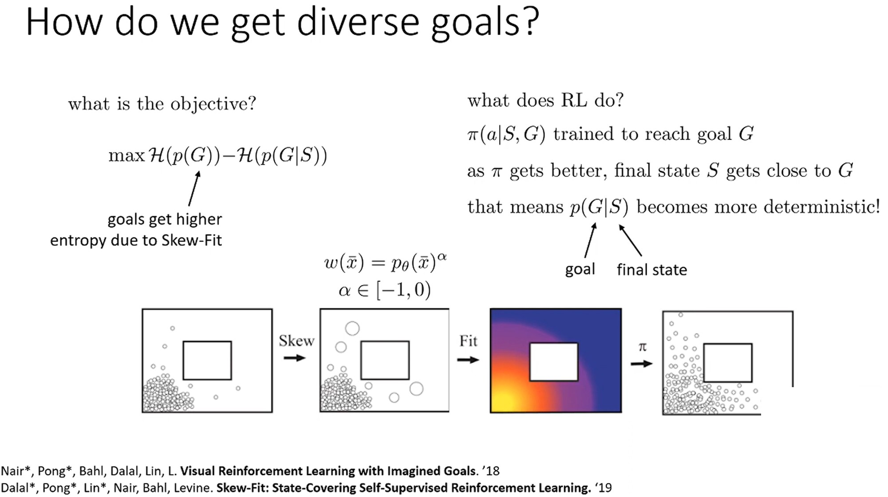

$p_\theta(\cdot)$의 entropy를 최대화하는 것은 MI에서 첫 번쨰 항을 최대화하는 효과와 같다.

RL 부분은 목표 $g$에 도달하도록 policy $\pi(a|S, G)$를 학습하는 것이다.
* Policy가 좋아질수록 현재 state $S$가 $G$에 도달할 확률이 커지는 것 즉, 점점 deterministic하게 된다는 것을 의미한다.
* 이는 MI에서 두 번째 항을 최소화하는 효과와 같다.

따라서 전체 절차는 MI $\mathcal{I}(S;G)$를 최대화하는 효과가 있다.
* 즉, $S, G$ 사이의 MI를 최대화하면 좋은 exploration으로 이어진다.
* MI는 exploration 성능을 정량화하는 또 다른 방법이다.

본질적으로 MI는 다양한 목표 set에 얼마나 효과적으로 도달할 수 있는지 정량화한다.

# 4. A state distribution-matching formulation of RL

이제 state coverage 개념에 대해 더 깊이 다루고, state의 entropy를 최대화하는 개념을 확장하여 state에 대한 목표 분포와 매칭하는 것을 논의한다.

  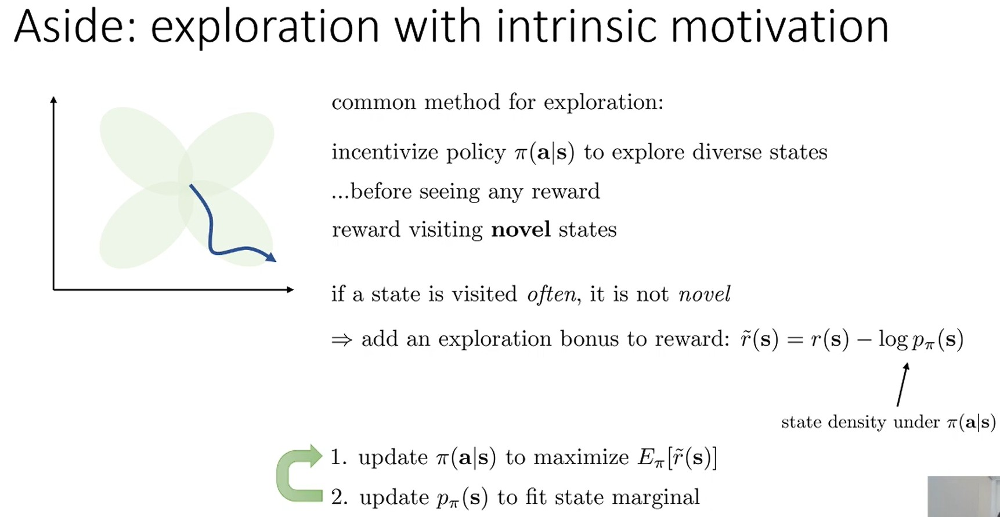

먼저 intrinsic motivation objectives로 unsupervised exploration을 수행하는 방법에 대해 이야기 해보자.
Intrinsic motivation은 lecture 13에서 살펴본 count/pseudo-counts과 같이 novelty를 추구하는 방법들을 지칭하는 또 다른 옹어이다.
* 일반적인 exploration 방법은 다양한 state를 탐색하도록 policy를 설정하며 새로운 state를 방문하도록 incentive를 제공한다.
* Lecture 13에서는 delayed/sparse reward에 대해서 살펴 보았고, 이번 강의 에서는 reward가 없는 상황에서 exploration하는 방법을 살펴 볼 것이다.

먼저 reward를 관찰할 수 있을 때의 intrinsic motivation을 알아보자.
자주 방문한 state의 novelty를 없애기 위한 가장 간단한 방법은 reward $r(s)$에 $\log p_\pi(s)$를 빼는 것이다.
이것을 intrinsic motivation이라고 불린다.
* Lecture 13 그리고 이번 강의 section 1~3과 같은 아이디어의 또 다른 variation일 뿐이다.

기본적으로 낮은 density를 가진 state를 방문하고 현재 state marginal distribution에 맞게 state distribution을 업데이트하는 것을 반복한다.
* Iteration 후, $p_\pi(s)$는 높은 coverage를 갖게 된다.
* 하지만 최종 policy는 space 전체에서 자신의 tail을 쫓는 것처럼 될 것이다.
  * 원하는 policy는 모든 state를 골고루 방문하는 것이만, 최종 policy는 바로 이전 policy가 덜 간 곳으로 가는 것으로 끝날 것이다.
    * A, B, C, D, E, F 6개 state가 있다고 했자. 
    * 처음 초기화된 density estimator가 A의 density가 낮다고 알려준다면, policy는 A만 방문하게 된다.
    * 이후, A의 density가 높아지면 policy는 B로 가도록 업데이트되고, B의 density가 높아지면, policy는 C로 가도록 업데이트된다.
    * A, B, ..., F까지 모두 방문했어도 policy는 density estimator가 비교적 낮은 density라고 말하는 것을 향하도록 구성된다
    * 바로 직전의 관찰된 data만 학습으로 사용할 경우, 그것의 state area를 많이 추출하도록 density estimator $p_\pi(s)$가 업데이트가 되기 때문에 어느정도 불균형이 생긴다.

# 5. Can we use this for state marginal matching?

  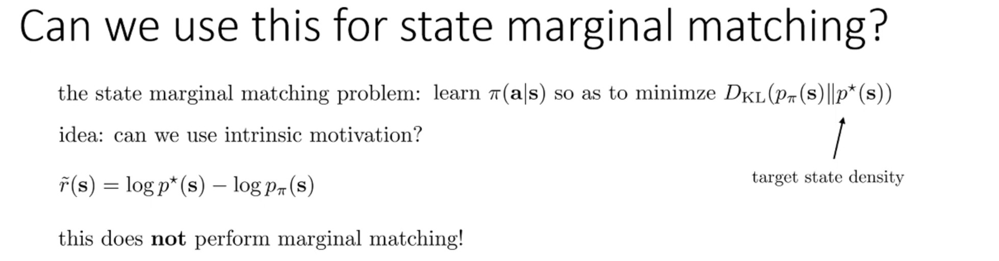

State space의 density estimator가 uniform coverage를 갖는 것과 더불어 학습된 policy가 모든 유휴한 state에 균등하게 도달해야 한다.
* 현재 하고자 하는 것은 unsupervised로 reward 없이 RL을 학습하는 방법이다.
* Unsupervised인 만큼 state를 uniform하게 exploration하는 전략이 필요한데, density estimator는 그에 필요한 VAE와 같은 model을 의미한다.
  * Section 4에서 목표 state를 생성하는 VAE의 density를 uniform하게 만들어 무작위적으로 주어진 목표 state 도달할 수 있는 policy를 만들었다.
* Intrinsic motivation은 reward에 exploration bonus를 추가해 density estimator $p_\pi(s)$의 uniform coverage를 향상 시킨다.
  * 하지만, lecture 13에서 살펴 본 방법과 다르게, intrinsic motivation의 최종 policy $\pi$는 덜 방문한 state area를 추구하도록 학습되는 tail chasing 문제가 발생한다.

State marginal matching은 state marginal 분포 $p_\pi(s)$와 target state marginal 분포 $p^\star(s)$ 사이의 KLD를 최소화하도록 policy $\pi(a|s)$를 학습하는 것이다.
* $p^\star(s)$의 entropy와 matching시키는 것이다.

명시적인 reward를 모르지만, intrinsic motivation의 아이디어를 활용해서 다음과 같이 target state 분포에서 현재 state 분포의 관계로 reward를 고안할 수 있다.

$$
\tilde{r}(s) = \log p^\star(s) - \log p_\pi(s)
$$

RL의 objective function은 stationary distribution 하에서 reward의 기댓값을 최대화하는 것이다.
이는 정확히 $D_{KL}(p_\pi(s)||p^\star(s))$을 최소화하는 것과 같다.

$$
\begin{aligned}
J(\pi) &= \mathbb{E}_{s \sim p_\pi(s)} [\tilde{r}(s)] \\
&= \sum_s p_\pi(s) \cdot \tilde{r}(s) \\
&= \sum_s p_\pi(s) \cdot [\log p^*(s) - \log p_\pi(s)] \\
&= \sum_s p_\pi(s) \log p^*(s) - \sum_s p_\pi(s) \log p_\pi(s) \\
&= -H(p_\pi(s), p^\star(s)) + H(p_\pi(s)) \\
D_{KL}(p_\pi || p^\star) &= \sum_s p_\pi(s) \log \frac{p_\pi(s)}{p^\star(s)} \\
&= \sum_s p_\pi(s) \log p_\pi(s) - \sum_s p_\pi(s) \log p^\star(s) \\
&= H(p_\pi(s)) -H(p_\pi(s), p^\star(s)) \\
&= -J(\pi)
\end{aligned}
$$

하지만 RL은 reward가 policy에 의존한다는 사실을 인지 못하기 때문에 RL 최적화가 곧 state marginal matching 문제를 푼다는 것을 의미하진 않는다.
* 일반적인 RL에서는 reward는 policy와 무관하게 특정 state에 도달할 때 관찰할 수 있는 것이다.
* 하지만 제안된 reward는 같은 state에 도달하더라고 policy에 따라 바뀔 수 있다.

결과적으로 intrinsic motivation가 가지는 tail chasing 문제가 발생한다.
* Policy가 계속해서 상대적으로 덜 본 곳으로 가도록 업데이트된다.

  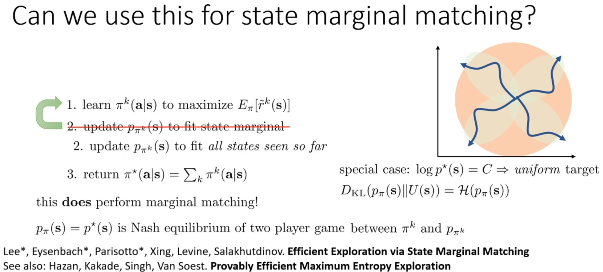

* $k$는 iteration을 indexing한다.
* $p_\pi^k(s)$는 density estimator로 VAE나 다른 distribution일 수 있다.

주황색 원이 matching하려는 density라고 하면, policy는 계속 덜 방문한 곳으로 가려고 하고 최종 policy는 임의의 state area로 가도록 될 것이다.
Policy $\pi$로 학습된 density estimation은 주황색 원과 그렇게 다르지 않다.
따라서 step 2를 약간 수정하고 step 3를 추가해 marginal matching을 할 수 있다.
* Step 2에서 최신 policy로 관찰한 data로만 학습하는 것이 아니라 과거의 모든 data를 활용하여 모든 policy의 density를 계속 고려한다.
* 반복으로 학습을 끝낸 뒤, state가 입력으로 들어 왔을 때 최신 policy를 반환하는 대신 지금까지 본 모든 policy를 고려하는 혼합 policy를 return한다.
  * 무작위로 선택된 $\pi^k$를 return 한다.

위의 3단계 절차가 실제로 marginal matching을 수행한다는 것이 밝혀 졌다.
이를 증명하려면 game theory의 Nash equilibrium가 필요하다.
* 이 게임의 2 명의 player는 state density estimator와 policy이다.
* 만약 target $\log p^\star(s)$가 상수 $C$라면 target state density 분포는 uniform distribution일 것이고 KLD는 $p_\pi(s)$의 entropy와 같아진다.

Marginal matching에서는 density matching algorithm과 policy 2 명의 player가 존재한다.
Density matching algorithm은 density를 정확하게 추정하려고 한다.
Policy는 $\tilde{r}$을 최대화하려고 한다.
단순히 2 명의 palyer가 최선의 행동을 하는 것만으론 Nash equilibrium을 제공하지 못한다.
Self-play라고 불리는 것을 수행하면 Nash equilibrium을 얻을 수 있다는 것이 밝혀졌다.
* Self-play가 하는 일은 지금까지 본 모든 iteration의 평균을 반환하는 것이다.
* 따라서 최종 policy는 Nash equilibrium이 아니지만 혼한 policy는 2인 game의 Nash equilibrium이라는 것을 증명할 수 있다.
* 이는 $p_\pi$와 $p^\star$ 사이의 KLD를 최소화한다는 것을 의미한다.

여기서 살펴 본 아이디어는 intrinsic motivation을 사용할 때 개별 iteration의 policy는 좋은 state coverage를 얻지 못하고 target 분포와 일치하지 않지만, iteration을 평균하면 target 분포와 일치한다는 것이다.
* 이를 증명하는 방법은 self-play 이론을 사용하는 것이며, 이것이 2인 게임의 Nash equilibrium임을 보여줄 수 있다.

# 6. Is Coverage of valid states a good exploration objective?

지금까지 unsupervised exploration 방법들은 좋은 coverage를 얻는 방법을 살펴 봤다.
하지만 valid state의 coverage가 좋은 exploration가 되는 이유를 논하진 않았다.

  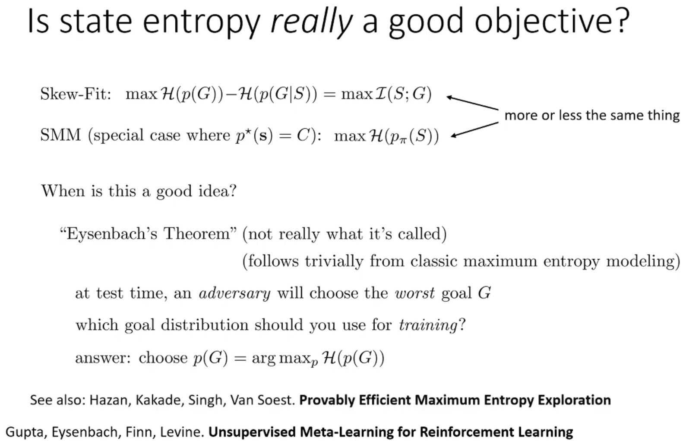

Skew-fit에서는 target space를 cover했고, state marginal matching에서는 $p^\star$에 맞춰 state entropy를 control했다.
이들은 사실상 같은 것이다.

Maximum entropy modeling의 결과로 entropy가 좋은 objective임을 보여주는 하나의 연구를 살펴보자.
* Test time에 adversary가 가능한 최악의 목표 $G$를 선택한다면 실제로 training 중에 학습해야 할 목표는 uniform 분포라는 것을 보여준다.

예를 들어, 악감정을 가지로 로봇 회사에 안 좋은 리뷰를 남기기위해 가장 최악의 task를 준다고 가정하자.
이때, 로봇이 훈련 중 사용할 최선의 target 분포는 uniform 분포라는 것이다.
이는 maximum entropy modeling 결과에서 따라오는 매우 간단한 결과이다.

이것이 의미하는 바는 무엇을 할지에 대한 지식이 없는 상태에서 entropy를 최대화하는 것이 최선이라는 것이다.
이것이 uniform coverage 작업 수행을 정당화한다.
자세한 것은 아래 논문을 살펴보자.

# 7. Covering the space of skills

이번엔 state distribution을 다루는 것을 넘어 실제로 다양한 skill을 학습하는 방법에 대해 살펴 보자.

  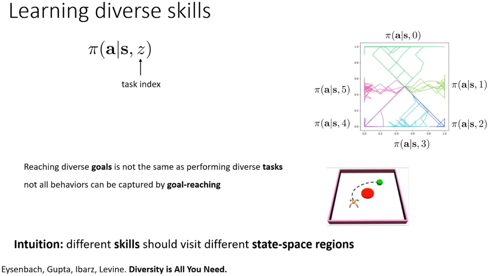

Policy $\pi(a|s, z)$가 있다고 가정하자.
* $z$는 task index이며 $N$개의 값을 가지는 categorical 변수일 수 있다.
* $N$개의 서로 다른 기술을 나타내는 $N$개의 서로 다른 policy가 있다고 상상할 수 있다. 설거지가 그 중 하나일 수 있다.
* 먼저 task $z$를 보고 적절한 policy를 실행하는 방식으로 $\pi(a|s, z)$를 구성하는 것이다.
* 예를 들어 2D 내비게이션 시나리오에서 skill 0은 위로, 1은 오른쪽으로 가는 식으로 생각할 수 있다.

다양한 goal에 도달하는 것은 다양한 task를 수행하는 것과 같지 않다.
* Skew-fit, state marginal matching은 다양한 goal에 도달하는 것을 의미한다.
* 하지만, 이 goal에 도달하기 위해 필요한 다양한 skill을 배우진 않는다.
* 즉, 목표에 도달하는 동안 관찰된 action으론 agent가 할 수 있는 모든 action을 포착할 수 없다.

예를 들어 빨간 원을 피하며 녹색 공에 도달해야 하는 task를 가정하자.
이것을 할 수 있는 goal condition policy는 없다.
Goal condition policy는 녹생 공으로 갈 수 있지만 빨간 원을 피하라고 알려줄 방법이 없다.
녹색 공으로만 가는 action만 관찰하지, 빨간 원을 피하기 위해 우회하여 가는 action은 관찰하지 못한다.

서로 다른 skill은 단순히 goal condition policy처럼 서로 다른 state에 도달하는 것이 아니라 서로 다른 state space area를 방문해야 한다.

  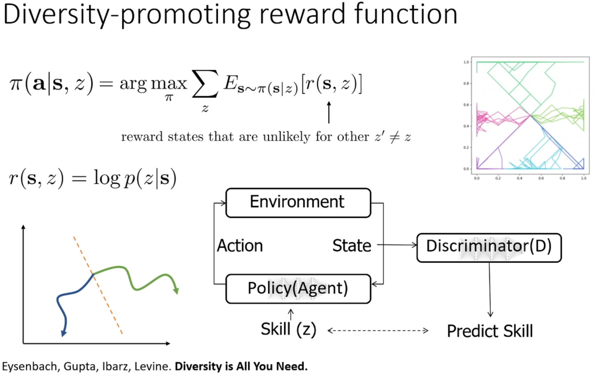

다양한 skill을 학습하는 방법으로 diversity-promoting reward function을 제안한다.
이는 특정 $z$에 대해 다른 task indicies에서 낮은 density를 가지는 state에 reward를 부여한다.
이것을 다르게 표현하면, policy가 방문한 state를 보면 어떤 task $z$를 수행하려고 했는지 추측할 수 있어야 한다는 것이다.
이를 수행하는 방법 중 하나는 reward를 classifier $p(z|s)$로 만드는 것이다.
* Reward function $r(s,z)$가 state를 기반으로 어떤 $z$를 수행하고 있는지 추측한다.
* $r(s,z) = \log p(z|s)$

이를 위해 초기에 skill이 주어지고 이에 따라 RL을 수행하는 과정에서 state를 보고 skill을 예측하는 discriminator $p(z|s)$를 학습한다.
Iteration마다 discriminator를 업데이트하고 policy를 $\log p(z|s)$를 최대화하는 방향으로 업데이트한다.
* 초기에는 무작위적이고 비슷한 state를 방문할 수 있다.
* 이때, 우연히 약간 다른 상태를 방문하게 되면서 그들 사이의 decision boundary가 생기게 된다.
* Iteration을 할수록 각 skill이 방문하는 state area 사이의 boundary는 더욱 명확해진다.

따라서 space를 잘 cover하고 단순히 개별 목표 state에 도달하는 것보다 더 정교한 작업을 하게 된다.

  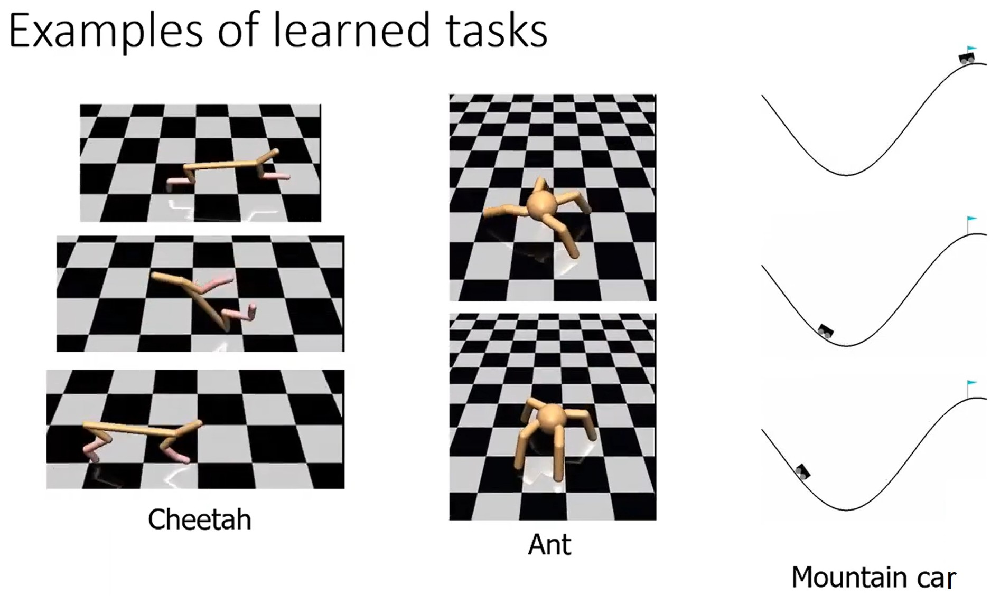

Benchmark 환경에서 이를 적용한 예시이다.
* 치타는 앞으로 달리는 skill, 공중제비를 하는 skill, 뒤로 달리는 skill을 학습했다.
각 state를 정지 상태에서 봐도 어떤 skill을 수행하고 있는지 추측할 수 있다.
* 개미나 mountain car도 마찬가지로 여러 skill을 수행하고 있다.

# 8. A connection to Mutual Information

  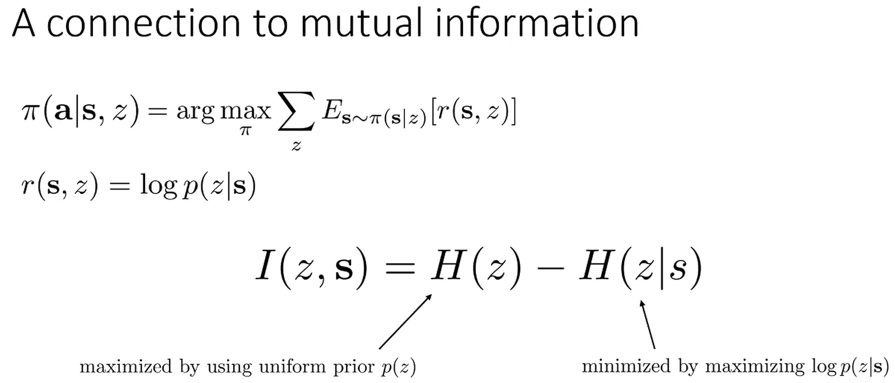

Diversity가 작동하는 이유를 mutual information과 연관지어 살펴보자.

Skill $z$와 state $s$ 사이의 mutual information을 구하면 아래와 같다.

$$
I(z;s) = H(z) - H(z|s)
$$

첫 번재 항은 skill의 prior 분포를 uniform 분포로 정의해 최대화 한다.
* N개의 서로 다른 skill을 균등하게 선택한다.
* 이 항은 매우 쉽게 최대화 가능하다.

두 번째 항은 최소화하는 것은 $\log p(z|s)$를 최대화하는 것과 같다.
* State $s$가 주어지면 skill $z$가 거의 deterministic 해지는 것과 같다.
* Skill이 주어졌을 때 state를 잘 예측하도록 ㅔolicy와 classifier를 학습하는 것은 실제로 $H(z|s)$를 최소화한다.

이는 diversity 전체 알고리즘이 $z, s$의 mutual information을 최대화한다는 것을 의미한다.