이번 강의에서는 offline RL이 무엇인지 그리고 전통적인 offline RL 방법론을 살펴볼 것이다.
이후, lecture 16에서 최신 offline RL 방법을 추가로 논의할 것이다.

# 1. The Gap between Reinforcement Learning (RL) and Supervised Learning (SL)

Offline RL의 동기를 파악하기 위해 먼저 RL과 일반적인 supervised learning의 차이점을 알아보자.

  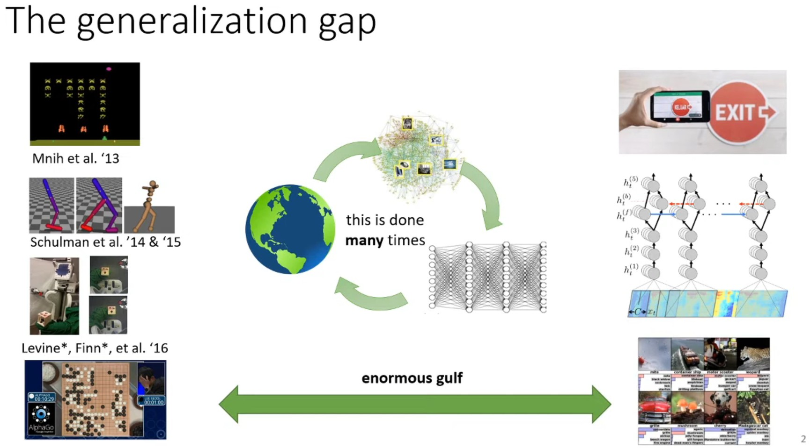

현재까지 논의한 RL 방법들이 잘 동작하는 환경은 supervised deep learning이 효과적인 환경과 차이점이 있다.

RL은 근복적으로 active online process로 반복적으로 환경과 상호작용하며 일부 데이터를 수집하고 그것을 활용해 policy를 개선한다.
이러한 RL의 policy는 closed world environments에서 더 잘 동작한다.
알파고는 바둑 고수들을 이길 수 있지만, 바둑판에 커피가 쏟아질 걱정할 필요가 없다.
반면, SL은 많은 학습 데이트를 미리 수집하고 학습을 진행해 어떤 상황이든 잘 동작하도록 학습이 된다.
즉, generalization gap이 있다.

RL과 SL의 유일한 차이는 data variability이다.
따라서 Deep RL을 다양한 환경에서 많은 양의 데이터로 훈련되도록 확장한다면 SL만큼 효과적으로 일반화될 것이다.

하지만 ImageNet 또는 LLM 등 SL에 학습에 필요한 데이터 양을 매 iteration마다 요청하는 것이 이상적이지만 active learning framework에서 대규모 데이터셋을 사용하는 것은 매우 어렵다.

  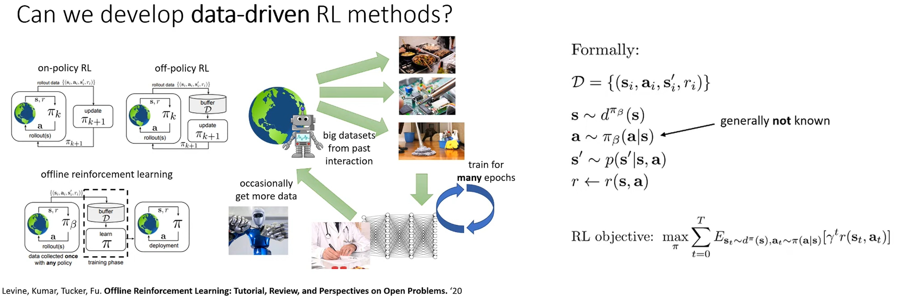

지금까지 논의한 방법들은 online RL로 environment와 상호작용하여 데이터를 수집하고 policy를 업데이트하면 수집한 데이터를 버린다.
* Q-learning과 같은 off-policy RL은 on-policy RL의 buffering version으로 생각할 수 있다.
* Off-policy RL은 데이터를 replay buffer에 저장하여 데이터 효율성을 개선하지만 추가적인 online 수집이 필요하다.
* Policy를 업데이트 한 후, exploration으로 더 많은 데이터를 수집해야 한다.
* Off-policy RL 알고지름에서 데이터를 수집하지 않으면 어떻게 되는지 뒤에서 더 논의한다.

Offline RL은 수집된 dataset을 재사용할 수 있는 RL을 개발하여 일종의 data-driven RL framework를 만드는 것이다.
* Batch RL, fully off-policy RL라고도 불린다.

On-policy, off-policy와 차이점은 offline RL에서는 active interaction을 하지 못하고, 다른 누군가 수집한 buffer만 활용한다는 것이다.
Buffer의 데이터를 수집할 때 실행된 policy를 behavior policy $\pi_\beta$라고 한다.
* Behavior policy와 imitation learning에서 봤던 expert policy를 구별해야 한다.
* Offline RL에서는 $\pi_\beta$는 데이터를 수집하는 데 사용된 mechanism으로 무작위일 수도 있다.
일반적으로 알려져 있지 않은 경우가 많다.
* $\pi_\beta$로 데이터 수집하여 $\pi$ policy를 학습시켜 배포하면 더 이상 학습을 추가로 진행하지 않는다.
일반적인 ML 방법과 같다.

물론 완전히 offline으로 하는 대신 배포 후 더 많은 데이터를 수집해 online RL로 policy를 더 개선할 수 있다.
핵심은 online RL에 의존하지 않는다는 것이다.
* 사람도 이와 비슷하다.
특정한 기술을 배운다고 하면, 과거 모든 경험을 활용해 기술을 효율적으로 배울 것이다.
그 과정에서 약간의 연습과 시행착오로 기술을 개선할 수 있다.

Offline RL을 통해 기존 online active learning으로 하기 어려웠던 다양한 실제 분야에 RL을 사용할 수 있게 된다.
* Robot / medical diagnosis, drug prescription 등 (active exploration이 불가능) / scheduling scientific experiments, controlling power grids, logistics networks 등
* 학습 기반 control을 사용하고자 하는 많은 분야가 있을 것이다.

Offline RL에서 dataset $\mathcal{D}$를 가진다.
Dataset은 transition $(s, a, r, s^\prime)$ 으로 구성되어 있다.
* 하나의 trajectory 내에서 여러 transitions가 발생할 확률이 높고, 이들은 서로 의존되어 있다.
* Importance sampling policy gradient에서는 transtions 간 의존성을 고려해야 한다. (lecture 5 참고)
* 하지만 대부분의 dynamic programming 알고리즘은 Q functions에 기반하고 있기 때문에 transitions 사이의 의존성을 고려하지 않아도 된다.

Dataset의 state는 분포 $d^{\pi_\beta}(s)$를 가진다.
Behavior policy $\pi_\beta$는 무엇인지 모른다.
자율주행으로 가정하면 좋은 운전자, 평범한 운전자, 나쁜 운전자에 dataset이 수집되었을 것이다.
수학적 분석을 위해 $\pi_\beta$가 존재한다고 가정하고 그것을 알 필요는 없다.

# 2. Types of offline RL problems

Offline RL 문제 유형을 살펴보자.

  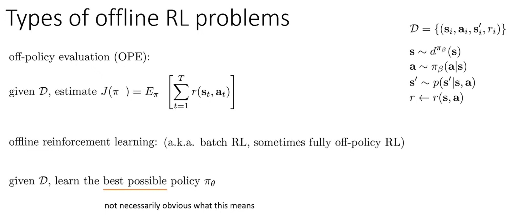

OPE (off-policy evaluation)
* Full offline RL 문제는 아니지만 관련있는 auxiliary 문제이다.
* Off-policy RL과 공통점이 있기 때문에 간단하게 살펴 볼 것이다.
* Dataset $\mathcal{D}$가 주어졌을 때 policy $\pi$의 return을 추정하는 문제이다.

Offline RL (Batch RL, Fully off-policy RL)
* Dataset $\mathcal{D}$가 주어졌을 때 best possible policy $\pi_\theta$를 학습하는 문제이다.
* Actor-critic과 같이 policy를 학습하기 위해선 policy evaluation이 필요하다.
* Offline RL 내부 loop에 off-policy evaluation이 존재할 것이다.

임의의 policy를 evaluation하는 것이 best possible policy를 학습하는 것보다 약간 더 어려울 수 있다.
* Policy를 학습할 때 절대로 나타나지 않을 수 있는 policies를 평가할 필요가 없기 때문이다.

Best possible policy란 반드시 MDP에서 가능한 최고의 policy를 의미하는 게 아니다.
Dataset을 사용해 학습할 수 있는 최고의 policy를 의미한다.
* 수집된 dataset이 MDP를 대변하는 것이 아니다.
* 예를 들어, Montezuma's Revange 게임에서 첫 번재 방의 dataset만 있다면 진정한 optimal policy를 학습할 수 있는 방법이 없다.
따라서 best possible policy 의미를 주의해야 한다.

  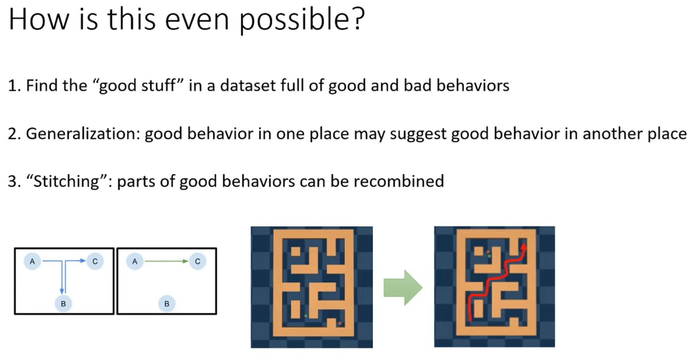

Offline RL과 같이 environment와 상호작용 없이 policies가 학습이 잘 될 수 있는지, 이것이 왜 어려운지를 논의해보자.
Offline RL이 해야 하는 것을 2가지 관점에서 살펴보자.

(1) Finding 'good stuff' in the dataset
* 좋은 offine RL에게 기대하는 naive한 관점이다.
* Imitation learning을 통해 좋은 behavior과 나쁜 behavior의 평균 behavior를 학습한다. (Accumulating error가 발생하지 않는다고 가정한다.)

원칙적으로 offline RL을 실행하면 좋은 운전자의 행동 그 이상을 얻어야 한다.
Offline RL이 항상 dataset 내에서 제일 좋은 behavior만큼만 좋은 것은 아니고, 일반적으로 그보다 더 잘할 수 있다.
2 번째 관점에서 이에 대한 직관을 살펴 보자.

(2) Generalization
* 한 곳에서의 좋은 behavior가 다른 곳에서의 좋은 behavior를 제안할 수 있다는 것을 의미한다.
* Dataset을 활용해, 특정 state에서 가장 좋은 behavior를 학습할 수 있다.
* 더 나아가 어느정도 일반화가 가능해 전혀 보지 못한 좋은 behavior도 할 수 있다.
* 예를 들어, stitching에서 a에서 b로가는 일부 transtiton을 보았고 b에서 c로 가는 다른 transition을 보았다면 a에서 c로 가는 것이 가능하다는 것을 알아낼 수 있다.
* Stitching을 대규모로 확장하여, 임의의 두 점 사이를 이동하는 미로에서 offline RL을 통해 dataset에서 전혀 본 적 없는 두 점 사이를 이동하는 behavior(transition으로 본 적 없음)가 가능하다.

  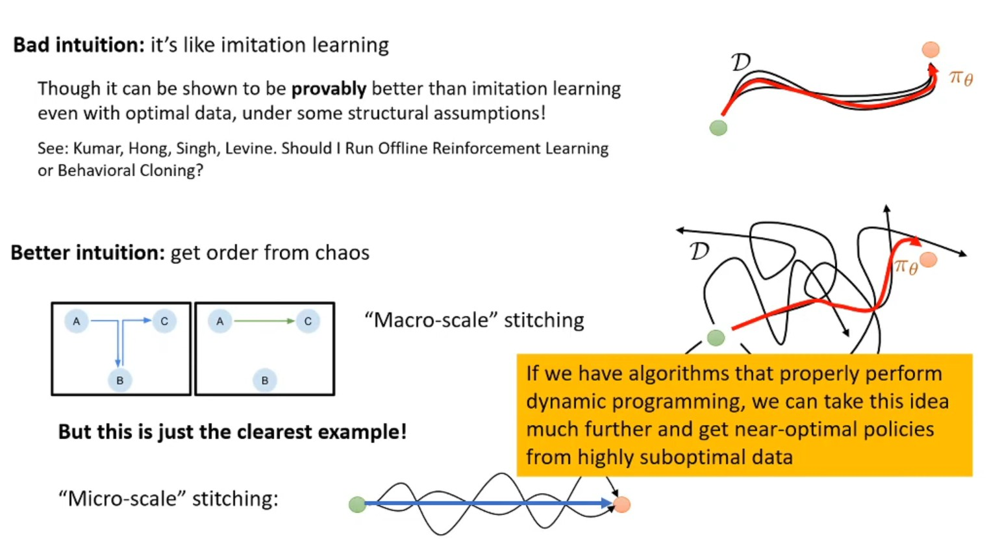

Offline RL을 바라보는 안 좋은 직관은 imitation learning과 비슷하게 생각하는 것이다.
* Offline RL이 dataset의 behavior를 imitate할 것이다.
이론적으로 또 경험적으로 offline RL이 imitation learning보다 더 낫다는 것을 확인할 수 있다.

Offline RL을 바라보는 더 나은 직관은 혼돈(chos) 속에서 질서(order)를 얻을 수 있다는 것이다.
* Dataset이 복잡한 차선책인 trajectories로 구성되어 있다고 가정하자. 
그것들은 대부분은 목표 근처에 가지도 않는다.
* 하지만 약간의 일반화를 추가하여 최고 부분을 취한다면, dataset에서 본 어떤 행동보다 훨씬 더 나은 행동을 얻을 수 있다.

일반화를 잘 할 수 있는 offlien RL 알고리즘이 있다면, policy를 학습할 때마다 대규모의 dataset을 수집할 필요 없다.
더불어, 기존에 RL을 적용할 수 없었던 exploration/trial error가 어려운 domain에 RL을 적용할 수 있다.

  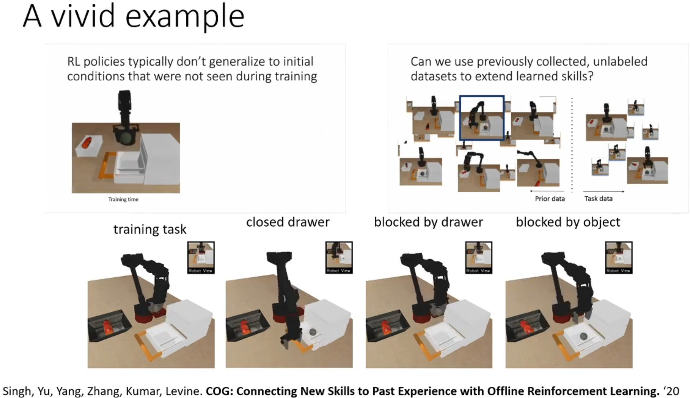

Offline RL의 일반화에 대한 예시를 보자.
* 왼쪽 상단은 열린 서랍에서 물체를 집는 것을 훈련 시켰다고 하자.
테스트 때 서랍이 당혀 있으면 무엇을 해야 할지 알 방법이 없을 것이다.
* 오른쪽 상단 처럼 열린 서랍에서 열린 서랍에서 물체를 집는 것과 독립된 skill을 가진 data를 수집하고 학습했을 때 아래 쪽 그림처럼 이전에 본 적 없는 닫힌 서랍을 열로 물건 집기 task를 수행할 수 있게 된다.
  * 각 state에서 reward를 최대로 할 수 있는 action을 하게 된다.

# 3. Why is offline RL hard?

  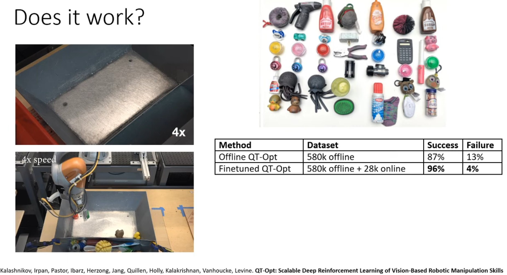

책상에 놓인 물건을 집는 task에서 offline RL만으로 학습한 policy와 online data로 추가로 fine-tuning한 policy의 성능을 비교해보자.
* Online dataset에는 offline data에 비해 적은 28K transition이 존재한다.
* Online으로 fine-tuning할 때 replay buffer와 Deep Q-learning을 사용해 off-policy로 학습을 진행한다.

이들의 성능을 살펴 보면 성공률은 각각 87%, 96%이고 실패율은 각각 13%, 4%이다.
Offline RL이 잘 동작하는 것처럼 보이지만 실패율에서 3배 이상 차이가 난다.

Offline RL의 성능이 떨어지는 이유를 직관적으로 알려주는 실험이 존재한다.

  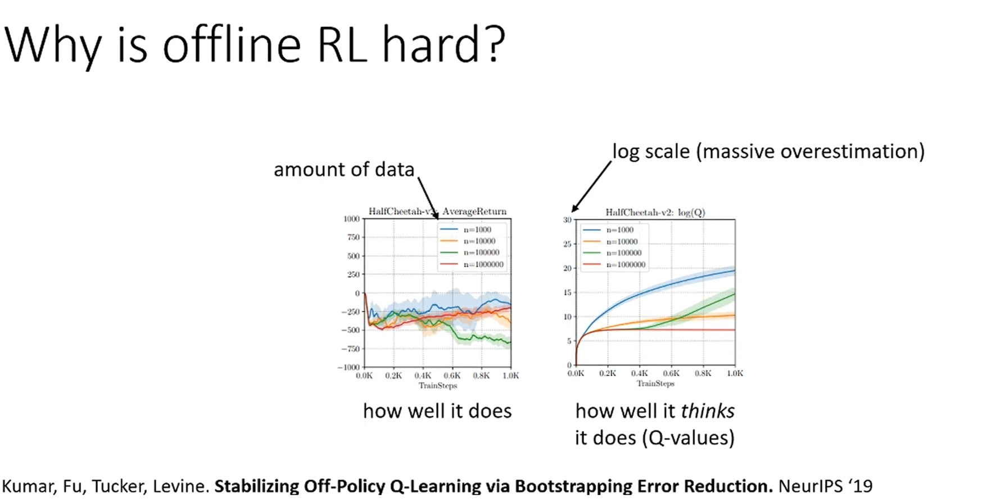

그림은 HalfCheetah dataset으로 수행된 실헙이다.
기본적으로 SAC(Soft Actor-Critic)으로 RL 학습을 진행하면서 replay buffer에 data를 수집하였다.
이때 성능은 5,000 ~ 6,000 정도였다.

그 후, 전체 replay buffer를 offline dataset으로 사용해 Q function을 사용하는 고전적인 actor-critic off-policy 알고리즘으로 학습하였다.
$n$은 dataset의 크기를 나타내고, 결과를 살펴보면 모두 나쁘게 수행되는 것을 관찰할 수 있다.

각 dataset 크기 $n$ 별로 학습된 Q value를 보면 reward가 높은 것을 알 수 있다.
y 축은 log scale로 $n=1,000,000$인 경우 $10^7$ reward를 얻을 것으로 추정하지만 실제로는 -250을 얻는다.

  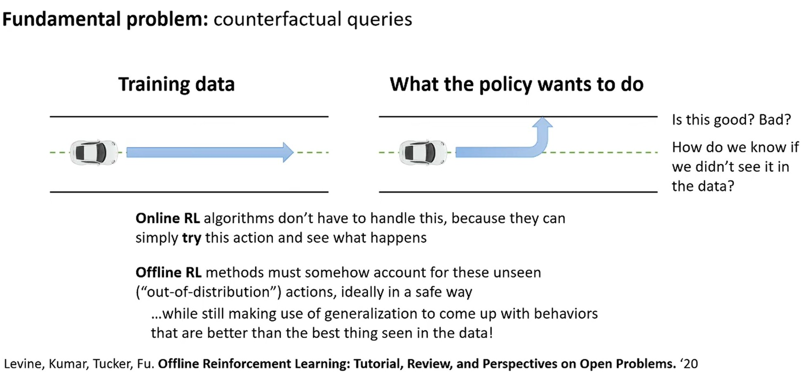

Offline RL의 근본적인 문제는 counterfactual queries 문제로 생각할 수 있다.
즉, dataset에서 관찰할 수 없었던 사실(counterfactual)에 대한 reward를 추정 (query)할 때 문제가 생긴다.
일종의 OOD (Out Of Distribution) 문제이다.

자율 주행 예시에서 적절하게 운전하는 인간 data를 학습할 때 사용한다고 가정하자.
운전자들이 최적, 즉 expert는 아니지만 그들은 갑자기 반대 차선으로 가는 등의 위험한 행동은 하지 않는다.
따라서 모든 possible behavior를 관찰할 수 없어 possible behavior의 coverage가 완전하지 않다.

Policy를 학습할 때 possible behavior를 모두 비교해서 argmax action을 취해야 한다.
Generalization 덕분에 유사한 state에서의 유사한 action은 추정이 가능하지만 너무 다른 행동은 그렇지 않다.
* Online RL 알고리즘은 배포 후, 새로운 action을 시도하고 어떤 일이 일어나는지 관찰 가능하기 때문에 이를 걱정할 필요가 없다.
하지만 그렇기에 활용하지 못하는 domain (의사 처방/수술 등)이 존재한다.
* Offline RL 알고리즘은 관찰하지 못한 action을 적절히 처리해야 한다.
익숙하지 않은 action, 즉 out of distribution action은 낮은 reward를 주거나 시도를 하면 안 된다는 것을 학습해야 한다.

주의할 점은 out of distribution actions과 out of sample action을 혼동해서는 안 된다는 것이다.
Q function은 이전에 본 적이 없는 action이라도 동일한 action distribution에서 나온 것이라면 generalization 덕분에 정확하게 추정할 수 있다.

Generalization 덕분에 dataset에서 본 적 없는 더 나은 action을 선택할 수 있다.
하지만, 동시에 OOD action을 파악해 적절한 처리를 해야 한다.

  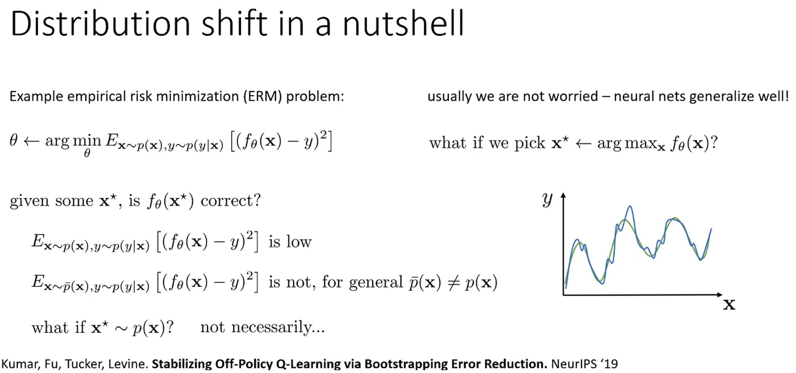

통계학에서는 이를 distribution shift라고 부른다.
이를 간단하게 살펴보자.

Supervised learning에서 어떤 분포 $p(x)$에서 샘플링된 train dataset를 이용해 target 값 $y$를 맞추도록 model을 학습한다.
Train dataset로 위험에 대한 경험적 추정하고 최소화하고 있기 때문에  empirical risk minimization라고 불린다.
Overfitting이 되지 않는다면 실제 risk도 최소화할 것이다.

하지만 일반적으로 train dataset 분포 $p(x)$와 다른 분포 $\bar{p}(x)$의 error 기댓값은 낮지 않다.
심지어 $p(x)$에서 샘플링된 $x$라고 낮은 error가 보장되지 않는다.
$p(x)$의 error 기댓값은 낮을 수 있어도 개별 point에서 높은 error를 가질 수 있기 때문이다.
$x^\star$를 선택할 때 임의로 선택하지 않고 $f_\theta(x)$를 최대화하는 $x$ 등 명시적으로 선택할 수 있다.
따라서 $f_\theta$가 얼마나 좋든 간에 error를 최대화하는 것을 선택할 수도 있는 것이다.
이는 adversarial example을 만드는 과정과 매우 유사하다.

Adversarial example은 원하는 class의 확률을 최대화하거나 true label에 대항하는 class의 확률을 최소화하기 우해 조작된 data를 의미한다.
이를 통해 neural network를 속여서 원하는 행동을 할 수 있도록 만든다.
* 예를 들어, spam classifier가 수행되는 원리를 파악해 이를 속일 수 있도록 메일을 작성할 수도 있다.

  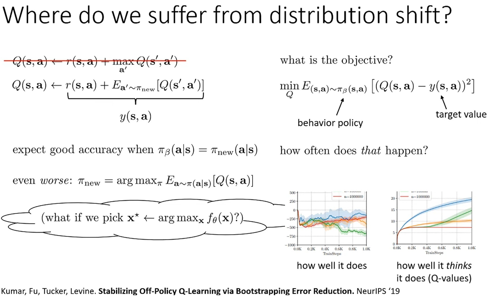

Adversarial example과 Q-learning의 관련성을 살펴 보자.

Q-learning은 off-policy 알고리즘으로 offline RL을 하기 위한 알고리즘으로 적절하다. (유일한 것은 아니다)
Q-learning에서 target 값을 계산할 때 다음 상태에서 가능한 action의 최대 Q value를 사용한다.
최대 Q value를 고려하는 대신, 이전에 논의한 것처럼 어떤 policy $\pi_\nu$의 Q function의 기댓값으로 쓸 수 있다.
이것이 regression하고자 하는 target $y(s,a)$이다.

Q function을 학습할 때 목표는 Q와 target 값 $y$ 사이의 오차를 최소화하는 것이다.
Offline RL에서는 dataset을 생성한 behavior policy $\pi_\beta$에 기반한 $r(s,a)$와 $Q(s,a)$ 사이의 오차를 최소화한다.
Offline RL에서 train distribution은 $\pi_\beta(s,a)$이다.
이는 $\pi_\beta$에 기반한 Q value가 정확할 것으로 기대하면서, 평가는 학습된 target 값인 $\pi_\text{new}$에 기반하는 것을 의미한다.

일반적으로 offline RL은 $\pi_beta$보다 더 나은 policy $\pi_\text{new}$를 학습하기 때문에 $\pi_\beta \neq \pi_\text{new}$이다.
더 나쁜 점은 $\pi_\text{new}$가 $\pi_\beta$ 분포에 기반한 Q value 기댓값을 최대화하는 action은 선택한다는 것이다.
* Q-learning에서는 Q 값이 최대인 action을 선택하고, actor-critic 같은 policy gradient에서도 advantage function 즉, Q 값이 최대가 되도록 학습한다.

이는 이전에 살펴본 adversarial example과 같은 문제를 야기한다.
즉, $\pi_\text{new}$는 Q function을 속여서 큰 값을 출력하도록 하는 adversarial example을 찾으려고 한다.
Policy $\pi_\text{new}$는 항상 Q functnciton을 속이는 어떤 action(trian dataset에서 보지 못한 action)을 찾을 수 있기 때문에, Q 값을 살펴보면 매우 큰 과대 평가가 발생하는 것을 알 수 있다.
* Maximization bias는 max 연산 자체로 과대평가가 발생하는 것이고 offline RL은 OOD로 인한 Q값의 부정확성 때문에 과대평가가 발생한다.

이것이 offline RL의 근본적인 문제이다.

  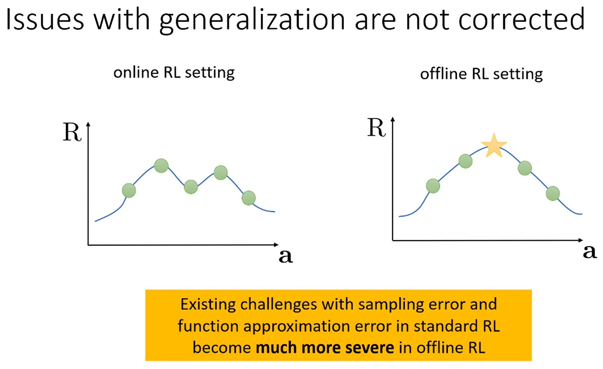

가운데 point($\star$)을 보지 못했다면 오른쪽 처럼 그곳이 reward를 최대화하는 action이라고 판단할 것이다.

Online setting에서는 실제로 가운데 action을 실행하고 그에 맞는 reward를 관찰하여 왼쪽과 같이 수정될 수 있다.
하지만, offline에서는 그렇게 할 수 없다.

Standard RL에서 발생하는 sampling error(데이터가 충분하지 않음)와 function approximation error(선정한 model이 부적절함. 예를 들어, Atari breakout와 Montezuma's Game에서 적절한 model이 다름)를 가지는 task에서 offline RL는 feedback 효과가 없기 때문에 문제점은 더욱 심각해진다.

# 4. Batch RL via Importance Sampling

이번 강의에서는 고전적인 offline RL 알고리즘을 살펴볼 것이다.
고전적인 알고리즘은 현재 사용되고 있지 않지만 과거 offline RL을 바라보는 관점을 알려준다.
오늘날 활용되는 offline RL 알고리즘은 lecture 16에서 살펴 볼 예정이다.

Offline RL 방법론들은 대부분 vlaue-based methos, dynamics programming-based method이지만, 과거 많이 연구되었던 importance sampling도 조금 살펴 볼 것이다.

  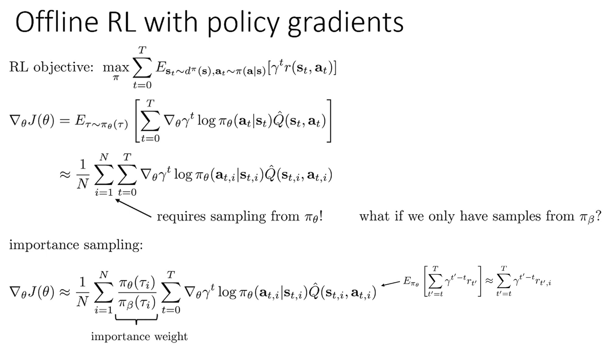

Offline RL에서 policy gradient를 사용하는 방법 중 가장 직관적인 것은 importance sampling하는 것이다.
Policy gradient에서 기대값을 계산할 때 behavior policy $\pi_\beta$에 기반한 데이터셋을 사용하기 때문에 importance weight $\frac{\pi_\theta(\tau_i)}{\pi_\beta(\tau_i)}$를 곱해줘야 한다.

  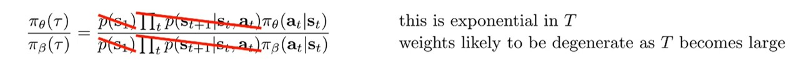

Importance weight 같은 확률을 사용할 때 policy에 의존하지 않는 initial state probability, transition probability term은 $\pi_beta$와 $\pi_\theta$에서 동일하기 때문에 모두 소거된다.
이것이 behavior policy의 샘플만 활용해 policy gradient estimator를 구성하는 unbiased 방법이다.

Time step $T$가 커질수록 곱해지는 action probability 수는 $O(T)$이다.
Action probability는 1보다 작기 때문에 importance weight 값은 $T$에 exponential하게 퇴화한다(작아진다)는 문제점이 있다.
* $T$가 증가할수록 weight가 작아지기 때문에 임의적인 하나의 sample만 사용해 policy gradient를 추정하게 된다는 것을 의미한다.

수학적으로 importance weight는 unbiased 방법론으로 많은 샘플을 사용하거나, 독립적인 샘플들로 얻은 추정량을 평균낸다면 실제로 올바른 값을 얻을 수 있다.
하지만, 분산이 $T$에 지수적으로 크다.
즉, 정확한 추정을 얻기 필요한 샘플 수는 $T$에 지수적으로 증가한다.

이것을 해결하는 방법으로 가기 전 recap하자.
Lecture 5 section 11 그리고 lecture 9를 바탕으로 두 policy가 가까우면 $s_t$까지 도달할 확률이 가깝기 때문에 과거에 대한 importance weight는 무시해도 합리적이라는 추론을 했었다.
* PPO 알고리즘이 이 방식으로 분산을 줄이고 있다.

Offline RL에서는 이 방식으로 분산을 줄일 수 없다.
* Online RL에서는 policy가 점진적으로 개선되기 때문에 $\pi_beta$와 $\pi_\theta$가 유사하다.
* Offline RL에서는 더 나은 policy를 얻는 것이 목표이기 때문에 $\pi_\beta$와 $\pi_\theta$가 유사하다는 가정을 할 수 없다.

하지만 이 점에 대해 조금 더 깊이 들여다보자.

  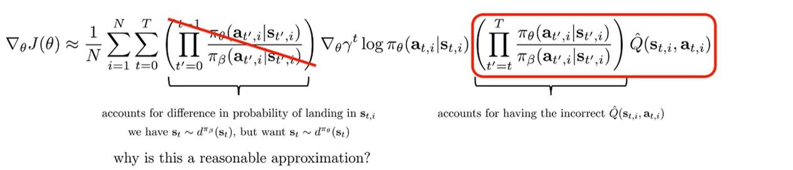

Importance weight를 두 부분으로 나눌 수 있다.
하나는 0부터 $t-1$까지의 곱으로 $s_t$ state에 도달할 확률의 차이를 설명하고, 다른 하나는 $t$부터 $T$까지의 곱으로 미래에 얻을 reward 차이를 설명한다.
* 만약 $\pi_\theta$와 $\pi_\beta$가 유사하다면 첫 번째 부분은 무시할 수 있다.

  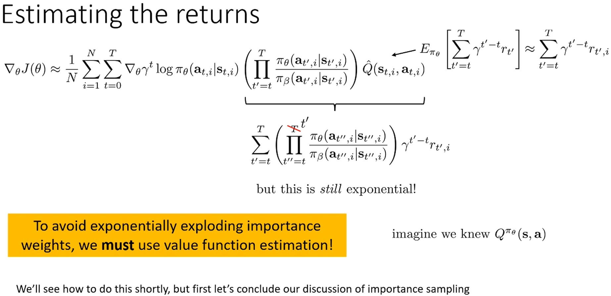

두 번째 부분을 좀 더 자세히 보자.
$\pi_\beta$로 reward의 합 $\hat{Q}$를 추정할 수 있지만, 이 값에 importance weight를 곱해 $\pi_\theta$에 대한 추정으로 변경할 수 있다.
이때, 미래의 action은 과거의 reward에 영향을 미치지 않기 때문에 (causality) $t$ 부터 $T$까지가 아닌, $t$부터  $t^\prime$까지의 곱으로 나타낼 수 있다.
이 방법으로 분산을 조금 낮출 수 있지만 여전히 $T$에 지수적으로 증가한다.

Importance sampling에서 분산을 감소시키기 위해 value function estimation $Q^{\pi_\theta}(s,a)$을 사용해야 한다는 것이 밝혀 졌다.
하지만, 여전히 value function estimation 없이 분산을 감소시키려는 시도를 하였다.
Causality와 바로 아래에서 살펴 볼 doubly robust가 그 방법들 중 하나이다.
* $Q^{\pi_\theta}(s,a)$는 조금 더 이후에 논의하자.

## 4.1. Doubly Robust Estimator

  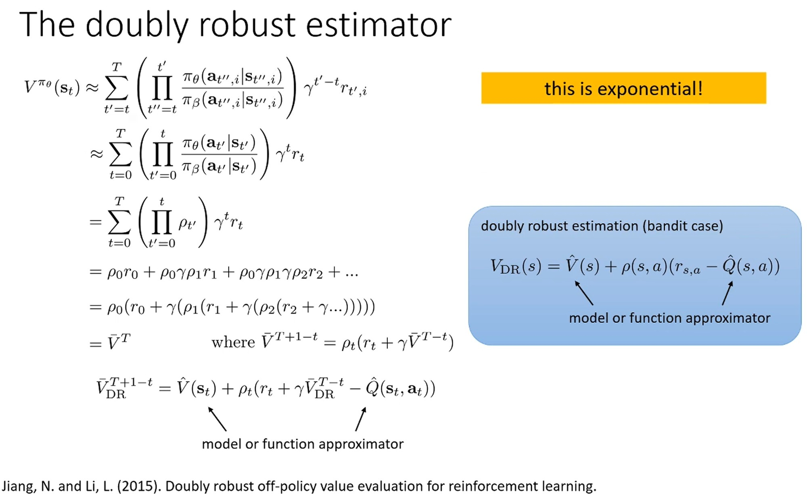

많은 최근 알고리즘에 영감을 준 doubly roubust estimator의 아이디어를 살펴보자.
* Doubly roubust estimator는 importance sampling을 위한 baseline과 비슷한 것으로 생각할 수 있다.

단순함을 위해 initial state $s_0$에서의 importance sampling으로 추정한 value를 논의하자.
그리고 $\rho_{t^\prime} = \frac{\pi_\theta(a_{t^\prime}|s_{t^\prime})}{\pi_\beta(a_{t^\prime}|s_{t^\prime})}$라고 하자.
이를 풀어 쓰면 $\rho_0r_0 + \rho_0\gamma\rho_1r_1 + \cdots$처럼 $\rho\gamma$가 교차로 나타나는 패턴을 얻을 수 있다.

이를 곱셈과 덧셈의 분뱁/교환법칙을 사용해 term $\bar{V}^T$로 그룹화하고 재귀적으로 나타내면 $\bar{V}^{T+1-t}=\rho_t(r_t + \gamma\bar{V}^{T-t})$ 식을 얻을 수 있다.
* $\bar{V}^3$에 대해, 
  * t=0: $\bar{V}^{2+1-0} = \bar{V}^3 = \rho_0(r_0 + \gamma \bar{V}^2)$
  * t=1: $\bar{V}^{2+1-1} = \bar{V}^2 = \rho_1(r_1 + \gamma \bar{V}^1)$
  * t=2: $\bar{V}^{2+1-2} = \bar{V}^1 = \rho_2(r_2 + \gamma \bar{V}^0)$
  * 따라서 $\bar{V}^3 = \rho_0(r_0 + \gamma \bar{V}^2) = \rho_0(r_0 + \gamma (\rho_1(r_1 + \gamma \bar{V}^1))) = \rho_0(r_0 + \gamma (\rho_1(r_1 + \gamma (\rho_2r_2))))$

궁극적으로 $\bar{V}^T$를 얻어야 하고 이는 재귀적으로 bootstarp으로 구할 수 있다는 것을 보았다.

Bandit 문제에서 doubly robust estimation을 먼저 살펴 봐서 직관을 얻자.
* Bandit 문제에 importance sampling을 적용하는 것이 어색할 수 있지만, 이는 작동하며 multi-step에 대한 직관을 제공한다.

다른 분포로부터의 reward가 있고 importance weight $\rho(s,a)$을 곱해 bandit의 value를 추정할 것이다.
이것은 state를 가지는 contextual bandit으로 볼 수 있다.
* Value 값을 추정 $\hat{V}(s), \hat{Q}(s,a)$ 할 것인데 매우 정확할 필요는 없다.
* $\hat{Q}(s,a)$을 neural network로 학습하고 샘플을 바탕으로 $\hat{V}(s)$ 값을 추정한다.

Doubly robust estimation은 baseline처럼 reward에 추정된 $\hat{Q}(s,a)$를 뺀 값에 importance weight $\rho(s,a)$를 곱한 기댓값을 $\hat{V}(s)$에 더한다.
* Bandit은 단일 step만 진행하므로 기댓값 $\mathbb{E}[\rho(s,a)(r_{s,a} - \hat{Q}(s,a)]$이 곧 단일 샘플로 추정 $\rho(s,a)(r_{s,a} - \hat{Q}(s,a)$한 것이다.

$\hat{V}$가 $\hat{Q}$의 기댓값이면 doubly robust estimation은 baseline과 같이 $\hat{Q}$와 관계없이 unbiased 기댓값을 가지면서, $\hat{Q}$가 정확할수록 $V_\text{DR}$의 분산이 낮아진다.
* Doubly robust estimation은 분산을 낮추기 위해 importance sampling에 baseline 아이디어를 결합한 것이다.

Bandit에서의 doubly robust estimation을 확장해 multi-step에 적용하면 $\bar{V}^T$는 위 그림의 마지막 수식과 같이 $\bar{V}_\text{DR}$에 관한 재귀 형식으로 추정할 수 있다.
* Neural network $\hat{Q}$를 학습한 뒤, $\hat{V}(s) = \mathbb{E}[\pi_\theta(s,a) \times \hat{Q}(s,a)]$를 추정한다.
  * $\hat{V}(s)$를 추정할 땐 $\pi_\beta$ 샘플을 사용하지 않고 오로지 학습된 $\pi_\theta$와 $\hat{Q}(s,a)$를 활용하므로 importance sampling이 필요 없다.
* Bandit에서의 $r(s,a)$ 대신 재귀적으로 $r_t + \gamma \bar{V}^{T-t}$의 importance sampling을 추정한다.

이것은 RL 방법론이 아닌 off-policy evalution (OPE) 방법으로,
가치를 추정해 더 나은 policy를 얻을 수 있도록 해준다.

## 4.2. Marginalized Important Sampling

  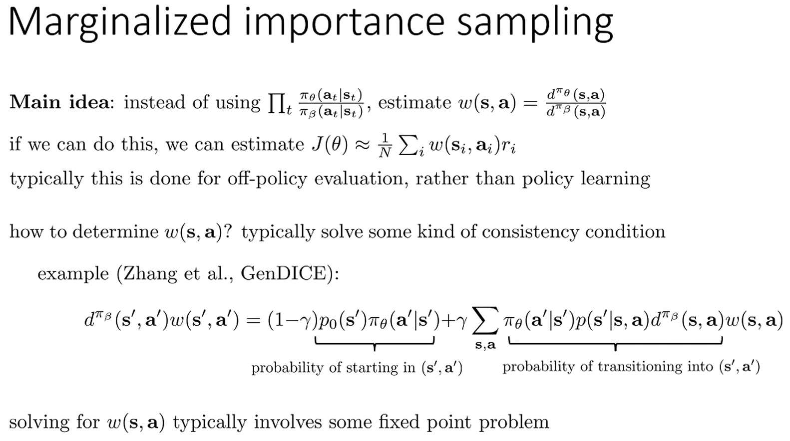

기술적으로 자세히 다루진 않지만, 알아두면 좋은 marginalized IS에 대해 살펴보자.

기존의 방법은 action 확률 $\pi(a|s)$로 importance weight를 계산했지만, state 또는 state, action 확률 $d^\pi(s,a)$로 importance sampling하는 것이 가능하다.
* $\pi(a|s)$를 알고 있기 때문에 state 확률의 ratio를 state, action ratio로 바꾸는 것은 쉽다.

State, action importance weight $w(s,a)$를 파악하면 모든 샘플 reward에 $w(s,a)$를 곱해 off-policy의 value를 쉽게 평가할 수 있다.
* 많은 paper에서 value를 평가할 때 이 방식을 사용했지만, policy learning (policy gradient 등)에서는 많이 보이지 않는다.

State, action importance weight $w(s,a)$를 결정해야 한다.
$d_{\pi_\theta}(s,a), d_{\pi_\beta}(s,a)$를 모르기 때문에 bellman equation처럼 $w(s,a)$에 대한 consistency condition을 풀어야 한다.
* Bellman equation에서는 $Q(s,a) = r(s,a) + \gamma \mathbb{E}[Q(s^\prime, a^\prime)]$이면 올바른 Q function이라는 일관성을 부여한다.

GenDICE paper에서 위의 그림의 수식과 같이 marginalized IS의 일관성을 부여하고 있다.
이것을 만족하면 $w(s,a)$가 올바르다고 생각하는 것이다.
* $d^{\pi_\beta}(s,a) \times w(s,a) = d^{\pi_\theta}$로 $\pi_\theta$로 행동했을 때 $(s,a)$에 있을 확률을 뜻한다.
* 우변의 첫 번째 항은 $s, a$에서 시작하는 확률을 나타내고, 두 번째 항은 다른 state로부터 $s, a$로 전이할 확률을 나타낸다.
* 좌변과 우변의 차이의 기댓값이 $d^{\pi_\beta}$ 하에서 0이되도록 학습해 $w(s,a)$를 추정한다.
  * 양변 차이의 제곱이 0이되도록 학습하여 $w(s,a)$를 추정한다.
  * $d^{\pi_\beta}$의 샘플을 사용하면, $w(s,a)$만 neural network로 학습하면 된다.

  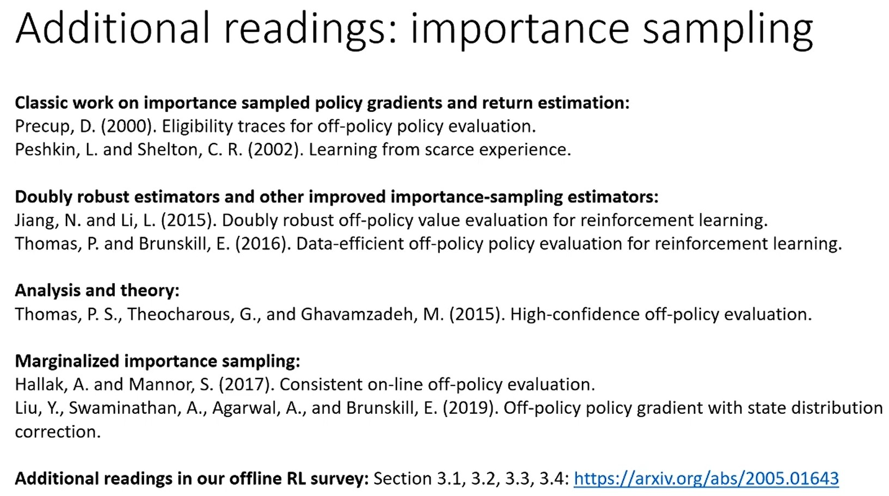

# 5. Batch RL via Linera Fitted Value Functions

요즘엔 liner fitted value functions 대신 deep neural network를 사용해 value function을 학습한다.
하지만, closed form으로 min squared error를 해결하는 직관은 deep RL 방법을 고안할 때 많은 insight를 제공하기 때문에 논의할 가치가 있다.

  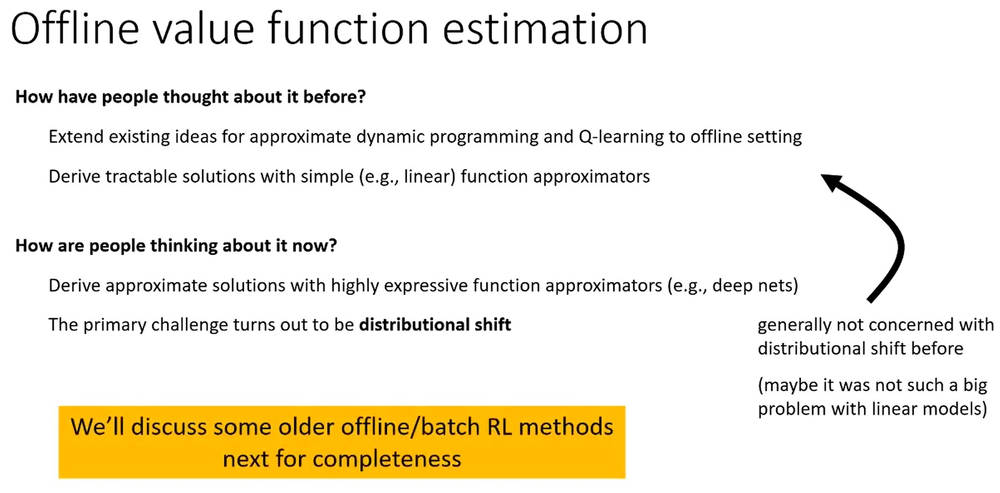

초기에는 linear function estimator와 같이 단순한 model로 dynamics programming 또는 Q-learning을 offline RL로 확장했다.
요즘엔 deep nerual network와 같은 representation이 높은 estimator를 사용해 정확성을 높였지만, distribution shift라는 문제가 발생하게 됐다.
* Linear function의 경우 model이 단순해서 overfitting이나 extrapolation 문제가 상대적으로 덜하기 대문에 distribution shift 영향이 거의 없다.

따라서 이번 section에서 논의하는 알고리즘은 distribution shift 문제를 고려하지 않고 batch data로 value function을 추정하는 문제에 집중한다.
그렇기 때문에 이 알고리즘들을 바로 deep neural network에 적용하면 distribution shift 문제 때문에 성능이 안 좋을 것이다.

  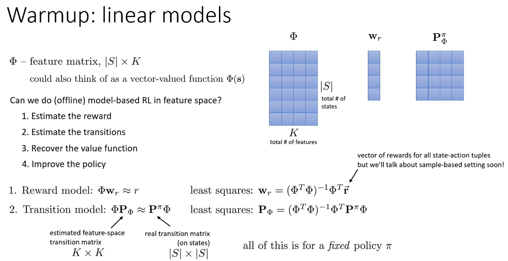

Discrete space MDP를 가정한다.
Feature matrix $\Phi \in \mathbb{R}^{|S| \times K}$가 있다.
$|S|$는 state의 수이고, $K$는 feature의 수이다.
* Infinite state space에서도 샘플링을 통해 feature matrix를 구성할 수 있다.

Feature space에서 (offline) model-based RL을 하기 위해, linear function을 이용해 feature로 reward, transtitions 추정하고 이를 바탕으로 value function을 추정할 수 있다고 가정한다.
추정된 Value function 값을 기반으로 policy를 개선한다.
* Reward model: $\Phi w_r \approx r \in \mathbb{R}^{|S|}$
  * $w_r$은 weight vector로 state의 feature를 활용해 reward를 맞추도록 학습된다.
  * 모든 state를 관찰할 수 있을 때, MSE를 최소화하는 $w_r$은 위의 그림과 같이 closed form으로 구할 수 있다.
  * Infinite space에서 샘플링하는 경우는 조금 밑에서 살펴보자.
* Transition model: $\Phi P_\Phi^\pi \approx P^\pi\Phi$
  * Transtion model에서는 지금의 feature가 미래에 어떻게 바뀌게 되는지를 표현하는 $P_\Phi^\pi \in \mathbb{R}^{K \times K}$를 학습한다.
  * 즉 현재 state가 바로 다음 어떤 state가 되는지 학습하는 것으로 $s_1$의 next state로 $s_3$로 갈 확률 80\%, $s_5$로 갈 확률 20\%이면 $s_3$의 feature $\times \ 0.8 + s_5$의 feature $\times \ 0.2$로 feature를 transition한다.
  * 다른 policy를 다른 state transiton을 유도하기 때문에 policy에 dependent하다.
  * 이것도 reward model과 동일한 방법으로 closed form으로 해를 구할 수 있다.

  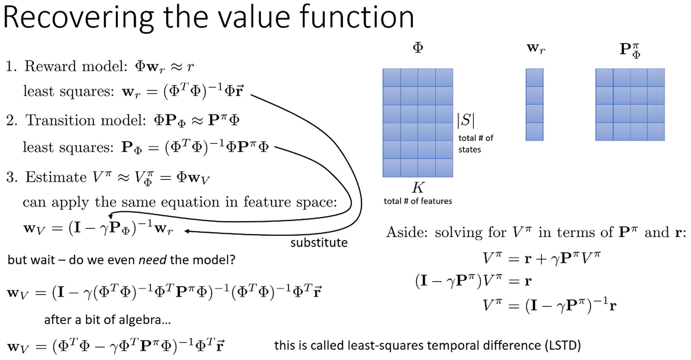

Value function model: $\Phi w_V \approx V^\pi_\Phi = \Phi w_V \in \mathbb{R}^{|S|}$
* Value function 모델은 Bellman equation을 만족하도록 학습된다.
* Bellman equation을 행렬 형태로 나타내면 $V^\pi = r + \gamma P^\pi V^\pi$와 같다.

MSE를 최소화하는 $w_V$는 reward model와 transition model에서 구한 값을 대입하여 closed form으로 구할 수 있다.
* $P_\Phi$와 $w_r$ 또한 feature matrix와 샘플을 기반으로 closed form으로 구했다.
* 따라서 $w_V$도 reward model과 transition model 없이 feature matrix $\Phi$와 샘플($r, P^\pi$)을 기반으로 closed form으로 바로 구할 수 있다.
* 약간의 선형대수를 활용해 단순화하면 위 그림의 마지막 수식을 유도할 수 있다.

이 방법론은 offline RL에서 LSTD(Least Squares Temporal Difference)라고 한다.
* 특정 policy의 가중치 $w_V$와 feature matrix $\Phi$를 고려해 value function을 추정하고, 이를 기반해 policy를 개선한다.

  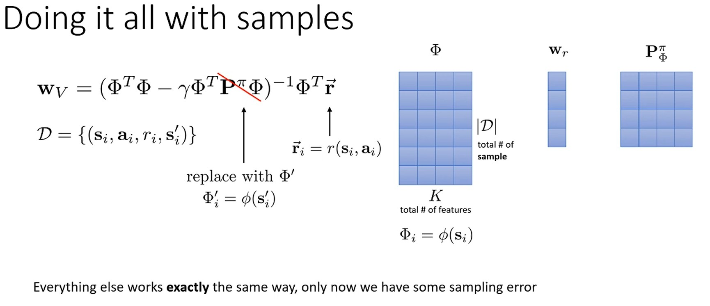

Model에 대한 지식 $r, P^\pi$가 없는 model-free 상황에서 샘플 기반으로 $w_V$를 추정해보자.
* 샘플은 offline dataset을 의미한다.

Feature matrix $\Phi \in \mathbb{R}^{|D| \times k}$가 될 것이고, reward와 transtion model 또한 샘플 $(s, a, r, s^\prime)$에 기반해 계산한다.
* $|D|$는 샘플에서 나타는 state의 unique 수이다.
* Transtiton model 또한 $s^\prime$을 알고 있기 때문에 $P^\pi \Phi$대신 $\Phi(s^\prime)$으로 바로 구한다.

이를 기반으로 $w_V$를 구하는 방법은 동일하고, 단지 샘플링 error가 있다.
샘플 집합으로 추정하기 때문에 empirical MDP라고 불린다.

  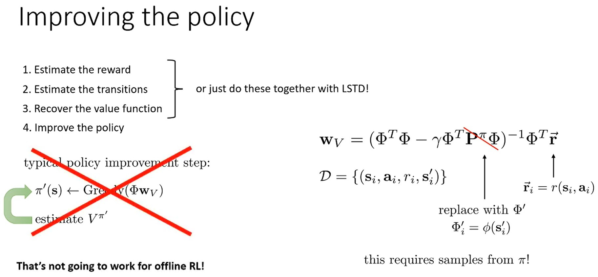

LSTD에서 $w_V$로 value function을 추정해서 policy를 개선해보자.

일반적으로 greedy 방식으로 policy를 개선하고 value function을 추정하는 LSTD 과정을 반복한다.
여기서 LSTD는 policy에 의존적인 값이기 때문에 개선된 policy $\pi^\prime$으로 샘플링된 data가 필요하다는 문제가 발생한다.

이는 off-policy를 얘기할 때 value iteration 대신 Q iteration 쓰는 이유와 동일한 문제이다.
따라서 value function을 추정하는 대신 Q function을 추정해야 한다.

  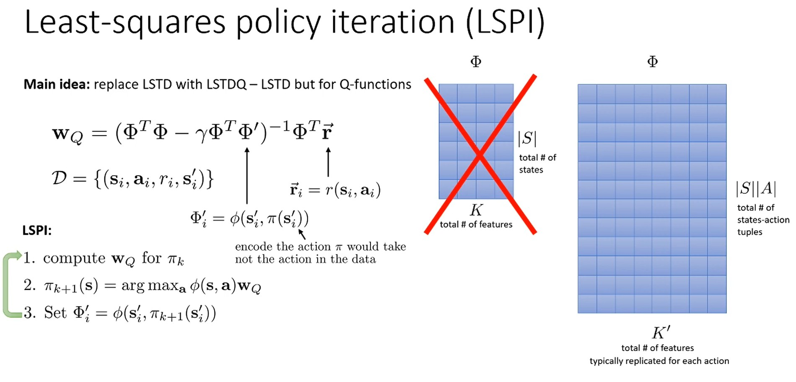

Q function을 linear function으로 모델링해서 LSTDQ(Least Squares Temporal Difference for Q)를 사용해 policy를 반복 개선하는 것을 LSPI (Least-squres policy iteration)이라고 한다.

LSTD대신 LSTDQ를 사용하는데 이는 Q function에 대한 LSTD를 의미한다.
* State에 대한 feature matrix 대신 state-action에 대한 feature matrix $\Phi \in \mathbb{R}^{|S||A| \times K}$를 가진다.
Action에 관한 feature도 가져야하기 때문에 state feature matrix보다 많은 $K$를 가질 것이다.
* 다른 모든 것은 정확히 동일하게 유지되고 이를 통해 $w_Q$를 계산할 수 있다.
  * $(s,a,r,s^\prime)$이 있을 때 $\Phi^\prime$는 $s^\prime$의 다음 action $a^\prime$을 필요하기 때문에 현재 평가하고 있는 policy $\pi(s^\prime)$로 action을 선택한다.
* $\Phi$는 변하지 않지만 $\Phi^\prime$은 policy에 따라 변한다.

  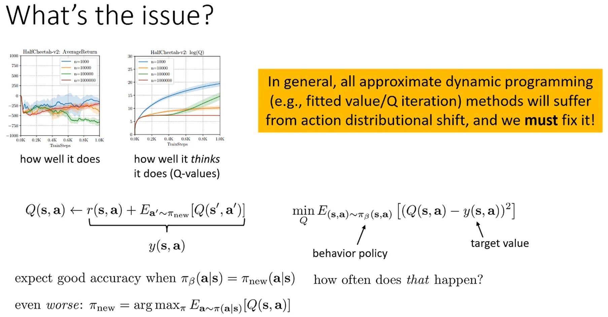

수식적으로 LSPI는 깔끔하지만, 이번 강의 section 3에서 살펴 봤다시피 argmax로 생성되는 adversarial example로 인해 실전에서는 distribution shift 문제가 발생한다.

이는 다음 lecture 16에서 논의하자.

