# 1. Distribution Shift Problem

  

이번 강의에서는 offline RL에서 distribution shift 문제를 완화하는 방법에 대해서 살펴본다.

Lecture 15에서 봤듯이, offlien RL에서 $\pi_\beta$로 샘플링된 train dataset으로 $\pi_\theta$를 개선하기 때문에, 학습된 $Q(s,a)$는 정확하지 않을 수 있다.
그 상황에서 argmax를 통해 advesarial example가 생성되고 배포 환경에서 distribution shift 문제를 겪을 수 있다.
* 본 적 없는 $Q(s,a)$를 부정확하게 추정하고 이것이 다른 pair보다 더 높은 reward를 준다고 평가되면 해당 action을 수행하게 된다.
하지만, 실전에서 최종 결과는 좋지 않을 확률이 크다.

  

Distribution shift 문제를 해결하는 방법 중 하나는 Levine 교수님이 policy constraint라고 부르는 방법이다.
해당 방법은 actor-critic (policy gradient) 구조를 채택하는 방법으로 policy를 개선할 때 $Q(s,a)$의 기댓값을 최대화하는 것과 더불어 어떤 종류의 constraint도 고려하도록 수정한 것이다.

예를 들어 $\pi_\theta$와 $\pi_\beta$ 사이의 KLD가 $\epsilon$보다 작아야 한다는 제약을 둘 수 있다.
$\epsilon$를 작은 값으로 선택하면 너무 다른 action은 선택하지 않도록 할 수 있기 때문에 원칙적으로 distribution shift 문제를 해결한다.
하지만, 이것은 오래된 단순한 아이디어로 실제에서 잘 동작하지 않기 때문에 더 정교한 방법이 필요하다.
* 그림의 우측과 같이 많은 논문들이 actor 업데이트에 constraint를 부여하는 아이디어를 활용하고 있다.

KLD의 한 가지 명백한 문제는 일반적으로 $\pi_\beta$가 무엇인지 모른다는 것이다.
* $\pi_\beta$를 behavioral cloning으로 추정하는 방법이 있다.
    * 추가 model 학습이 필요하고 복잡한 policy (여러 policy가 혼합됨)에서 샘플링된 data면 추정 error가 커지기 때문에 어렵다.
* 다른 방법은 $\pi_\beta$ 확률에 접근하지 않고 $\pi_\beta$의 샘플만으로 해결할 수 있는 constraint 방법을 생각하는 것이다.
  * 해당 방법이 $\pi_\beta$를 학습하는 것보다 더 잘 작동하는 경향이 있다.

두 번째 문제는 KLD가 너무 비관적(pessimistic)이면서 동시에 충분히 비관적이지 않을 수 있다는 것이다.
이것이 더 해결해야 심각한 문제이다.
* Not pessimistic Enough (Optimistic)
  * Policy를 개선할 대 기댓값으로 error를 최고화하고 있기 때문에 기댓값으로만 낮고 특정 개별 샘플에 대해서는 높은 error를 가질 수 있다.
  * 즉, $\pi_\theta$와 $\pi_\beta$가 충분히 가까워도 개별 샘플에 대한 $Q$ 값은 여전히 부정확할 수 있다.
    * 더 구체적으로 말하자면 $\pi_\beta$와 충분히 가깝게 유지하는 것($\epsilon$이 작음)과 policy가 개선되기 위해 $\pi_\beta$를 충분히 벗어나야 하는 것($\epsilon$) 사이의 trade-off를 부과한다.
  * 따라서 $Q(s,a)$가 부정확할 수 있지만, KLD를 만족할 때 $Q(s,a)$ 값을 낙관적으로 신뢰하는 경우를 말한다.  
* Too pessimistic
  * Data의 support 내부 (support란 확률이 0 이상인 영역을 말함)에 있는 최상의 policy를 찾고자 한다.
  * 하지만, KLD와 같은 constraint는 최상의 policy를 찾는 것을 막을 수 있다.
  * 예를 들어, $\pi_\beta$가 uniform distribution일 때도 이 분포와 크게 다르지 않도록 policy를 개선한다는 것이다.
  * 따라서, $\pi_\beta$와 다르면 너무 위험하다고 판단하여 비관적으로 좋은 policy를 찾는 것을 방해하는 경우를 말한다.

위와 같은 이유로 단순히 KLD를 constraint로 두면 좋은 결과를 가져오지 못한다.

# 2. Explicit Policy constraint methods

  

Constraint의 종류를 알아보자.

제일 간단한 선택은 KLD이다.
KLD는 미분 및 최적화가 쉬운 편리한 functional form을 가지고 있어 구현하기 쉽지만, 앞서 설명한 문제점이 있다.
* 그림에서와 같이 $\pi_\beta$에서 샘플링 된 point에 Q 함수가 overfitting되어 관측하지 못한 action에 대해 추정(extrapolate)이 틀릴 수 있다.
그 결과, 실제 얻은 return이 안 좋을 수 있다.
* 이를 보완하기 위해 constaint를 주지만, $\pi_\beta$와 가깝게 유지되는 것을 강제하기 때문에, 개선되는 policy가 좋은 action을 학습하는 것을 방해한다.
  * 그림을 보면 KL constraint가 있는 경우에도 reward가 안 좋은 action(첫 번째, 3번째 action 등)을 선택할 확률이 높다.
  * 가장 best policy는 어두운 녹색 곡선과 같이 2 번재 point에 높은 확률을 부여하는 것일 수 있지만, 이는 KLD를 위반하게 될 것이다.

KLD의 문제점을 완화하기 위해 support constraint를 사용할 수 있다.
$\pi_\beta(a|s) \geq \epsilon$인 action에만 $\pi(a|s) > 0$인 constraint를 주는 것이다.
즉, behavior policy $\pi_\beta$에 없거나 거의 보지 못한 state, action의 경우 해당 action을 선택하지 않도록 한다.
* $\epsilon$ 선택의 어려움 및 미분 불가능하다는 단점이 있는 crude한 방법이지만, 다양한 approximate 알고리즘이 있다.

Support constraint에 근사하는 알고리즘 중 한 가지 일반적인 선택은 MMD (Maximum Mean Discrepancy) estimator를 사용하는 것이다.
구현하기가 KLD보다 복잡하다는 단점이 있지만, 일반적으로 성능이 더 좋다.

Constraint에 관한 세부 적인 사항은 위 그림의 논문들을 살펴보자.

이번 lecture에서는 contraint를 결정할 때 고려해야 할 trade-off 종류를 살펴 보았다.
이후 알고리즘들에서 구현하기 쉬운 KLD constraint를 다룰 거지만, 실전 offlie RL에 적용할 때 위에서 언급한 단점이 있다는 것을 명심하자.

  

Constraint를 구현하는 3가지 방법에 대해 알아보자.
* Explicit approaches: 잘 작동하지 않지만 다른 방법을 이해하기 위한 개념을 제공하기 때문에 간단히 살펴 볼 것이다.
* Implicit approaches: 실제로 효과적인 방법으로 자세히 살펴 볼 것이다.
* Others: 간단히 살펴 볼 것이다.

Constraint을 explicit하게 구현하는 가장 간단한 방법은 actor의 objective function을 직접수정 하는 것이다.
* 단점이 있지만 쉽게 다룰 수 있는 KLD constraint를 예로 들자.
* KLD를 풀어 쓰면 아래와 같다.

$$D_\text{KL}(\pi||\pi_\beta) = -\mathbb{E}_\pi[\log \pi_\beta(a|s)] - \mathcal{H}(\pi)$$

* Constraint에 lagrange multiplier $\lambda$를 곱해 objective function과 결합하면 constraint가 없는 문제로 작성할 수 있다.
* Lagrange multiplier $\lambda$값을 dual gradient descent로 찾거나 hyper-parameter tuning으로 찾을 수 있다.
* $\log \pi_\beta$에 $\pi_\beta$가 필요하고 이를 추정하기 위해 behavior cloning과 같은 어려운 작업을 수행해야 한다.

또 다른 explicit한 방법은 reward를 수정하는 것이다.
* KLD나 MMD 등 divergence를 계산하는 알고리즘으로 reward에 penalty를 주는 것이다.
* Reward에 penalty를 추가하며 Q 함수는 미래의 divergence까지 고려하게 된다.
즉, 지금은 divergence가 낮지만 나중에 더 높은 divergence로 이어지는 action을 피할 것이다.

현대 offline RL에서는 일반적으로 잘 작동하지 않는 위의 두 가지 방법을 사용하지 않는다.

# 3. Implicit policy constraint methods

  

$\pi_\beta$ 추정을 피하는 한 가지 방법은 implicit policy constraint를 사용하는 것이다.

Explicit policy constraint method에서 constraint를 lagrangian duality를 활용해 closed form으로 풀면 위 그림과 같은 $\pi^\star$를 얻을 수 있다.

$$\pi^\star = \text{argmax}_\pi\mathbb{E}_{a\sim\pi(a|s)}[\cdot]$$

* $\pi^\star$가 직관적 의미를 살펴보면, $\lambda$가 0이면 $\frac{A^\pi}{\lambda}$의 값이 무한대가 되고, 결국 $A^\pi$를 최대화하는 action에 확률 1을 할당하고 다른 모은 것에 0을 할당하는 greedy policy이다.
반면 $\lambda$가 커지면 $\pi_\beta(a|s)$를 더욱 많이 고려하게 돼서 $\pi_\beta$에서 확률이 매우 낮은 action은 advantage가 높더라도 결국 최종 확률은 낮게 유지된다.

$\pi^\star$에 $\pi_\beta$가 필요하지만 수집된 샘플을 통해서 $\pi_\beta$의 근사값을 구할 수 있다.
즉, $\pi_\beta$로 샘플된 data로 학습을 진행하며 $\pi^\star$의 추정하는 것이다.
학습은 weighted maximum likelihood를 통해 진행된다.
* $\pi_\theta$와 $\pi^\star$를 가깝게 만들도록 학습하는 것이다.
* 이를 KLD를 사용해 $\min_{\pi_\theta}D_\text{KL}(\pi_\theta || \pi^\star)$ 문제로 변환할 수 있다.

$$
\begin{aligned}
\min_{\pi_\theta}D_\text{KL}(\pi_\theta || \pi^\star) &= \max_{\pi_\theta} \sum_{\mathcal{D}} \pi^\star(a|s) \log \pi_\theta(a|s) \\
&= \max_{\pi_\theta} \sum_{\mathcal{D}} \frac{1}{Z(s)}\pi_\beta(a|s)\exp\left(\frac{1}{\lambda}A^{\pi_\text{old}(s,a)}\right) \log \pi_\theta(a|s) \\
\therefore \ \pi_\text{new} &= \text{argmax}_{\pi_\theta}\mathbb{E}_{(s,a)\sim\pi_\beta}\left[ \log \pi_\theta(a|s) \frac{1}{Z(s)}\exp\left(\frac{1}{\lambda}A^{\pi_\text{old}(s,a)}\right) \right]
\end{aligned}
$$

이는 weight $w(s,a)$를 고려한 behavior cloning으로 볼 수 있다.
* $\pi_\beta$ 샘플링 data로 maximun likelihood를 구하므로 $\pi_\theta$는 $\pi_beta$와 비슷하도록 학습되지만, weight $w(s,a)$로 action의 좋고 나쁨을 고려하게 된다.
* 즉, dataset의 behavior를 모방하지만 나쁜 action보다 좋은 action을 더 많이 모방하게 된다.
* 이것이 실제로 constrainted actor의 objective function을 푸는 것과 같다는 것을 볼 수 있다.

  

구현 시 일반 Q 함수를 구하는 방식으로 critic의 loss 함수를 구성하고 actor는 weighted maximum likelihodd로 loss 함수를 구성한다.
그리고 Q 함수 업데이트 $leftrightarrow$ Policy 업데이트를 반복하며 학습을 진행한다.

이것이 implicit constraint trick을 사용해 constrained actocritic framework를 구현하는 것이다.
이 알고리즘은 AWAC(Advantage Weighted Actor-Critic)라고 불린다.
* Q function 대신 Monte Carlo returns를 사용하면 AWR
(Advante Weighted Regression) 알고리즘이 된다.

AWAC/AWR 방법에 2 군데에서 OOD query를 해야 한다는 문제가 있다.
왜냐하면 학습 되는 중간에 $\pi_\theta$가 constraint를 준수한다는 보장이 없기 때문에 $\pi_\theta$가 필요한 부분에서 OOD query가 발생할 수 있다.
* 첫 번째는 critic에서 $\pi_\theta$ 하에 target 값의 기댓값을 계산할 때이다.

$$Q(s,a) = r + \gamma \mathbb{E}_{a^\prime \sim \pi_\theta}[Q(s^\prime, a^\prime)]$$

* 두 번재는 advantage를 계산할 때이다.

$$A^\pi(s,a) = Q(s,a) - \mathbb{E}_{a^\prime \sim \pi_\theta}[Q(s, a^\prime)]$$

  

OOD query를 피하는 방법을 살펴 보자.

$$\mathbb{E}_{a^\prime \sim \pi_\theta}[Q(s^\prime, a^\prime)] = V(s^\prime)$$

이때, $V(s^\prime)$을 $\pi$를 활용해 구할 수 있지만, 어떤 neural network로 훈련한다고 하자.
$\ell(V(s_i),Q(s_i, a_i))$라고 한 뒤, 샘플 데이터에 대해 학습을 진행하면 아래와 같다.

$$V(s_i) = \mathbb{E}_{\pi_\beta}\left[Q(s_i, a_i)\right]$$

Trajectory 관점에서 dataset에 있는 $(s,a,r,s^\prime)$는 아마도 한 번만 존재할 것이지만 다른 비슷한 state $s$에서 한 다른 actions가 있을 수 있다.
따라서 $V(s)$는 일반화를 통해 $s$와 비슷한 state에서 관측된 다양한 actions의 Q 값을 반영하게 되며, $V(s)$ 학습 시 이러한 Q 값들의 분포 $p(V(s))$가 형성된다.
MSE loss를 사용해 $V(s)$를 학습하게 되면 $\pi_\beta$ 하에서 $p(V(s))$의 기댓값을 학습하게 된다.

만약 $p(V(s))$의 기댓값을 추정하는 대신 expectile을 사용해  upper quantile을 추정한다면 어떻게 될까?
* Expectile은 quantile의 개념을 mean squared error으로 확장한 것이다.

$p(V(s))$의 upper quantile은 data가 제공하는 최고 policy의 값으로 생각할 수 있다.
* Upper quantile은 유사한 state에서 본 높은 value $V(s)$를 제공하는 action을 의미한다.

기댓값 대신 이러한 upper quantile을 학습하는 loss function이 expectile이다.
* MSE loss function은 포물선처럼 보인다. Negative error와 posive error에 동등한 penalty를 부여한다.
  * Negative error $V < Q$와 positive error $V > Q$에 동일한 penalty를 부여한다.
* Expectile loss function은 일종의 기울어진 포물선으로, negative error와 positive error가 서로 다른 weight를 가진다. 
적절한 $\tau$를 선택하면 negative error에 더 많은 penalty를 줄 수 있다.
  * Negative error $V < Q$에 더 많은 penalty를 부여해 $V > Q$가 되도록 학습한다는 의미이다.

여기서 upper quantile을 학습하면 value를 과대평가 하는 문제가 악화될 것이라고 생각할 수 있다.
하지만 dataset에 있는 $(s,a)$만 사용하고 OOD query가 없기 때문에 실제로는 과대평가 문제가 발생하지 않는다.
* 과대평가 문제는 $\pi_\theta$에서 샘플링된 dataset에 없는 $(s,a)$에 대한 Q 값을 추정할 때 발생한다.

따라서 negative error에 더 많은 penalty를 주는 것이 올바른 최적 Q 함수로 이끈다.
* Expectile loss function이 하는 일은 behavior policy의 support 내에 있는 state $s$와 유사한 states에서 관찰된 모든 actions에 대해 Q function의 최댓값이 되로록 $V(s)$를 학습하는 것이다.
* Support를 벗어난 action은 dataset에 나타나지 않으므로 loss function에 영향을 주지 않는다.

Expectile loss function으로 각 state마다 독립적으로 upper quantile을 학습해서 조합하고 있기 때문에 dataset에서 본 최상의 trajectory보다 더 나은 policy를 얻을 수 있다.

  

Expectile loss function에서 살펴 본 원리는 IQL (Implicit Q-learning) 알고리즘을 고안하는 데 사용된다.
* Expectile loss를 사용해 $V(s)$를 학습한다.
* 이것은 $\Omega(s)$인 actions에 대해 최대값을 가지는 $Q(s,a)$를 $V(s)$로 고려한다.
* 즉, 기본적으로 implicit policy로 bellman backup을 수행한다.
 * Argmax policy이지만 support $\Omega(s)$ 내에 있는 action에 대해서만이다.

구현은 간단하게 요약하자면 $Q$ 함수와 $V$ 함수를 번갈아가며 업데이트하고, 그 후, policy를 개선하는 과정을 반복한다.
* Q function은 왼쪽 상단 방정식과 같이 $r(s,a) + V(s^\prime)$을 target으로 MSE error로 업데이트됩니다.
  * 단순히 $r(s,a) + V(s^\prime)$를 Q 값으로 사용할 수 없는 이유는 $Q(s,a)$가 $V(s)$를 학습할 때도 사용되기 때문이다.
  * 단순 대입하면 초반에 $V(s)$이 부정확하므로 $Q(s,a)$도 부정확하고, $V(s)$도 부정확한 $Q(s,a)$를 맞추도록 학습될 것이다.
* V function은 dataset의 모든 state와 action에서 Q 함수에 regression하여 업데이트되지만 expectile loss funciton을 사용한다.
* Q, V function을 학습할 때 policy가 명시적으로 나타나지 않기 때문에 implicit라고 부른다.
* 마지막으로 policy는 AWAC에서 본 advantage weighted 방법으로 업데이트 된다.

$$\mathcal{L}_A(\theta) = \mathbb{E}_{(s,a)\sim\pi_\beta}\left[\log\pi_\theta(a|s)\frac{1}{Z(s)}\exp\left(\frac{1}{\lambda}A^{\pi_\text{old}(s,a)}\right)\right]$$

이 IQL 알고리즘이 얼마나 잘 작동하는지는 추후에 살펴보자.

# 4. Conservative Q-learning

이전에 살펴 본 방법들은 constraint를 둬서 actor(policy)를 제어했었다.
이번 section에서는 새로운 방법으로, Q function에서 과대평가된 actions을 직접 수정하는 방법을 논의하자.

  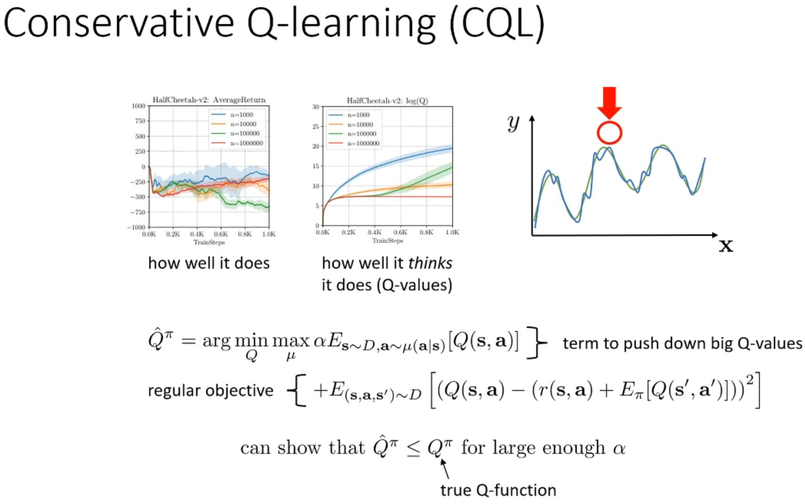

과대평가(overestimation)가 발생하는 이유는 bellman backup에서 maximization을 수행할 때 OOD query의 추정값이 부정확(실제론 낮지만, 학습할 때 보지 못한 data로 높게 평가할 수 있음)하기 때문에 발생한다.
* 우상단의 그림처럼 실제 Q function의 곡선이 녹색이고 학습한 것이 파란색이라 하자.
* 대부분 잘 맞지만 최대값 지점은 오히려 가장 크게 틀릴 수 있다.
(파란색 곡선의 최대값이 녹색 곡선의 최대값이 아니다.)

이 문제를 해결하기 위한 새로운 아이디어를 제안한다.
* Regular objective: MSE loss로 Q function을 학습한다.
* Term to push down big Q-values: 높은 Q 값을 가지는 action을 찾은 다음, 그 action의 Q 값을 최소화한다.
  * 직관적으로 말하자면 잘못된 peak를 찾아서 아래로 내리는 term이다.
  * 먼저 Q 값이 높은 action에 높을 확률을 부여하는 분포 $\mu$를 찾고, 해당 분포 하에서 Q 값의 기댓값을 최소화하도록 Q function model의 parameter를 학습한다.
  * 적절한 $\alpha$ 값을 선택하면 학습된 Q 함수가 실제 Q 함수의 lower bound $\hat{Q}(s,a) \leq Q_\text{true}(s,a)$가 된다는 것을 볼 수 있다.

위 아이디어의 문제점은 모든 Q 값들을 아래로 밀어내기 때문에 너무 pessimistic (비관적)일 수 있다는 것이다.

  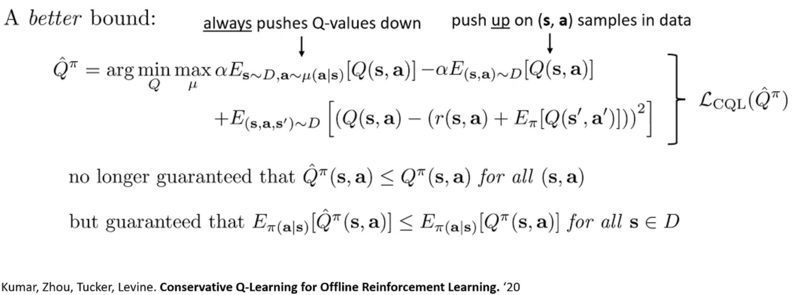

이를 위해 dataset에 있는 Q 값들은 위로 올리는 term을 추가할 수 있다.
* Dataset에 있는 action에 대해서는 아래로 내리는 term과 올리는 term이 상쇄되어 적절한 값을 유지한다.
* Dataset에 없는 acton은 아래로 내리는 term이 강하게 작용하여 값을 낮춘다.
* 이는 $\mu$가 dataset에 가까운 actions을 선택하게 만든다.

이는 학습된 Q function이 모든 state와 action에 대해 실제 Q 함수의 lower bound가 되는 것을 보장하지 않지만, policy $\pi$에 대한 기댓값은 여전이 lower bound가 보장된다.

$$\mathbb{E}_{\pi(a|s)}[\hat{Q}^\pi(s,a)] \leq \mathbb{E}_{\pi(a|s)}\left[Q^\pi(s,a)\right] $$

이 objective function을 $\mathcal{L}_\text{CQL}$이라고 부른다.

  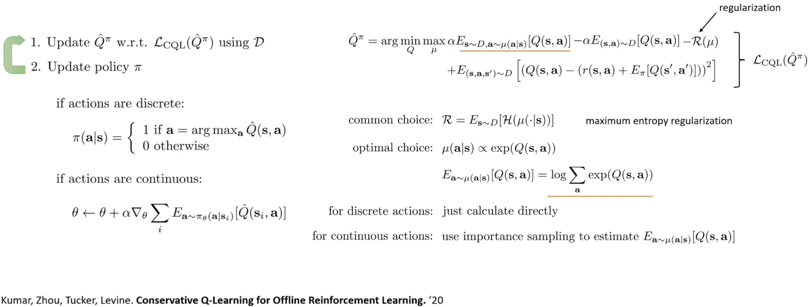

CQL loss를 활용하는 구조는 위의 그림과 같이 $\mathcal{L}_\text{CQL}$을 사용해 Q funciton을 업데이트하고, 일반적인 actor-critic 방식으로 policy를 업데이트한다.
* Discrete action space는 단지 $\pi \leftarrow \text{argmax}_a Q(s,a)$이다.
* Continuous action space의 경우, policy gradient로 actor $\pi_\theta$를 업데이트한다.

이제 $\mathcal{L}_\text{CQL}$을 구현하는 방법을 알아보자.

$\mu$를 명시적으로 구하기 어렵기 때문에 entropy regularization $\mathcal{R}(\mu)$을 추가해 $\mu$에 대한 기댓값 계산을 없앤다.
Entropy regularization을 최대화함으로써 더 다양한 action을 선택할 수 있도록 만든다.
Regularization term을 고려한 최적의 $\mu$는 Q 값의 exponential에 비례하고, $\mu$ 하에서 Q 값의 기댓값이 Q 값들의 log sum exponential이라는 것도 밝혀 졌다.
최종적으로 $\mu$하에서 Q 값의 기댓값을 최대화 하는 term (첫 번째 term)과 regularization term(3 번째 term)이 합쳐서 log sum exponential term이 된다.
* 유도는 하지 않는다. 받아 들이자.

Discrete action space에서는 단순히 state의 모든 actions에서 Q 값들의 log sum을 최소화하도록 Q function의 parameter를 학습시키면 된다.

Continuous action space에서는 importance sampling을 사용해 Q 함수의 기댓값을 추정한다.
* 특정 policy(random or 현재 policy 등)로부터 aciton을 샘플링한다.
* 최적 $\mu$가 $\exp (Q)$에 비례한다는 사실을 활용해, $Q$ 값을 $\exp (Q)$로 reweight한 평균으로 기대값을 추정한다.
* Importance sampling이 한 time step만 고려하기 때문에 높은 분산을 걱정하지 않아도 된다.

Discrete/continuous action space에서 CQL은 잘 동작한다.

# 5. Model-Based Offline RL

지금까지 살펴 본 offline RL은 model-free였고, 이젠 model-based offline RL을 살펴보자.

  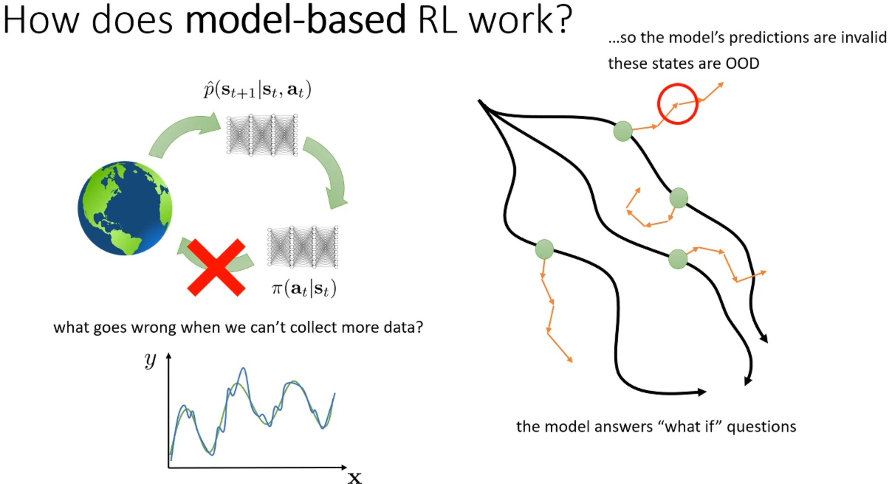

Model-based RL에서는 data를 수집하고 dynamics model을 훈련시켜 좋은 policy 얻거나 바로 planning을 하는 과정을 반복했다.
Model-based RL에서 Dyna style 방법을 살펴 보았다.
* 수집된 실제 data를 시작점으로 두고 짧은 model-based rollout을 한 뒤 policy 학습에 활용한다.

이번 section에서 살펴 볼 model-based offline RL도 Dyna style 방법을 활용한다.
* 더 많은 data를 수집하지 않는 model-based offline RL에서도 model-free offlie RL에서 겪었던 OOD 문제가 발생한다.
* Model-based offlie RL에서는 action 뿐만 아니라 state의 OOD 문제도 발생한다.
* Policy가 잘못된 action을 취하여 dynamics model을 속여 다른 state 분포로 가게 만들 수 있고, 그 분포 외 state에서 dynamics model은 더욱 이상한 state로 가게 될 수 있다.

직관적으로 이 문제를 해결 하는 방법 중 하나는 잘못된 state로 가기 시작하면 어떤 종류의 penalty를 받도록 하여, dynamics model과 policy가 수집된 data에 가까운 영역으로 돌아오도록 만드는 것이다.

## 5.1. MOPO: Model-Based Offline Policy Optimization

  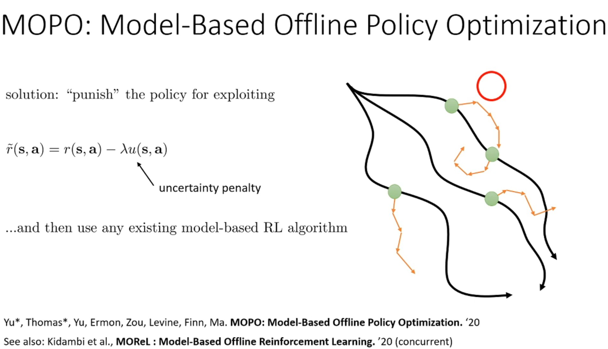

먼저 reward 함수에서 penalty를 부과하는 MOPO 방법을 살펴 보자.
* 비슷한 방법으로 MOReL이 있는데, 관심 있으면 논문을 찾아보자.

기본적인 아이디어는 dynamics model을 악용하는 것에 대해 policy에 penalty를 부여하는 것이다.
한 가지 방법은 reward function에 penalty를 부여하는 것으로 $u(s,a)$로 표시하자.
Peantly를 추가한 다음 일반적인 model-based RL 알고리즘(Dyna style 등)을 사용한다.
* $u(s,a)$는 uncertainty penalty로 dynamics model이 틀린 state로 가는 것에 대한 penalty이다.
  * $Q(s,a) \leftarrow r + \gamma Q(s^\prime, a^\prime)$
    * $(s,a)$가 주어졌을 때 dynamics model이 틀린 $s^\prime$을 출력해, 실제는 낮아야 하지만 높은 $Q(s^\prime, a^\prime)$라고 잘못 추정해, 실제로는 reward를 낮게 받는 action $a$를 선택하게 된다.
  * 예를 들어, 운전 중 '급격한 U턴' 행동을 했을 때 dynamics model이 $s^\prime$이 안전한 state, 즉 높은 $Q(s^\prime, a)$인 $s^\prime$이 된다고 잘못 예측하면, policy는 '급격한 U턴' action을 할 것이다.
  그 이후, dataset에서 보지 못한 state와 action을 계속 예측하게 되는 OOD query 문제가 반복해서 발생해 성능이 나빠지게 된다.
* Policy가 action $a$를 선택했을 때 dynamics model의 잘못된 예측으로 도달한 state $s^\prime = p(s^\prime|s,a)$가 높은 Q 값을 얻을 것으로 예상해 해당 action $a$을 선택 때 $u(s,a)$가 커져야 한다.

따라서 dynamics model이 얼마나 틀렸는지 정량화해야 하고, uncertainty penalty는 그것을 파악애햐 한다.
그리고 틀린 state를 policy가 exploiting하는 것이 의미 없을 정도로 충분한 penalty를 부여해야 한다.
* 따라서 multiplier lambda를 신중하게 선택해야 한다.
* Uncertainty penalty $u(s,a)$는 어떤 종류의 divergence에 따라 측정된 dynamics model의 error보다 최소한 커야 한다.

실제 dynamics model을 모르기 때문에 학습한 dynamics model의 틀린 정도를 정량화하기 어렵다.
따라서 이를 위해 lecture 11에서 논의한 model uncertainty 기법 중 ensemble을 사용한다.
Dynamics model의 ensemble을 훈련시키고 esemble 내의 다른 models 간의 불일치 정도를 error metric으로 판단한다.
하지만 $u(s,a) \geq \text{error}_\text{true}$를 보장하지 못한다.
따라서 매번 잘 작동하는 것이 보장된 훌륭한 방법은 없지만 ensemble은 하나의 일박적인 선택이다.

  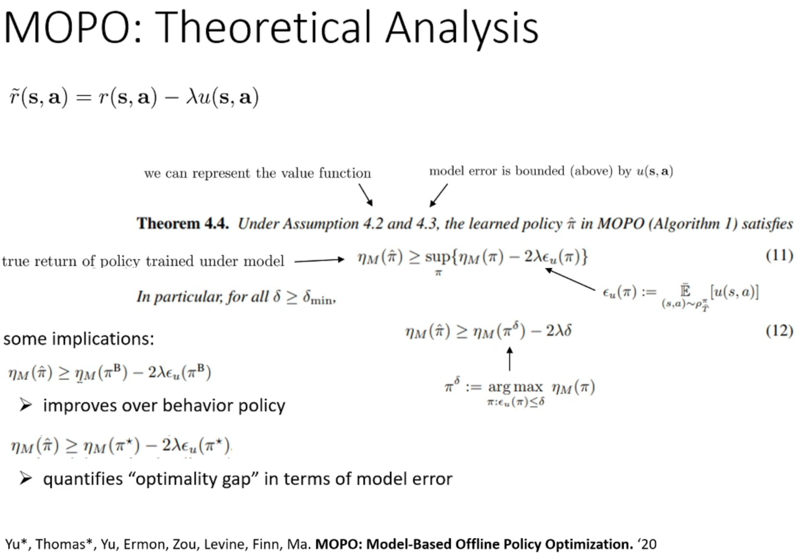

이론적 배경은 위와 같다.

우선 2가지 가정을 한다.
* Value function이 충분한 representation을 가지고 있어 정확한 추정을 한다고 가정.
* $u(s,a)$가 true error의 upper bound라고 가정.
  * $u(s,a) \geq \text{error}_\text{true}$

위 그림의 수식 11에서 
* $\eta_M$은 model $M$ 하에서 학습된 policy의 실제 return을 뜻한다.
* $\epsilon_u$는 model $M$ 하에서 error metric $u(s,a)$의 기댓값을 뜻한다.
* 이는 학습된 policy $\hat{\pi}$의 성능이 (정책 $\pi$ - 정책 $\pi$의 error)보다 나쁘지 않다는 것을 뜻한다.
* 즉, reward에 uncertainty penalty를 고려한 objective로 학습한 policy는 최소한 return - error만큼 좋다는 것을 보장한다.

이것을 해석하는 또 다른 방법은 수식 12와 같이 $\pi_\delta$를 도입하는 것이다.
* $\pi^\delta$는 수집된 true return으로 얻을 수 있는, error $u(s,a)$의 기댓값이 $\delta$보다 이하인, 최고의 policy이다.
즉, model이 틀릴 수 있는 satet를 방문하지 않는 최고의 policy이다.
  * Dynamic model이 플릴 수 있다는 뜻은 $u(s,a) > \delta$라는 걸 의미한다.
* 수식 12은 MOPO로 학습한 policy $\hat{\pi}$가 최고의 성능을 내는 policy에 $\delta$에 의존하는 error metric의 기댓값을 뺀 것만큼 좋다는 것을 말한다.
* 즉, $\delta$를 작게 선택하면 학습한 policy의 성능이 좋아진다.

해당 이론은 몇 가지 흥미로운 implications을 제공한다.
* Behavior policy $\pi_\beta$를 대입하면, dynamics model이 해당 data로 학습되었기 때문에 error는 거의 0에 가까울 것이다.
따라서 학습된 policy가 최소한 behavior policy만큼 좋다는 것을 보장한다.
* Optimality gap을 정량화할 수 있다.
  * 만약 최적 policy $\pi^\star$를 대입하면 학습한 policy가 최소한 $\pi^\star$에 $\pi^\star$에서 dynamics model이 얼마나 틀렸는지에 대한 penalty를 뺀 것만큼 좋다는 것을 의미한다.
  * 따라서, dynamics model이 최적 policy가 방문하는 state와 aciton에 대해 매우 정확하다면, 최적 policy에 가까운 policy를 학습할수 있다는 것을 의미한다.

## 5.2. COMBO: Conservative Model-Based RL

  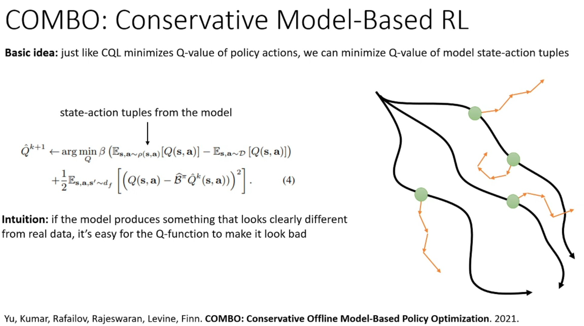

MOPO 아이디어를 발전시켜 CQL과 같은 원리를 model-based offlie RL에 적용할 수 있다.
이를 COMBO라고 부른다.
CQL이 policy가 선택한 action의 Q 값을 최소화하는 것처럼, COMBO는 dynamics model (state, action) tuple의 Q 값을 최소화하고 dataset에서 존재하는 (state, action) tuple은 최대화하는 term을 추가한다.
* 직관은 CQL과 유사하게 dataset에서 보지 못한 (state, action) tuple의 Q 값은 최소화하고 dataset에서 본 (state, aciton)와 유사한 tuple은 최소화 과정을 상쇄시켜 적절한 값을 유지한다.
* 실제 reward function을 변경하지 않기 때문에 MOReL, MOPO보다 더 잘 동작한다.

지금까진 Dyna style의 model-based RL을 살펴 보았다.
실제로 non-Dyna style의 방식으로 offline RL을 할 수 있다.
* Policy를 전혀 학습하지 않고 dynamics model을 활용해 planning을 하는 offline RL을 생각할 수 있다.
* 이를 위해 OOD action에 penalty를 주는 mechanism이 필요하다.

## 5.3. Trajectory Transformer

  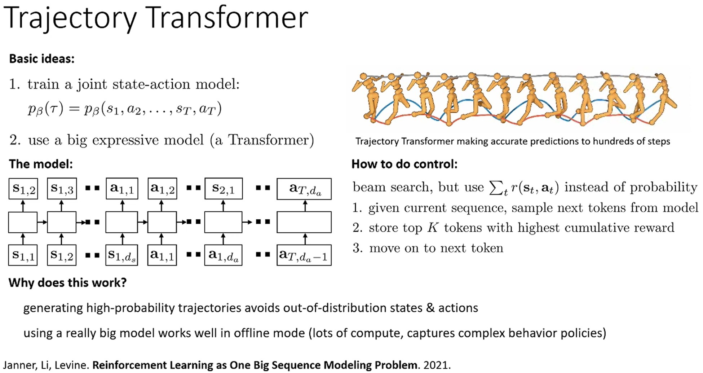

Non-Dyna style model-based offline RL의 최신 방법으로 trajectory transformer를 소개한다.

Trajectory transformer의 아이디어는 joint state-action model을 학습하는 것이다.
* 기본적인 dynamics model은 현재 state-action이 주어지면 next state를 예측했다.
* Trajectory transformer에서는 전체 trajectory에 대한 model $p_\beta(\tau)$을 학습한다.
  * Trajectory는 behavior policy 분포에 의존하기 때문에 아래 첨자로 $\beta$를 사용한다.

결론적으로 $\pi_\beta$ 분포 하에서 높은 확률을 가진 state-action의 seuqnece에 대한 planning을 최적화하게 될 것이다.
이것은 OOD state, action에 대해서 매우 낮을 확률을 추정하므로 OOD 문제를 피할 수 있다.
또한, offlie RL을 수행하고 있기 때문에 transformer와 같은 expressive model을 사용할 수 있다.
* Environment와 상호작용해 수집한 data로 model을 계속 업데이트할 필요가 없기 때문에 expressive model을 사용하면 좋다.

NLP task에서 전체 문장을 discretize(이산화)하지 않고 token을 사용하는 것처럼 trajectory 전체를 이산화하지 않고 모든 state와 action의 각 차원마다 이산화를 수행한다.
즉, state, action의 vector에서 각 element가 하나의 token이 되는 것이다.
* 첫 번째 state의 첫 번째 차원 $s_{1,1}$을 입력해서 마지막 action의 마지막 차원 $a_{T,d_{a}-1}$ 까지의 sequence를 학습한다.

기본적인 model-based RL은 긴 horizon을 예측할 때 error가 누적되는 문제가 있다.
* Step 1: $s_1, a_1 → s_2$ (정확)
* Step 2: $s_2, a_2 → s_3$ (약간 틀림)
* Step 3: $s_3, a_3 → s_4$ (더 틀림)
* ...
* Step 100: 완전히 엉망

하지만, trajectory transformer에서는 전체 trajectory를 한 번에 예측하기 때문에 훨씬 더 긴 horizon까지 정확하게 추론할 수 있다.
* 그림에서 우상단의 그림은 실제로 trajectory transformer가 휴머노이드의 수백 단계 미래까지 예측하는 것을 보여주고 있다.

이제 transformer 모델을 사옹해 planning을 할 수 있다.
* 이전에 논의했던 model-based control planning 기법(random shooting ,CEM, ...)을 생각할 것이다.
  * 랜덤으로 action sequence를 생성해서 dynamics model로 trajectory를 수집한 뒤 return을 계산한다.
  * 그리고 가장 큰 reward를 제공하는 action sequence를 선택한다.
* 하지만 action probability를 고려해 OOD 문제를 해결하는 것이 중요하기 때문에 beam search를 사용한다.
  * 기존 NLP에서 사용하는 beam search와 같다.
  * 후보 sequence K 개에 대해 각각 N개씩 샘플링 한 다음 누적 reward가 큰 상위 K개 token을 선택하는 방식이 반복된다.

Transformer의 discrete tokens를 continuous value로 변경하면 MCTS 및 미분 가능한 planning 방법도 사용할 수 있다.
* 중요한 것은 reward를 최대화하고 $p_\beta$ 확률을 고려하고 있는지 확인해야 한다는 것이다.

$p_\beta$에서 높은 확률을 가진 token을 선택하는 것은 OOD state와 action을 피하기 때문에 잘 작동한다.

# 6. Wrap-up

  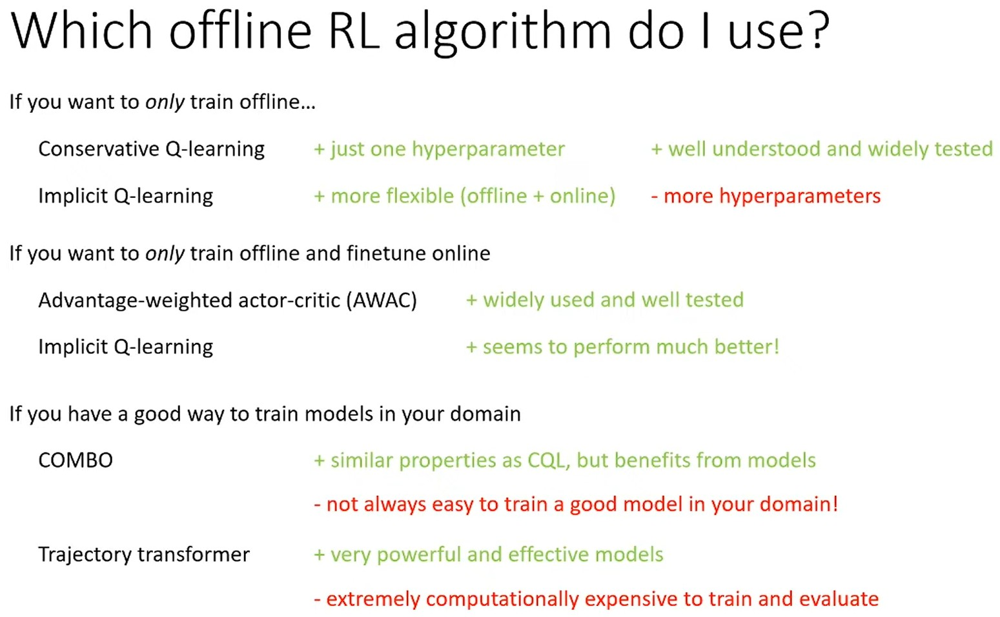

지금까지 많은 offline RL 알고리즘을 살펴봤다.
이제 어떤 상황에 어떤 알고리즘을 선택해야 하는지 알아보자.
이것은 2021년 말 기준, 지극히 경험 기반으로 상황에 따라 달라질 수 있다.

* Offline 전용 학습 (Online fine-tuning 없음)
  * CQL (+): Hyper-parameter가 하나만 있고 순수 offline에서 잘 동작하는 것을 보여주는 많은 논문들에서 광범위하게 테스트되었다.
  * IQL (+): Offline과 online 모두에서 잘 작동하기 때문에 좀 더 유연하지만 hyper-parameter가 많다.
* Offline 학습 + online fine-tuning
  * AWAC (+): 널리 사용되고 잘 테스트되어 있다.
  * IQL (+): 경험적으로 꽤 잘 작동하는 것으로 보이며 실제로 AWAC보다 더 나은 성능을 보여줄 때가 많다. 하지만, 오래되지 않았고 널리 검증되지 않았다.
  * CQL (-): 너무 보수적이기 때문에 fine-tuning이 잘 되지 않기 때문에 비추천한다.
* Model-based offline RL
  * Domain에 따라 학습시키기 쉬우면 선택한다.
    * COMBO (+): 좋은 dynamics model을 학습할 수 있다면 좋은 선택이다. CQL 아이디어와 더불어 model의 이점을 받는다.
    하지만 항상 좋은 dynamics model을 학습시키기 쉬운 건 아니므로 주의해야 한다.
    * Trajectory Transformer (+): 강력하고 효과적이지만, 학습과 평가에 비용이 많이 들고, policy를 학습하는 것이 아니기 때문에 horizon에 여전히 일부 제한이 있다
      * Horizon이 너무 길면 계산량이 많이 들어 처리할 수 없고, 매번 처음부터 끝까지 sequence를 생성해야 한다.
      * 매우 긴 horizon이 있는 경우 dynamic programming의 이점을 받는 Dyna와 같은 방법이 여전히 더 나을 수 있다.

  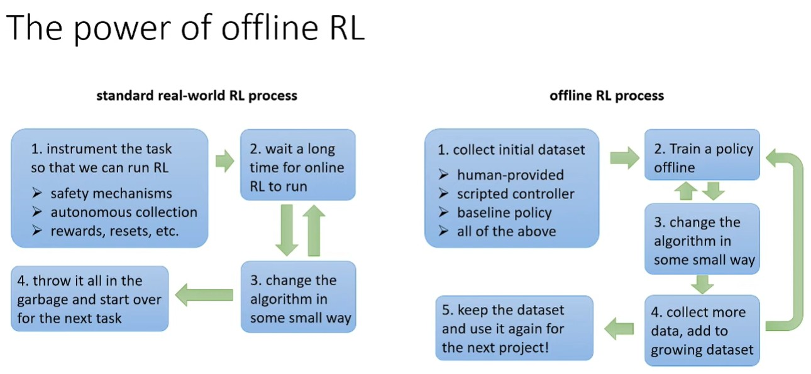

실제 세계에서 시뮬레이터 없이 RL을 적용할 때 offline RL이 online RL보다 훨씬 실용적이다.
* 좋은 시뮬레이터를 가지고 있으면 online RL을 하는 것이 더 좋을 것이다.

Online RL의 문제점
1. 복잡한 초기 설정
* Safety mechanism: exploration policy가 위험한 action을 하지 않도록 방지
  * 로봇공학: 물리적 손상 방지
  * 알고리즘 트레이딩: 금전적 손실 방지
* Autonomous collection: 시행 사이 자동 재설정 필요 (특히 로봇공학)
  * 컵을 집는 task를 할 때, 컵을 떨어뜨리는 과정이 많을 것이고 그때마다 초기 state(컵의 위치, 로봇 팔의 위치 등)로 다시 되돌려야 한다.
* Reward 설계: offline RL은 dataset 수집 후 crowdsourcing으로 사후 labeling이 가능하다.
하지만, online RL의 경우 자동화된 reward function이 필요하다.
  * 일부 코드를 작성하거나 일부 모델을 학습시켜야 함을 의미한다.
2. RL이 실행될 때까지 오랜 시간을 기다려야 하며, 일부 안전 모니터링이 필요할 수 있기 때문에 상당히 수동적인 프로세스이다.
3. 알고리즘을 개선하기 위해 작은 방식으로 무언가를 변경한 다음 이 모든 것을 다시 수행하기 때문에 느리다.
4. Task를 완료되면 다음 task를 위해 처음부터 다시 시작하기 때문에 모든 것을 버려야 한다.
* 로봇에게 커피 한 잔을 만들도록 학습시켰고 이제 차 한 잔을 만들고 싶다면 일반적으로 이 모든 것을 버리고 처음부터 다시 시작한다.

Offline RL의 장점
1. 다양한 소스에서 나올 초기 데이터셋을 수집한다.
*  인간 데이터, 스크립트 컨트롤러일 수 있고, 일부 policy 등에서 추출될 수 있고 이 모든 것의 조합일 수 있다.
* Reward function을 설계해야 할 수도 있지만 학습 데이터에만 reward가 필요하기 때문에 인간이 reward에 레이블을 지정하도록 할 수도 있습니다.
2. Offlien RL로 policy를 학습시키고 작은 개선을 줘도 데이터를 다시 수집할 필요가 없어 프로세스가 훨씬 더 가벼워진다.
* 더 많은 데이터를 수집하여 데이터셋에 추가할 수 있지만, 처음부터 데이터를 다시 수집할 필요는 없다.
3. 정기적으로 policy를 online으로 실행해야 하는데, 주로 얼마나 잘 수행되고 있는지 확인하기 위해서이다. 이는 online으로 학습하는 것보다 훨씬 덜 부담스럽다.
4. 미래에 유사한 도메인에서 하고 싶은 다른 프로젝트가 있다면 데이터셋을 보관하고 다시 재사용할 수 있다.

# 7. Future directions

  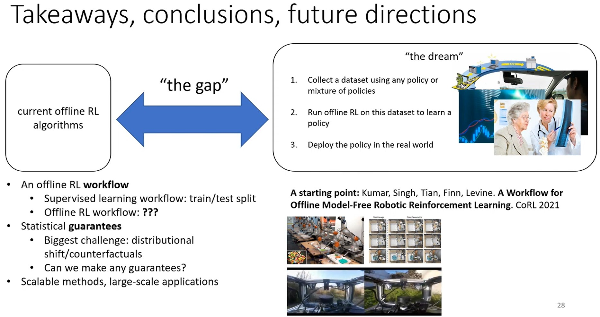

Open problem 중 하나는 workflow이다.
* Supervised learning에서는 train/valid/test로 데이터를 분할하여 실제 세계에서 잘 수행될 것이라는 확신을 가질 수 있다.
* Offline RL에서 policy가 실세계에서 잘 수행되는지 알고 싶다면 실제로 배포해 봐야 한다.
학습은 offline이지만 평가는 여전히 online이며 이는 비용이 많이 들거나 심지어 위험할 수 있다.
  * 연구는 계속되고 있지만 여전히 많은 이론이 누락되어 있고 offline workflow를 구조화해야 하는 방법에 대한 기본적인 이해가 여전히 많이 부족하다.
* Off-Policy Evaluation(OPE)과 같은 고전적인 기술도 이 점을 다루지만 OPE 방법 자체는 hyper-parameter 튜닝이 필요하며, 이는 종종 online 평가를 필요로 하므로 큰 openproblem이다.

또 다른 문제는 statistical guarantees (통계적 보장)이다.
* Distirubiton shift와 관련된 많은 bounds와 결과가 있지만 불완전한 경향이 있다.

마지막은 대규모 응용 프로그램에서의 확장 가능성이다.
* 원칙적으로 offline RL은 광범위한 설정에 적용될 수 있지만 실제로는 여전히 그렇게 널리 적용되지 않는다.
* 실제 응용 프로그램의 제한 사항과 제약 조건을 더 잘 이해하는 것이 올바른 방향으로 나아가는 데 정말 중요하다.
  * 의료 진단의 경우, 개인정보 보호 / 법적 책임 / 의사들의 신뢰 문제가 제약 사항이 될 것이다.
  * 금융 트레이딩의 경우, 계속 변하는 시장 환경 / 극단적 사건 (금융 위기) 데이터 부족 / 규제 준수 요구 사항 등이 제약사항이 될 것이다.

