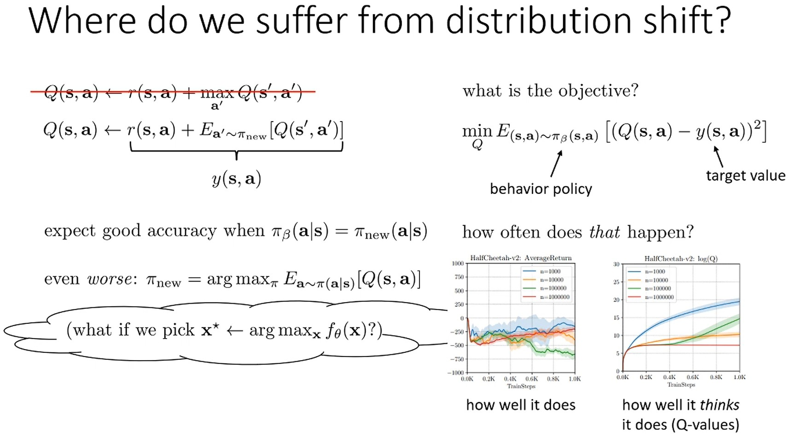
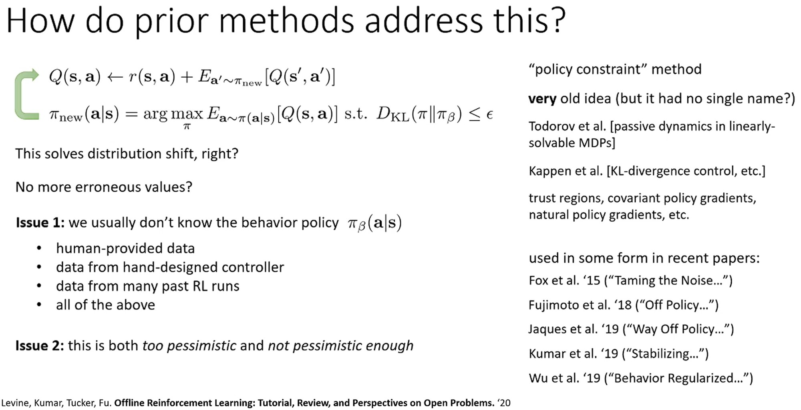
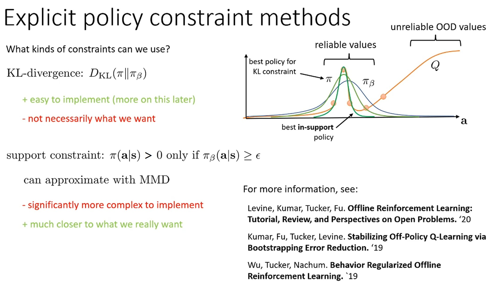
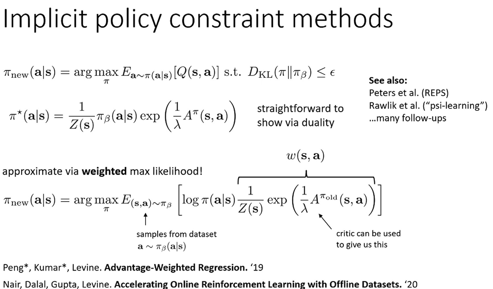
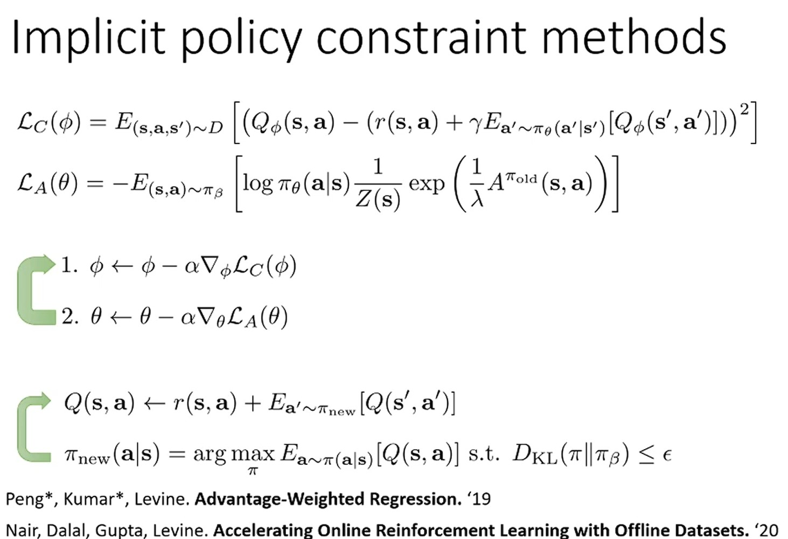
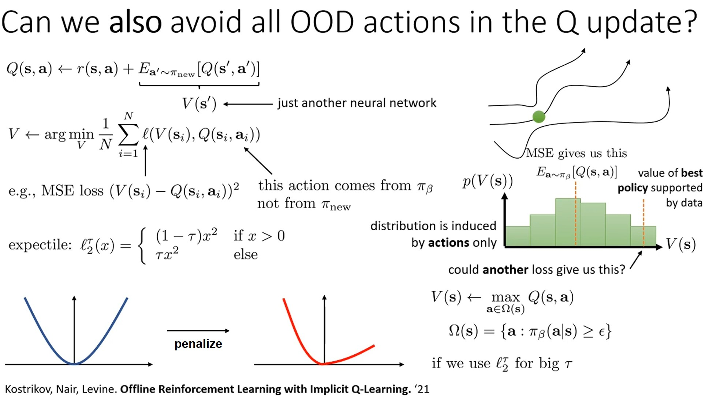
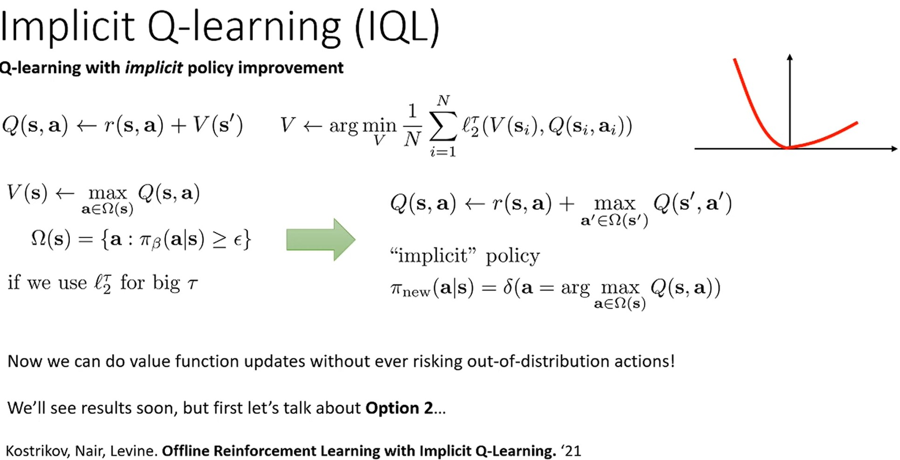

# 1. Distribution Shift Problem

  

이번 강의에서는 offline RL에서 distribution shift 문제를 완화하는 방법에 대해서 살펴본다.

Lecture 15에서 봤듯이, offlien RL에서 $\pi_\beta$로 샘플링된 train dataset으로 $\pi_\theta$를 개선하기 때문에, 학습된 $Q(s,a)$는 정확하지 않을 수 있다.
그 상황에서 argmax를 통해 advesarial example가 생성되고 배포 환경에서 distribution shift 문제를 겪을 수 있다.
* 본 적 없는 $Q(s,a)$를 부정확하게 추정하고 이것이 다른 pair보다 더 높은 reward를 준다고 평가되면 해당 action을 수행하게 된다.
하지만, 실전에서 최종 결과는 좋지 않을 확률이 크다.

  

Distribution shift 문제를 해결하는 방법 중 하나는 Levine 교수님이 policy constraint라고 부르는 방법이다.
해당 방법은 actor-critic (policy gradient) 구조를 채택하는 방법으로 policy를 개선할 때 $Q(s,a)$의 기댓값을 최대화하는 것과 더불어 어떤 종류의 constraint도 고려하도록 수정한 것이다.

예를 들어 $\pi_\theta$와 $\pi_\beta$ 사이의 KLD가 $\epsilon$보다 작아야 한다는 제약을 둘 수 있다.
$\epsilon$를 작은 값으로 선택하면 너무 다른 action은 선택하지 않도록 할 수 있기 때문에 원칙적으로 distribution shift 문제를 해결한다.
하지만, 이것은 오래된 단순한 아이디어로 실제에서 잘 동작하지 않기 때문에 더 정교한 방법이 필요하다.
* 그림의 우측과 같이 많은 논문들이 actor 업데이트에 constraint를 부여하는 아이디어를 활용하고 있다.

KLD의 한 가지 명백한 문제는 일반적으로 $\pi_\beta$가 무엇인지 모른다는 것이다.
* $\pi_\beta$를 behavioral cloning으로 추정하는 방법이 있다.
    * 추가 model 학습이 필요하고 복잡한 policy (여러 policy가 혼합됨)에서 샘플링된 data면 추정 error가 커지기 때문에 어렵다.
* 다른 방법은 $\pi_\beta$ 확률에 접근하지 않고 $\pi_\beta$의 샘플만으로 해결할 수 있는 constraint 방법을 생각하는 것이다.
  * 해당 방법이 $\pi_\beta$를 학습하는 것보다 더 잘 작동하는 경향이 있다.

두 번째 문제는 KLD가 너무 비관적(pessimistic)이면서 동시에 충분히 비관적이지 않을 수 있다는 것이다.
이것이 더 해결해야 심각한 문제이다.
* Not pessimistic Enough (Optimistic)
  * Policy를 개선할 대 기댓값으로 error를 최고화하고 있기 때문에 기댓값으로만 낮고 특정 개별 샘플에 대해서는 높은 error를 가질 수 있다.
  * 즉, $\pi_\theta$와 $\pi_\beta$가 충분히 가까워도 개별 샘플에 대한 $Q$ 값은 여전히 부정확할 수 있다.
    * 더 구체적으로 말하자면 $\pi_\beta$와 충분히 가깝게 유지하는 것($\epsilon$이 작음)과 policy가 개선되기 위해 $\pi_\beta$를 충분히 벗어나야 하는 것($\epsilon$) 사이의 trade-off를 부과한다.
  * 따라서 $Q(s,a)$가 부정확할 수 있지만, KLD를 만족할 때 $Q(s,a)$ 값을 낙관적으로 신뢰하는 경우를 말한다.  
* Too pessimistic
  * Data의 support 내부 (support란 확률이 0 이상인 영역을 말함)에 있는 최상의 policy를 찾고자 한다.
  * 하지만, KLD와 같은 constraint는 최상의 policy를 찾는 것을 막을 수 있다.
  * 예를 들어, $\pi_\beta$가 uniform distribution일 때도 이 분포와 크게 다르지 않도록 policy를 개선한다는 것이다.
  * 따라서, $\pi_\beta$와 다르면 너무 위험하다고 판단하여 비관적으로 좋은 policy를 찾는 것을 방해하는 경우를 말한다.

위와 같은 이유로 단순히 KLD를 constraint로 두면 좋은 결과를 가져오지 못한다.

# 2. Explicit Policy constraint methods

  

Constraint의 종류를 알아보자.

제일 간단한 선택은 KLD이다.
KLD는 미분 및 최적화가 쉬운 편리한 functional form을 가지고 있어 구현하기 쉽지만, 앞서 설명한 문제점이 있다.
* 그림에서와 같이 $\pi_\beta$에서 샘플링 된 point에 Q 함수가 overfitting되어 관측하지 못한 action에 대해 추정(extrapolate)이 틀릴 수 있다.
그 결과, 실제 얻은 return이 안 좋을 수 있다.
* 이를 보완하기 위해 constaint를 주지만, $\pi_\beta$와 가깝게 유지되는 것을 강제하기 때문에, 개선되는 policy가 좋은 action을 학습하는 것을 방해한다.
  * 그림을 보면 KL constraint가 있는 경우에도 reward가 안 좋은 action(첫 번째, 3번째 action 등)을 선택할 확률이 높다.
  * 가장 best policy는 어두운 녹색 곡선과 같이 2 번재 point에 높은 확률을 부여하는 것일 수 있지만, 이는 KLD를 위반하게 될 것이다.

KLD의 문제점을 완화하기 위해 support constraint를 사용할 수 있다.
$\pi_\beta(a|s) \geq \epsilon$인 action에만 $\pi(a|s) > 0$인 constraint를 주는 것이다.
즉, behavior policy $\pi_\beta$에 없거나 거의 보지 못한 state, action의 경우 해당 action을 선택하지 않도록 한다.
* $\epsilon$ 선택의 어려움 및 미분 불가능하다는 단점이 있는 crude한 방법이지만, 다양한 approximate 알고리즘이 있다.

Support constraint에 근사하는 알고리즘 중 한 가지 일반적인 선택은 MMD (Maximum Mean Discrepancy) estimator를 사용하는 것이다.
구현하기가 KLD보다 복잡하다는 단점이 있지만, 일반적으로 성능이 더 좋다.

Constraint에 관한 세부 적인 사항은 위 그림의 논문들을 살펴보자.

이번 lecture에서는 contraint를 결정할 때 고려해야 할 trade-off 종류를 살펴 보았다.
이후 알고리즘들에서 구현하기 쉬운 KLD constraint를 다룰 거지만, 실전 offlie RL에 적용할 때 위에서 언급한 단점이 있다는 것을 명심하자.

  

Constraint를 구현하는 3가지 방법에 대해 알아보자.
* Explicit approaches: 잘 작동하지 않지만 다른 방법을 이해하기 위한 개념을 제공하기 때문에 간단히 살펴 볼 것이다.
* Implicit approaches: 실제로 효과적인 방법으로 자세히 살펴 볼 것이다.
* Others: 간단히 살펴 볼 것이다.

Constraint을 explicit하게 구현하는 가장 간단한 방법은 actor의 objective function을 직접수정 하는 것이다.
* 단점이 있지만 쉽게 다룰 수 있는 KLD constraint를 예로 들자.
* KLD를 풀어 쓰면, $D_\text{KL}(\pi||\pi_\beta) = -\mathbb{E}_\pi[\log \pi_\beta(a|s)] - \mathcal{H}(\pi)$ 로 나타낼 수 있다.
* Constraint에 lagrange multiplier $\lambda$를 곱해 objective function과 결합하면 constraint가 없는 문제로 작성할 수 있다.
* Lagrange multiplier $\lambda$값을 dual gradient descent로 찾거나 hyper-parameter tuning으로 찾을 수 있다.
* $\log \pi_\beta$에 $\pi_\beta$가 필요하고 이를 추정하기 위해 behavior cloning과 같은 어려운 작업을 수행해야 한다.

또 다른 explicit한 방법은 reward를 수정하는 것이다.
* KLD나 MMD 등 divergence를 계산하는 알고리즘으로 reward에 penalty를 주는 것이다.
* Reward에 penalty를 추가하며 Q 함수는 미래의 divergence까지 고려하게 된다.
즉, 지금은 divergence가 낮지만 나중에 더 높은 divergence로 이어지는 action을 피할 것이다.

현대 offline RL에서는 일반적으로 잘 작동하지 않는 위의 두 가지 방법을 사용하지 않는다.

# 3. Implicit policy constraint methods

  

$\pi_\beta$ 추정을 피하는 한 가지 방법은 implicit policy constraint를 사용하는 것이다.

Explicit policy constraint method에서 constraint를 lagrangian duality를 활용해 closed form으로 풀면 위 그림과 같은 $\pi^\star$를 얻을 수 있다.
* $\pi^\star = \text{argmax}_\pi\mathbb{E}_{a\sim\pi(a|s)}[\cdot]$
* $\pi^\star$가 직관적 의미를 살펴보면, $\lambda$가 0이면 $\frac{A^\pi}{\lambda}$의 값이 무한대가 되고, 결국 $A^\pi$를 최대화하는 action에 확률 1을 할당하고 다른 모은 것에 0을 할당하는 greedy policy이다.
반면 $\lambda$가 커지면 $\pi_\beta(a|s)$를 더욱 많이 고려하게 돼서 $\pi_\beta$에서 확률이 매우 낮은 action은 advantage가 높더라도 결국 최종 확률은 낮게 유지된다.

$\pi^\star$에 $\pi_\beta$가 필요하지만 수집된 샘플을 통해서 $\pi_\beta$의 근사값을 구할 수 있다.
즉, $\pi_\beta$로 샘플된 data로 학습을 진행하며 $\pi^\star$의 추정하는 것이다.
학습은 weighted maximum likelihood를 통해 진행된다.
* $\pi_\theta$와 $\pi^\star$를 가깝게 만들도록 학습하는 것이다.
* 이를 KLD를 사용해 $\min_{\pi_\theta}D_\text{KL}(\pi_\theta || \pi^\star)$ 문제로 변환할 수 있다.

$$
\begin{aligned}
\min_{\pi_\theta}D_\text{KL}(\pi_\theta || \pi^\star) &= \max_{\pi_\theta} \sum_{\mathcal{D}} \pi^\star(a|s) \log \pi_\theta(a|s) \\
&= \max_{\pi_\theta} \sum_{\mathcal{D}} \frac{1}{Z(s)}\pi_\beta(a|s)\exp\left(\frac{1}{\lambda}A^{\pi_\text{old}(s,a)}\right) \log \pi_\theta(a|s) \\

\therefore \pi_\text{new} &= \argmax_{\pi_\theta}\mathbb{E}_{(s,a)\sim\pi_\beta}\left[ \log \pi_\theta(a|s) \frac{1}{Z(s)}\exp\left(\frac{1}{\lambda}A^{\pi_\text{old}(s,a)}\right) \right]
\end{aligned}
$$

이는 weight $w(s,a)$를 고려한 behavior cloning으로 볼 수 있다.
* $\pi_\beta$ 샘플링 data로 maximun likelihood를 구하므로 $\pi_\theta$는 $\pi_beta$와 비슷하도록 학습되지만, weight $w(s,a)$로 action의 좋고 나쁨을 고려하게 된다.
* 즉, dataset의 behavior를 모방하지만 나쁜 action보다 좋은 action을 더 많이 모방하게 된다.
* 이것이 실제로 constrainted actor의 objective function을 푸는 것과 같다는 것을 볼 수 있다.

  

구현 시 일반 Q 함수를 구하는 방식으로 critic의 loss 함수를 구성하고 actor는 weighted maximum likelihodd로 loss 함수를 구성한다.
그리고 Q 함수 업데이트 $leftrightarrow$ Policy 업데이트를 반복하며 학습을 진행한다.

이것이 implicit constraint trick을 사용해 constrained actocritic framework를 구현하는 것이다.
이 알고리즘은 AWAC(Advantage Weighted Actor-Critic)라고 불린다.
* Q function 대신 Monte Carlo returns를 사용하면 AWR
(Advante Weighted Regression) 알고리즘이 된다.

AWAC/AWR 방법에 2 군데에서 OOD query를 해야 한다는 문제가 있다.
왜냐하면 학습 되는 중간에 $\pi_\theta$가 constraint를 준수한다는 보장이 없기 때문에 $\pi_\theta$가 필요한 부분에서 OOD query가 발생할 수 있다.
* 첫 번째는 critic에서 $\pi_\theta$ 하에 target 값의 기댓값을 계산할 때이다.
  * $Q(s,a) = r + \gamma \mathbb{E}_{a^\prime \sim \pi_\theta}[Q(s^\prime, a^\prime)]$
* 두 번재는 advantage를 계산할 때이다.
  * $A^\pi(s,a) = Q(s,a) - \mathbb{E}_{a^\prime \sim \pi_\theta}[Q(s, a^\prime)]$

  

OOD query를 피하는 방법을 살펴 보자.

$\mathbb{E}_{a^\prime \sim \pi_\theta}[Q(s^\prime, a^\prime)] = V(s^\prime)$이다.
이때, $V(s^\prime)$을 $\pi$를 활용해 구할 수 있지만, 어떤 neural network로 훈련한다고 하자.
$\ell(V(s_i),Q(s_i, a_i))$라고 한 뒤, 샘플 데이터에 대해 학습을 진행하면 $V(s_i) = \mathbb{E}_{\pi_\beta}\left[Q(s_i, a_i)\right]$가 된다.

Trajectory 관점에서 dataset에 있는 $(s,a,r,s^\prime)$는 아마도 한 번만 존재할 것이지만 다른 비슷한 state $s$에서 한 다른 actions가 있을 수 있다.
따라서 $V(s)$는 일반화를 통해 $s$와 비슷한 state에서 관측된 다양한 actions의 Q 값을 반영하게 되며, $V(s)$ 학습 시 이러한 Q 값들의 분포 $p(V(s))$가 형성된다.
MSE loss를 사용해 $V(s)$를 학습하게 되면 $\pi_\beta$ 하에서 $p(V(s))$의 기댓값을 학습하게 된다.

만약 $p(V(s))$의 기댓값을 추정하는 대신 expectile을 사용해  upper quantile을 추정한다면 어떻게 될까?
* Expectile은 quantile의 개념을 mean squared error으로 확장한 것이다.

$p(V(s))$의 upper quantile은 data가 제공하는 최고 policy의 값으로 생각할 수 있다.
* Upper quantile은 유사한 state에서 본 높은 value $V(s)$를 제공하는 action을 의미한다.

기댓값 대신 이러한 upper quantile을 학습하는 loss function이 expectile이다.
* MSE loss function은 포물선처럼 보인다. Negative error와 posive error에 동등한 penalty를 부여한다.
  * Negative error $V < Q$와 positive error $V > Q$에 동일한 penalty를 부여한다.
* Expectile loss function은 일종의 기울어진 포물선으로, negative error와 positive error가 서로 다른 weight를 가진다. 
적절한 $\tau$를 선택하면 negative error에 더 많은 penalty를 줄 수 있다.
  * Negative error $V < Q$에 더 많은 penalty를 부여해 $V > Q$가 되도록 학습한다는 의미이다.

여기서 upper quantile을 학습하면 value를 과대평가 하는 문제가 악화될 것이라고 생각할 수 있다.
하지만 dataset에 있는 $(s,a)$만 사용하고 OOD query가 없기 때문에 실제로는 과대평가 문제가 발생하지 않는다.
* 과대평가 문제는 $\pi_\theta$에서 샘플링된 dataset에 없는 $(s,a)$에 대한 Q 값을 추정할 때 발생한다.

따라서 negative error에 더 많은 penalty를 주는 것이 올바른 최적 Q 함수로 이끈다.
* Expectile loss function이 하는 일은 behavior policy의 support 내에 있는 state $s$와 유사한 states에서 관찰된 모든 actions에 대해 Q function의 최댓값이 되로록 $V(s)$를 학습하는 것이다.
* Support를 벗어난 action은 dataset에 나타나지 않으므로 loss function에 영향을 주지 않는다.

Expectile loss function으로 각 state마다 독립적으로 upper quantile을 학습해서 조합하고 있기 때문에 dataset에서 본 최상의 trajectory보다 더 나은 policy를 얻을 수 있다.

  

Expectile loss function에서 살펴 본 원리는 IQL (Implicit Q-learning) 알고리즘을 고안하는 데 사용된다.
* Expectile loss를 사용해 $V(s)$를 학습한다.
* 이것은 $\Omega(s)$인 actions에 대해 최대값을 가지는 $Q(s,a)$를 $V(s)$로 고려한다.
* 즉, 기본적으로 implicit policy로 bellman backup을 수행한다.
 * Argmax policy이지만 support $\Omega(s)$ 내에 있는 action에 대해서만이다.

구현은 간단하게 요약하자면 $Q$ 함수와 $V$ 함수를 번갈아가며 업데이트하고, 그 후, policy를 개선하는 과정을 반복한다.
* Q function은 왼쪽 상단 방정식과 같이 $r(s,a) + V(s^\prime)$을 target으로 MSE error로 업데이트됩니다.
  * 단순히 $r(s,a) + V(s^\prime)$를 Q 값으로 사용할 수 없는 이유는 $Q(s,a)$가 $V(s)$를 학습할 때도 사용되기 때문이다.
  * 단순 대입하면 초반에 $V(s)$이 부정확하므로 $Q(s,a)$도 부정확하고, $V(s)$도 부정확한 $Q(s,a)$를 맞추도록 학습될 것이다.
* V function은 dataset의 모든 state와 action에서 Q 함수에 regression하여 업데이트되지만 expectile loss funciton을 사용한다.
* Q, V function을 학습할 때 policy가 명시적으로 나타나지 않기 때문에 implicit라고 부른다.
* 마지막으로 policy는 AWAC에서 본 advantage weighted 방법으로 업데이트 된다.

$$\mathcal{L}_A(\theta) = \mathbb{E}_{(s,a)\sim\pi_\beta}\left[\log\pi_\theta(a|s)\frac{1}{Z(s)}\exp\left(\frac{1}{\lambda}A^{\pi_\text{old}(s,a)}\right)\right]$$

이 IQL 알고리즘이 얼마나 잘 작동하는지는 추후에 살펴보자.

# 4. Conservative Q-learning

