RL에 대해 가질 수 있는 일반적인 의문점에 대한 이론적 분석과 결론에 대해 간단히 살펴 보겠다.

# 1. Question and Assumption

RL theory에서는 다양한 질문을 할 수 있지만, 여기서는 몇 가지 일반적인 질문을 살펴본다.

  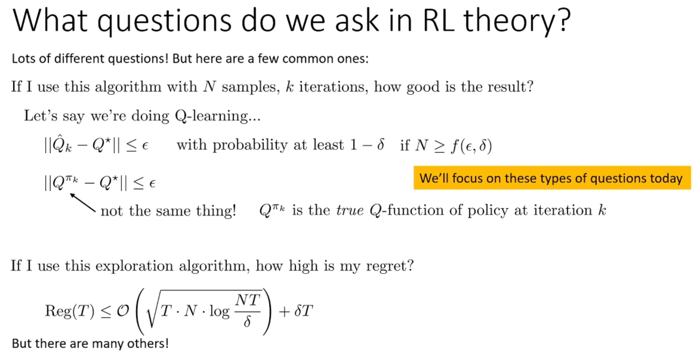

어떤 종류의 RL 알고리즘이 $k$번의 반복마다 $N$개의 샘플을 사용한다면 이 알고리즘의 결과가 얼마나 좋을지 궁금할 수 있다.
또는 특정 정확도를 달성하기 위한 $N, k$ 값을 궁금해할 수 있다.

Q-learning 알고리즘에 대해 예시를 들어보자.
* $k$번 반복 학습된 Q 함수 $\hat{Q}_k$가 최적 Q 함수 $Q^\star$와 얼마나 다를까?
  * $\hat{Q}_k$는 $k$번 반복 학습 후, 각 (state, action) tuple에 대한 Q 값 자체를 의미한다.
  * $\hat{Q}_k$가 최적 Q 함수 $Q^\star$와 어떤 norm에서 최대 $\epsilon$만큼 차이가 난다는 것을 보고 싶을 것이다.
  * 일반적으로 이러한 알고리즘에는 어느 정도의 무작위성(예: transiton 샘플을 무작위로 생성, exploration을 무작위로 수행)을 가지고 있기 때문에 항상 $\epsilon$ 이하의 차이를 가질 것이라고 보장할 수 없다.
  * 따라서 일반적으로 최소한 어떤 확률 $1 - \delta$로 $\epsilon$ 이하라는 보장을 갖게 된다.
    * 여기서 $\delta$는 작은 숫자이다.
  * $\epsilon$ 정확도를 $1-\delta$ 확률로 보장하기 위해 필요한 샘플 수 $N$은 $\epsilon$과 $\delta$의 함수 $f(\epsilon, \delta)$로 표현할 수 있다.
    * 일반적으로 $N$이 $\delta$에 대해 로그적으로 증가하는 잘 동작하는 함수를 원한다. 
* 또 다른 질문은, $k$번 반복 학습 후 policy의 기대 reward가 얼마나 다른지 물을 수 있다.
  * 즉, 학습으로 얻는 reward의 기댓값 $Q^{\pi_k}$이 최적 reward 기댓값 $Q^\star$와 얼마나 다른가이다.
    * $Q^{\pi_k}$는 $k$번 반복 학습한 $\hat{Q}_k$에 기반해 얻은 policy $\pi_k$(일반적으로 argmax policy) 를 활용해, 실제 environment에서 *얻은 reward의 기댓값을 의미한다.
  * 따라서 이것은 실제로 regret의 척도이다.
    * Regret이란 "최선의 선택 - 실제 선택"을 의미한다.
  * $\hat{Q}_k$는 Q 값을 과대평가할 수 있기 때문에 $Q^{\pi_k}$는 $\hat{Q}_k$와 같지 않다.
* 마지막으로, 특정 exploration 알고리즘을 사용하는 경우의 regret은 얼마일까?
  * 예를 들어, upper confidence bound (UCB) exploration 방법에 대한 regret의 bound가 위의 그림에 나타나 있다.
  * $\delta$를 곱한 선형 항이 있지만 $\delta$는 매우 작은 숫자이고 대부분은 첫 번째 term에 의해 결정된다.
    * 첫 번째 term은 $T$의 로그로 증가한다.

이외에도 다양한 질문들이 있지만, 이번 강의에서는 주로 sample complexity 유형의 질문에 초점을 맞출 것이다.
* Sample complexity란 성능을 달성하기 위해 필요한 샘플(데이터)의 개수 $N$를 의미한다.

  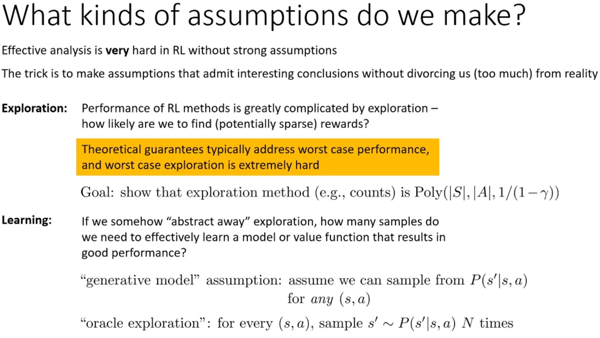

Deep RL을 있는 그대로 분석하는 것은 불가능하기 때문에 현실에서 너무 벗어나지 않는 강한 aussumptions을 한다.

Sample complexity는 'sparse한 reward를 찾을 수 있는가'에 크게 영향을 받기 때문에 RL의 성능 분석은 exploration에 의해 어려워질 수 있다.
이론적 보장은 일반적으로 최악의 성능을 다루는데, 최악의 exploration의 경우 모든 state를 방문해야 하기 때문에 매우 비관적이게 된다.
* 즉, 학습의 어려움이 대부분 최악의 exploration에 의해 발생하게 되어 learning을 제대로 분석할 수 없다.
따라서 exploration 분석과 learning 분석을 분리해서 진행한다.

일반적으로 exploration이 좋다는 것은 좋은 policy를 학습하는 알고리즘이라는 의미로, 최적 policy과 작은 epsilon만큼 오차가 있는 policy를 다항 시간 내에 학습할 수 있는 알고리즘을 뜻한다.
* 일반적으로 state 수 $|S|$, action 수 $|A|$, horizon $\frac{1}{1-\gamma}$에 대한 다항식을 의미한다.
  * $\gamma$는 discount factor로, $\gamma$가 크면 더 긴 horizon으로 return을 구하게 된다.
  * 긴 horizon에서는 return에 기여하게 되는 state, action이 많아져 분산이 켜지므로 더 많은 학습 반복이 필요하게 된다.

Learning 분석은 approximation error 또는 sampling error 등을 다루는 sample complexity를 의미한다.
Exploration이 잘 작동한다고 가정하고, 좋은 dynamics, value function을 학습하는 데 필요한 샘플의 수를 구하는 질문이다.
일반적으로 잘 형성된 reward가 있다면, exploration은 최작의 경우만큼 나쁘지 않다.
  * 잘 형성된 reward란 target state에서만 reward가 관찰되는 것이 아니라, 각 state에 target state로 안내하는 reward가 기록되어 있는 것을 뜻한다.

따라서 exploration이 잘 된다고 추상화해서 그것의 영향을 제거해 sample complexity를 연구할 수 있다.
예를 들어, generative model assumption을 사용해 전체 MDP에서 원하는 모든 state-action을 원하는 만큼 샘플링할 수 있다면 exploration이 필요없다.
* Exploration은 순차적으로 탐색하는 과정이 필요하지만, generative model assumption은 바로 sampling할 수 있기 때문에 탐색하는 과정이 필요없다.
* 모든 state-action tuple에 대해 $p(s^\prime|s,a)$를 $N$번 샘플링해 전체 MDP를 균일하게 carpet bombing하는 것과 같은 가정이므로 비현실적이지만, learning을 분석하기에 편리하다.

샘플링으로 추정한 $\hat{p}(s'|s,a)$이기 때문에 sampling error에 대한 연구가 필요하므로 generative model assumption으로 RL 문제가 해결되진 않는다.

  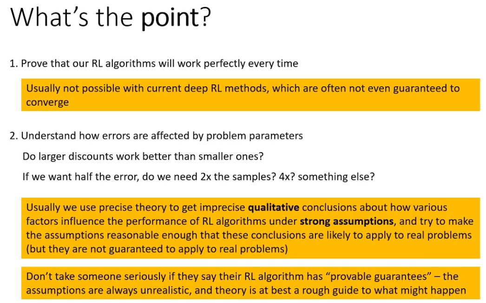

이번 강의를 통해 exploration, learning 분석을 하는 이유는 사용하고자 하는 RL 알고리즘이 이상적인 환경에서 가지는 한계와 잠재력을 파악하기 위함이다.
* 다양한 problem의 parameter(discount factor, state space 크기, 학습 반복 횟수)를 변경할 때 RL 알고리즘이 어떻게 변하는지 파악할 수 있다.
  * Discount factor를 증가시키면 더 많은 반복학습이 필요한가?
  * State space가 커질수록 더 효율적으로 되는가?
  * ...

이를 통해 parameter 선택과 알고리즘 설계 결정 등 qualitative guidance를 받을 수 있다.

주의해야 할 것은 RL 알고리즘이 매번 완벽하게 작동할 것이라는 증명은 불가능 하다.
* 매우 강한 assumption으로 시작해 수학적 증명을 도출하고, assumption을 점진적으로 완화해 실제 문제에 적용 가능한 수준으로 만들려고 노력할 것이다.
그렇기 때문에 실제 문제에 theory가 완벽하게 적용된다는 보장이 없기 때문에 이를 잘 이해해야 한다.
* 대부분의 RL, ML theory에서는 실제 문제를 단순화된 특수항 경우로 분석하여 정성적이로 다소 heuristic한 결론을 얻는다.
따라서 '이론적 증명 가능한 보장이 있다'는 말은 그대로 받아들이지 말고 대략적인 가이드로 사용해야 한다.
* 즉, 완벽한 sample complexity를 구하는 것은 불가능하기 때문에, 다양한 parameter를 변경했을 때 sample complexity가 어떻게 변할지에 대한 가이드로 RL theory를 활용해야 한다.

# 2. Basic Sample Complexity Analysis

  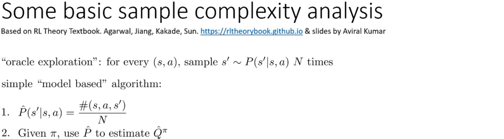

기본적인 samplecomplexity 분석부터 살펴보자.

Oracle exploration assumption으로 모든 state-action pair에 대해 next state $s^\prime$을 $N$번 샘플링하여 transition probability $\hat{p}(s^\prime|s,a)$를 추정한다.
* 어떠한 approximation function (linear regression, neural network 등) 없이 간단한 table 데이터로 추정하는 것으로 state와 action space가 discrete일 때만 가능하다.

주어진 policy $\pi$ 하에 $\hat{p}(s^\prime|s,a)$를 사용해 $\hat{Q}^\pi$를 정확히 추정할 수 있다.
* $\hat{p}(s^\prime|s,a)$가 MDP를 완전히 결정하기 때문에 $\hat{Q}^\pi$는 $\hat{p}(s^\prime|s,a)$ 하에서 정확한 추정값을 가지게 된다.
* 하지만, $\hat{p}(s^\prime|s,a) \neq p(s^\prime|s,a)$이기 때문에 $\hat{Q}^\pi \neq Q^\pi$이다.

목표는 $\hat{p}(s^\prime|s,a) \neq p(s^\prime|s,a)$로 발생하는 sampling error가 Q function으로 어떻게 전파되는지 이해하는 것이다.

Supervised learning theory에는 $N$개의 샘플이 있다면 추정된 $\hat{p}$가 얼마나 정확할 것인가에 답하는 많은 도구들이 있다.
이러한 sampling error의 bound 대한 표준 supervised learning의 결과를 가져와 bellman backup의 결과인 Q function으로 변환하는 것이 이번 강의에서 수행될 분석의 특징이다.

  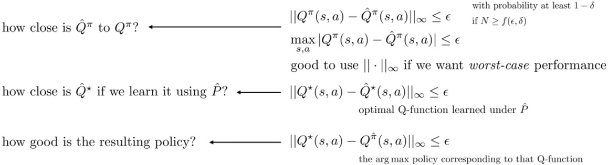

이론 분석의 목표는 $1 - \delta$ 확률로 추정값과 실제의 $\infty$-norm이 $\epsilon$으로 제한됨을 보여주는 것이다.
* $\infty$-norm은 최악의 state-action에 대한 두 Q 값의 차이를 의미한다.
* Sample complexity가 $\epsilon, \delta$에 대해 다항식이길 원한다.
즉, Q 값을 잘 추정하길 원한다.
1. $\hat{Q}^\pi$와 $Q^\pi$의 차이
  * 임의의 policy $\pi$에 대해 학습한 Q function $\hat{Q}$의 정확도를 판단하는 것이다.
  * 이때, Q 값이 조금 틀려도 정해진 길($\pi$)을 따르므로 error가 크게 벌어지지 않을 수 있다.
    * Maximization 과정이 없어서 Q 값의 약점이 악용되지 않는다.
  * 1번은 아래 두 질문에 답하는데 활용된다.
  따라서 주로 이 질문에 집중할 것이다.
2. $\hat{p}$로 value iteraiton을 했을 때 $\hat{Q}^\star$과 최적 $Q^\star$의 차이
  * $\hat{Q}$의 최고점과 $Q$의 최고점의 차이를 보는 것이다.
  * 서로 길($\pi$)가 다르기 때문에 추정된 Q 값이 조금 틀리더라도 그 error가 계속 쌓여 최적값과 벌어질 수 있다.
    * Maximization 과정으로 error가 증폭된다.
  * 이 값이 보장받아야 3번의 실제 성능을 보장할 수 있다.
    * 이 값이 보장받지 못하면 아무리 학습을 잘 해봤자 3번을 만족할 수 없다.
3. $Q^{\hat{\pi}}$와 $Q^\star$의 차이
  * $\hat{p}$ 하에서 학습한 policy $\hat{\pi}$를 바탕으로 실제 환경에 실행했을 때의 성능이다.
  * 이것이 실제 RL의 성능을 뜻한다.

먼저 supervised learning에서 사용되는 표준 theory를 살펴보자.
* 살펴 볼 이론들은 샘플 수가 어떤 추정값에 어떻게 영향을 미치는지와 관련있다.

## 2.1. Concentration Inequalities

Contentration inequalities는 확률 변수의 추정치가 진짜 기댓값 주위에 얼마나 빨리 집중되는지를 정량화한다.
즉, 학습된 함수가 샘플 수의 관점에서 진짜 함수와 얼마나 가까운지에 대한 질문을 답할 때 concentration inequalities를 활용한다.
* 즉, $N$이 많으면 error가 $\epsilon$보다 작은 확률이 $1-\delta$라고 말할 수 있는 근거가 된다.

  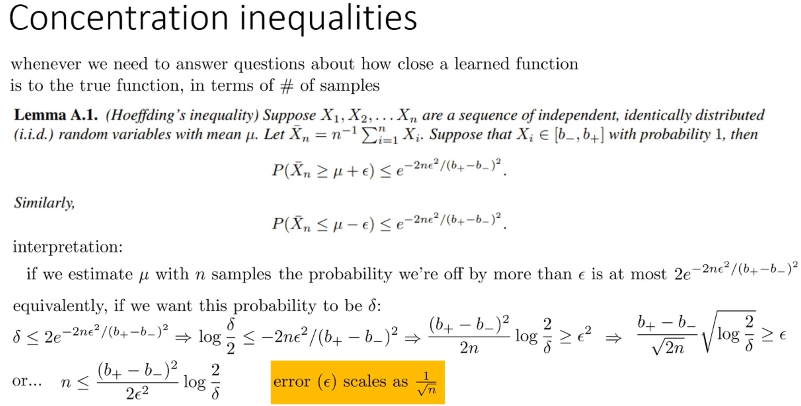

먼저 호프딩 부등식(Hoeffding's inequality)을 알아야 한다.
간단히 직관적으로 무엇을 의미하는 지만 살펴 볼 것이다.
* 평균 $\mu$를 가진 분포에서 i.i.d 샘플링한 N개의 샘플을 $X_1, \cdots, X_N$라 하자.
* $\bar{X}_N$은 샘플의 평균으로 추정치이다.
* 각 샘플이 $[b_, b+]$ 범위에 있다고 가정한다.
* 호프딩 부등식은 얻게 될 error의 quantity를 $n$의 함수로 정량화한다.
  * 위 사진처럼, 실제 평균 $\mu$에 $\epsilon$을 더한 것보다 추정된 평균 $\bar{X}_N$이 크거나 같을 확률의 bound를 알 수 있다.
  반대로, 실제 평균 $\mu$에 $\epsilon$을 뺀 것보다 추정된 평균 $\bar{X}_N$이 작거나 같을 확률의 bound를 알 수 있다.
* 이것은 추정치 $\bar{X}_N$이 진짜 평균 $\mu$ 주위로 얼마나 빨리 집중되는지 설명한다.
  * $\epsilon$이 $\mu$ 주위의 범위를 뜻한다.
* 

호프딩 부등식을 재해석하여 $\epsilon$ 이상 벗어날 확률을 $\delta$로 만들어, $\epsilon$보다 작은 error를 가지는 최소 확률을 $1-\delta$로 표현할 것이다.
* 양의 방향, 음의 방향 둘 다로 벗어날 수 있는 것을 고려해 $\delta$를 위에서 본 확률의 2배보다 작거나 같다고 말할 수 있다.
  * 강의와 강의노트에서는 작거나 같다고 하는데, 크거나 같아야 하는 게 아닌지...???
* 이를 $\delta$에 대해 풀면 위 사진의 마지막 수식을 얻을 수 있다.
* 즉, 확률 $1 - \delta$로 error $\epsilon$는 $\sqrt{N}$에 비례해 작아진다.
  * $\delta \propto \exp(\frac{1}{N})$이고 $\epsilon \propto \sqrt{\frac{1}{N}}$이기 때문에 전체적인 관점에서 더 큰 값인 $\sqrt{N}$에 비례해 작아진다.

  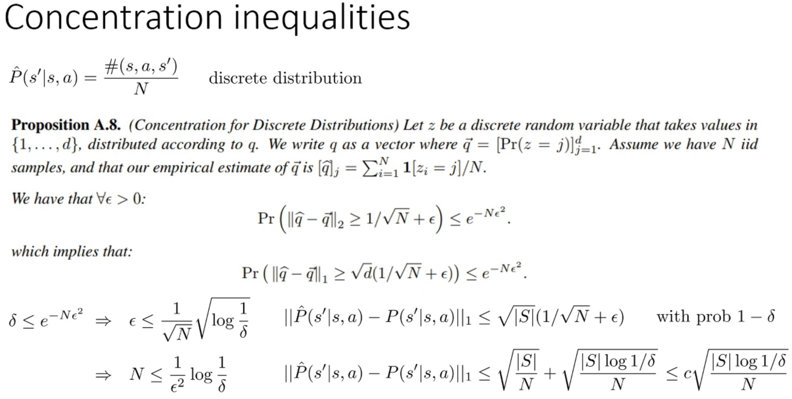

RL에서는 샘플링을 통해 categorical 분포 $p(s^\prime|s,a)$를 추정한다.
* 호프딩 부등식은 continuous 분포이지만 RL에서는 categorical 분포를 추정하는 것에 관심있다.

$1, \cdots, d$까지의 값을 가지는 discrete probability $q$가 있다고 하자.
$q$는 합이 1인 vector로 표현할 수 있고, 경험적 샘플링을 통해 구할 수 있다.
* 2-norm은 평균적인 error를 나타내므로 outlier에 취약하기 때문에 total variation divergence을 나타내는 1-norm으로 error를 계산하는 것 같다...??

호프딩 부정식과 다른점은 error 범위를 나타내는 값이 상수 $\epsilon$만 있는 것이아니라는 것과 확률의 지수가 약간 다르다는 것이다.
하지만 같은 방식으로 $\delta$와 $\epsilon$의 function으로 $n$을 구할 수 있다.
* 우선 $\delta$에 관해서 풀면 위 사진의 좌하단 수식을 얻을 수 있다.
* $q = p(s^\prime|s,a)$이고 cardinality는 space의 수인 $|S|$이다.
* 좌하단의 수식을 우하단에 같이 활용하면 최종적으로 우하단의 수식을 얻을 수 있다.
  * 상수 $|S|$와 $\delta$의 영향을 무시해 어떤 상수 $c$의 곱으로 표현할 수 있다.

지금까지 일반적인 ML theory를 다루었다.

## 2.2. A Few Useful Lemmas

이제 $\hat{p}$의 error를 $\hat{Q}^\pi$의 오차로 연관시켜 보자.

  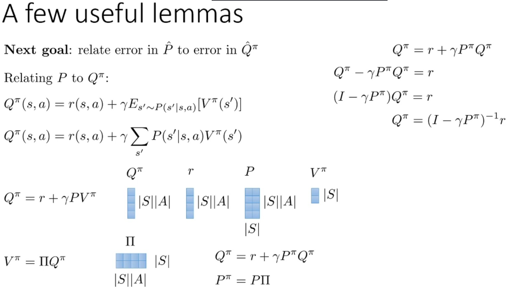

먼저 $\hat{p}$와 $\hat{Q}^\pi$의 관계만 살펴보자.

Q function $Q^\pi \in \mathbb{R}^{|S||A|}$, reward function $r \in \mathbb{R}^{|S||A|}$, transition function $P \in \mathbb{R}^{|S| \times |S||A|}$, value function $V^\pi \in \mathbb{R}^{|S|}$, policy $\Pi \in \mathbb{R}^{|S||A| \times |S|}$라 하자.

그럼 $Q^\pi$는 우상단의 수식과 같이 $P^\pi$의 식으로 나타낼 수 있다.
둘은 비선형 관계를 가지고 이는 모든 dynamics에 대해 참이다.

  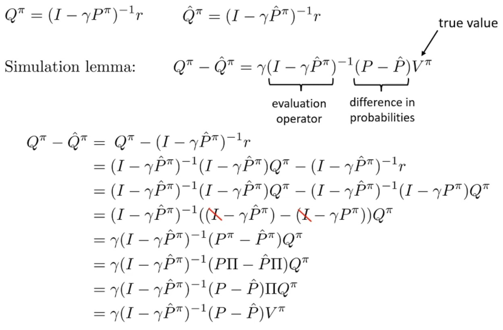

Simulation Lemma는 위의 식과 같다.
* 실제 value로 가중치가 부여된 학률의 차이 $P - \hat{P}$로 reward의 error를 구하고, evaluation operator으로 reward function을 Q function으로 변환한 것이다.
  * 실제 value와 dynamics model의 차이를 곱해 한 step에서의 reward를 error를 구한다.
  * 그리고 evaluation operator로 일종의 Q iteration를 적용하는 것이다.
    * Evaluation operator는 무한 등비급수의 합 형태이다.

증명은 위의 사진을 참고하자.
* $r = (I - \gamma\hat{P}^\pi)Q^\pi$

  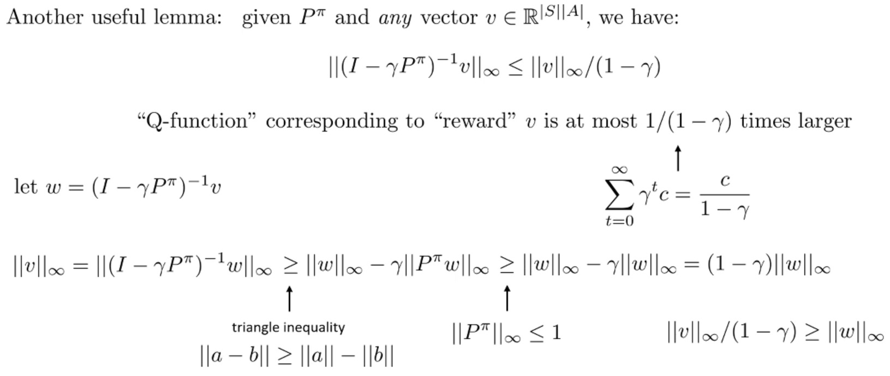

또 다른 정리를 살펴보자.
이것은 $P^\pi \in \mathbb{R}^{|S| \times |S||A|}$와 임의의 vector $v \in \in \mathbb{R}^{|S||A|}$관의 관계이다.

Evaluation operator를 적용하면 vector의 $\infty$-norm이 최대 $\frac{1}{1-\gamma}$배 만큼 증가한다는 의미이다.
* Evaluation operator가 Q iteration을 나타낸다.
* 직관적으로 reward vector $v$를 가지고 Q iteration으로 구한 Q function은 $\infty$-norm 측면에서 최대 $\frac{1}{1-\gamma}$배 만큼 클 수 있다는 것이다.
* $\frac{1}{1-\gamma}$ 형태는 discount factor를 고려한 reward의 합을 구할 때 볼 수 있는 형태이다.
  * $c$는 보통 reward의 최대값으로 생각할 수 있다.
  * $\frac{1}{1-\gamma}$는 일종의 horizon term이다.
  * 만약 horizon이 유한하고 $\gamma$가 1이면 $c$ 앞의 승수 $\gamma^t$는 $T$와 같다.
  * 무한한 horizon을 유한 형태로 고려하기 위해 이 term이 생기는 것이다.

증명은 위의 사진을 참고하자.
* Norm 연산에 관한 triangle inequality를 활용한다.

## 2.3. Conclusion: Put Together

  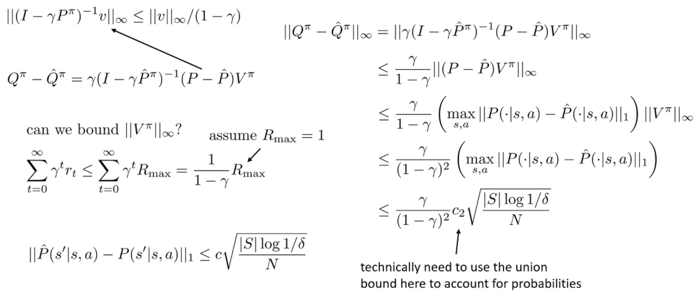

위에서 살펴본 lemmas를 모두 합하면 위의 사진과 같은 결론을 얻을 수 있다.
* RL의 reward는 상대적이기 때문에 reward의 range를 0 ~ 1사이라고 가정한다.
* 모두 1이라고 했을 때 $V^\pi_\infty = \frac{1}{1-\gamma}$이다.
* 하나의 state-action이 아니라 모든 state-action의 maximization을 고려하기 때문에 상수 $c$가 달라진다.
이를 $c_2$로 표현한다.

$$
||Q^\pi - \hat{Q}^\pi||_\infty \leq \frac{\gamma}{(1-\gamma)^2}c_2\sqrt{\frac{|S|\log 1/\delta}{N}}
$$

* Supervised learning과 같이 error는 $\sqrt{N}$에 비례해 작아진다.
* Error가 $\frac{\gamma}{(1-\gamma)^2}$에 비례해 커진다.
  * $\gamma$는 1에 가깝기 때문에 분자는 무시한다.
  * 분모는 horizon에 따라 제곱으로 증가하는 error이다.
  * Horizon을 현재 reward에 많이 고려할수록 error가 제곱으로 축적된다는 것을 의미한다.
  * 알고리즘 또는 학습 방법에 따라 horionz에 제곱한 만큼 error가 증가하지 않는 것도 있다.
  다만, 이번에 분석한 방법에서는 제곱만큼 증가한다.

## 2.4. Some simple implications

  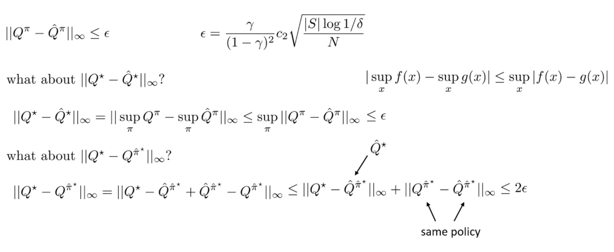

이전까지 1번 질문에 대한 답을 한 것이었다.
이를 활용해 2, 3번 질문에 대한 답을 하면 위와 같다.

$$
|\sup_x f(x) - \sup_x g(x)| \leq \sup_x|f(x)-g(x)|
$$

어떤 두 함수의 최대값의 차이가 두 함수 차이의 최대값보다 작거나 같다는 성질을 이용해 2번에 대한 질문을 할 수 있다.
* 두 Q 값의 policy가 다르기 때문에 1번 결과를 바로 적용하지 못한다.

마지막으로 $\infty$-norm에 triangle inequality와 $\hat{Q}^{\hat{\pi}^\star} = \hat{Q}^\star$를 적용한다.
2번 결과로 첫 번째 term을 처리할 수 있다.
그리고 두 번째 term은 서로 같은 policy를 고려하기 때문에 1번의 결과를 바로 적용할 수 있다.

# 3. Sample Complexity in Model-Free RL

