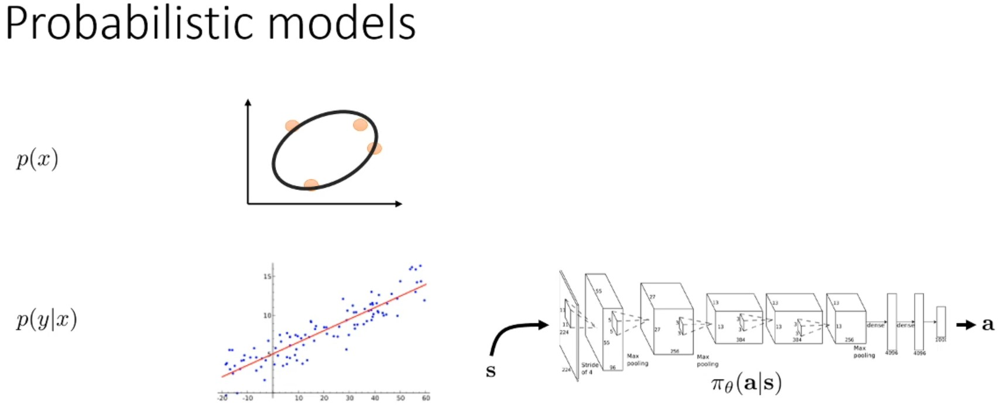
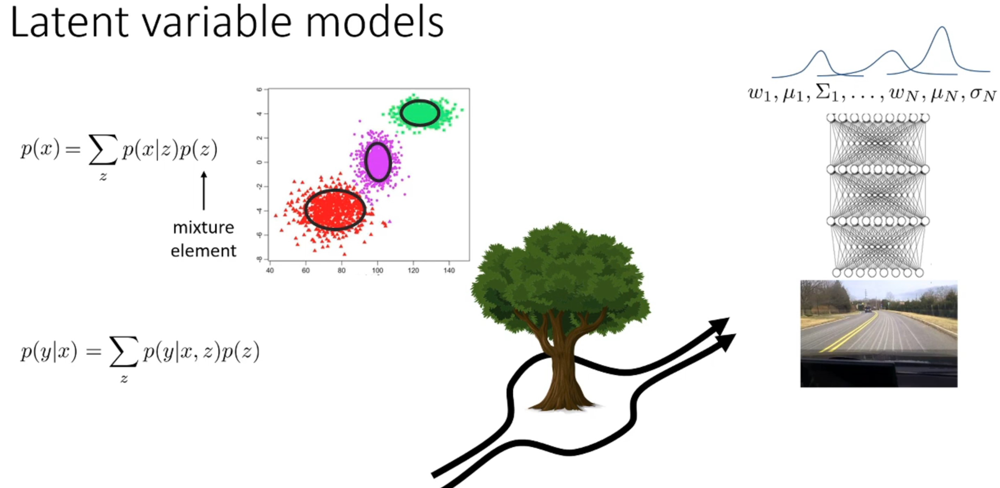
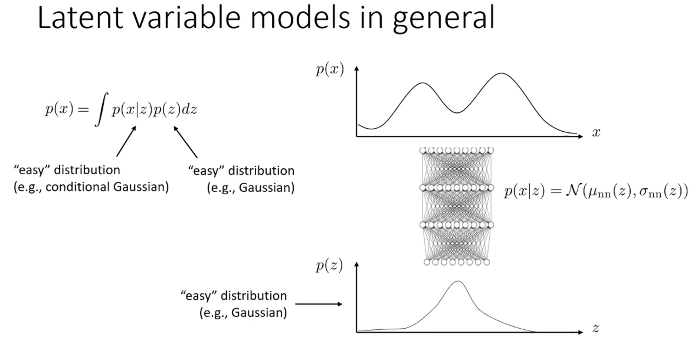
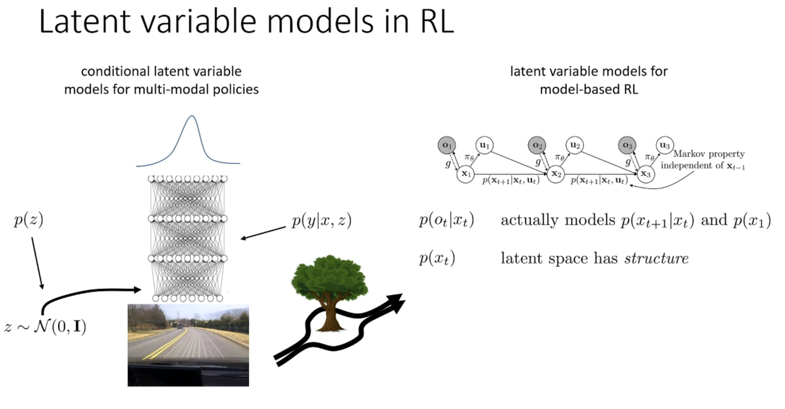
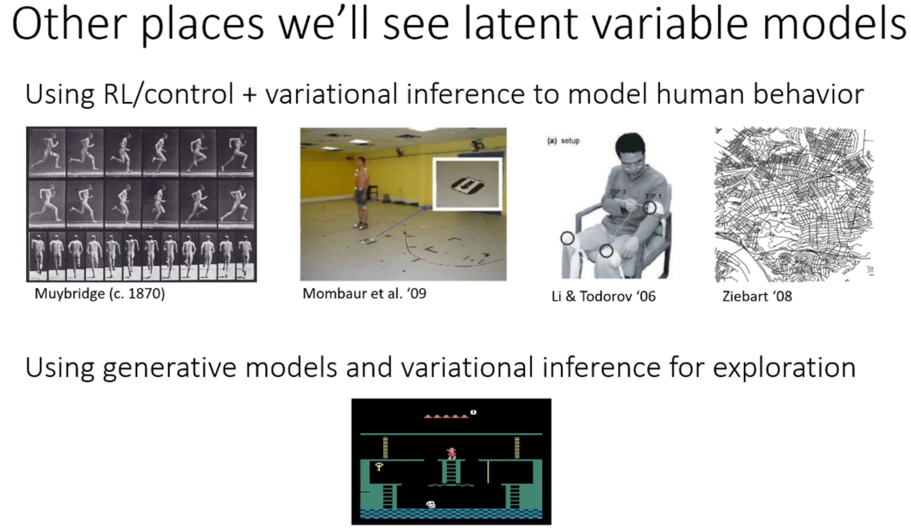
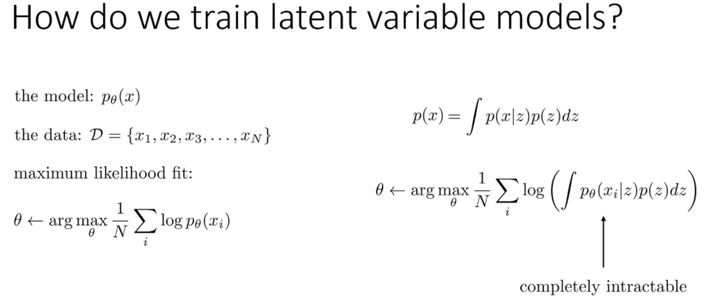
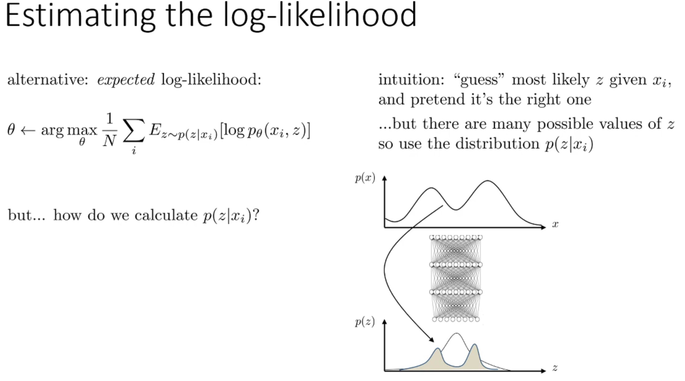

이번 강의에서는 Model-based RL, Inverse RL, exploration 등 다양한 주제에서 등장하는 variational inference에 대해서 자세히 살펴 본다.
* Probabilisitc latent variable models이 무언인지, 어떤 용도로 쓰이는지 살펴본다.
* Variational inference를 통해 probabilisitc latent variable models을 학습을 통해 어떻게 approximation할 수 있는지 알아본다.
* Amortized variational inference 개념을 활용해 neural network와 같은 approximator를 variational inference와 결합해서 활용하는 방법을 살펴본다.
* 마지막으로 amortized variational inference를 활용하는 모델의 예시를 살펴본다.
  * VAE: Variational Auto Encoder
  * Model-based RL에서 쓰이는 다양한 sequence level models

또한, variational inference는 다음 강의에서 배우는 학습 기반 control과 매우 깊은 연관성을 가지기 때문에 잘 알아두자.

# 1. Probabilistic Latent Variable Models

  

Probabilistic model이란 확률 분포를 나타내는 model을 의미한다.
Random variable $x$에 대해 확률 분포 $p(x)$를 modeling한다는 것은 관측된 data(주황색 점들)에 fitting한 분포를 결정한다는 뜻이다.
* 예를 들어, 주황색 data를 표현하기 위해 multivariate normal distribution을 사용할 수 있다.

또한, probabilisitic model은 conditional models이 될 수 있다.
* $p(y|x)$라는 확률 분포가 있을 수 있는데, 이 경우 $x$에 대한 분포 모델링에는 관심이 없고 $x$가 주어졌을 때 $y$의 조건부 분포를 모델링하는 데 집중한다.
* Conditional Gaussian Model을 사용해 fitting할 수 있다.
위의 경우, $y$를 $x$에 대한 선형 함수에 가우시안 노이즈가 더해진 형태로 표현하고 있다.
  * 단순한 gaussian 분포는 고정된 종 모양의 분포이다.
  * 조건부가 붙으면 입력값 $x$에 따라 종 모양의 위치가 달라진다.
	* 즉, 종 모양의 위치를 나타내는 평균 $\mu$은 $x$의 선형 함수로 결정되고, 거기에 가우시안 노이즈(분산 $\sigma^2$)이 더해진 형태이다.
* Policy $\pi(a|s)$는 state $s$가 주어졌을 때 action $a$에 대한 조건부 분포를 제공하는 조건부 확률 모델이다.

  

Latent variable models은 probabilistic models의 특수한 형태로, evidence나 query가 아닌 다른 variables들이 포함된 모델을 뜻한다.
* $p(x)$에서는 evidence는 없고 query는 $x$이다.
* $p(y|x)$에서는 evidence는 $x$이고 query는 $y$이다.
* Query에 관한 확률을 구하기 위해서는 latent variable를 적분해서 없애야 한다.

$p(x)$를 표한하기 위한 latent variable model의 전형적인 예는 Mixture model이다.
* 위의 사진에서 3개의 cluster를 구한다고 할 때, 주어진 데이터를 fitting하는 probabilistic model을 구하길 원할 것이다.
* 가장 편리한 방법은 3개의 multivariable normal distribution으로 구성된 mixture model로 표현하는 것이다.
* 이때 latent variable $z$은 3개의 cluster 중 하나를 나타내는 categorical discrete variable이다.
* $p(x)$를 latent variable model $\sum_z p(x|z)p(z)$로 표현한다.

조건부 모델에서도 똑같은 작업을 할 수 있다.
* $p(y|x) = \sum_z p(y|x,z)p(z)$
* $p(y|x) = \sum_z p(y|x,z)p(z|x)$
  * $z$ 역시 $x$에 의존한다고 설정
* $p(y|x) = \sum_z p(y|z)p(z|x)$
  * $y$에 대한 조건부 분포가 $x$에 의존하지 않음.

Categorical discrete variable $z$의 예시로 mixture density network가 있다.
* 이는 imitation learning을 다룰 때 나무를 피해 운선하는 상황과 같은 multimodal 상황을 처기하기 위해 언급했던 모델이다.

Gaussian mixture로 표현한 분포를 출력하는 neural network에 대해서도 배웠다.
* Neural network는 각 mixture element에 대해 여러 개의 평균 $\mu$, 표준편차 $\sigma$, 가중치 $w$를 출력한다.

위의 clustering 예제는 network 입력을 $x$, 출력을 $y$, latent variable $z$를 cluster의 identity로 둔다.
* 확률 모델 $p(y|x) = \sum_z p(y|x,z)p(z|x)$에서 neural network는 Gaussian들의 평균 $\mu$과 분산 $\sigma^2$을 출력하고 있으며, 각 mixture element의 확률인 $w$도 출력한다.
  * $z$가 $x$에 dependent하다는 것을 heuristic하게 결정되는 확률 모델 디자인 선택이다.
	* 추천 시스템의 예시로 들면 user $x$가 어떤 cluster(segment) $z$에 속하는지 파악하고, 이 둘의 정보를 활용해 특정 content를 소비할 확률 $y$를 구하는 것으로 해석할 수 있다.

  

일반적인 latent variable model은 복잡한 probabilistic model을 단순한 분포들의 곱으로 표현하기 위해 활용된다.
* $p(x)$ 자체는 복잡하지만, $p(x|z)$, $p(z)$는 Gaussian, Categorical 분포처럼 간단할 수 있다.
* 즉, 간단한 분포 곱의 marginalization을 통해 복잡한 분포 $p(x)$를 표현할 수 있게 된다.

  

같은 원리가 conditional case에서도 발생할 수 있다.

Multi-modal policies를 위한 conditional latent variable model의 경우, 출력에 Gaussian mixture를 사용할 수 있지만 더 일반적으로 모델의 입력으로 latent variable $z$를 추가할 수 있다.
* 이전과 같은 원리로 prior 분포 $p(z)$가 있고, 조건부 분포 $p(y|x,z)$는 매우 단순하지만, $p(y|x)$는 복잡할 수 있다.

또 이전에 model-based RL에서 살펴보았다.
* Image $o_t$를 관측하고 action $u_t$에 의존하는 latent state $x_t$를 학습하고자 하는 latent state models을 보았었다.
* 이 예시에서는 다소 복잡한 latent space를 갖는다.
* Observation 분포 $p(o|x)$가 있고, prior 분포 $p(x)$는 dynamics $p(x_{t+1}|x_t)$, $p(x_1)$을 모델링한다.
  * 이러한 latent space는 구조(structure)를 가지고 있기 때문에 prior 분포는 훨씬 더 구조화되어 있고 복잡하다.
* 위 내용은 이번 강의 마지막에 더 자세히 다룰 것이다.

  

Latent variable model은 RL의 다양한 분야에서 볼 수 있다.
* Reward function이 주어졌을 때 최적의 action을 묻는 대신, 무언가를 수행하는 사람의 데이터가 주어졌을 때 그 사람이 무엇을 하려는지 reverse enginnering할 수 있는지를 묻는다.
  * 이것은 imitation learning분야뿐만 아니라 신경과학 및 운동 제어 분야의 인간 행동 연구에서도 흔히 볼 수 있다.
* Exploration에서 information gain을 할 때 variational inference를 사용했고, pseudo counts나 count-based bonus를 할당하기 위해 generative model과 density model을 사용했다.
  
Generative model과 latent variable model은 RL 연구에서 항상 등장한다.
* Generative model은 $x$를 생성하는 모델로, $p(x)$가 generative model이다.
* Latent variable model은 latent variable을 가지는 모델이다.
* 모든 generative 모델이 latent variable 모델인 것은 아니며, 모든 latent variable 모델이 generative 모델인 것도 아니다.
* 하지만, 일반적으로 복잡한 generative model을 간단한 latent models의 곱으로 표현 것이 훨씬 더 쉽다.

  

이제 latent variable model $p_\theta(x)$을 학습시키는 방법을 살펴보자.
* $\theta$는 model의 parameter를 나타낸다.

데이터 $x_1, \cdots, x_N$이 있을 때, 보통 maximul likelihood fitting으로 데이터에 model을 fitting할 것이다.
따라서 자연스러운 objective function은 모든 데이터 point에 대한 $\log p_\theta(x_i)$의 합의 평균을 최대화하는 $\theta$를 구하는 것이다.

여기서 $p(x) = \int p(x|z)p(z)dz$로 주어질 때 이를 objective function에 대입한다.
이때, objective function을 계산하기 상당히 어렵다.
* $z$가 continuous variable이라면 graidnet step을 수행할 때마다 적분을 계산하는 것은 intractable하다.
  * Log 안에 적분이 있기 때문에 미분을 해도 적분 기호가 사라지지 않고, 분모와 분자에 복잡하게 남게 된다.
	* Latent variable $z$가 단순하면 적분 대신 모든 경우의 수를 summation $\sum$하면 된다.
	* 하지만, deep neural network인 경우 보통 $z$는 continuous variable이므로 적분을 수행해야 한다.

* Gaussian mixture model과 같이 경우, 각 gaussian model의 identity $z$는 discrete이므로 summation을 통해 적분을 구할 수 있다.
  * 하지만, 이 경우에도 computer numerical error와 optimization landscape가 까다롭기 때문에 좋지 못한 결과가 나온다는 것이 밝혀졌다.
	* Gaussian 분포의 값은 $\exp\left({-(x-\mu)^2}\right)$ 형태를 가진다. 그렇기 때문에 데이터가 평균 $\mu$에서 조금만 멀어져도 아주 작은 값이 되기 때문에 underflow가 자주 일어난다.
	* Gaussian mixture model은 mode 값이 많은 non-convexity이다.
	그렇기 때문에 local minima에 빠질 위험이 많다.

  

Log likelihood와 gradient를 다루기 위해 expected log likelihood를 objective function으로 사용한다.
* 나중에 이번 강의에서 이것이 왜 타당한지 알게 될 것이다.

직관적으로 latent variable을 기본적으로 데이터의 부분적인 관측값으로 생각할 수 있다.
즉, 데이터는 실제로 $x,z$로 구성되어 있는데, $x$는 관측하지만 $z$는 관측하지 못하는 것이다.
따라서 본질적으로 $z$가 무엇이었을지 추측하는 것이다.
* 예를 들어, 데이터 point가 여기 있으니 아마도 이 cluster에 속할 거야라고 추측할 수 있다.

그리고 나서 $x_i$가 실제로 $z$ 값을 가진다는 fake label을 만든 다음, $x_i, z$값에 대해 maximum likelihood를 수행하는 것이다.

특정 $x_i$에 대응하는 $z$를 정확히 알 수 없지만, 그에 대한 분포는 알 수 있다.
따라서 가장 가능성이 높은 $z$값 하나만 취하는 대신, $z$에 대한 전체 분포를 가져와서 해당 $z$의 확률로 가중치를 둔 likelihood의 평균을 구하는 것이 expected log likelihood 계산이다.

기댓값은 샘플을 통해 추정할 수 있고, 기댓값의 unbiased estimate를 얻을 때 모든 $z$를 고려할 필요 없이, posterior $p(z|x_i)$에서 샘플링하고 샘들을의 log 확률을 평균낸다.
* 이를 Monte Carlo extimation이라고 부른다.
* $\log (\mathbb{E}_z)$ 형태의 경우 샘플링을 통해 Monte Calro로 unbiased estimate를 수행할 수 없지만, $\mathbb{E}_z[\log]$ 형태의 경우 적용할 수 있다.
	* Log 함수는 직선(선형성)이 아니기 때문에 $\log (\mathbb{E}_z) \neq \log(\frac{1}{N})$
	* 반면 $\mathbb{E}_z[\log] \approx \frac{1}{N}(\log)$
* Policy gradient에서도 몇 개의 episode를 실행해서 얻은 transition sample로 학습을 진행하였다.

하지만 가장 큰 challenge는 $p(z|x_i)$를 모른다는 것이다.
이것만 파악하면 expected log likelihood를 추정할 수있다.
* $p(z|x_i)$에서는 $x_i$가 주어졌을 때 이를 다시 $z$에 대한 분포로 매핑하는 것이다.