이번 강의에서는 Model-based RL, Inverse RL, exploration 등 다양한 주제에서 등장하는 variational inference에 대해서 자세히 살펴 본다.
* Probabilisitc latent variable models이 무언인지, 어떤 용도로 쓰이는지 살펴본다.
* Variational inference를 통해 probabilisitc latent variable models을 학습을 통해 어떻게 approximation할 수 있는지 알아본다.
* Amortized variational inference 개념을 활용해 neural network와 같은 approximator를 variational inference와 결합해서 활용하는 방법을 살펴본다.
* 마지막으로 amortized variational inference를 활용하는 모델의 예시를 살펴본다.
  * VAE: Variational Auto Encoder
  * Model-based RL에서 쓰이는 다양한 sequence level models

또한, variational inference는 다음 강의에서 배우는 학습 기반 control과 매우 깊은 연관성을 가지기 때문에 잘 알아두자.

# 1. Probabilistic Latent Variable Models

  

Probabilistic model이란 확률 분포를 나타내는 model을 의미한다.
Random variable $x$에 대해 확률 분포 $p(x)$를 modeling한다는 것은 관측된 data(주황색 점들)에 fitting한 분포를 결정한다는 뜻이다.
* 예를 들어, 주황색 data를 표현하기 위해 multivariate normal distribution을 사용할 수 있다.

또한, probabilisitic model은 conditional models이 될 수 있다.
* $p(y|x)$라는 확률 분포가 있을 수 있는데, 이 경우 $x$에 대한 분포 모델링에는 관심이 없고 $x$가 주어졌을 때 $y$의 조건부 분포를 모델링하는 데 집중한다.
* Conditional Gaussian Model을 사용해 fitting할 수 있다.
위의 경우, $y$를 $x$에 대한 선형 함수에 가우시안 노이즈가 더해진 형태로 표현하고 있다.
  * 단순한 gaussian 분포는 고정된 종 모양의 분포이다.
  * 조건부가 붙으면 입력값 $x$에 따라 종 모양의 위치가 달라진다.
	* 즉, 종 모양의 위치를 나타내는 평균 $\mu$은 $x$의 선형 함수로 결정되고, 거기에 가우시안 노이즈(분산 $\sigma^2$)이 더해진 형태이다.
* Policy $\pi(a|s)$는 state $s$가 주어졌을 때 action $a$에 대한 조건부 분포를 제공하는 조건부 확률 모델이다.

  

Latent variable models은 probabilistic models의 특수한 형태로, evidence나 query가 아닌 다른 variables들이 포함된 모델을 뜻한다.
* $p(x)$에서는 evidence는 없고 query는 $x$이다.
* $p(y|x)$에서는 evidence는 $x$이고 query는 $y$이다.
* Query에 관한 확률을 구하기 위해서는 latent variable를 적분해서 없애야 한다.

$p(x)$를 표한하기 위한 latent variable model의 전형적인 예는 Mixture model이다.
* 위의 사진에서 3개의 cluster를 구한다고 할 때, 주어진 데이터를 fitting하는 probabilistic model을 구하길 원할 것이다.
* 가장 편리한 방법은 3개의 multivariable normal distribution으로 구성된 mixture model로 표현하는 것이다.
* 이때 latent variable $z$은 3개의 cluster 중 하나를 나타내는 categorical discrete variable이다.
* $p(x)$를 latent variable model $\sum_z p(x|z)p(z)$로 표현한다.

조건부 모델에서도 똑같은 작업을 할 수 있다.
* $p(y|x) = \sum_z p(y|x,z)p(z)$
* $p(y|x) = \sum_z p(y|x,z)p(z|x)$
  * $z$ 역시 $x$에 의존한다고 설정
* $p(y|x) = \sum_z p(y|z)p(z|x)$
  * $y$에 대한 조건부 분포가 $x$에 의존하지 않음.

Categorical discrete variable $z$의 예시로 mixture density network가 있다.
* 이는 imitation learning을 다룰 때 나무를 피해 운선하는 상황과 같은 multimodal 상황을 처기하기 위해 언급했던 모델이다.

Gaussian mixture로 표현한 분포를 출력하는 neural network에 대해서도 배웠다.
* Neural network는 각 mixture element에 대해 여러 개의 평균 $\mu$, 표준편차 $\sigma$, 가중치 $w$를 출력한다.

위의 clustering 예제는 network 입력을 $x$, 출력을 $y$, latent variable $z$를 cluster의 identity로 둔다.
* 확률 모델 $p(y|x) = \sum_z p(y|x,z)p(z|x)$에서 neural network는 Gaussian들의 평균 $\mu$과 분산 $\sigma^2$을 출력하고 있으며, 각 mixture element의 확률인 $w$도 출력한다.
  * $z$가 $x$에 dependent하다는 것을 heuristic하게 결정되는 확률 모델 디자인 선택이다.
	* 추천 시스템의 예시로 들면 user $x$가 어떤 cluster(segment) $z$에 속하는지 파악하고, 이 둘의 정보를 활용해 특정 content를 소비할 확률 $y$를 구하는 것으로 해석할 수 있다.

  

일반적인 latent variable model은 복잡한 probabilistic model을 단순한 분포들의 곱으로 표현하기 위해 활용된다.
* $p(x)$ 자체는 복잡하지만, $p(x|z)$, $p(z)$는 Gaussian, Categorical 분포처럼 간단할 수 있다.
* 즉, 간단한 분포 곱의 marginalization을 통해 복잡한 분포 $p(x)$를 표현할 수 있게 된다.

  

같은 원리가 conditional case에서도 발생할 수 있다.

Multi-modal policies를 위한 conditional latent variable model의 경우, 출력에 Gaussian mixture를 사용할 수 있지만 더 일반적으로 모델의 입력으로 latent variable $z$를 추가할 수 있다.
* 이전과 같은 원리로 prior 분포 $p(z)$가 있고, 조건부 분포 $p(y|x,z)$는 매우 단순하지만, $p(y|x)$는 복잡할 수 있다.

또 이전에 model-based RL에서 살펴보았다.
* Image $o_t$를 관측하고 action $u_t$에 의존하는 latent state $x_t$를 학습하고자 하는 latent state models을 보았었다.
* 이 예시에서는 다소 복잡한 latent space를 갖는다.
* Observation 분포 $p(o|x)$가 있고, prior 분포 $p(x)$는 dynamics $p(x_{t+1}|x_t)$, $p(x_1)$을 모델링한다.
  * 이러한 latent space는 구조(structure)를 가지고 있기 때문에 prior 분포는 훨씬 더 구조화되어 있고 복잡하다.
* 위 내용은 이번 강의 마지막에 더 자세히 다룰 것이다.

  

Latent variable model은 RL의 다양한 분야에서 볼 수 있다.
* Reward function이 주어졌을 때 최적의 action을 묻는 대신, 무언가를 수행하는 사람의 데이터가 주어졌을 때 그 사람이 무엇을 하려는지 reverse enginnering할 수 있는지를 묻는다.
  * 이것은 imitation learning분야뿐만 아니라 신경과학 및 운동 제어 분야의 인간 행동 연구에서도 흔히 볼 수 있다.
* Exploration에서 information gain을 할 때 variational inference를 사용했고, pseudo counts나 count-based bonus를 할당하기 위해 generative model과 density model을 사용했다.
  
Generative model과 latent variable model은 RL 연구에서 항상 등장한다.
* Generative model은 $x$를 생성하는 모델로, $p(x)$가 generative model이다.
* Latent variable model은 latent variable을 가지는 모델이다.
* 모든 generative 모델이 latent variable 모델인 것은 아니며, 모든 latent variable 모델이 generative 모델인 것도 아니다.
* 하지만, 일반적으로 복잡한 generative model을 간단한 latent models의 곱으로 표현 것이 훨씬 더 쉽다.

  

이제 latent variable model $p_\theta(x)$을 학습시키는 방법을 살펴보자.
* $\theta$는 model의 parameter를 나타낸다.

데이터 $x_1, \cdots, x_N$이 있을 때, 보통 maximul likelihood fitting으로 데이터에 model을 fitting할 것이다.
따라서 자연스러운 objective function은 모든 데이터 point에 대한 $\log p_\theta(x_i)$의 합의 평균을 최대화하는 $\theta$를 구하는 것이다.

여기서 $p(x) = \int p(x|z)p(z)dz$로 주어질 때 이를 objective function에 대입한다.
이때, objective function을 계산하기 상당히 어렵다.
* $z$가 continuous variable이라면 graidnet step을 수행할 때마다 적분을 계산하는 것은 intractable하다.
  * Log 안에 적분이 있기 때문에 미분을 해도 적분 기호가 사라지지 않고, 분모와 분자에 복잡하게 남게 된다.
	* Latent variable $z$가 단순하면 적분 대신 모든 경우의 수를 summation $\sum$하면 된다.
	* 하지만, deep neural network인 경우 보통 $z$는 continuous variable이므로 적분을 수행해야 한다.

* Gaussian mixture model과 같이 경우, 각 gaussian model의 identity $z$는 discrete이므로 summation을 통해 적분을 구할 수 있다.
  * 하지만, 이 경우에도 computer numerical error와 optimization landscape가 까다롭기 때문에 좋지 못한 결과가 나온다는 것이 밝혀졌다.
	* Gaussian 분포의 값은 $\exp\left({-(x-\mu)^2}\right)$ 형태를 가진다. 그렇기 때문에 데이터가 평균 $\mu$에서 조금만 멀어져도 아주 작은 값이 되기 때문에 underflow가 자주 일어난다.
	* Gaussian mixture model은 mode 값이 많은 non-convexity이다.
	그렇기 때문에 local minima에 빠질 위험이 많다.

  

Log likelihood와 gradient를 다루기 위해 expected log likelihood를 objective function으로 사용한다.
* 나중에 이번 강의에서 이것이 왜 타당한지 알게 될 것이다.

직관적으로 latent variable을 기본적으로 데이터의 부분적인 관측값으로 생각할 수 있다.
즉, 데이터는 실제로 $x,z$로 구성되어 있는데, $x$는 관측하지만 $z$는 관측하지 못하는 것이다.
따라서 본질적으로 $z$가 무엇이었을지 추측하는 것이다.
* 예를 들어, 데이터 point가 여기 있으니 아마도 이 cluster에 속할 거야라고 추측할 수 있다.

그리고 나서 $x_i$가 실제로 $z$ 값을 가진다는 fake label을 만든 다음, $x_i, z$값에 대해 maximum likelihood를 수행하는 것이다.

특정 $x_i$에 대응하는 $z$를 정확히 알 수 없지만, 그에 대한 분포는 알 수 있다.
따라서 가장 가능성이 높은 $z$값 하나만 취하는 대신, $z$에 대한 전체 분포를 가져와서 해당 $z$의 확률로 가중치를 둔 likelihood의 평균을 구하는 것이 expected log likelihood 계산이다.

기댓값은 샘플을 통해 추정할 수 있고, 기댓값의 unbiased estimate를 얻을 때 모든 $z$를 고려할 필요 없이, posterior $p(z|x_i)$에서 샘플링하고 샘들을의 log 확률을 평균낸다.
* 이를 Monte Carlo extimation이라고 부른다.
* $\log (\mathbb{E}_z)$ 형태의 경우 샘플링을 통해 Monte Calro로 unbiased estimate를 수행할 수 없지만, $\mathbb{E}_z[\log]$ 형태의 경우 적용할 수 있다.
	* Log 함수는 직선(선형성)이 아니기 때문에 $\log (\mathbb{E}_z) \neq \log(\frac{1}{N})$
	* 반면 $\mathbb{E}_z[\log] \approx \frac{1}{N}(\log)$
* Policy gradient에서도 몇 개의 episode를 실행해서 얻은 transition sample로 학습을 진행하였다.

하지만 가장 큰 challenge는 $p(z|x_i)$를 모른다는 것이다.
이것만 파악하면 expected log likelihood를 추정할 수있다.
* $p(z|x_i)$에서는 $x_i$가 주어졌을 때 이를 다시 $z$에 대한 분포로 매핑하는 것이다.

# 2. Variational Inference

## 2.1. The Variational Approximation 

Variation inference는 기본적으로 $x_i$가 주어졌을 때 $z$의 확률인 $p(z|x_i)$를 계산해야 한다.
이 식을 유도하는 과정에서 expected log likelihood가 합리적인 이유를 알게 될 것이다.

  

일반적으로 $x_i$는 여러 원인($z_1, z_3, ...$)에 의해서 결정되기 때문에 $p(z|x_i)$는 꽤 복잡한 분포이다.
하지만, 일단 $p(z|x_i)$가 아주 간단한 Gaussian 분포 $q_i(z)$에 근사한다고 가정하자.
* $q_i$와 같이 아래첨자가 붙은 이유는 특정 point $x_i$에 특화된 $z$에 대한 분포이기 때문이다.
* 그림처럼 $p(z)$의 분포가 복잡하고 이를 single peak를 가진 Gaussian 분포 $q_i(z)$로 근사하는게 반드시 잘 작동하지 않을 수 있다.
단순히 최적의 fit을 가지는 Gaussian 분포를 찾는 것이다.

$p(z|x_i)$가 $q_i(z)$에 근사하면 $\log p(x_i)$에 대한 lower bound를 구축할 수 있다는 것이 밝혀졌다.
이 lower bound를 최대화하여 충분히 tight하게(실제 값에 근접하게)만들 수 있다.

위의 사진의 수식에서 어떤 수치에 $q_i(z)$가 곱해진 형태를 볼 수 있는데 이를 $q_i(z)$ 하에서의 기댓값으로 쓸 수 있다.

  

Jensen's inequality를 적용하면 위와 같은 수식을 얻을 수 있다.
* Jensen's inequality은 convex/concave 함수에서 linear combination의 관계를 설명한다.
* 이를 통해 lower bound를 만들 수 있게 된 것이다.

위 수식의 장점은 모든 term이 계산 가능하다는 것이다.
* 어떤 $q_i(z)$를 선택하든 성립한다.

모든 $q_i(z)$가 최선의 lower bound를 만들어내지는 않겠지만, 임의의 $q_i(z)$를 골라 샘플링하여 첫 번째 기댓값 term을 계산할 수 있다.

두 번째 기댓값 term은 $q_i(z)$의 entropy와 같다.
Gaussian $q_i(z)$에 대해선 closed form으로 이를 계산할 수 있다.

위의 수식을 최대화하면 $\log p(x_i)$를 최대화할 수 있지만, lower bound가 너무 느슨(loose)하지 않다는 것을 증명해야 한다.
* 즉, lower bound가 실제 $\log p(x_i)$와 가까워야 한다.

이를 증명하기 위해 먼저 Entropy와 KLD에 관해서 잠깐 살펴보자.
이는 variational inference가 무엇을 하는지에 대한 좋은 직관을 제공한다.

  

Entropy의 첫 번째 직관은 '확률 변수가 얼마나 무작위적인가?'이다.
* 가장 무작위적이고 예측 불가능할 때 가장 높은 entropy를 가진다.

두 번째 직관은 '$p(x)$의 분포하에 $\log p(x)$의 기댓값이 얼마나 큰가?'이다.
* 만약 주로 낮은 log 확률값을 가지면, 비슷한 확률을 할당하는 지점이 많다는 뜻으로 무작위성이 크고 높은 entropy를 가진다.

만약 $p(x_i, z)$의 그래프가 위의 그림의 하단과 같다면, 첫 번째 기댓값 term은 $p(x_i, z)$ 값의 peak에 위치한 $z$에 큰 density를 가지는 분포 $q_i(z)$를 찾게 한다.
하지만, 동시에 두 번째 기댓값 term은 $z$에 대한 분포 $q_i(z)$가 최대한 넓게 퍼지기를 원한다.

이를 통해 $p(x_i, z)$가 높은 지역들을 찾아가되, entropy 덕분에 너무 peak만 찾지 않고 주변을 cover 하는 형태를 띠게 된다.

  

두 분포 $p, q$ 사이의 KL Divergence를 풀어 쓰면 위 사진과 같아진다.

KLD의 한 가지 직관은 '두 분포가 얼마나 다른가'이다.
* 두 분포가 같으면, KLD의 값은 0이 된다.

두 번째 직관은 entropy term을 제외 했을 때 '한 분포가 다른 분포에 대해 가지는 expected log probability가 얼마나 작은가?'이다.
* Entorpy term은 VLB (variational lower bound)와 같이 $q$가 단순히 $p$ 아래에서 가장 확률이 높은 지점에서 머무는 것을 방지하여 전체 $p$를 cover하도록 만든다.

  

Variational approximation에서는 사진의 최상단의 관계를 ELBO (evidence lower bound) 또는 VLB (variational lower bound)라고 부르며 $\mathcal{L}_i(p,q_i)$로 표기한다.

좋은 $q_i(z)$는 $p(z|x_i)$에 잘 근사해야하고, 이를 통해 가장 tight한 lober bound를 얻을 수 있다.
이는 KLD로 비교할 수 있다.

$q_i(z)$와 $p(z|x_i)$ KLD를 계산하여 정리하면 위와 같은 수식을 얻을 수 있다.
결국 두 분포의 KLD는 음의 VLB $-\mathcal{L}_i(p,q_i)$에 $\log p(x_i)$를 더한 것과 같다.

$\log p(x_i)$는 $q_i$에 영향을 받지 않으므로 식을 재배치하여 $\log p(x_i) = D_\text{KL} + \text{ELBO}$와 같은 형태가 되는 것을 확인할 수 있다.
이는 ELBO를 유도하는 또 다른 방법으로 KLD는 항상 0보다 크거나 같기 때문에 ELBO에서 살펴 본 부등식 형태를 얻을 수 있다.

더 나아가 KLD를 0으로 만들면 ELBO가 정확히 $\log p(x_i)$와 같아지는 것을 볼 수 있다.
즉, KLD를 최소화하는 것이 ELBO를 tight하게 만드는 것이다.
* 이것이 단순한 $q_i(z)$가 $p(z|x_i)$에 근사해야 하는 이유이다.

또한, $\log \int$가 $\mathbb{E}[\log]$로 되는 과정을 통해 왜 expected log likelihood를 사용해도 되는지에 대한 정당한 이유를 제시한다.

  

정리하면 KLD를 최소화하는 $q_i$는 동시에 ELBO를 최대화하는 것과 같다진다.
* $\log p(x_i)$는 $q_i$에 영향을 받지 않으므로 무시한다.

따라서 $q_i$에 대한 ELBO를 최대화하면 KLD가 최소화되면서 lower bound가 tight해지고, $\log p(x_i)$도 증가한다.

  

ELBO를 최대화하는 구체적인 구현을 살펴보자.

각 data $x_i$에 대해 $q_i(z)$로부터 $z$를 샘플링해 model paramter $\theta$에 대한 gradient를 계산해야 한다.
이때, $p(z)$는 $\theta$에 영향을 받지 않으므로 $p_\theta(x_i|z)$의 gradient만 계산해 $\theta$를 개선한다.

그 다음 동일한 ELBO loss를 최대화하도록 $q_i$를 업데이트한다.
* 이부분을 해결해야 한다.
* 만약 $q_i$가 평균 $\mu_i$와 분산 $\sigma_i$를 가진 Gaussian 분포라고 가정하면 ELBO를 평균과 분산에 대해 미분하여 gradient ascent를 수행할 수 있다.

  

모든 data point $x_i$마다 개별 $q_i$를 가지므로 data가 많아질수록 학습해야 할 parameter 개수가 많아지게 된다.
따라서 개별 평균과 분산을 학습하는 대신 $q_i(z)$를 근사하는 별도의 posterior $q_\phi(z|x_i)$를 neural network로 학습시킬 수 있다.
* Posterior parameter인 $\mu_\phi(x)$와 $\sigma_\phi(x)$를 출력하는 neural network를 가지게 된다.

즉, 2개의 neural network $q_\phi: x \rightarrow z$, $p_\theta: z \rightarrow x$를 가지게 된다.
이것이 Amortized Variational Inference의 핵심 아이디어이다.

## 2.2. Amortized Variational Inference

  

Amortized variational inference에는 generative model $p_\theta(x|z)$와 inference network라고 부르는 $q_\phi(z|x)$가 있다.

어떤 $q$를 사용하든 $\log p(x_i)$의 lower bound를 만들 수 있지만, 이 lower bound는 $q$가 posterior $p(z|x_i)$에 근사할 때 가장 tight해진다.
* 이전에 KLD와 ELBO의 관계로 유도하였다.

ELBO $\mathcal{L}$의 gradient ascent를 $\theta, \phi$에서 진행한다.
$\theta$에 대한 gradient ascent는 자명하다.
문제는 $\phi$에 대한 gradient를 계산해야 한다는 것이다.
* $q_\phi$는 평균 $\mu_\phi(x)$와 분산 $\sigma_\phi(x)$를 가지는 Gaussian 분포로 가정한다.
* $q_\phi$는 기댓값을 취하는 기준이 되는 분포와 entropy term에서 나타난다.
* $\phi$와 무관한 어떤 quantity의 기댓값을 $\phi$로 매개변수화된 분포 하에서 구하는 것은 policy gradient에서 본 형태와 비슷하다.
  * Policy gradient에서는 policy $\pi_\theta(a|s)$ 분포 하에서 reward의 기댓값을 최대로 만들도록 학습된다.
  * 기댓값 term 안의 값을 reward라 고려할 수 있다.
  * 기댓값 term을 $J(\phi)$라 정의했을 때 했을 때, policy gradient와 같은 과정을 거치면 위 그림의 좌하단의 수식을 얻을 수 있다.
    * $q_\phi$에서 샘플링하고 샘플들을 평균내어 $\nabla_\phi J$를 추정한다.
    * Policy gradient와 같이 환경과 상호작용할 필요가 없기 때문에 큰 비용을 들이지 않고 샘플을 생성할 수 있다.
  * 하지만, policy gradient와 같이 높은 분산을 가지기 때문에 noise가 많거나 정확한 gradient를 얻기 위해 많은 샘플을 수행해야 한다는 불편한 점이 있다.
  * 분산을 낮춰 더 나은 gradient를 추정하기 위해 reparameterization trick을 사용한다.
* Gaussian의 entropy term은 closed form으로 계산할 수 있다.

## 2.3. The Reparameterization Trick

  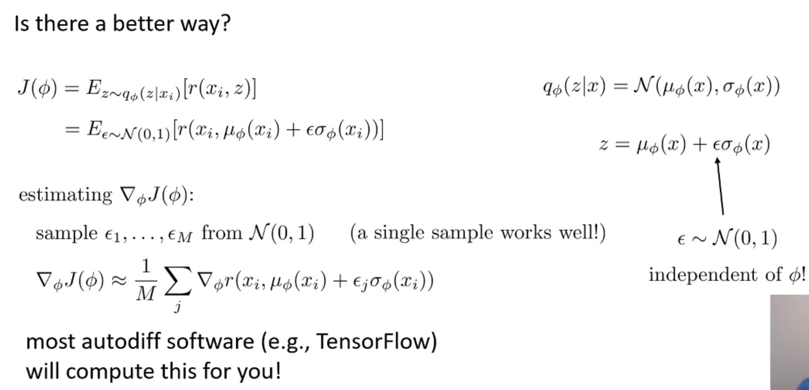

RL에서는 dynamics model을 통한 미분 계산이 불가능하기 때문에 policy gradient를 사용한다.
* Action을 했을 때 dynamics model로부터 얻은 reward가 있을 때, action과 reward 사이에는 gradient 흐를 수 없다.
* 따라서 $\pi_\theta$의 parameter인 $\theta$에 대한 gradient를 구할 수 없다.
* 이를 해결하기 위해 샘플링을 통해 gradient를 추정하는 방식을 사용하고, 이 때문에 분산이 높아진다.
  * 똑같은 상황에서도 뽑힌 샘플에 따라 gradient가 계속 달라지거나, reward가 거의 마지막에 관찰되는 등 불확실성이 많다.

Amortized variational inference에서는 미분 불가능한 dynamics가 없어 reparameterization trick으로 gradient를 계산할 수 있다.
* $r(x_i, z_i)$는 단지 학습 중인 모델 하에서의 로그 확률일 뿐이며, 이는 미분 가능한 또 다른 neural network이기 때문입니다. 따라서 $\phi$에 대한 gradient를 계산할 수 있습니다.

Reparameterization trick으로 $\phi$는 deterministic한 quantity $\mu_\phi, \sigma_\phi$에만 영향을 끼치기 때문에 더 낮은 분산을 가지게 된다.
* 확률적인 요소는 $\epsilon \sim \mathcal{N}(0,1)$로 결정된다.

## 2.4. Another way to look at it

  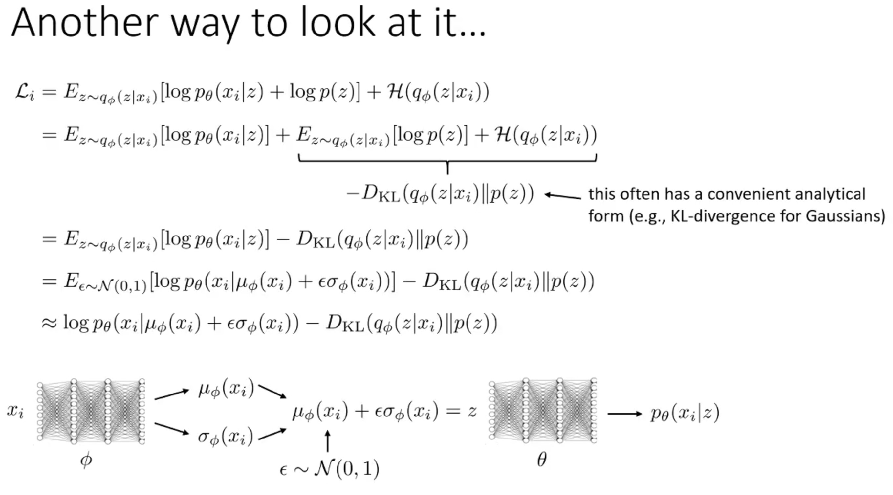

ELBO의 2번째 term과 3번째 term을 다시 합치면 KLD가 된다.
* $q_\phi$를 Gaussian 분포로 가정했는데, 이때 $p(z)$또한 Gaussian 분포로 가정하면 KLD는 analytic form으로 쉽게 구할 수 있다.
  * 두 분포의 평균과 분산에 관한 식이 나오게 된다.
* KLD에 관한 gradient를 구할 때 샘플링이 전혀 필요없다.

ELBO의 첫 번째 term은 reparameterization term으로 구할 수 있다.

## 2.5. Reparameterization trick vs Policy gradient

  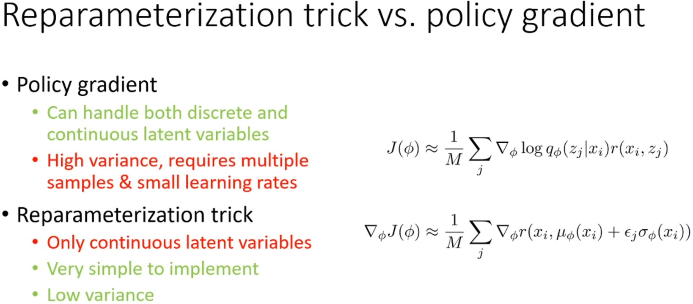

Entropy term을 제외한 뒤, reparameterization trick과 policy gradient를 비교해보다.

Policy gradient
* Discrete 변수와 continuous latent 변수 모두 다룰 수 있다.
* $q$가 어떤 분포이든 상관없다.
* 분산이 높고 각 $x$마다 여러 개의 샘플을 뽑아야 하며, 더 작은 learning rate가 필요하다.

Reparameterization trick
* Continuous latent 변수만 다룰 수 있다.
  * $z$에 대한 $r$의 gradient가 정의되지 않는다.
  * 미분에 필요한 연속성 특징이 discrete 변수에는 없다.
  * 하지만, gumbel-softmax라는 게 있으니 참고하자.
* 분산이 낮고 하나의 샘플만으로도 잘 작동한다.

따라서 amortized variation inference를 구현할 때 continuous 변수일 경우 reparameterization trick을 사용하는 것이 좋습니다. 
만약 discrete 변수라면 policy gradient 스타일의 추정치를 사용해야 한다.
* RL의 policy gradient에서는 $r$을 $z$에 대해 미분하지 않는다.

# 3. Variational Inference in Deep RL

이번 강의에서는 amortized variational inference로 훈련된 generative model을 응용하는 방법에 초점을 맞춰 실제 예시를 살펴본다.
Variational inference이 deep learning에서 갖는 역할에 대해서는 이후 강의에서 더 폭넓게 논의하겠다.

## 3.1. Variational Autoencoder

  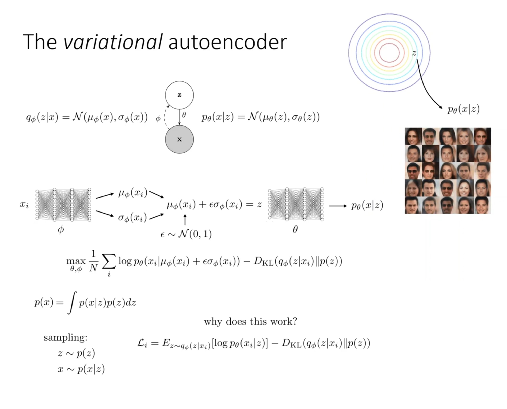

VAE (Variational Autoencoder)에서는 image $x$와 latent vector $z$를 사용해 모델링한다.
* $p(z)$는 표준정규분포라고 가정한다.
* Reconstruction error를 통해 $\phi, \theta$를 학습한다.
* KLD regularizer도 함께 고려한다.

Encoder는 prior 분포 $p(z)$와 가까워지기 위해 KLD term으로 분산을 1로 최대한 유지한다. 
* 즉, latent space을 매우 알뜰하게(frugal) 사용하고 싶어 한다.
* Latent space에 사용되지 않는 빈 공간이 있다면, 인코더는 그 공간까지 확장하여 분산을 키움으로써 분산 값을 1에 더 가깝게 만들려 할 것이다.
* 결과적으로 $z$와 $ㅌ$ 사이의 매핑이 촘촘하게 이루어져서, 표준 가우시안 사전 분포에서 샘플링한 거의 모든 $z$가 유효한 $x$로 매핑된다.
* 이는 image를 인코딩하여 representaiton $z$를 얻을 수 있을 뿐만 아니라, prior 분포에서 샘플링하고 디코딩하여 그럴듯한 image를 얻을 수 있음을 의미한다.

  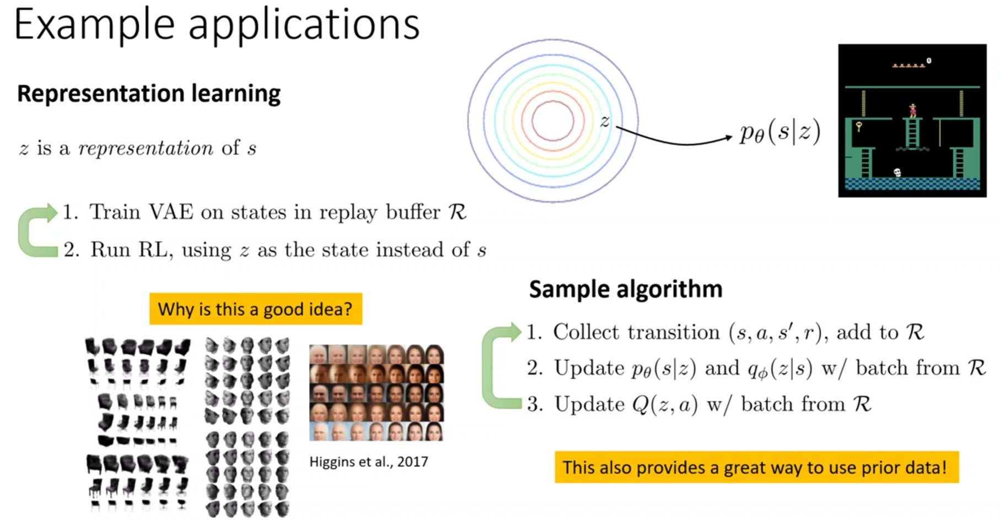

State가 action을 추론하는데 모든 정보를 포함하고 있고, markovian을 만족한다고 하자.

관측되는 state data가 image처럼 배우 복잡한 경우가 있다.
이 상황에서 VAE를 학습하고, image를 더 나은 representation으로 표현해 RL학습을 진행할 수 있다.

VAE는 prior 분포 $p(z)$와의 KLD term으로 latent vector $z$의 각 차원이 서로 독립적으로 강제할 수 있다. 
즉, variation의 factor를 disentangle할 수 있다는 의미이다.
직관적으로 해골의 위치, 캐릭터 위치가 서로 독립적인 factor로 $z$에 표현되기 때문에 VAE가 잘 동작한다는 것이다.
* 예를 들어, Montezuma's Revange에서 캐릭터의 pixel 하나하나를 살피는 대신 캐릭터 pixel 덩어리가 움직이는 위치와 속도를 알고 싶을 것이다.
* 즉, 캐릭터, 해골, 열쇠 등의 위치, 방향, 속도 등이 image를 구성하는 근본적인 factor이고 image pixel 그 자체보다 훨씬 더 간결하고 유용한 표현이다.

좌하단의 그림의 $\beta$-VAE에서 basis factor가 명확한 데이터로 VAE를 훈련했을 때, latent variable $z$를 interpolation하고 decoding하면 자연스러운 회전하는 image를 얻을 수 있다.

Atari 게임에서 Q-learning은 다음과 같이 학습한다.
* Transition 데이터를 수집해 replay buffer에 저장한다.
* 샘플 image 데이터로 VAE를 학습/개선한다.
* Q function의 입력으로 image 그자체가 아닌 latent variable을 넣어 Q function을 업데이트한다.
* Prior data를 활용해 사전 학습을 미리 해서 바로 좋은 representation을 사용할 수 있다.
물론 Q-learning을 진행하면서 실시간으로 동시에 VAE를 학습할 수도 있다.

## 3.2. Conditional Models

  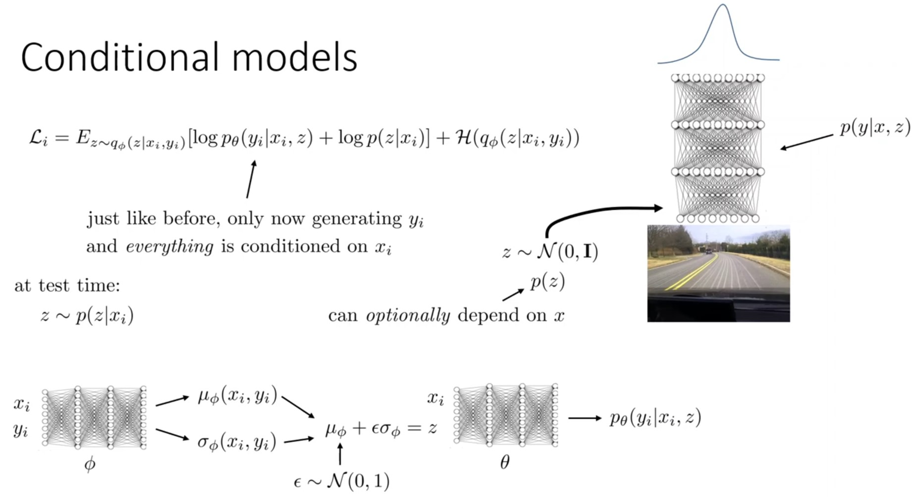

Conditional VAE에 대해서 살펴보자.
이것의 목표는 image의 분포 $p(x)$를 모델링하는 것이 아니라, 조건부 분포 $p(y|x)$를 모델링하는 것이다.

$p(y|x)$ 자체가 매우 복잡하고, multimodal일 수 있다.
이를 위해 encoder와 decoder 모두에서 조건으로 $x_i$를 주면된다.
* 선택적으로 prior 분포 $p(x)$에도 조건으로 넣을 수 있지만, 반드시 그럴 필요는 없으며 일반적으로 unconditional prior $p(x)$를 사용하는 것이 매우 일반적이다.

Policy 학습이 이 형태로, $y$가 action $x$가 observation이다.
* 노이즈 샘플 $z$를 입력으로 받는 policy인 $p(y|x,z)$로 생각할 수 있다.

CVAE는 imitation learning에서 훨씬 더 자주 사용된다.
* RL의 objective는 최적 policy를 배우는 것이고 완전 관측 MDP에서는 최적 policy는 보통 deterministic이다.
  * CVAE는 $\epsilon$에 의해 확률적인 action을 할 수 있다.
* 하지만, imitation learning에서는 multimodal이거나 non markovian인 인간의 행동을 모방해야 할 수도 있다.
  * 나무를 피하는 예시에서 사람은 왼쪽으로 갈 수 있고 오른쪽으로 갈 수 있기 때문에 확률적으로 행동해도 괜찮다.

  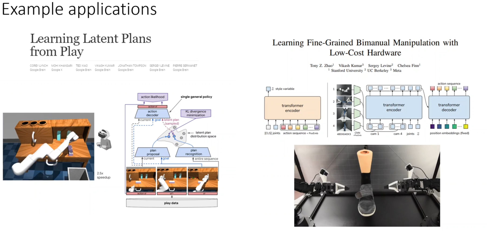

이전에 논의했던 'learning latent plans from play' 논문에서 CVAE는 개별 action이 아니라 action sequence (plans)를 모델링했다.
* 인간은 같은 시작점과 끝점 사이에서도 다양한 action 조합을 실행할 수 있는데, latent variable $z$가 이러한 선택의 차이를 설명한다.

또 다른 논문으로 $bimanual manipulator$가 신발을 신기는 것과 같은 복잡한 task를 배우는 영상이 있다.
* CVAE의 encoder, decoder는 모두 Transformer로 구현되어 있다.
* Encoder는 action sequence를 입력받아 $z$로 encodeing한다.
* Decoder는 로봇의 여러 카메라가 input과 $z$를 받아 미래의 action sequence를 생성한다.

결론적으로, CVAE는 일반적인 Gaussian 분포로는 불가능한 훨씬 복잡한 policy를 표현하기 위해 imitation learning 분야에서 아주 많이 응용되고 있다.

## 3.3. State space models

  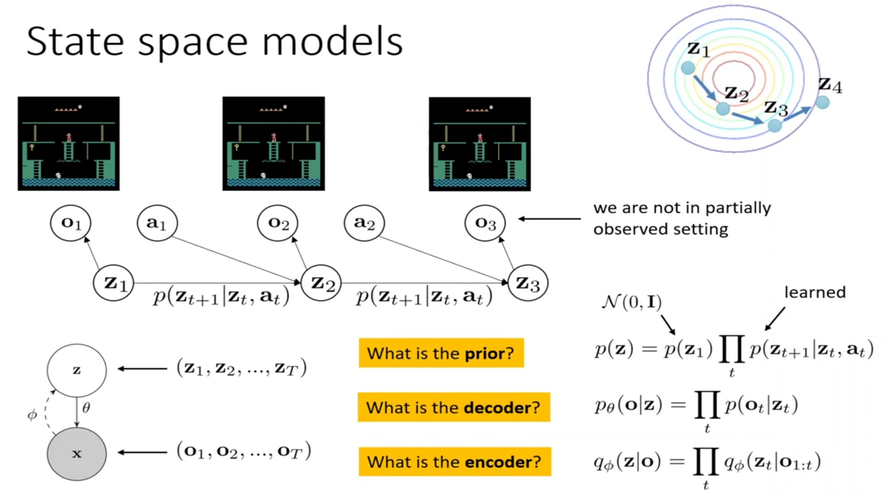

Model-based RL에서 살펴본 partially observation system을 다뤄보자.
* State는 모르지만 observation sequence를 알 수 있는 환경에서, 실제 state의 latent를 VAE의 latent variable $z$로 대신하는 state space models를 학습한다.

State $s$ 대신 observation $o$가 있는 상황에서 $z, o$가 포함된 sequence를 하나의 latent vector $z$와 하나의 observation vector $x$로 모델링할 것이다.
* 이것은 sequence VAE라고 부른다.
* $z$는 무엇이고, $x$는 무엇인가? Prior 분포, decoder, encoder의 형태는 어떠해야 하는가?

Latent vector $z$가 하나의 sequence $z_1, \cdots z_T$이고 observation vector $x$도 관측의 sequence $o_1, \cdots, o_T$이기 때문에 이전에 설명한 RL 모델들보다 훨씬 복잡하다.
또한 action sequence가 조건부로 있는 모델이기 때문에 conditional sequence VAE가 된다.

$z_i$ 간에 dynamics가 존재하므로 prior는 더 구조화되어야 한다.
즉, 일반 VAE처럼 $z$의 각 element가 독립적이기를 원하지 않는다.
* Prior $p(z)$를 표준정규분포인 $p(z_1)$과 $p(z_{t+1}|z_t, a_t)$의 곱으로 정의한다.
  * Sequence VAE에서는 이 dynamics 또한 보통 함께 학습된다.
  * 첫 단계는 Gaussian이지만, 이후 단계들을 이전 $z$에 의존한다.

Decoder는 $z$를 $o$로 복원한다.
* 일반적으로 Markovian state space를 형성하기 때문에 $z_i$에 해당 time step 필요한 모든 정보가 요약되어 있으므로, 각 time step별로 $p(o_t|z_t)$가 독립적이다.

Encoder는 time step $t$까지의 관측으로 latent variable $z_t$를 구한다.
* Partially observation 환경에서는 observation $o_t$만으로 latent variable $z_t$에 대한 충분한 정보를 알 수 없다는 것이 핵심이다.
* 따라서 encoder 부분이 가장 복잡하다.
* 물론 여기에 이전 latent variable $z_{t-1}$을 고려하면 더 나은 encoder $q_\phi(z_t|z_{t-1}, o_{1:t})$를 얻을 수 있다.
* Encoder의 아키텍처는 논문마다 다양한 것을 사용할 수 있지만, 모두 유효한 EBLO를 형성한다는 공통점이 있다.

  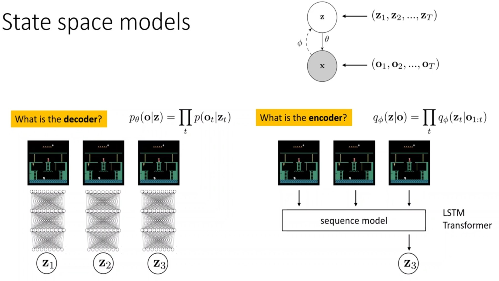

이 예시에서 decoder는 독립적이지만 prior 분포 때문에 $z_i$들은 모두 밀접하게 연관되어 있다.
Encoder는 image를 history를 입력받아 현재 $z_t$에 대한 분포를 형성하며, LSTM이나 transformer와 같은 sequence model로 구현될 수 있다.
이 구조에선 이전 $z_{t-k}$ 값들을 넣는 것도 쉬워진다.

  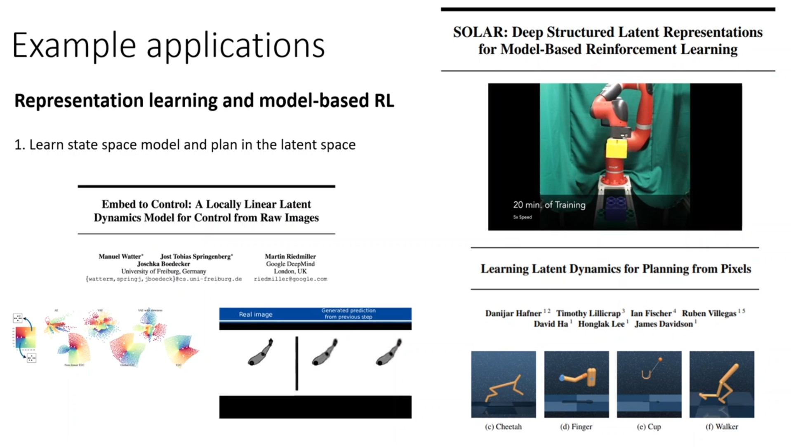

한 가지 application은 state space model을 학습한 뒤, state space 내에서 planning을 하는 것이다.

Embed to Control (E2C) 논문에서는 cartpole, point mass와 같은 간단한 시스템에서 latent space embedding을 학습한다.
실제 state space를 모르지만, 관찰된 pixel data로부터 실제 state를 추론했다.

알고리즘이 발전해 우측 논문과 같이 실제 로봇을 제어하는데 사용되기도 한다.
Sequence VAE는 로봇의 다음 image를 예측하며, policy는 이를 바탕으로 레고 블록을 쌓도록 로봇을 control한다.

이후 이러한 방식들은 수많은 image 기반 task에 적용되었으며, 다양한 encoder 및 planning 알고리즘과 결합하여 우수한 성능을 보였다.
* LQR(Linear Quadratic Regulator)부터 랜덤 샘플링, 그리고 trajectory optimizers 등이 있다.

  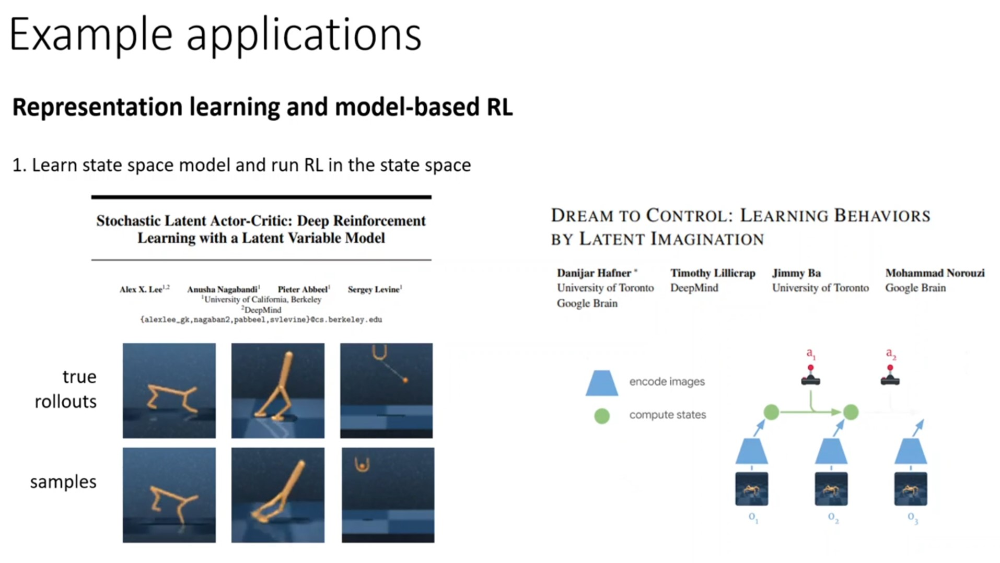

또 다른 application으로 sequence VAE로 state space의 latent representation을 추론한 뒤 RL을 수행하는 것이다.

Stochastic Latent Actor-Critic이라는 논문에서는 image의 latent vector $z$를 활용해 Q function 기반의 actor-critic 알고리즘인 Soft Actor-Critic을 사용해 policy를 업데이트한다.
* 실제 시스템의 roll outs(실행 결과)와 VAE에서 생성된 샘플들을 비교하면, VAE가 실제 시스템과 매우 유사한 비디오를 생성하는 법을 배우고 있음을 알 수 있다.

또 다른 논문은 actor-critic 알고리즘과 short horizon roll outs을 결합하여 매우 유사한 작업을 수행했다. 
* Sequence VAE로 latent state $z$를 구하고 planning과 RL을 결합한 형태이다.