이번 강의에서는 RL의 control 문제를 inference 문제로 재구성하는 방법을 살펴볼 것이다. (Variational inference 아이디어가 활용된다.)
* RL과 optimal control이 human behavior에 대한 합리적인 model을 제공하는가?
* 지금까지 본 전통적인 optimality 개념보다 더 나은 설명이 있을까?
* Optimal control, RL, planning을 확률적 inference로 유도할 수 있을까?
* 만약 그렇다면 어떤 모델에서 inference을 수행하며, 이것이 RL 알고리즘을 어떻게 변화시키는가? 이를 통해 실제로 더 나은 알고리즘을 유도할 수 있는가?

이번 강의의 목표는 다음과 같다.
* Control과 inference의 관계를 이해한다.
* RL 알고리즘이 inference framework에서 어떻게 구현되는지 살펴본다.
* RL을 확률적 inference로 유도하는 것이 왜 좋은 아이디어인지 논의한다.

Lecture 20에서는 위의 내용을 바탕으로 near optimal human behavior을 관찰해 reward를 복원하려는 inverse RL 방법을 살펴볼 것이다.

# 1. Optimal Control as a Model of Human Behavior

  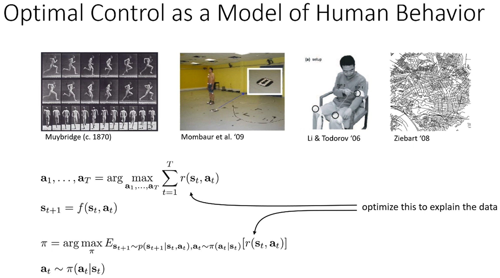

모든 행동이 그렇진 않지만, 일부 인간의 행동은 목표 지향적이고 의도적이다.
인간이 지적인 존재라면 낮은 수준의 motor control (걷기, 장소 탐색, 위치 도달)부터 높은 수준의 congnitive skills (도시 탐색, 최적 경로 계획)까지 어떤 optimality 개념을 반영하는 방식으로 human behavior가 이뤄진다고 생각하는 것은 합리적이다.
즉, human behavior는 목표 지향적이며, 어떤 utility function을 최적화하려는 합리적인 과정으로 설명할 수 있다는 것이다.

RL과 optimal control는 reward를 최대화하기 위해 최적의 의사결정을 내리는 framework이다.
따라서, RL과 optimal control이 human behavior을 설명하는 좋은 모델이 될 수 있을 것이다.

예를 들어, 인간이나 동물이 최적의 방식으로 행동하고 있다고 가정하고, 어떤 reward function에 대해 그들이 최적인지 알아낼 수 있을낼 수 있을 것이다.
이것이 lecture 20 inverse RL 강의에서 논의할 내용이다. 
결정론적 설정에서 할 수도 있고 확률적 설정에서도 할 수 있다.
* RL은 reward function을 알고 policy를 복원하려는 것이다.
* Inverse RL은 관찰한 합리적인 action으로 적절한 reward function을 찾는 것이다.

  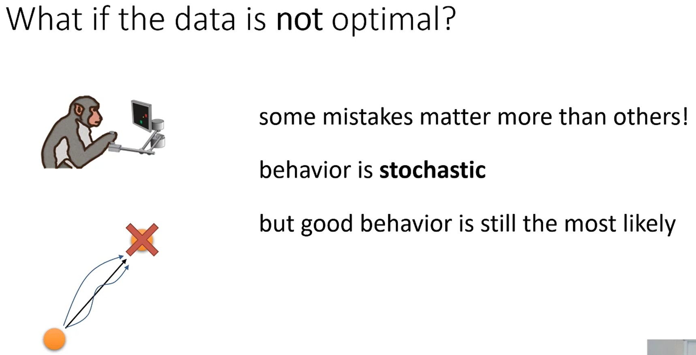

Reward를 최대화하는 합리적인 방식으로 인간이나 동물이 행동한다는 optimality 원리를 통해 복잡한 행동을 간결한 objective function 또는 reward function으로 설명할 수 있다.
그리고 다른 상황에서 그들이 무엇을 할지 예측할 수 있다.
* 예를 들어, 어떤 작업을 수행하는 원숭이의 행동 원리(objective function)를 이해하고 싶을 것이다.
* 이때 reward function을 알고 있는 작업이면 원숭이의 행동이 합리적인지 판단할 수 있다.
* RL이나 optimal control 알고리즘과 원숭이가 비슷한 행동을 하면 원숭이의 행동이 꽤 훌륭하다고 판단할 수 있다.

인간과 동물의 행동은 완벽하게 최적이지 않다.
* 레버 조작을 통해 주황색 원을 빨간 십자가로 옮기면 reward를 받는다고 가정하자.
* 항상 직선으로 주황색 원을 빨간 십자가로 옮기지 않는다.
  * 보통 실수를 하지만, 학습이 진행될수록 작업의 성공에 영향을 덜 끼치는 방식으로 실수가 발생한다.
  * 단순히 집중력이 흐트려졌을 수도 있다.
  * 또는 목표에 도달하는 특정 방식이 중요하지 않다는 것을 알고 있기 때문에 (지루해서) 다른 경로를 택할 수도 있다.
* 쉽게 말해서 보상에 차이가 없다면 굳이 한 가지 행동에 집착하지 않는다.

이는 현재까지 논의한 RL 알고리즘이 설명하지 못하는 부분이다.
* 어떤 것이 덜 중요하므로 덜 완벽하게 수행될 수 있다는 것을 이해하는 개념이 없다.
즉, 결과에 큰 영향을 주지 않는 사소한 부분에서는 무작위로 행동해도 된다는 융통성이 없다.
* 어떤 실수는 다른 실수보다 작업의 성공에 더 많은 영향을 끼치고, 이를 고려하는 것이 인간과 동물의 지능적인 행동을 설명하는 model 개발에 중요하다.
* 또한 이 개념이 더 나은 RL 알고리즘을 구축하고 나중에 inverse RL 알고리즘을 구축할 수 있게 해준다.

같은 상황에 두 번 직면했을 때 원숭이는 확률적으로 행동하기 때문에 정확히 같은 행동을 하지 않을 것이다.
* 이것이 진정 무작위인지 아니면 실험에서 설명되지 않는 수많은 내/외부 요인(배가 고픔, 손가락이 가려움)인지 논쟁할 수 있다.
* 행동을 1차 함수 등으로 근사할 때 이러한 효과를 무작위라고 생각할 수 있지만, 여전히 좋은 행동이 가장 높은 확률값을 가질 것이다.

따라서 합리적 의사 결정자의 행동이 확률적이라면 거의 최적에 가까운 행동에 대한 확률적 모델이 필요하다.
이전에 살펴본 기존 RL 및 optimal control 알고리즘은 확률적 모델링을 수행하지 않는다.
즉, 왜 최적이 아니라 무작위를 선택할 수 있는지 실제로 알려주지 않는다.
* $\epsilon$-greedy는 policy 학습과 상관없이 단순히 무작위로 탐험하는 것이고, 이번 강의에서는 무작위성을 policy 학습 과정에서 고려한다는 것이다.
* 또한 기본 RL 알고리즘은 최적의 deterministic한 policy를 선택하기 때문에 사람/동물의 확률적 행동을 표현하지 못한다.
* 다라서 기존과 다른 새로운 framework 'Control as Inference'가 필요하다.

# 2. Graphical Models

  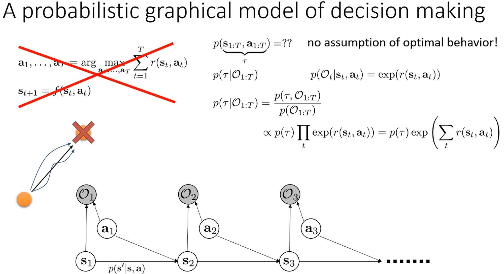

이전까지 살펴본 RL은 reward의 expectation 값을 바탕으로 deterministic하게 policy를 선택하기 때문에 무작위 행동을 합리적으로 설명할 수 없다.
Action의 확률성을 표현하는 도구로 probabilistic graphical model을 사용할 것이다.
* Probabilistic graphical model의 inference로 거의 최적에 가까운 action을 얻을 수 있고, RL 및 optimal control과 꽤 비슷할 것이다.

Graphical model을 그릴 때, MDP에서 보는 일반적인 변수(state, action)을 포함하고, 추가로 optimality variable $\mathcal{O}$가 필요하다.
* 간단한 표기를 위해 fully observation이라고 가정한다.
* 전통 RL의 graphical model에서는 MDP 구성 요소(transition probability, initial state)는 '세상이 어떻게 움직이는가'라는 물리 법칙만 설명할 뿐 agent가 왜 특정 action을 선호해야 하는지(의도)를 확률적으로 설명할 수 없다.
즉, 확률 모델 내에 최적 행동(optimal behavior)에 대한 가정이 없다.
* 그렇기 때문에 덜 최적적인 행동보다 더 최적적인 행동을 선택하는 이유(의도)를 모델에 주입하기 위한 optimality variable $\mathcal{O}$가 필요하다.
  * Optimality vriable은 관찰 가능한 binary variable이다.
  * 원숭이가 어떤 작업을 틍해 reward를 얻었다면, 해당 trajectory에서 $\mathcal{O}_t$는 모두 1이 된다.  
  * 이를 통해 graphical model 외부에서 다루던 optimization 문제를 성공($\mathcal{O}=1:T$)이라는 결과가 주어졌을 때의 원인(action)을 찾는 graphical model 내부의 확률 추론 문제로 다룰 수 있게 된다.
* 풀어야할 추론 문제는 time step $1 ~ T$까지의 모든 optimality vraible이 1일 때 trajectory의 확률 $p(\tau | \mathcal{O}_{1:T})$을 구하는 것이다.
또는 초기 상태에 대한 조건부 추론 $p(\tau | \mathcal{O}_{1:T}, s_1)$을 할 수 있다.
  * $P(\mathcal{O}_t=1 | s_t, a_t) = \exp(r(s_t, a_t))$로 정의함으로써 reward를 확률의 언어로 번역한다.
  * 위의 정의를 통해 편리하고 우아한 수학적 framework를 얻게 된다.
  * 확률은 1보다 작아야하므로 reward는 항상 음수여야 하고, 단순히 각 reward에서 최대 reward를 뺀 것으로 생각할 수 있다.
  * 최대 reward가 $\infty$인 경우 불가능하지만, 이를 다루는 전통적인 RL도 없기 때문에 그렇게 큰 제약사항이 아니다.
* Bayesian 방식으로 추론 문제를 풀면 위 사진의 중간에 위치한 수식을 얻을 수 있다.
  * Trajectory 확률에 집중하기 위해 분모를 무시하고, 분자의 결합분포를 모두 곱한 값에 비례한다고 나타낸다.
  * 기본적으로 $p(\tau)$와 모든 time step에 걸친 모든 지수화된 reward의 곱을 취한 형태가 된다.
  * Dynamics model이 deterministic하면 $p(\tau)$는 0 또는 1인 indicator가 된다.
    * 물리적으로 가능한 trajectory면 1 아니면 0이 된다.
  * 추론 문제에서 reward가 높은 trajectory의 확률값이 가장 높을 것이다.
  Reward가 감소함에 따라 조건부 trajectory의 확률값은 기하급수적으로 감소한다.
    * 원숭이에게 모두 동일한 reward을 갖는 여러 선택이 주어지면 무작위로 선택하지만, 훨씬 낮은 reward을 갖는 선택이 있다면 그것을 선택할 가능성이 기하급수적으로 낮다는 것을 의미한다.
    * 따라서 목표에 도달할 때 직선 trajectory에 벗어날 수 있는 이유는 다른 방식으로 목표에 도달했을 때 얻는 reward가 조금 낮지만 거의 같기 때문이다.
* 이를 통해 본질적으로 가장 최적의 trajectory의 가능성이 가장 높지만 차선책 trajectory도 발생할 수 있는 확률적 모델을 구성할 수 있다.
단지 reward가 감소함에 따라 확률이 기하급수적으로 감소할 뿐이다.

  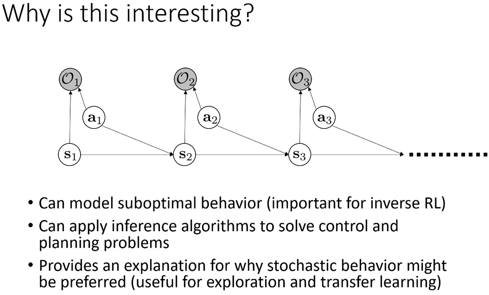

확률적 optimality 개념을 활용하는 것은 agent의 suboptimal behavior을 이해하는 데 매우 중요하며 imitation learning에도 중요하다.
  * 인간이 보여주는 reward function이 무엇인지 알아내려면 그들이 완벽하게 수행하지 않는 것을 고려해야 한다.
  * 이 사실이 inverse RL에서 중요한 역할을 한다.

이 framework를 기반으로 control 및 planning 문제를 해결하기 위해 추론 알고리즘을 적용할 수도 있다.
또한, deterministic behavior가 가능하더라도 확률적 behavior가 선호될 수 있는 이유를 설명하고, 이는 exploration 및 transfer learning에서 꽤 유용하다.
* 작업을 여러 가지 다른 방식으로 수행하면, 작업을 조금 다르게 수행해야 하는 새로운 설정으로 transfer할 가능성이 더 높기 때문에 유용하다.

# 3. Inference: Planning

이번 lecture에서는 추론 문제를 수행하는 것에 대해 살펴 볼 것이다.
그리고 graphical model에 정확한 추론과 근사 추론을 모두 적용하면 RL과 매우 유사한 알고리즘으로 이어딘다는 것을 알게 될 것이다.

  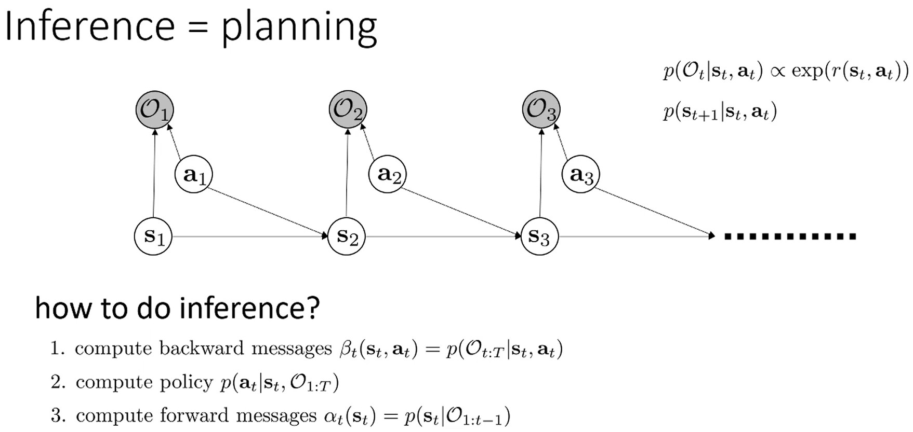

HMM(hidden markov model)이나 kalman filters 또는 variable elimination에서와 같이 chain 구조의 dynamical base network로 2가지 종류의 message를 계산해야 한다.
* Variable elimination 중 하나인 message passing 추론에 매우 적합해야 함을 의미한다.

Graphical model에서 추론을 하기 위해서 3가지 연산이 필요하다.
* Compute backward message
  * 현재 state와 action이 주어졌을 때, 지금부터 trajectory의 끝까지가 optimal일 확률을 의미한다.
  * Backward message를 $\beta$라고 부르며, 이를 통해 policy를 복원할 수 있다.
* Compute policy
  * Time step $t$의 state $s_t$가 주어지고 $1 ~ T$까지의 전체 trajectory가 optimal일 때, time step $t$에서의 action 확률을 의미한다.
  * Graphical model에서의 확률적 최적 policy이다.
  * Backward message를 계산할 수 있다면 policy를 계산할 수 있다는 것이 밝혀졌다.
  * Forward message에 활용된다.
* Compute forward messages
  * Time step $t-1$까지 optimal이었을 때, time step $t$에 특정 state $s_t$에 도달할 확률을 의미한다.
  * Backward message와 합치면 실제 state occupancies을 구할 수 있다.
    * Optimal policy를 복원하는 데 필요하지 않지만, inverse RL에 필요하다.

## 3.1. Backward Message

$s_t$와 $a_t$가 주어졌을 때 $t$부터 $T$까지의 optimality확률인 backward message를 계산해보자.
이를 통해 최적에 가까운 policy를 복구할 수 있기 때문에 중요하다.

  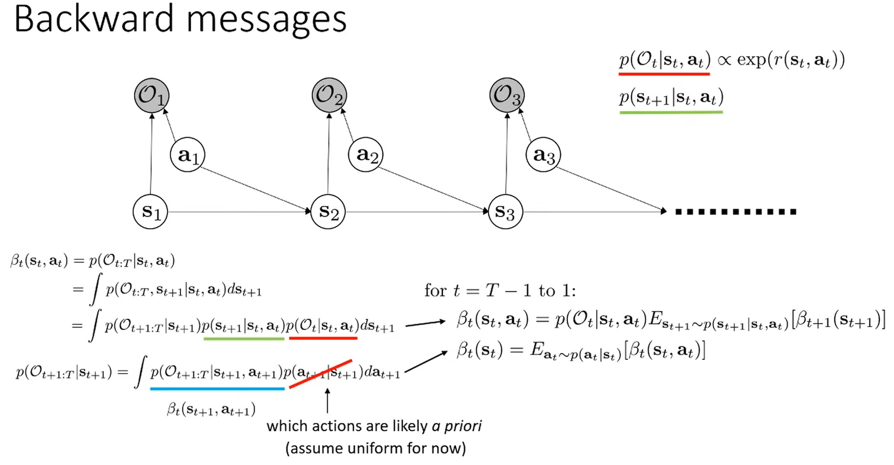

재귀와 확률 이론, 선형 대수를 사용해서 backward message를 유도할 수 있다.
* Marginal distribution과 Bayesian theory를 활용하면 3가지 부분으로 factorization할 수 있다.
  * 두 번째는 transition model이고 세 번째 부분은 미리 정의한 exponentiated reward으로 이미 알고 있다고 가정한다.
  * 첫 번째 부분은 $s_{t+1}$가 주어졌을 때 $t+1 ~T$까지의 모든 optimality variables의 확률이다.
    * 미래의 optimality variables $\mathcal{O}_{t+1:T}$는 $s_{t+1}$이 주어졌을 때 과거의 모든 것 $\mathcal{O}_{1:t}$와 독립이다.
    * Graphical model을 살펴보면 이를 확인할 수 있다.
* 첫 번째 부분도 비슷하게 2 부분으로 factorization한다.
  * 마지막 부분은 policy가 아니라 optimality를 모를 때 어떤 action발생하기 쉬운지를 말하는 action prior이다.
   * Policy는 $p(a_t|s_t, \mathcal{O}_{1:T})$인 posterior이다.
  * 일반적으로 optimal 여부를 모른다면 어떤 action이 더 가능성이 높은지 알 수 없다. 
  * 따라서 $p(a|s)$를 균등 분포(uniform)라고 일단 가정한다.
  즉, 상수로 무시할 수 있다.
    * 원숭이가 무엇을 하려는지 모른다면 어떤 action을 할 가능성이 높은지 말하기 어렵다.
    * Action prior를 도입할 때, uniform prior를 유지하고 reward function을 수정하면 정확히 같은 결과를 얻을 수 있다는 것이 수학적으로 증명되었다.
    * 따라서 균등 분포로 가정하는 것은 합리적이다.

Trajectory 끝 $T-1$에서 재귀적으로 state-action backward message와 state backward messge를 교대로 계산하면 모든 backward message를 계산할 수 있다.
* $\beta(s_T)$는 정의에 따라 마지막에 얻은 reward의 exponential이다.

  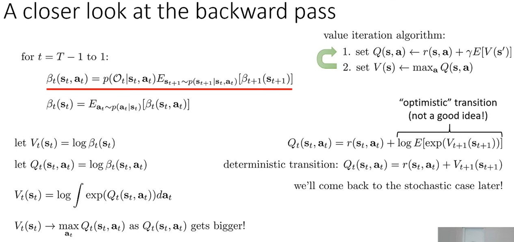

Backward message를 더 자세히 살펴보자.
* 알고리즘을 이해하기 위해 $V_t$와 $Q_t$를 새롭게 정의해 log space에서 살펴 보자.

$$
V_t(s_t) = \log \int \exp(Q_t(s_t,a_t))da_t
$$

* 위의 수식으로 $V_t$는 $Q_t$의 soft버전 max라고 해석할 수 있다.
* $Q_t$ 값이 커질수록 $V_t$는 값이 큰 $Q_t$에 비슷한 값을 가지게 될 것이다.
* 이는 RL에서 살펴 본 것과 유사하게 최적 value function이 최적 Q 함수의 max라는 것과 같은 직관을 제공한다.
* 추론 관점에서는 soft max가 optimality 개념을 부드럽게 하여, 약간 최적에서 벗어난 action도 가능하게 하려는 의도로 해석할 수 있다.

$$
Q_t(s_t, a_t) = r(s_t, a_t) + \log \mathbb{E}\left[\exp(V_{t+1}(s_{t+1}))\right]
$$

* Bellman backup과 매우 유사하지만 기댓값 앞에 logarithm이 있다는 점이 다르다.
* Next state $s_{t+1}$이 현재 state $s_t$와 action $a_t$의 deterministic transition이라면 bellman backup가 같아진다.
  * Deterministic한 설정에서는 기댓값 합계에 0이 아닌 원소가 하나뿐이므로 log와 exp가 서로 상쇄된다.
* Stochastic transition인 경우 log-sum-exp 형태로 soft 버전의 max으로 optimistic transtition을 얻게 된다.

Deterministic case는 classic value iteration과 완벽하게 일치한다.
단지 hard max 대신 soft max를 사용할 뿐이다.

Log-sum-exp 형태에서는 운 좋게 좋은 reward를 때에도 그 곳이 좋다고 판단하게 된다.
이는 좋은 아이디어가 아니다.
* 절벽 끝에서 99% 확률로 떨어지고, 1%의 확률로 지름길로 간다고 하자.
* 운 좋게 1%의 지름길을 갔을 때, 절벽으로 가는 게 좋은 action이라고 잘못 판단할 수 있다.
* 운이 아닌 올바른 action을 통해 최적인 경우를 구분해야 한다.
* 추후에 variational inference(section 3.5)를 활용해 이를 해결하는 방법을 다룬다.

  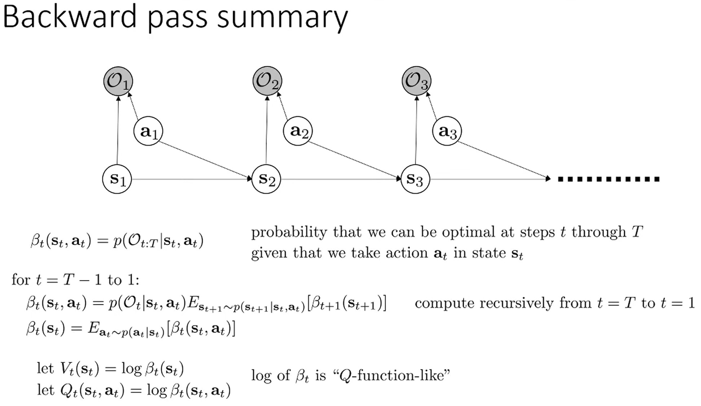

Backward message를 요약하면 위와 같다.

  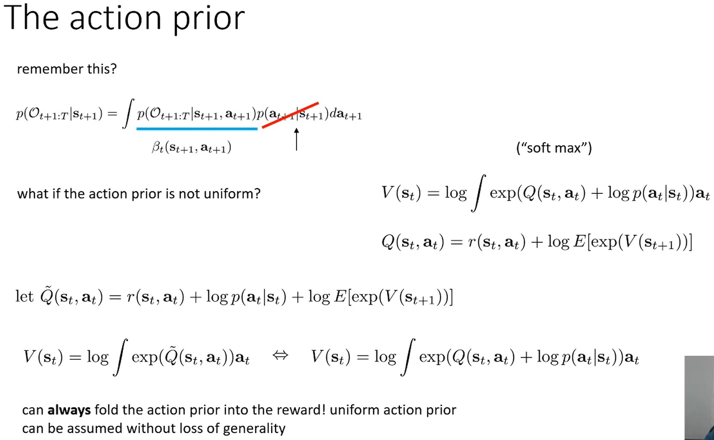

Action prior가 균등 분포가 아닐 때를 조금 더 살펴 보자.
* $V(s_t)$에 대한 식에서 적분 안에 $\log p(a_t|s_t)$가 추가된다.
* $\tilde{Q}$를 위와 같이 정의하면, value function는 지수화된 $\tilde{Q}$의 적분에 대한 로그가 된다.

이를 통해 Reward에 $\log p(a_t|s_t)$를 더한 다음, 균등 분포 action prior처럼 수행하면 비균등 prior를 적절히 고려했을 때와 정확히 같은 답을 얻을 수 있다.
이것이 action prior에 대해 걱정하지 않는 이유이다.
* Action prior를 reward function에 다음 균등 prior로 취급할 수 있기 때문에, 균등 분포 action prior를 가정하는 것은 generality를 잃지 않는다.

## 3.2. Policy computation

이제 backward message로 policy를 복구하는 방법을 살펴보자.
Policy는 $s_t$가 주어지고 전체 trajectory $\tau$가 최적이라는 조건 하에서의 action $a_t$의 확률을 나타낸다.
기본적으로 최적에 가까운 policy이다.

  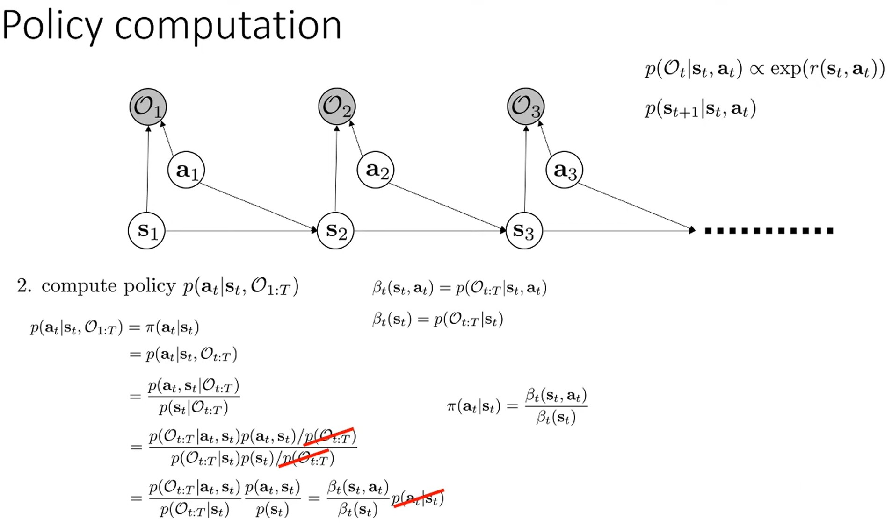

Policy는 $s_t$가 주어지고 전체 trajectory $\tau$가 최적이라는 조건 하에서의 action $a_t$의 확률을 나타낸다.
기본적으로 최적에 가까운 policy이다.

과거의 optimality variables는 state가 주어지면 조건부 독립임이다.
즉, policy를 $s_t$와 $O_{t:T}$가 주어졌을 때 $a_t$의 확률로 쓸 수 있습니다.
* $s_t$에 의해 $O_{1:t-1}$와 $a_t$는 d-separated된다.

위 식에 존재하는 모든 variable이 backward message에 존재하기 때문에 backward message만으로 policy를 복구할 수 있다.
* Bayesian rule을 이용해 수식을 유도할 수 있다.
* $p(a_t|s_t)$는 uniform prior이기 때문에 무시한다.

  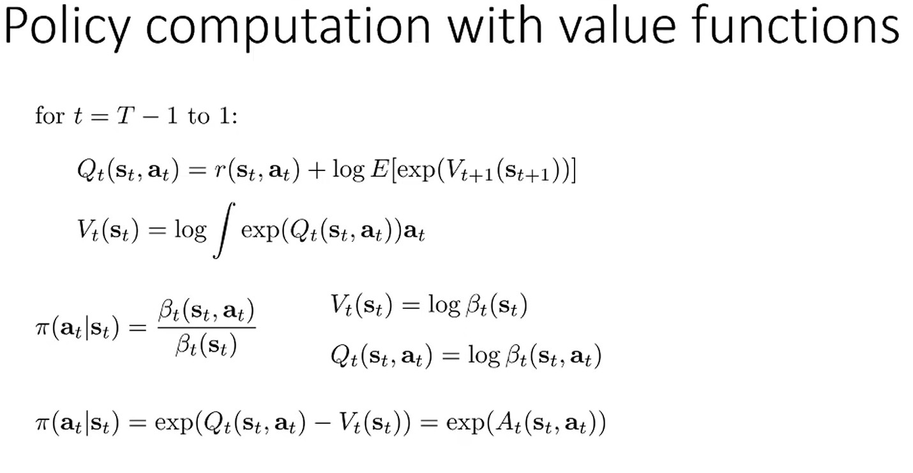

Policy computation을 log space로 가져와서 살펴보자.
State-action backward message의 log는 $$Q$와 같고, state backward message의 log는 $V$와 같다.
이를 policy에 대입하면, $\pi(a_t|s_t)$는 $\exp(Q) / \exp(V)$와 같으며, 이는 $\exp(Q - V)$이다. 
$Q - V$는 advantage와 유사한 함수이다.

  

Policy computation의 요약은 위와 같다.
* Advantage의 exponential 함수이다.
* Temperature 등의 parameter를 추가할 수 있다.
  * $Q, V$ 앞에 $1/\alpha$를 넣으면 hard optimality와 soft optimality 사이를 부드럽게 interpolate할 수 있다.
  * $\alpha$가 0으로 가면 policy는 최적 action에 대해 deterministic이 되고, $\alpha$가 1이면 classic한 추론 프레임워크를 복구한다.
  * Temperature가 낮을수록 greedy policy에 접근하게 된다.
* 더 좋은 행동일수록 더 확률이 높고, 두 행동의 advantage가 정확히 같다면 무작위로 선택하게 된다.
* Boltzmann exploration과 유사하다.

## 3.3. Forward Message

  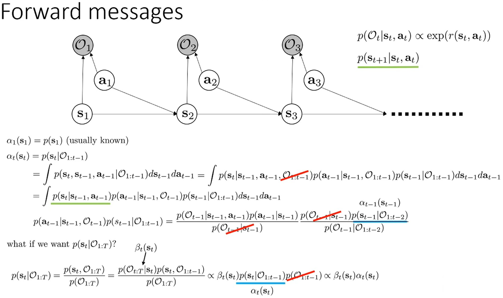

Forward message는 $\mathcal{O}_{1:t-1}$까지 최적이었다는 조건 하에 현재 state $s_t$의 확률을 의미한다.
Backward message와 유사하게 재귀와 약간의 확률/선형대수로 계산을 진행한다.
* $p(s_t|s_{t-1}, a_{t-1})$은 transition probability로 알고 있는 값이다.
* $p(\mathcal{O}_{t-1}|s_{t-1}, a_{t-1})$은 reward의 exponential로 알고 있는 값이다.
* $p(a_{t-1}|s_{t-1})$은 uniform prior로 무시할 수 있다.
* $p(\mathcal{O}_{t-1}|\mathcal{O}_{1:t-2})$는 확률을 1로 만드는 nomarlization term이다.

마지막으로 backward와 forward message 계산을 통해 state marginal 확률을 구할 수 있다.
* State marginal 확률은 backward message와 forward message 곱에 비례한다.
* 3번째 항 $p(\mathcal{O}_{1:t-1})$는 $s_t$에 의존하지 않는 normalization term으로 볼 수 있다.
* Soft optimal policy에 대한 state marginal 확률을 복구하는 방법이며, 이는 나중에 Inverse RL에 대해 이야기할 때 매우 중요하다.

## 3.4. Forward/Backward Message Intersection

  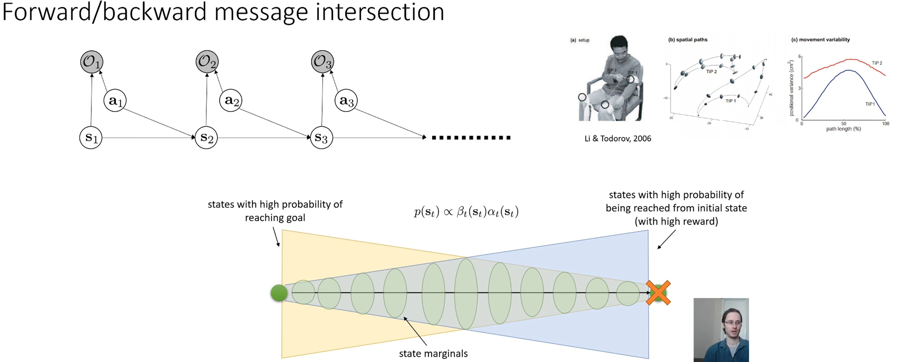

State marginal 확률 계산을 직관적으로 생각해보자.
* Backward message는 목표 지점에서 시작 지점으로 퍼져 나가는 원뿔과 같다.
  * 원뿔은 목표에 도달할 수 있는 state을 나타낸다.
  * 시작 지점에 가까울수록 목표에 도달할 수 있는 state가 더 많다.
* Forward message는 시작 지점에서 목표 지점으로 퍼져 나가는 원뿔과 같다.
  * 원뿔은 높은 reward를 유지해왔을 때 도달할 수 있는 state 확률을 나타낸다.
  * 목표 지점에 가까울수록 높은 reward를 유지하면서 도달할 확률이 높다.
* State marginal 확률은 이 두 원뿔의 교집합이다.
  * 최적에 가까운 행동은 기본적으로 이 두 가지의 교집합에 위치한다.
  * 인간의 운동 제어와 관련된 실험에서 과학자들이 실제 인간의 도달 행동이 이런 종류의 분포를 보인다는 것을 관찰했다.
  * 사람에게 도구를 잡고 특정 위치를 터치하게 하고 도구 끝이 공간에서 이동하는 위치 분포를 그리면, 시작점과 끝점에서는 매우 정밀하지만 중간 부분에서 가장 넓은 state marginal 확률을 가지는 cigar 모양의 분포를 보인다.

Optimal control을 위한 probabilistic graphical model을 유도하는 방법을 살펴보았다.
Inference 과정이 value iteration이나 dynamic programming과 유사하지만, hard max 대신 soft max를 사용한다는 차이점이 있다.

## 3.5. Control as Variational Inference

이전까진 graphical model로 exact inference를 수행하는 3가지 연산을 살펴 보았다.
이번 section에서는 복잡한 고차원, continuous state space 또는 dynamics model/transisiton 확률을 알 수 없어 rollouts을 통해서만 샘플링할 수 있는 환경에서 필요한 approximate inference를 살펴보자.
* Variational inference를 통해 model-free RL이 inference 프레임워크로 도출되는 방법을 알아볼 것이다.

  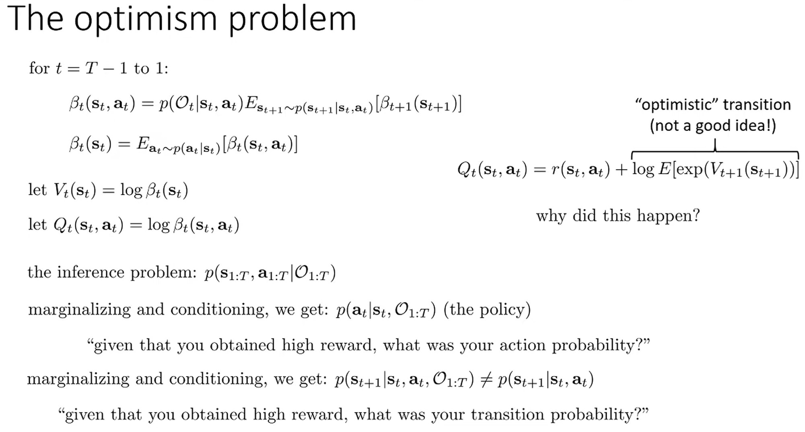

Soft max는 soft optimality의 개념을 구현한 거지만, log-sum-exp 형태가 가장 운이 좋은 state에 의해 지배된다는 문제점이 있다.
* 이런 종류의 backup은 일종의 optimism bias를 초래한다.
* 예를 들어, 1/1000 확률로 백만 달러에 당첨되는 복권이 있다고 하자.
* Exp를 취한 기댓값의 log에서는 0의 효과는 사라지게 되고 최종 value가 positive 결고(당첨)에 지배된다.
  * 복권의 원래 기댓값은 그다지 높지 않기 때문에 복권을 사는 행동이 좋지 않다.

Inference 문제는 optimality가 주어졌을 때 가능성이 가장 높은 grajectory를 추론하는 것이다.
직관적으로 높은 reward를 얻었을 때 취한 action 확률을 구하는 것이다.
* 복권의 예시에서 백만 달러를 얻었다는 사실을 알고 있다면, 복권을 샀을 확률을 높여주는 것이다.
* 하지만 이것이 복권을 사는 것이 좋은 아이디어라는 뜻은 아니다.

즉, 근본적으로 inference 문제가 원하는 답을 주는 질문이 아니라는 것이다.
'백만 달러를 얻었을 때 무엇을 했는 지'가 아니라, '최적이 되려고 노력한다면 무엇을 했을 것인가'를 질문해야 한다.
* 이 문제는 optimality evidence $\mathcal{O}_{1:T}$이 주어졌을 때의 posterior가 달라진다는 점에서 발생한다.
  * 실제 복권에 당첨될 확률은 0.001이지만 미당첨 확률 0.999를 무시하고 당첨된 상황만 고려하도록 dynamics를 재해석해버린다.
  * Inference 과정에서 evidence에 맞게 dynamics를 왜곡하고 있는 셈이다.

  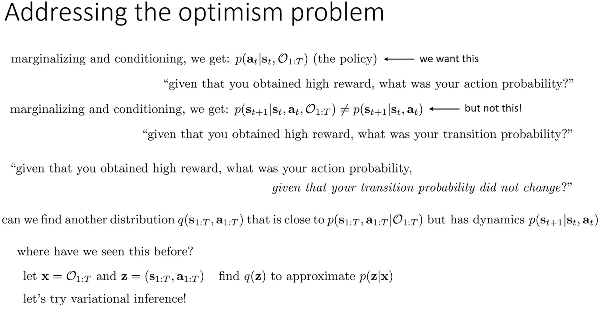

현실에서 dynamics는 변하지 않기 때문에 inference 과정에서는 dynamics 변경을 허용하지 않고 대략적인 최적의 행동을 알아내고 싶은 것이다.
즉, transition 확률이 변하지 않는 조건 아래에서 높은 reward를 얻었을 대의 action 확률이 무엇인지 알아내야 한다.

이를 해결하기 위해 원래 dynamics $p(s_{t+1}|s_t,a_t)$를 유지하면서 posterior에 가까운 또 다른 분포 $q$를 찾는다.
* Reward를 아는 것에 영향을 받지 않는 현실의 dynamics를 가지면서도, action 확률은 변화된 posterior에 근사하는 분포 $q$를 원한다.
* 이러한 형태는 variational inference가 해결하는 문제이다.
* 만약 관측 변수 $x$를 $O_{1:T}$, 잠재 변수 $z$를 $s_{1:T}, a_{1:T}$라고 한다면, 이 문제는 사후 분포 $p(z|x)$를 정확하게 근사하는 근사 분포 $q(z)$를 찾는 것과 동일하다. 

  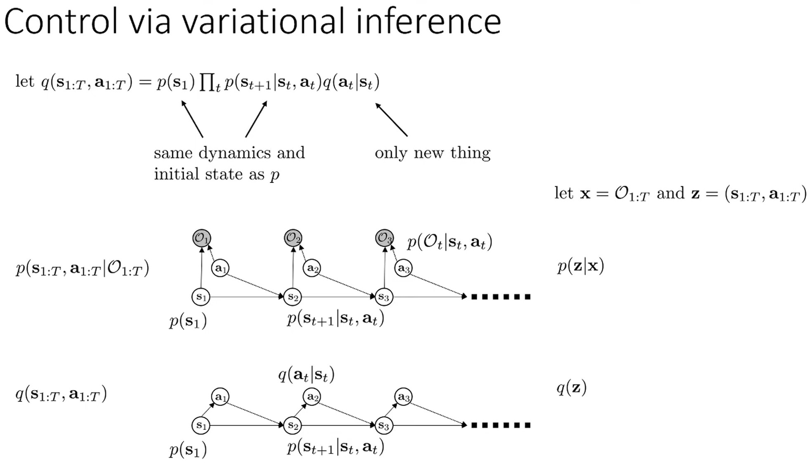

Variational inference로 optimal control을 수행하기 위해 $q$ 분포 class를 위의 같이 정의한다.
* 일반적으로 variational inference는 분포 전체를 학습하지만, 여기서는 dynamics model과 initial state 분포는 동일하게 고정하고 $q(a_t|s_t)$만 학습한다.
  * Optimism bias를 방지하기 위해 고정을 하는 것이다.

Graphical model로 표현하면 위와 같다.
* 실제로는 observed variables $\mathcal{O}_t$와 latent variable $s_t, a_t$를 가진다.
* Approximate model $q$은 observed variables가 제거되고 $s_t, a_t$만 가진다.
  * $\mathcal{O}_t$ 대신 학습할 $q(a_t|s_t)$를 가진다.
* 이 유도는 $s_1$이 관측되지 않은 경우를 가정하여 제시된 것이지만, 실제로 $s_1$을 알고 있는 경우가 많으며 이땐 $p(s_1)$이 사라진다.
  * $s_1$ node가 모든 곳에서 색칙(shaded)될 것이고, variational inference의 일부로도 표현되지 않는다.
* 간단한 표기법을 위해 $s_1$을 latent variable로 취급한다.
  * 하지만 현재 state를 알고 미래 state와 action을 파악하고 싶은 상황이라면 $s_1$이 관측될 것이다.
  * 이에 맞게 확장하는 것은 꽤 쉬우며 스스로 연습해 보자.
  ($s_1$을 조건으로 추가하고 수식에서 $s_1$일 때 따로 처리하는 과정이 필요해진다.)

  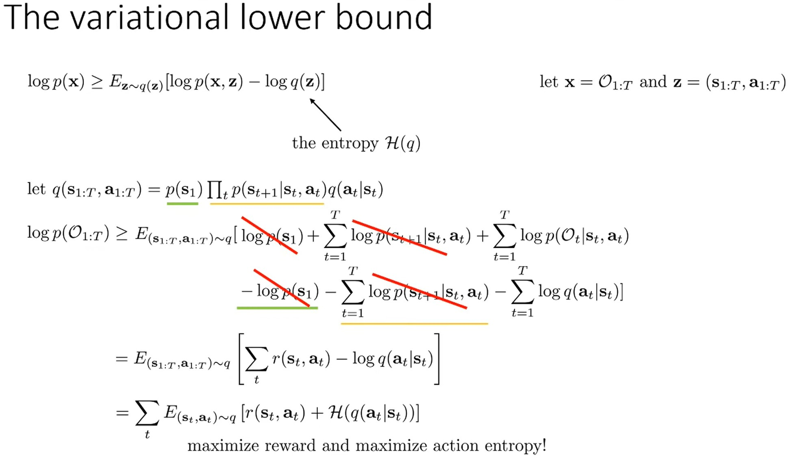

Lecture 18에서 살펴 봤듯이, KLD term으로 인해 $q(z)$가 $p(z|x)$에 가까울수록 lower bound는 더 tight해진다.
Observed variables $x = \mathcal{O}_t$와 latent variable $z = (s_t, a_t)$로 ELBO를 유도하고 이를 최적화하는 것은 RL 알고리즘과 밀접하게 관련 있다.
* 수식을 풀어쓰면, 위와 같이 상쇄되는 term이 있어 간단하게 표현할 수 있다.
* 이것이 $q$를 $p(s_1)\prod_{t}p(s_{t+1}|s_t,a_t)q(a_t|s_t)$로 정의한 이유이다.
* $p(\mathcal{O}_t|s_t,a_t)$의 정의에 따라 풀어쓰면 최종적으로 reward를 최대화하고 action entropy를 최대화하는 것과 같게 된다.
* $q$ 분포는 실제 dynamics와 동일한 initial state 분포와 transition 분포를 가지기 때문에 expectation을 취한 최종 수식은 RL objective function에 entropy term이 더해진 형태와 동일하다.
  * 추가된 entropy term은 단 하나의 최적 해가 아니라 약간의 비최적성도 모델링하는 확률적 행동을 원하는지를 정당화해준다.

  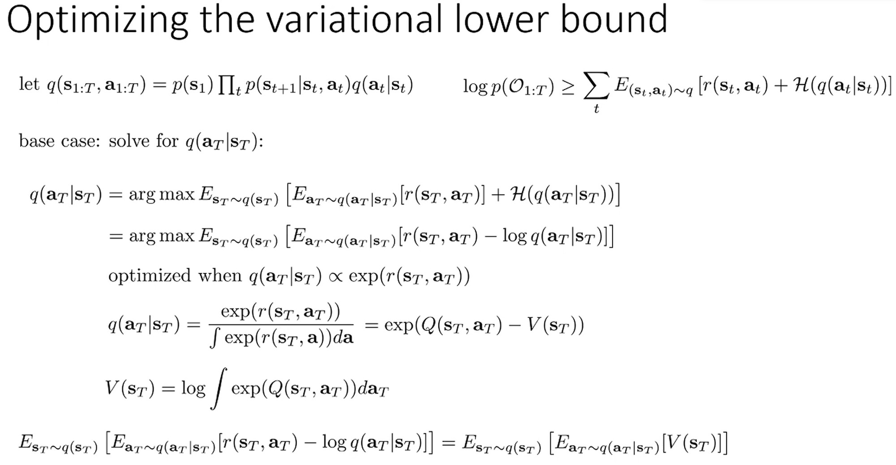

ELBO를 최적화하기 위해 dynamic programming 접근 방식을 사용한다.
Value iteration 방법과 유사하게, 마지막 time step부터 해결해 나간다.
* 미분을 통해 최대값을 구할 수 있지만, 일반적으로 objective가 log 확률을 뺀 형태라면 해는 항상 그것의 양의 exponential 형태가 된다.
* 즉, 마지막 time step $T$의 최적 $q$는 exponential reward에 비례하며, nomarlize 상수는 value function이 되는 것을 볼 수 있다.
* $\log q = \exp(Q - V)$이므로 이것을 대입하면 $r - \log q = V$인 것을 볼 수 있다.
  * 마지막 time step에서 $Q(s_T, a_T) = r(s_T, a_T)$이다.

  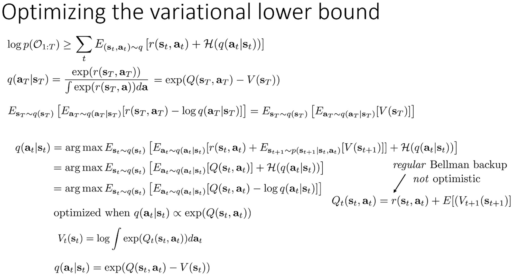

재귀적으로 임의의 time step $t$에 대해 $q(a_t|s_t)$를 계산할 수 있다.
* Initial state와 dynamics model이 변경되지 않는 일반적인 bellman backup을 사용하기 때문에 더 이상 optimism bias가 발생하지 않는다.
  * $V(s_t)$는 action의 entropy를 고려한 값이다.
* 동시에 action의 entropy를 고려하고 있기 때문에 확률적인 action을 설명할 수 있다.

  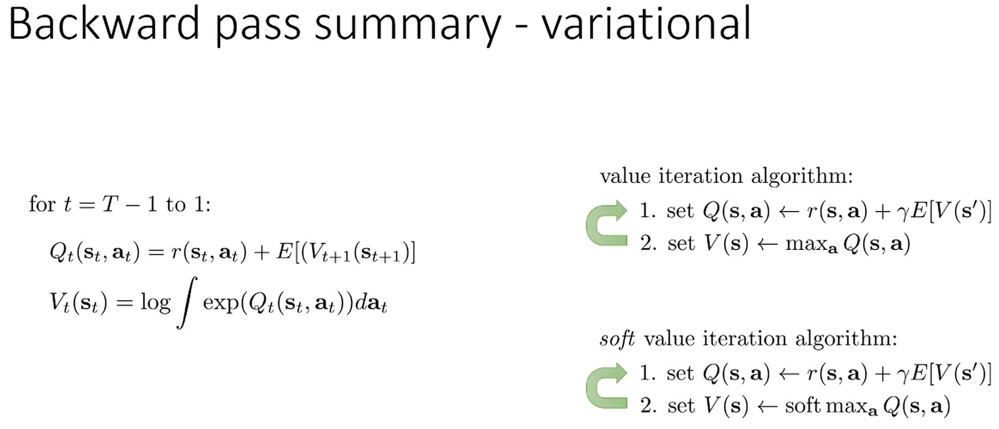

Variational inference의 backward pass를 요약하면 위와 같다.
일반적인 value iteration과 다른 점은 아래와 같다.
* $V(s_t)$에서 soft max를 고려한다.
* 최종 policy $q(a_t|s_t)$는 $\exp(Q - V)$로 결정된다.

  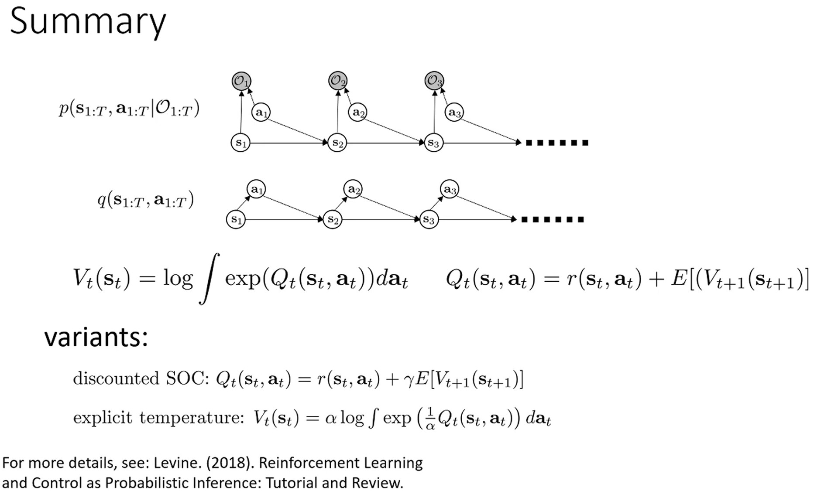

Control as variational inference를 요약하면 위와 같다.

다양한 변경이 가능하다.
* Discount factor $\gamma$를 추가할 수 있다.
* 명시적인 temperature parameter $\alpha$를 추가할 수도 있다.
  * $\alpha$가 0에 가까울수록 hard max에 가까워진다.
* Infinite horizion을 실행하는 공식을 구성할 수도 있다. ($\gamma$가 필수적이다.)

# 4. Algorithms for RL as Inference

Soft optimality를 적용한 RL 방법론을 살펴보자.

## 4.1. Q-learning 

  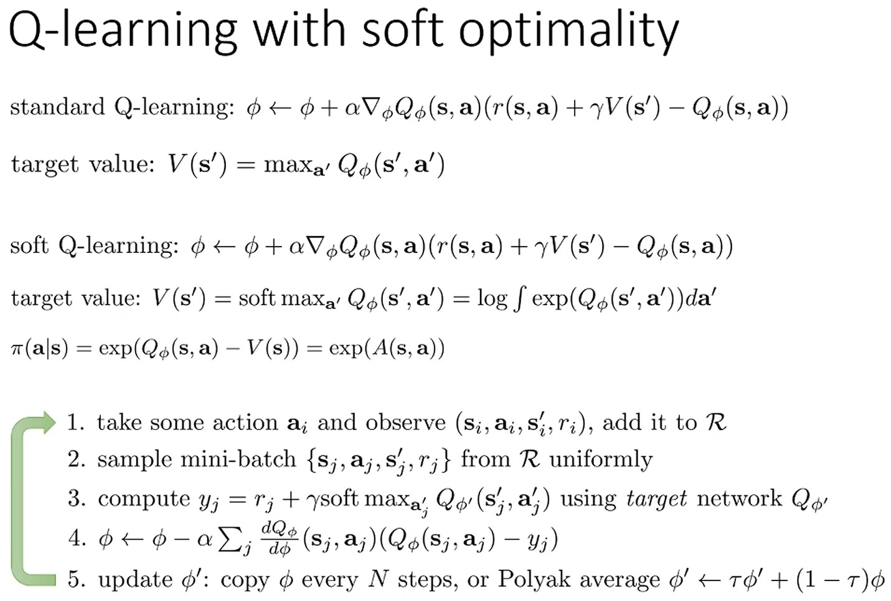

Soft optimality를 적용한 Q-learning 알고리즘이 있다.
* Q 함수 업데이트는 동일하다.
* 차이점은 target value를 계산할 때 다음 action에 대해 hard max를 취하는 대신 soft max를 취한다는 것이다.
* 그리고 policy는 greedy policy가 아니라 exponentiated advantage로 주어진다.
  * 이 policy는 대응하는 variational inferene 문제의 해가 된다.

  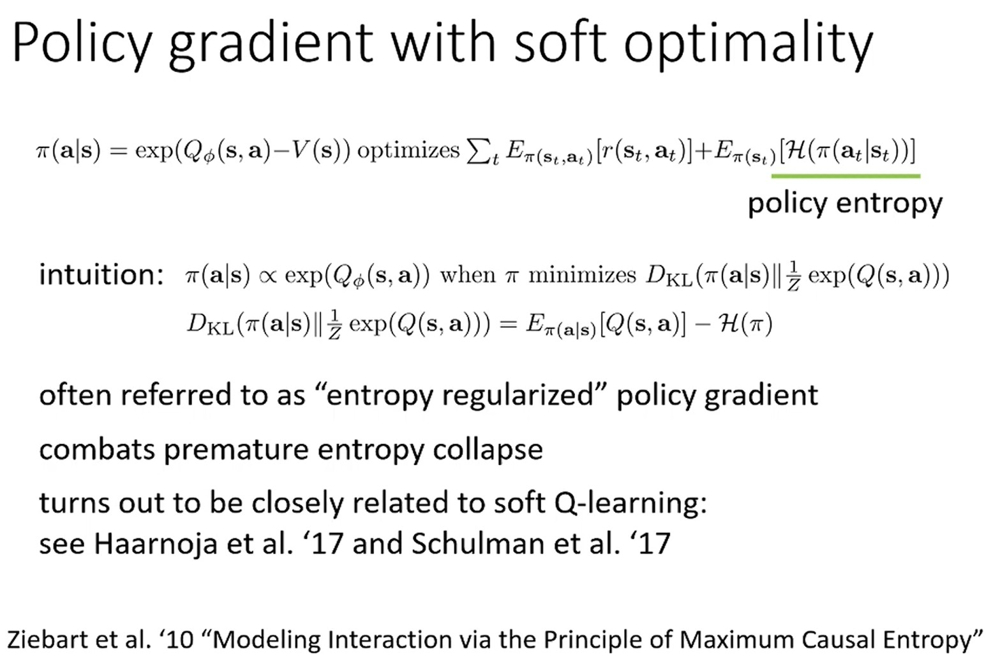

## 4.2. Policy gradient

Soft optimality를 적용한 policy gradient 알고리즘이 있다.
* Variational inference에서 얻은 원래의 objective function을 최적화하는 policy gradient 알고리즘을 간단하게 유도할 수 있다.
* 표준 policy gradient와 차이점은 entropy term을 고려하는 것이다.
* 이는 직관적으로 policy $\pi$와 $\frac{1}{Z}\exp(Q)$의 KLD를 최소화할 때 $\pi$가 exponentiated Q 값에 비례하거나 exponentiated advantage와 같아진다는 것이다.
  * 이 KLD term은 상수 term을 제외하면 $\pi$하에서의 $Q$의 기댓값 빼기 $\pi$의 entropy와 같다.
  * 그래서 종종 entropy regularized policy gradient라고 부른다.
* Policy entropy가 너무 일찍 collapse되는 것을 막아주기 때문에 policy gradient에 좋은 아이디어가 될 수 있다.
  * On-policy policy gradient 알고리즘은 policy에 존재하는 stochasticity에 의존해 exploration을 하기 때문에 policy가 일찍 deterministic이 되면 나쁜 결과를 얻게된다.
  * 따라서 entropy regularizer는 매우 유용하다.

또한 soft Q-learning과 매우 밀접하다는 연구가 존재한다.

## 4.3. Q-learning vs Policy gradient

  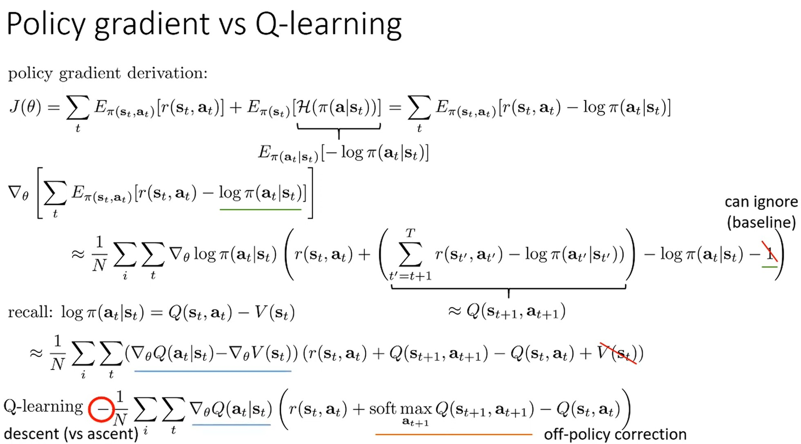

Inference 프레임워크에서 policy gradient와 Q-learning이 어떻게 관련되는지 살펴 보자.
* Policy gradient의 objective function의 gradient를 수행하면 위와 같은 수식을 얻을 수 있다.
  * Entropy regularized policy gradient는 reward에서 $\log \pi$를 빼는 것이 더해진 것으로 전체적인 형태는 변경되지 않는다.
  * 기존 gradient: $\nabla_\theta J(\theta) \approx \sum_i \left(\sum_t \nabla_\theta \log \pi_\theta(a_t^{(i)} \mid s_t^{(i)})\right) \left(\sum_t r\big(s_t^{(i)},a_t^{(i)}\big)\right)$

$\log \pi$의 정의에 따라 이를 대입하면 policy gradient (descent)와 Q-learning (ascent)가 매우 유사한 것을 볼 수 있다.
* Policy gradient에서 $V(s_t)$는 state에만 의존하여 baseline 역할을 하기 때문에 무시할 수 있다.
* 차이점은 policy gradient는 $\nabla_\theta V$를 뺀다는 것이고, Q-learning은 soft max를 한다는 것이다.
  * Q-learning 목적 함수에는 off-policy 보정이 있다.
  * 만약 on-policy Q-leraning 방법을 사용한다면 이 term을 생략할 수 있다.

## 4.4. Benefits of soft optimality

  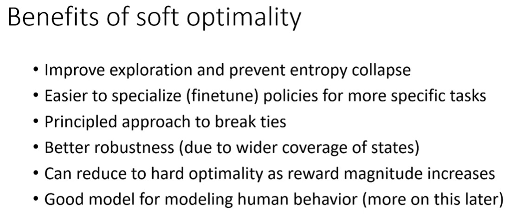

Soft optimality의 장점은 위와 같다.
* 초기 entorpy collapse를 방지해 exploration을 개선한다.
* 좀 더 무작위적인 policy을 갖게 되면, task가 약간 변경되었을 때 fine-tuning하기에 더 적합하다.
* Ties(동점)을 처리하는 원칙적인 접근 방식을 제공한다.
  * Policy는 argmax가 아니가 exponential advantage로 결정된다.
* 다양한 state에 대해 더 나은 coverage를 달성하기 때문에 더 나은 robustness를 제공한다.
  * 만약 task를 해결하는 여러 가지 방법을 배운다면, 환경 변화로 인해 그중 한 가지 방법이 유효하지 않게 되더라도 여전히 성공할 확률이 0이 아닐 수 있다.
* 일반적으로 deterministic하지 않고 실수를 하는 경향이 있는 human behavior를 모델링하는 데 좋은 모델이다.
  * 기본적으로 실수를 할 수는 있지만, reward가 감소할 수 있는 실수를 할 가능성이 기하급수적으로 낮아진다는 것을 의미한다.

# 5. Review

  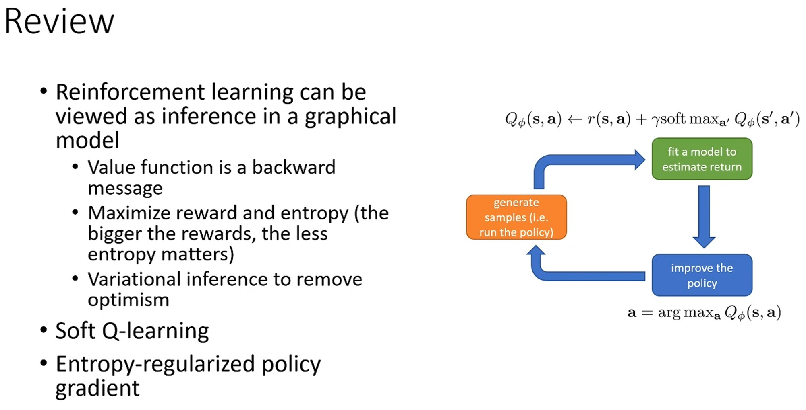

# 6. Example methods

마지막으로 variational inference, soft optimality 프레임워크를 활용한 논문을 살펴보자.

## 6.1. Stochastic models for learning control

  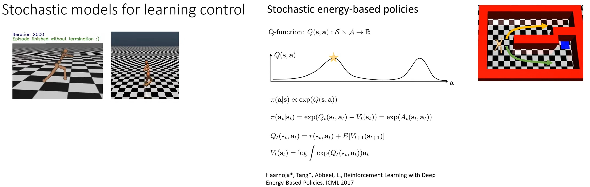

Exploration과 robustness에 관한 예를 살펴볼 수 있다.

로봇을 걷도록 훈련할 때 같은 policy gradient 알고리즘을 사용해도 진행해도 결과가 달라질 수 있다.
* 이는 local optimum 문제의 좀 더 복잡하고 일반적인 버번이다.

또 다른 예로 개미 로봇이 파란색 사각형으로 표시된 위치로 걸어가는 환경이 있다.
* 파란색 사각형의 거리에 따라 reward를 준다고 하자.
* 일반적인 RL로는 위쪽 통로와 아래쪽 통로 중 하나를 선택하고 그것에 전념하게 될 것이다.
  * 둘 통로 모두 target과 가까워지므로 어느 것이 더 나은지 agent는 모른다.
  * $Q$값이 더 높은 곳을 exploration하게 되어, 한 통로에서의 $Q$값이 더욱 높아질 것이다.
* 이를 해결하기 위해선 두 가설을 모두 추적해야 하고, soft Q-learning이 매우 효과적이다는 연구가 존재한다.
  * Soft Q-learning에서는 $\exp(Q)$에 비례하도록 선택하기 때문에 두 통로를 모두 exploration 한다.
  * 정규화 상수(normalizer)가 value function와 동일하고, 이는 exponentiated advantage로 해석할 수 있다.
    * 평균적인 value $V$보다 더 좋은 action $Q$일수록 그 action을 선택할 확률을 기하급수적으로 높인다.

## 6.2. Stochastic energy-based policies provide pretraining

  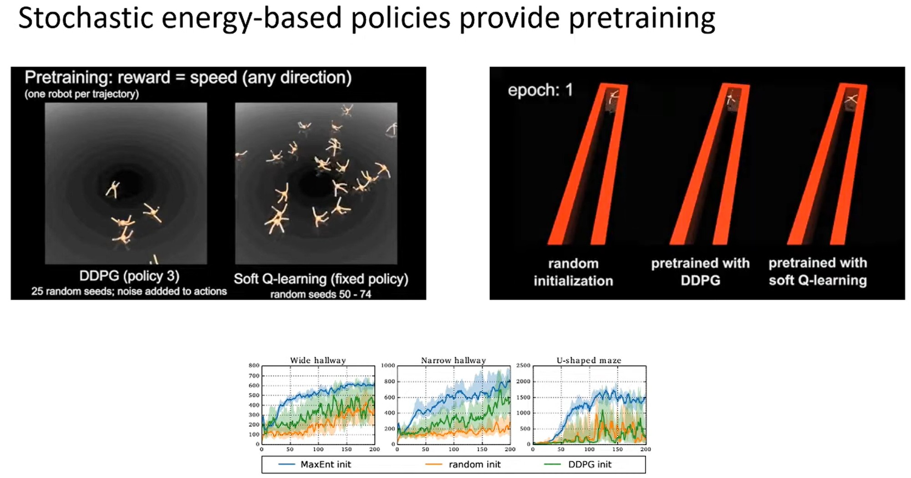

Soft optimality는 향후 fine-tuning에 이점을 주기 때문에 좋은 pre-traning 방법이다.
* Underspecified task에서 pre-train을 위해 soft optimality를 사용하면, 그 task를 매우 다양한 방식으로 해결하는 법을 배우게 된다.
* 기술을 전문화할 때 다시 학습하는 대신 잘못된 해결 방식들을 제거하기만 하면 된다.

Explosion of spiders에서는 어느 방향으로든 매우 빨리 달리면 reward가 주어진다.
* 왼쪽은 표준전인 DDPG deterministic RL 알고리즘이고 오른쪽은 soft Q-learning 접근 방식이다.
* Soft Q-learning에서는 entropy를 증가시키기 위해 가능한 많은 방향으로 달릴려고 시도할 것이다.

Soft Q-learning으로 학습되었다면, 오른쪽 task와 같이 좁은 복도를 한 방향으로 달리는 환경에 두면 훨씬 빨리 fine-tuning할 수 있다.
* 초기에 DDPG policy는 deterministic 알고리즘으로 잘못된 방향으로만 달립니다.
그렇기 때문에 그것을 잊어버진(unlearn)한 다음 올바른 방향으로 달리는 방법을 다시 배워야 한다.
* Soft Q-learning 정책은 매 에피소드마다 무작위 방향으로 달린다.
약간의 fine-tuning을 통해 잘못된 방향으로 달리지 않는 법을 배우고 올바른 방향만 유지하면 된다.

## 6.3. Soft Actor-Critic

  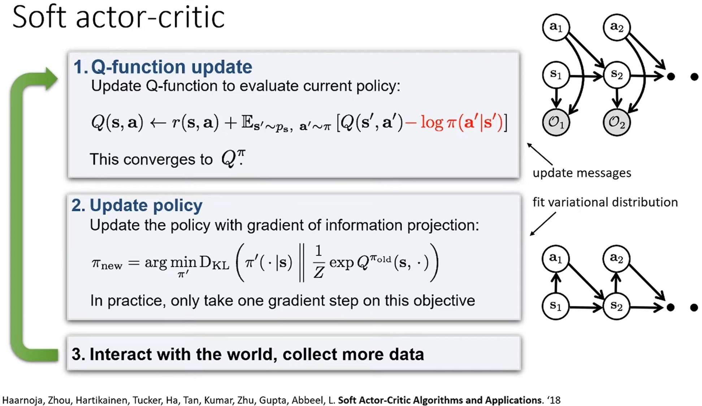

Soft optimality 프레임워크는 단순히 더 성능이 좋고 효과적인 RL 알고리즘으로 이어질 수도 있다.
* 지금 가장 널리 사용되는 off-policy continuous control 알고리즘 중 하나는 soft actor-critic이라고 불리는 것으로, Soft Optimality 원칙에 기반하고 있다.
* Soft actor-critic은 soft Q-learning의 actor-critic 알고리즘이다.

Soft actor-critic에는 Q 함수 업데이트가 있지만 soft max를 사용하지 않는다.
* Message passing의 variational로, entropy를 설명하기 위한 $-\log \pi$ term을 제외하고 일반적인 actor-critic Q 함수 업데이트와 같다.

Policy update는 이전에 봤던 policy gradient objective function과 같다.
* Q 함수를 사용하기 때문에 off-policy data로부터 학습할 수 있다.

Varitaion inference 관점에서 step 1은 미래의 reward 정보가 현재 state로 전달되는 backward message를 계산하는 것과 같다.
그리고 step 2는 variation distribution을 원래 graphical model의 approximate posterior에 더 잘 근사하도록 맞추는 것과 같다.

# 7. Futher Readings

  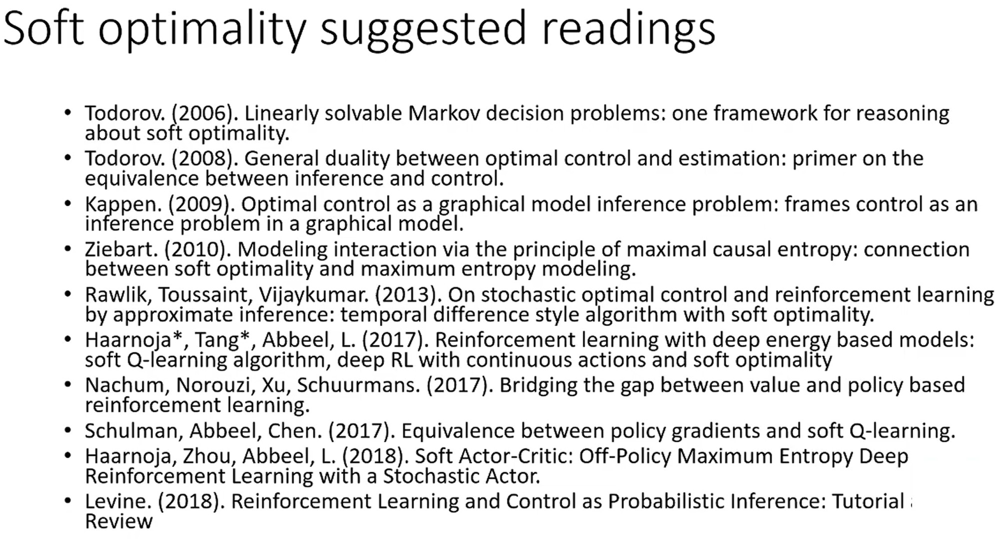

