기존 RL에서는 task를 정의하기 위해 reward를 수동으로 정의했다.
이번 강의에서는 optimality에 대한 근사 모델을 적용해 정의한 reward에서 policy를 직접 학습하는 것이 아니라 reward function 자체를 학습하는 방법인 Inverse RL에 대해 살펴보자.
* Reward function을 수동으로 정의하기 어렵지만, task를 성공적으로 수행하는 인간이나 전문가의 행동 데이터로 reward function을 도출하고, 이 reward function으로 다시 RL 알고리즘을 최적화한다.

1. Inverse RL의 정의를 이해한다.
2. 행동에 대한 확률적 모델이 inverse RL을 유도하는 방법을 이해한다.
3. Deep RL에서 다루는 고차원 문제를 다루기 위한 몇 가지 실용적인 inverse RL 방법을 이해한다.

# 1. Optimal Control as a Model of Human Behavior

  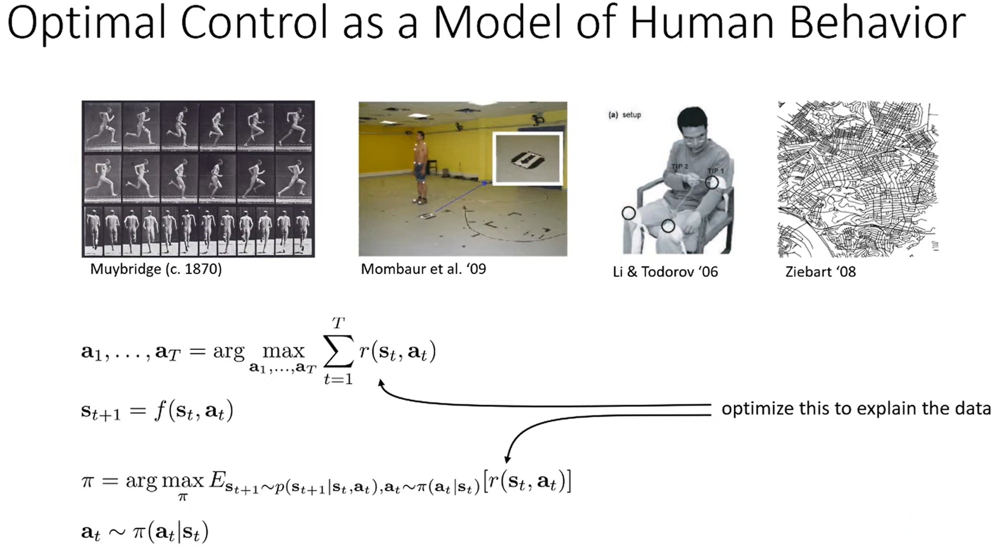

Lecture 19에서 optimal control과 RL이 inference framework를 통해 human behavior의 모델이 될 수 있다는 것을 살펴보았다.
많은 연구에서 인간의 합리적 행동을 잘 정의된 utility funciton을 최대화하는 것으로 프레임화한다.
* 인간의 의사결정 과정을 optimality 관점에서 deterministic 또는 probabilistic 최적화 문제로 정의할 수 있다.
* 최적화 문제를 푸는 의사결정을 한다고 가정했을 때, 행동과 일치하는 reward function이 무엇인지 찾는 것이다.

인간이 deterministic하지 않고 완벽하게 최적이 아니기 때문에 optimality에 대한 soft model이 인간의 행동을 잘 설명한다.

# 2. Why should we worry about learning rewards?

  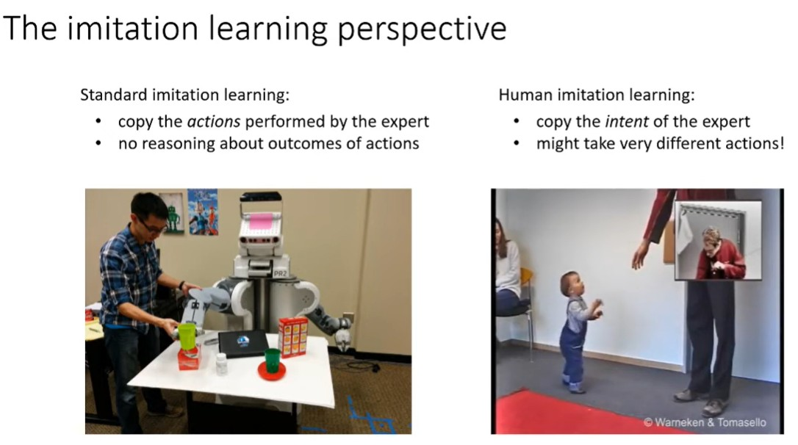

Imitation learning은 단순히 움직임을 모방하기 대문에 행동의 목적이나 결과에 대해 추론하지 않는다.
하지만 인간은 움직임 자체를 복사하지 않고 움직임의 '의도'를 이해하려고 한다.
그렇기 때문에 다른 행동을 하더라고 같은 결과로 이어질 수 있는 것이다.

Inverse RL로 agent가 어느정도 의도를 이해하도록 만들 수 있다.

  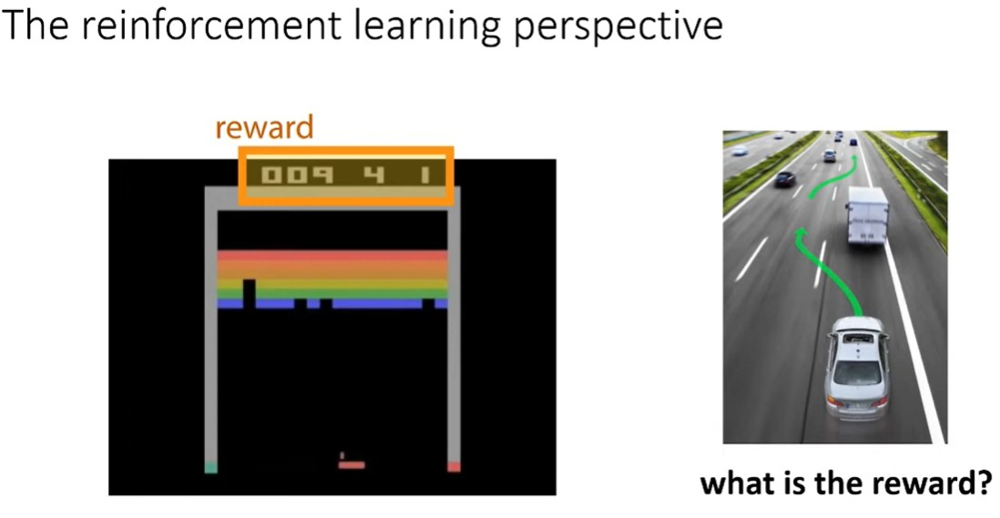

Inverse RL이 중요한 이유를 RL 알고리즘 관점에서 살펴보자.
기존의 RL task는 목표가 명확하고 reward function이 합리적으로 정의된다.
* 게임의 경우 게임 점수가 reward function이 되는 것은 자연스럽다.

하지만 다양한 시나리오에서 reward function이 명확한 것은 아니다.
* 고속도로에서 자율 주행 자동차의 경우 여러 가지 factor를 고려해야 한다.
  * 목적지에 도착해야 함.
  * 특정 속도로 가야 함
  * 교통 법규를 위반하지 않아야 함.
  * 다른 운전자를 짜증나게 해서는 안 됨.
* 이를 하나의 방정식으로 표현하는 것을 매우 어렵다.
* 그렇기 때문에 비교적 쉬운, 전문 운전자의 시범을 통해 reward function을 학습하는 것이다.

# 3. Inverse Reinforcement Learning

  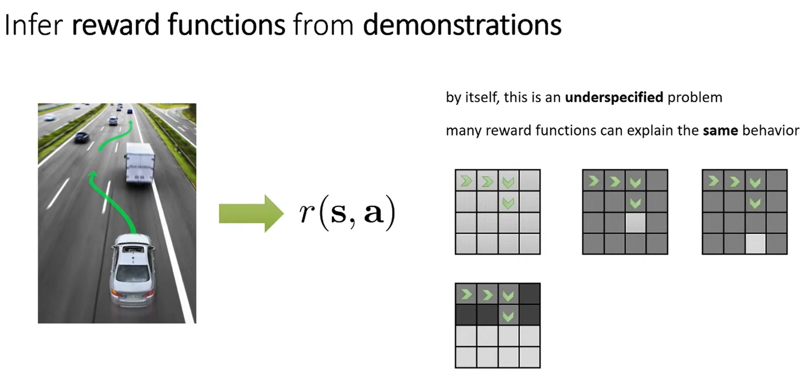

Inverse RL이란 RL agent에게 줄 좋은 reward function을 알아내는 과정으로, 시연(demonstrations)으로부터 reward function을 추론한다.
하지만 행동 패턴에 대해 그것을 설명할 수 있는 reward function은 무수히 많기 때문에 underspecified 문제이다.

예를 들어 16개의 state가 있는 grid world를 생각해 보자.
위 그림에서 제일 처음 grid world가 관찰된 demonstration이다.
* 단순히 grid 위에 화살표 몇 개가 그려진 것 뿐이므로 이것만 가지고 reward function이 무엇인지 알 수 없다.
* 위의 demonstration이 최적이 될 수 있는 reward function이 무수히 많다.
* 예를 들어, 특정 사각형에 도달하면 reward를 주는 environment에서 특정 사각형의 위치가 서로 다를 수 있다.

자율 주행 시나리오에서는 semantics가 훨씬 풍부하다.
* 다른 차들의 위치, 정지 표지판, 신호등 등이 있다.
* 하지만, RL 알고리즘은 세상을 이해하는 데 도움을 주는 semantics를 파악할 수 없다.
  * Montezuma's Revange에서 exploration이 어려운 이유가 RL 알고리즘이 semantics를 가지고 있지 않기 때문이다.
* 마찬가지로 inverse RL에서도 단지 state와 action만 있을 뿐, 의미 있는 reward function이 교통 법규와 관련이 있고 특정 GPS 좌표와는 관련이 없다는 것을 이해할 방법이 없다.

  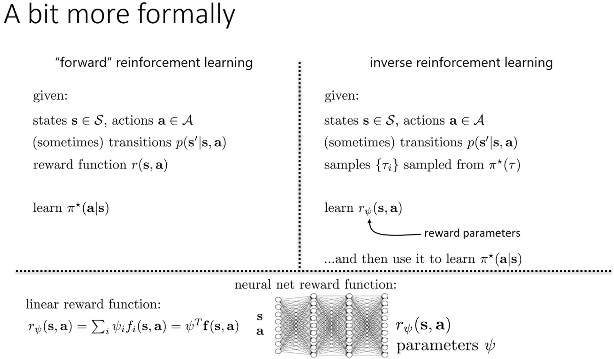

Inverse RL을 일반적인 RL (forward RL)과 비교하며 formularize하자.

일반적인 RL의 경우 state, action space가 주어진다.
Transition 확률이 주어질 때도 있지만, 경험을 통해 추론해야 하는 경우도 있다.
그리고 주어진 reward function에 대한 최적 policy $\pi^\star$를 학습한다.

Inverse RL의 경우 마찬가지로 state, action space가 주어지고, transition 확률이 주어질 때도 있지만, 경험을 통해 추론해야 하는 경우도 있다.
그리고 최적 policy (전문가/인간 등)을 실행해 샘플된 trajectory $\tau$가 주어진다.
목적은 trajectory $\tau$를 생성한 policy $\pi^\star$가 최적화 했던 reward function $r_\psi$을 찾는 것이다.
* 최적 policy가 무엇인지 알 필요는 없지만 최적 policy에 준하는 것에서 trajectories가 샘플링되었다고 가정한다.
* $\psi$는 reward를 매개변수화하는 파라미터 vector이다.
  * Linear reward function, neural network reward function 등 다양한 형태가 가능하다.

Inverse RL에서 reward function을 학습하고 나면, 그것으로 최적 policy $\pi_\star$를 학습한다.

## 3.1. Feature Matching

  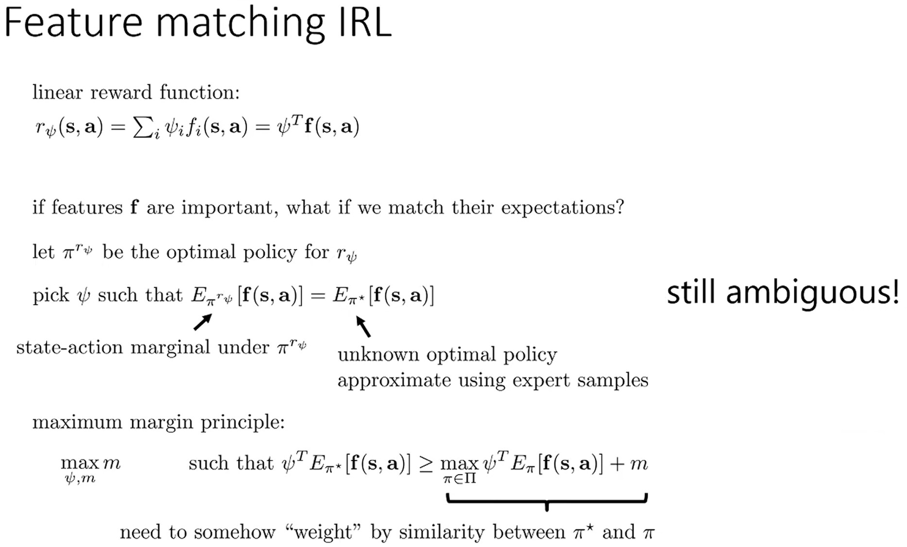

Deep learning 이전 inverse RL을 해결하기 위해 시도했던 방법 중 feature matching을 알아보자.
* 지금 많이 사용되는 inverse RL 알고리즘은 maximum entropy 원리에 기반해 lecture 19에서 제시한 graphical model을 활용한다.

Feature matching은 reward를 구할 때 활용되는 중요한 feature $f_i$에 대한 linear function을 학습한다.
* 운전을 예로 들면, $f_i$는 충돌 횟수, 목적지 도착 시간 등이 될 수 있다.

Feature는 state와 action에 대한 함수이고, $\pi^{r_\psi}$를 학습한 reward $r_\psi$에 대한 최적 policy라고 하자.
그러면 $\pi^{r_\psi}$ 하에서의 features의 기댓값과 $\pi^\star$ 하에서의 features의 기댓값이 같아지도록 $\psi$를 학습한다.
* 예를 들어, 최적의 운전자가 충돌을 거의 경험하지 않고, 빨간불을 거의 무시하지 않으며, 왼쪽으로 자주 추월하고 오른쪽으로 주행하는 것을 보았다고 하자.
* 행동에 영향을 주는 올바른 features가 주어졌을 때 그 features의 기댓값을 맞추는 것이 유사한 행동으로 이끌 것이다.

하지만, 여러 $\psi$ 값들이 동일한 features의 기댓값을 가질 수 있기 때문에 여전히 모호한 방법이다.

이를 완화하기 위해 maximum margin 원리를 활용한다.
* Support vector machine (SVM)의 maximum margin 원리와 매우 유사하며, 관찰된 policy $\pi^\star$와 다른 모든 policy 사이의 margin을 최대화하도록 $\psi$를 선택한다.
	* $\pi^\star$가 다른 어떤 policy보다 점수가 월등히 높게 나오도록 reward function을 선택하는 것이다.
* 이렇게 얻은 reward function으로 $\pi^\star$를 반드시 복원할 수 있는 것은 아니지만 합리적이다.

하지만 policy space가 크고 continuous하다면 $\pi^\star$와 동일한 결과를 내는 거의 동일한 policy가 있을 가능성이 높다.
그렇기 때문에 margin을 최대화하는 것은 그 자체로는 별로 좋은 생각이 아니다.

이를 해결하기 위해 $\pi^\star$와의 유사성을 고려해 가중치를 둘 수 있다.
* $\pi^\star$와 유사성이 높으면 작은 margin이어도 괜찮다.

이것은 SVM에서 마주치는 문제들과 매우 유사하고, feature matching inverse RL에서 SVM 기술을 차용한다.

  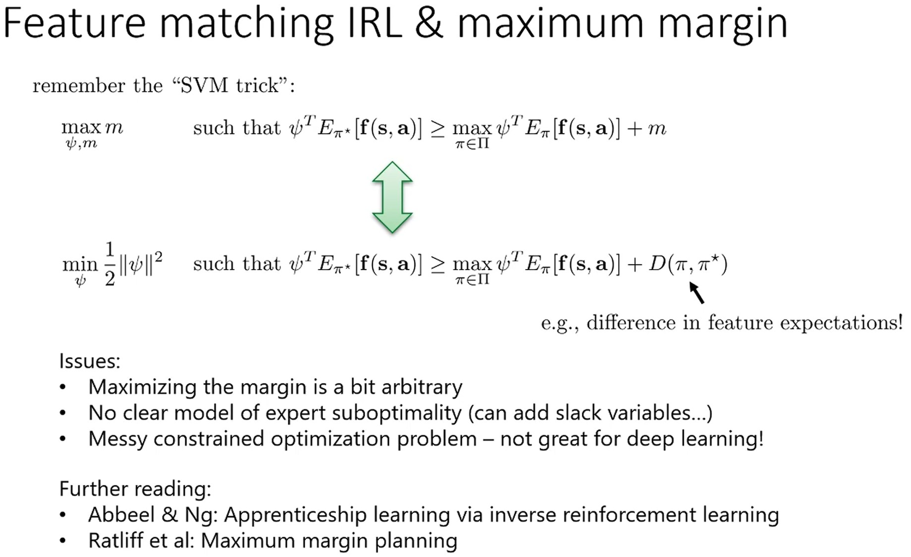

SVM에서는 maximum margin 문제에서 margin이 항상 1인 weight vector의 길이를 최소화하는 문제고 재구성한다.
Feature matching 문제에서는 SVM의 margin이 항상 1이라는 constraint를 두 policy 간의 divergence로 대체하면 된다.
* Divergence의 선택으로 KLD 또는 features 기댓값 차이 등이 도리 수 있다.

하지만, 여전히 몇 가지 단점을 가진다.
* Margin을 최대화하는 것이 다소 임의적이다.
	* 전문가의 행동이 명확하게 더 나은 선택이 되는 reward function을 찾고 싶지만, 그 이유를 설명해주진 않는다.
	* 전문가는 자신의 행동이 다른 행동과 뚜렷히 구별되야 한다는 생각을 가친 채 행동하지 않을 것이다.
	* Margin을 최대화하는 것은 전문가의 행동에 대한 heuristic 반응이며 전문가의 행동에 대한 가정은 명시되지 않는다.
* 전문가의 sub-optimality에 대한 명확히 설명하는 model을 제공하지 않는다.
  * 전문가가 왜 때때로 실제로 최적이 아닌 행동을 하는지 설명하지 않는다.
	* 즉, 같은 결과를 내는 다양한 행동들을 설명할 수 없다.
	* SVM와 같이 완벽하게 분리되지 않는 point의 경우 slack variables를 통해 sub-optimality를 설명할 수 있지만, 여전히 heuristic하다.
* 다소 복잡한 constraint 최적화 문제로 귀결된다.
  * Linear model에서는 큰 문제가 아니지만, neural network인 경우 문제가 된다.

더 궁금한 점은 위에서 제시된 논문을 읽어보자.
이번 강의에서는 trajectory의 확률을 활용해 reward function을 학습하는 것에 집중할 것이다.

## 3.2. Learning the Reward Function

  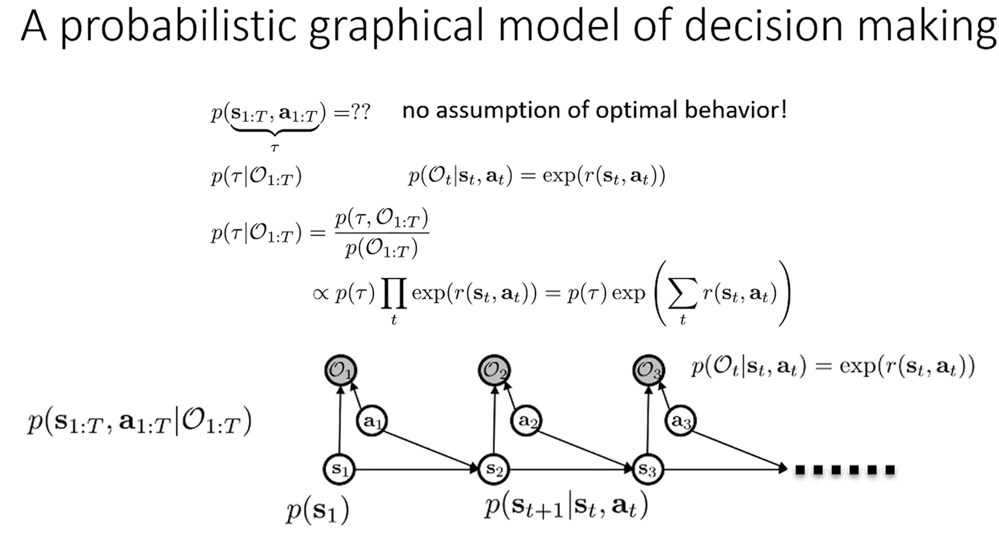

Lecture 19에서는 sub-optimality 행동을 state, atction, optimality variables를 갖는 graphcial model의 inference로 모델링하였다.
* 전문가가 최적으로 행동했다는 가정 하에 trajectory의 확률이 무엇인지 파악한다.
* 이를 통해 가장 최적인 trajectory가 가장 가능성이 높고, sub-optimality인 trajectories는 기하급수적으로 가능성이 낮아진다는 해석을 할 수 있다.

Lecture 19에서는 graphical model을 바탕으로 trajectory의 확률을 inference 했다.
이번 강의에서는 trajectory가 주어졌을 때 graphical model 하에서 그 trajectories의 likelihood가 최대가 되도록 reward function의 parameter를 학습할 것이다.

  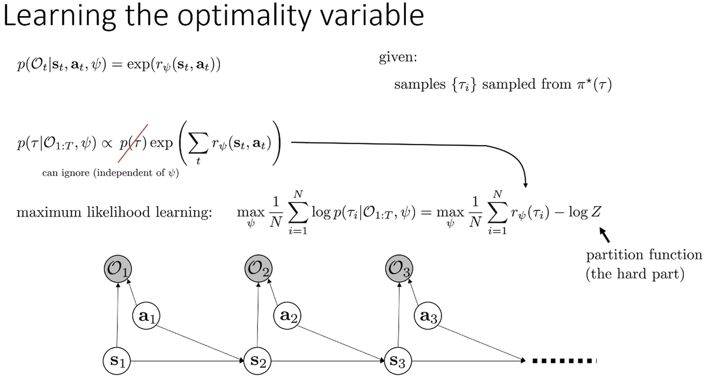

Graphical model에서 reward funciton을 학습한다는 것은 optimality variable을 학습한다는 의미이다.
* $p(\mathcal{O}_t | s_t, \psi)$로 정의하여 parameter $\psi$에 의존함을 강조한다.
* Optimality variables와 $\psi$가 주어졌을 때 trajectory의 확률은 lecture 19에서 살펴 봤듯이 trajectory의 확률에 reward의 합의 exponential를 곱한 것에 비례한다.

Inferse RL에서는 알 수 없는 최적 policy로부터 샘플들이 주어지며, maximum likelihood를 통해 reward function을 학습한다.
* 관찰된 trajectories의 log likelihood를 최대화하는 parameter $\psi$를 선택한다.
* 이는 ML에서의 maximum likelihood와 매우 유사하다.
* $p(\tau)$ term은 $\psi$와 독립적이므로 무시할 수 있다.

Trajectory의 log 확률에 대한 exponential reward term을 대입하면 매우 직관적인 식을 얻을 수 있다.
* 모든 trajectories에 대해 reward의 합의 평균에서 log normalizer $Z$를 빼는 것을 $\psi$에 대해 최대해야 한다.

Normalizer term을 무시하면 단순히 trajectory가 높은 reward를 갖도록 학습해야 한다는 것을 의미하는데, 이는 좋지 않다.
* 이 경우, 모든 trajectory에 대해 무조건 높은 reward를 가지도록 학습하는 trivial solution이 존재한다.

Normalizer term은 직관적으로 관찰하지 못한 다른 trajectories보다 관찰한 trajectories가 더 그럴듯해 보이도록 reward를 할당해야 한다고 말한다.
하지만, normalizer term이 inverse RL을 어렵게 만든다는 단점이 있다.

  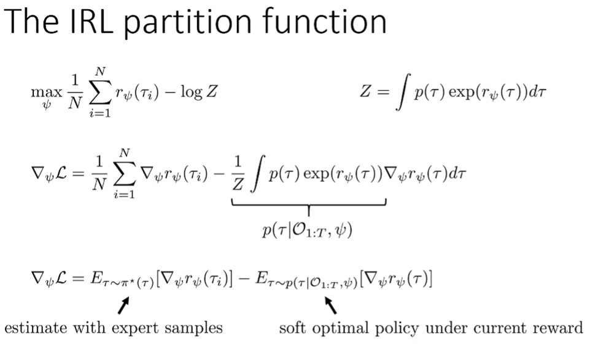

Normalizer term $Z$는 partition function라고 불리며 모든 가능한 trajectories에 대해 $p(\tau)$와 $r_\psi(\tau)$의 exponential을 곱한 것을 적분한 것과 같다.

일반적으로 모든 가능한 trajectories에 대해 적분하는 것은 intractable하기 때문에 $Z$를 대입에서 $\psi$에 대한 gradient를 계산한다.
* 첫 번째 term은 샘플된 trajectories에 대한 reward gradient의 평균이다.
* 이때 $1/Z \times p(\tau) \times \exp(r_\psi(\tau))$는 $p(\tau|\mathcal{O}_{1:T}, \psi)$와 같기 때문에 두 번째 term을 $\psi$에 의해 유도된 trajectory 분포 하에서의 기댓값으로 볼 수 있다.
	* $Z$는 이미 계산된 상수값이기 때문에 $\int$ 안으로 들어갈 수 있다.

결과적으로 gradient는 전문가 policy $\pi^\star$ 하에서의 gradient의 기댓값에 현재 reward $\psi$ 하에서의 gradient 기댓값의 차이를 의미한다.
* $p(\tau | \mathcal{O}_{1:T}, \psi)$는 단순히 $\psi$에 대해 soft하게 최적인 trajectories의 분포이다.

이를 통해 다음과 같은 알고리즘을 생각할 수 있다.
1. 현재 reward $r_\psi$로 lecture 19에서 살펴본 graphical model inference를 수행해 soft 최적 policy를 찾는다.
2. 그 policy에서 trajectory를 샘플링한 다음 전문가로부터 관찰한 trajectories에 대해서는 reward를 증가시키고, 현재 reward에 대해 샘플링한 trajectoreis에 대해서는 reward를 감소시키는 작업을 수행한다.

  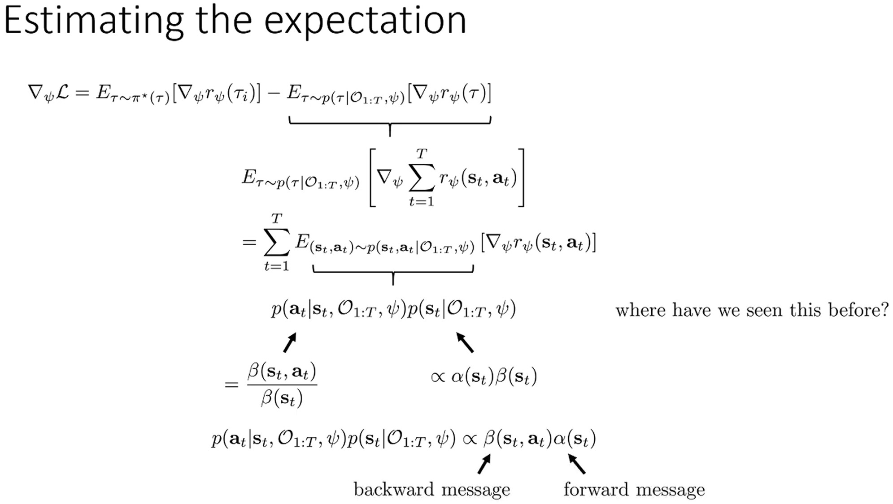

Lecture 19 알고리즘을 활용해 현재 reward $r_\psi$로 soft 최적 policy를 찾는 것을 살펴보자.

두 번째 term을 좀 더 명시적으로 표현해보자.
* Expectation의 linearity 특징으로 expectation을 밖으로 빼낸다.
* 그러면 state-action marginal 분포 하에서의 reward gradient의 기댓값의 합을 구하는 식으로 바꿀 수 있다.
* State-action marginal 분포는 lecture 19에서 살펴본 forward/backward message에 대한 비례식으로 나타낼 수 있다.
  * Normalizer term이 필요하지만, trajectory에 대한 것이 아니라 state, action에 대해 normalize해야 한다.

  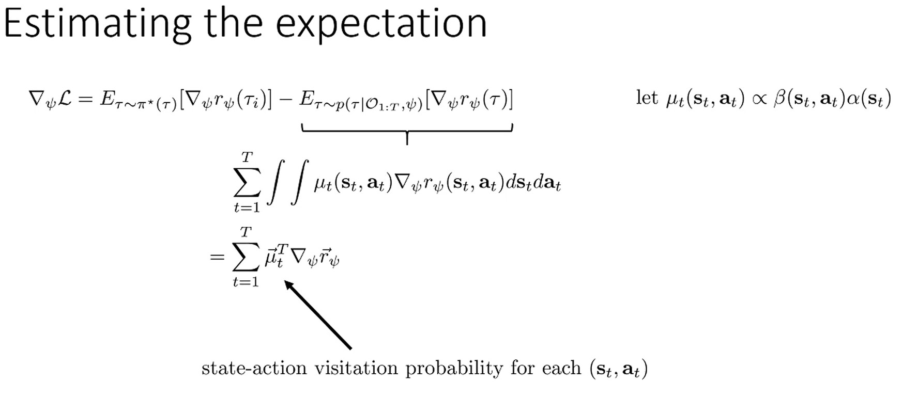

두 번째 term을 계산하기 위해 $\mu_t(s_t,a_t)$를 계산해야 한다.
* Backward, forward message를 곱하고 전체 state와 action에 대해 정규화하여 계산한다.

기댓값은 확률 벡터 $\mu$와 모든 state-action tuple에서의 reward gradient vector 간의 내적으로 쓸 수 있다.
* Forward/backward message를 계산할 수 있어야하며, transition 확률을 알아야 한다.
* 따라서 알려지지 않은 dynamics에서는 작동하지 않으며 $\mu$를 계산할 수 있어야 하므로 작은 discrete인 state, action space에서만 동작한다.

  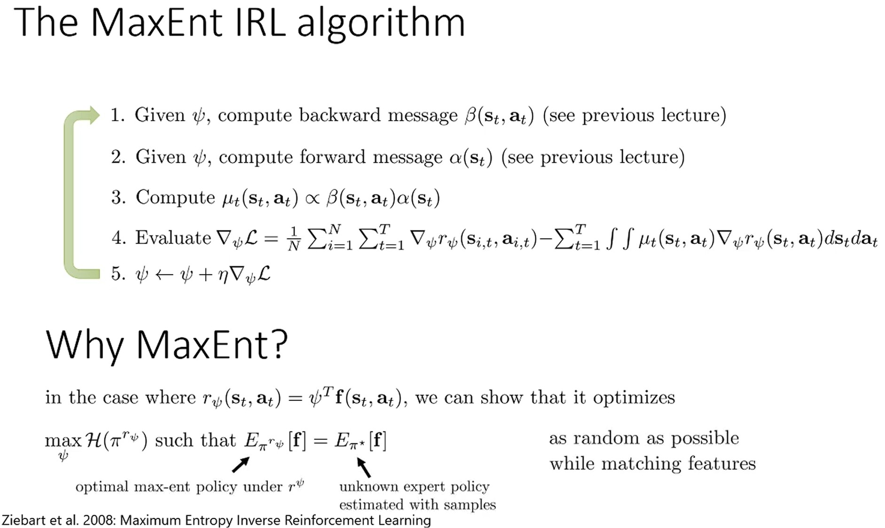

2008년에 제안된 maximum entropy inverse RL 알고리즘을 살펴 보자.
* 현재 reward vector $\psi$가 주어지면 backward/forward message를 계산한다.
* 두 message를 곱해 정규화를 진행해 $\mu$를 계산한다.
* Trajectories의 gradient를 샘플링된 trajectories에 대한 $\nabla_\psi r_\psi$의 평균에서 $\mu$와 $\nabla r$ 간의 내적을 뺀 차이로 평가한다.
* $\psi$에 대한 gradient ascent 수행하고 수렴할 때까지 과정을 반복한다.

위의 과정을 통해 샘플링된 trajectories의 likelihood를 최대화하는 reward parameter $\psi$를 얻을 수 있다.
즉, 전문가의 sub-optimality action을 잘 설명할 수 있는 reward function을 얻는 것이다.
* Optimality 개념을 활용해 이전에 보았던 모호성 (서로 다른 reward function이 유사한 policy를 갖는 등)을 없앴다.
* 전문가가 매우 무작위적인 행동을 하는 것을 본다면, 그들이 서로 다른 무작위 결과에 대해 신경 쓰지 않는다는 것을 의미할 수 있다.
즉, 모든 결과가 전문가에게 거의 동등하게 좋다는 것을 의미할 수 있다.
* 하지만 전문가가 매우 구체적인 행동을 반복해서 하는 것을 본다면, 그 행동이 전문가에게 정말 중요하고 훨씬 더 큰 보상을 갖는다고 말할 수 있다.

Linear reward function인 경우, policy의 entropy를 최대화하면서 전문가의 feature 기댓값과 일치하게 만들기 때문에 이를 maximum entropy 알고리즘이라고 부른다.
* Feature matching에서 policy 가능한 무작위적으로 만들어 모호성을 없애는 방식이다.
* 데이터에 의해 뒷받침되는 것 이외의 어떤 추론도 해서는 안 된다고 말하는 일종의 Occam's razor이다.
  * Maximum entropy 알고리즘은 데이터에 뒷받침되지 않는 부당한 가정 및 전문가의 행동에 대한 추론을 피한다.

Maximum entropy 알고리즘은 작은 discrete 설정에서 꽤 효과적이다.
* 원본 논문에서는 내비게이션 경로를 추론하였다.
	* 택시 운전사 데이터를 수집했고 route planning software가 택시 운전사처럼 길을 찾도록 학습했다.

## 3.3. Approximations in High Dimensisons

이번엔 고차원 또는 continuous space에서 approximate inverse reinforcement learning을 수행하는 방법에 대해 알아보자.

  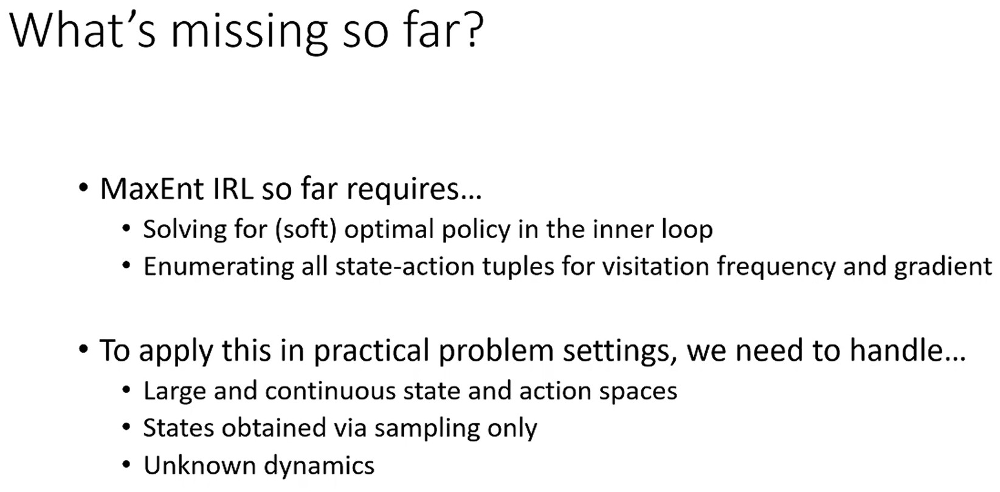

Maximum entropy inverse RL에서 정규화와 backward/forward message를 계산해야 한다.
하지만 고차원적인 현실 task에서는 불가능 하다.
* State-action space가 크고 continuous하면 계산이 불가능하다.
* 추가로 backward/forward message를 계산하기 위한 dynamics를 알 수 없는 경우도 있다.

이를 위해 tractable approximations을 고안해야 한다.

  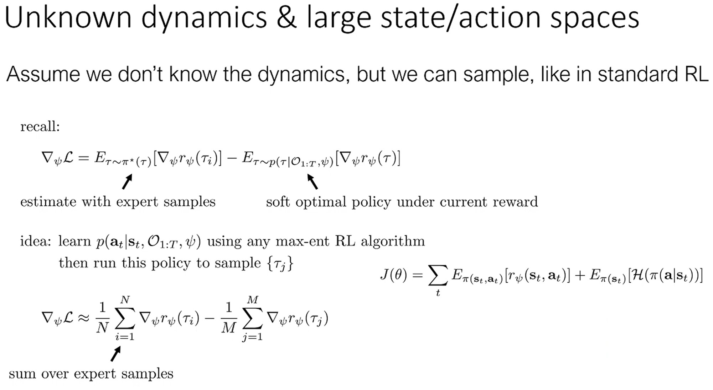

먼저 dynamics model을 모르지만, model-free RL처럼 샘플링은 가능하다고 가정하자.
문제는 likelihood의 gradient의 두 번째 term이다.

한 가지 아이디어는 soft optimal policy $p(a_t | s_t, \mathcal{O}_{1:t}, \psi)$를 학습하는 것이다.
Lecture 19의 soft Q-learning이나 entropy regularized policy gradient와 같은 max-entropy 알고리즘을 사용해 $J(\theta)$를 최대화하도록 학습한다.
그리고 학습된 policy로 trajectory ($\tau_j$)를 샘플링하여 두 번째 term을 추정한다.
* 동작하긴 하지만, 매 gradient step마다 수렴할 때까지 max-entropy 알고리즘을 실행해야 한다는 것이다.
이는 어려운 문제이다.

  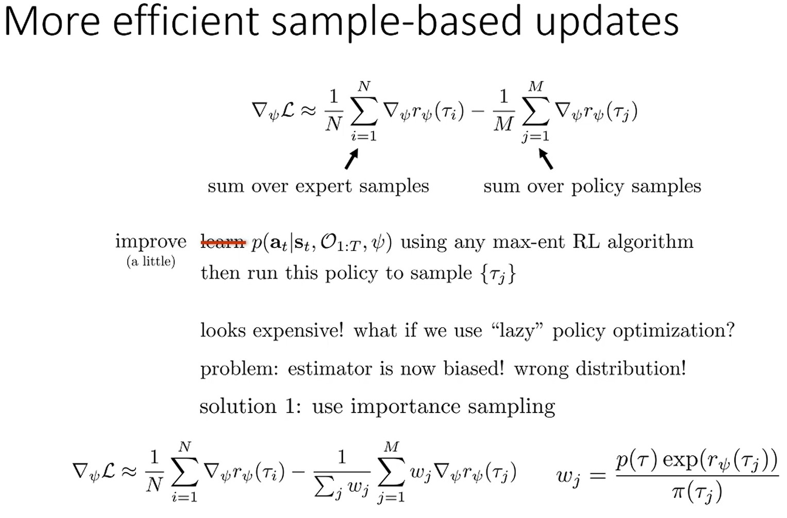

좀 더 효율적인 방법으로 lazy policy optimization을 생각할 수 있다.
매 step 마다 수렴 때까지 최적화하는 대신 조금씩만 최적화하는 것이다.
* 즉, $p(a_t | s_t, \mathcal{O}_{1:t}, \psi)$를 학습하는 대신 이전 $\psi$에서 얻은 policy에서 시작하여 개선하는 것이다.

하지만, 두 번째 term에 대한 estimator에 bias가 생기게 된다.
한 가지 해결책은 importance sampling으로 보정하는 것이다.
* 최적 policy 대신 sub-optimal policy를 사용한 것이기 때문에 importance weight $w_j$를 부여하여 최적 policy에서 나온 샘플처럼 보이게 만들 수 있다.
  * $w$는 최적 policy의 확률 / 현재 policy의 확률이다.
	* $\pi^\star \propto p(\tau)e^{r_\psi}$이고, $r_\psi$도 계산할 수 있으므로, importance weight $w_j$는 계산 가능하다.
	* 현재 policy는 max-entropy 알고리즘으로 구한 것으로 접근 가능하다.

  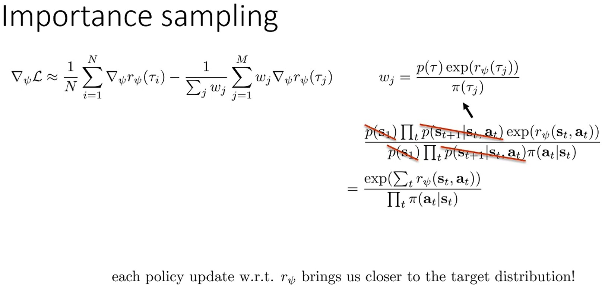

$w_j$에서 initial state term과 dynamics term (transition 확률)은 동일하기 때문에 상쇄된다.
그리고 $\psi$에 대한 policy 업데이트로 최적 policy에 점점 더 가까워지기 때문에 policy를 최적화할수록 importance weight는 1에 가까워질 것이다.

  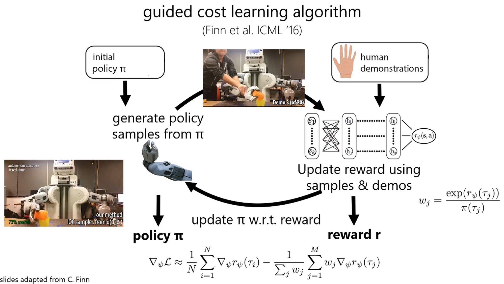

단계적으로 $\psi$를 업데이트하는 것은 'Guided Cost Learning 알고리즘'의 기초이다.
* 고차원 state action space로 확장할 수 있는 최초의 deep inverse RL 알고리즘이다.

1. 학습 중인 policy로 샘플링을 하고, 인간의 demonstrations를 수집한다.
2. 수집된 trajectories로 reward functions를 학습한다.
  * Importance sampling을 활용한다.
3. 학습된 reward functions로 policy를 수렴할 때까지 최적화한다.
  * Max-entropy 학습 프레임워크를 활용한다.
4. 1 ~ 3을 반복해서 최종 policy와 reward function을 얻게 된다.
  * Reward function은 전문가 행동에 대한 좋은 설명을 해줄 수 있을 것이고, policy는 그 reward function을 최대화하는 것이다.

# 4. IRL and GANs

Approximate inverse RL 방법과 GAN (Generative adversarial networks)와의 관계를 살펴보자.

  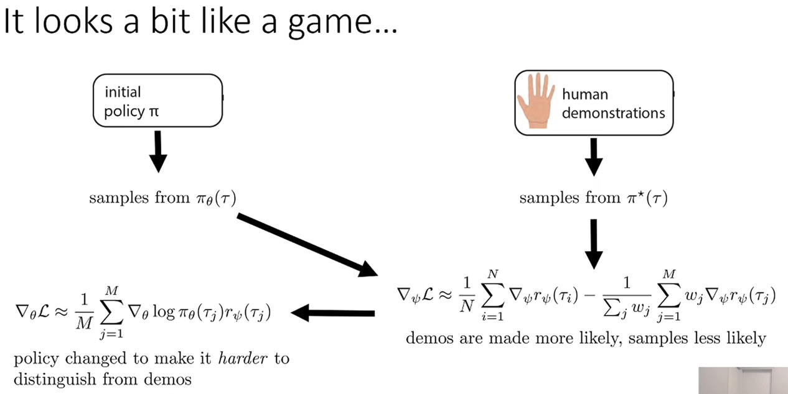

$\psi$의 구조를 살펴 보면 reward function 학습과 policy 학습 사이에서 벌어지는 일종의 게임 형태이다.
* 인간의 demonstration은 좋게 만들면서 임의의 policy에서 샘플링된 trajectories는 나쁘게 만드는 reward function을 학습한다.
즉, 인간과 policy를 구별할 수 있는 reward를 찾으려고 한다.
* 반면, policy 업데이트는 policy와 인간의 demonstration 구별하기 어렵게 만든다.
즉, reward function을 속여 자신이 인간만큼 훌륭하다고 생각하게 만든다.

  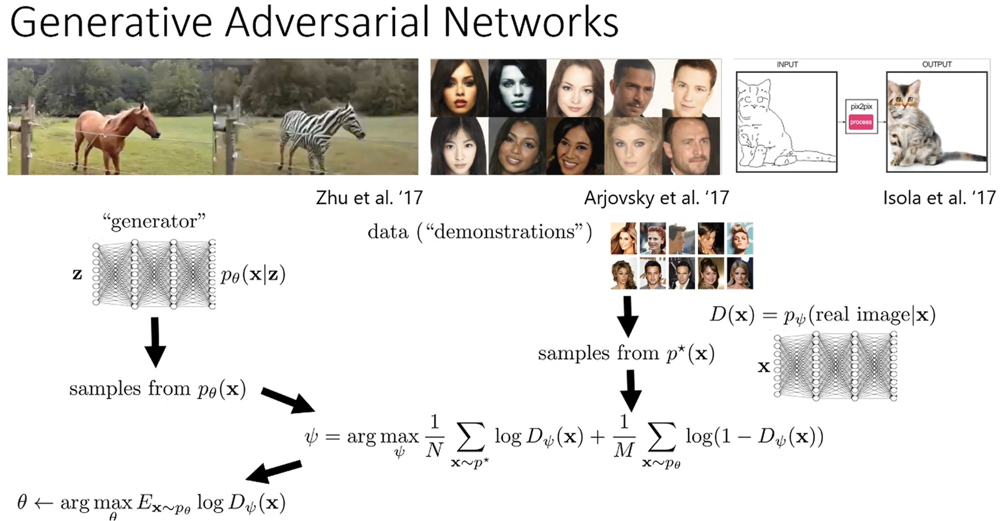

이러한 관점에서 inverse RL을 GAN과 연결할 수 있다.
* Discriminator: 생성된 image와 실제 image를 구별한다.
* Generator: 샘플링된 latent variable $z$로 image를 생성하고 discriminator를 속여야 한다.

  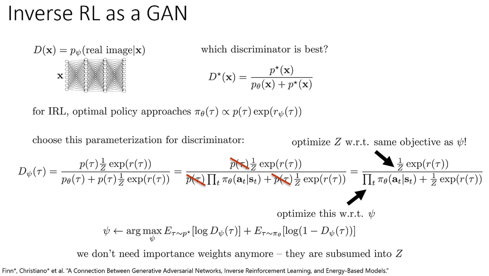

Inverse RL을 GAN으로 프레임화할 수 있다.
이때, 어떤 종류의 discriminator를 사용할지 선택해야 한다.
* 일반적인 GAN에서 최적 discriminator는 $p^\star$와 $p_\theta$ 사이의 density 비율을 나타낸다.
	* Generator가 실제 image와 매우 유사한 것을 생성한 경우를 고려한 것이다.
	* Image가 실제 분포에서만 확률이 높고 generator에서 확률이 낮으면 discriminator는 거의 1이라고 출력한다.
	* 반면, 둘다 확률이 높으면 discriminator는 0.5에 가깝게 출력해야 한다.
* 이 사실을 활용해 inverse RL을 GAN으로 casting할 수 있다.

Optimal policy가 생성한 trajectory는 $\propto p(\tau)e^{r_\psi(\tau)}$이다.
따라서 inverse RL에서 discriminator는 위 사진의 수식과 같이 구성할 수 있다.
Policy 확률이 exponential reward와 같도록 최적화되면, discriminator는 0.5를 출력한다.

인간의 demonstration에서 reward가 높게 나오도 샘플된 trajectories에서는 reward가 낮게 나오도록 $D_\psi$를 학습시킨다.
* $D_\psi$ 내부에 있는 $r_\psi$를 학습시키는 것이다.
* Normalize term $z$를 계산하는 것은 어렵기 때문에 동일한 objective function으로 $\psi$와 같이 학습 가능한 parameter로 설정하면 최종적으로 복잡한 적분을 계산한 값으로 수렴하게 된다.
  * 그러면 $z$에 importance weight도 함께 고려되기 때문에 더 이상 importance weight도 필요없게 된다.

Policy는 generator처럼 최적화되며 다시 reward를 최대화한다.

  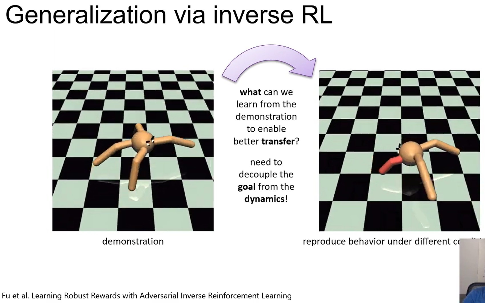

'Learning Robust Rewards with Adversarial Inverse Reinforcement Learning'에서 실제로 ant가 걷는 것을 학습하면 전문가와 다른 방식으로 걷지만 reward를 최대화하는 것을 볼 수 있다.
* 이는 inverse RL의 이점 중 하나로 전문가의 행동을 복사하는 것이 아니라 의도를 학습해 의미 있는 행동을 얻을 수  있다.
* 이를 위해서는 reward function과 dynamics를 분리해야 하고 이것이 inverse RL이 하는 일이다.

  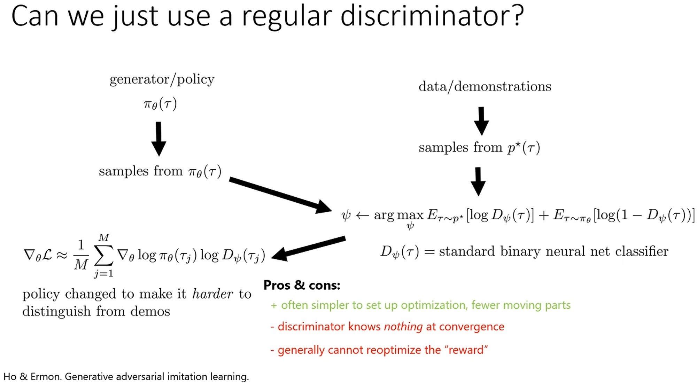

GAN 프레임워크에서 inverse RL을 연결하기 위해 다른 유형의 discriminator를 사용했다.
* Reward function을 학습하기 위해 필요했다.

만약 reward function 학습 없이 전문가의 policy를 복사하고 싶다면 GAN과 동일한 discriminator를 사용할 수 있다.
* Ho와 Ermon의 Generative Adversarial Imitation Learning 논문에서 소개되었다.

Reward function을 학습하기 않기 때문에 inverse RL이 아니지만, 전문가의 policy를 복원하므로 잘 정의된 imitation learning 방법이다.
여기에 몇가지 trade-off가 있다.
* 구현이 간단하다는 장점이 있다.
* 하지만, discriminator는 무엇이 좋은 action(높은 reward를 주는 action)인지 모른다.
따라서, 경로 따라 이동 중 공사 등으로 가지 못하는 것처럼 새로운 environment를 대처할 수 없다.
  * Reward function을 학습했으면, 다른 길로 돌아가는 것이 가능하다.
	

  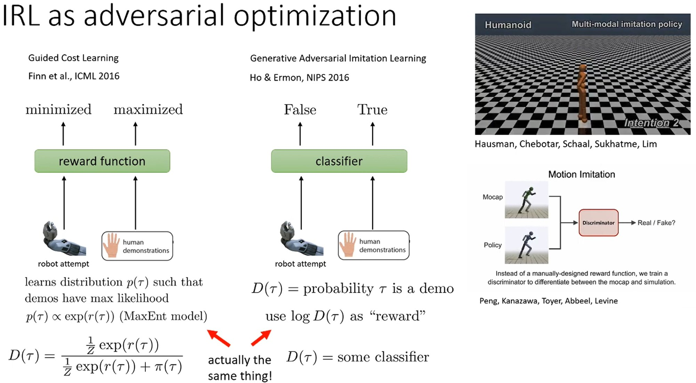

요약하면 위와 같다.
* Inverse RL은 다양한 setting에서 활용될 수 있다.
* 예를 들어 일종의 clustering 방법론과 결합해 heterogeneous demonstrations에서 여러 다른 behavior cluster를 학습할 수 있다.
* Image로부터 inverse RL 또는 imitation learning을 수행해 시뮬레이션된 보행 걸음걸이 등을 복사할 수도 있다.

  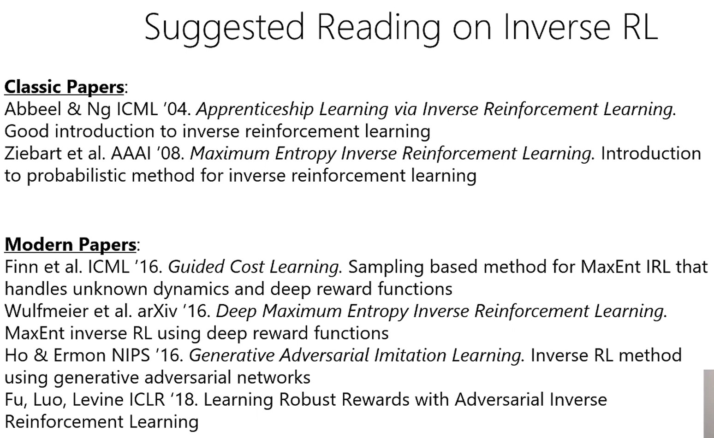

