Sequence 모델을 활용한 RL에 대해 알아보자.

# 1. POMDP (Partially Observable Markov Decision Process)

  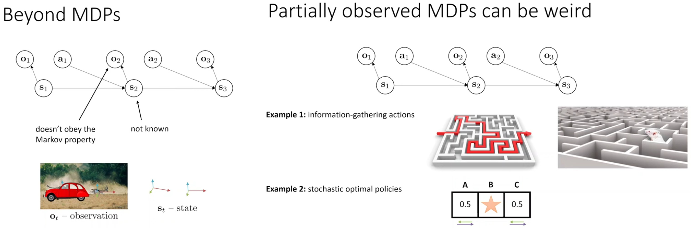

RL에서 sequence model을 고려하게 된 출발점이 제한된 관측만 얻는 POMDP 환경이다.
* POMDP란 현재 관측만으로 state를 추론하기에 충분한 정보를 갖지 못하여 이전 관측들이 정보를 더 줄 수 있는 상황을 의미힌다.
Partial observation 환경에서는 state가 무엇인지 모르고 심지어 state의 type도 모른다.
* State는 충분한 정보를 가지고 있기 때문에 이전 states가 미래 예측에 더 많은 정보를 주지 않는다.
즉, 현재 state가 과거로부터 미래를 분리한다.
  * State가 미래를 deterministic하게 결정한다는 것은 아니다.
  다만, 현재 state를 알고 있다면 이전 states이 미래 예측에 도움이 되지 않는다는 뜻이다.

지금끼자 논의한 많은 알고리즘들이 전체 state를 알 수 있는 상황을 가정하지만, 대부분의 실제 task는 state가 주어지지 않는 경우가 많다.
* 때로는 partial observation이 너무 미미해서 관측을 상태처럼 취급해도 잘 작동하는 경우도 있다.

다음과 같은 예시를 들 수 있다.
* 치타가 가젤을 쫓는 장면 image를 관측이라고 하자.
그 관측의 이면에는 동물들의 위치, 운동량, 신체 구성 등의 state가 있을 것이다.
관측은 부분적일 수 있다.
자동차가 치타를 가려 치타를 볼 수 없는 상황이 있을 수 있다.
State 자체는 변하지 않지만 관측에는 현재 state를 추론하기에 충분한 정보가 없는 것이다.
* Atari 게임의 경우 기술적으로는 partial observation이지만, 관측이 거의 모든 정보를 담고 있다.
  * System state는 Atari 에뮬레이터의 RAM이다.
* 자동차를 운전할 때 정면만 관측하면 사각지대에 다른 차량이 있을 수 있다.
이 차량들은 미래 state에 매우 중요하기 때문에 정면은 매우 부분적인 관측이다.
* 게임 내에 현재 관측에서는 볼 수 없지만 게임을 효과적으로 하기 위해 기억해야 할 과거 관측들이 많을 수 있다.
* 다른 agents와 상호작용에서 partial observation이 매우 중요하다.
  * 인간과 상호작용 하는 로봇의 경우 인간의 행동은 관측할 수 있지만, 그들의 마음속 까지 관측할 수 없다.
  * 대화 시스템의 경우 관측이 텍스트 문자열일 것이고, 상호작용의 history가 중요할 것이다.

Fully observed MDP에서는 일어나지 않는 많은 일들이 POMDP에서 발생할 수 있다.
몇 가지 예를 살펴 보자.
* Informtation-gathering actions
  * POMDP에서는 더 높은 reward로 이어지지 않지만, reward가 있는 곳에 대한 정보를 얻게 해주는 action을 하는 것이 최적일 수 있다.
    * 미로를 탐색할 때, 하나의 미로만 푼다고 가정하면, 현재 나의 위치가 state가 되기 때문에 RL 알고리즘으로 풀면 되고 그러면 최적 policy가 하나로 고정될 것이다.
    하지만, 미로의 분포, 즉 여러 개의 미로를 풀어야 하는 policy를 학습해야 할 경우 현재 나의 위치만으로는 fully observed MDP가 될 수 없다.
    따라서 미로 위에 올라가 미로의 구성을 알아보려는 action이 최적이 될 수 있다.
    이때 그 action은 출구에 전혀 가까워지지 않지만, 최적의 action이 되는 것이다.
* Stochastic optimal policies 
  * Fully observed MDP에서는 항상 최적인 deterministic policy가 존재한다.
  동등하게 좋은 확률적 policy가 있을 수 있지만, 확률적 policy만이 최적인 상황은 절대 없다.
  * POMDP의 경우 확률적 policy만이 최적인 상황이 있다.
    * B state에 reward가 있고 A 또는 C state에서 시작할 확률을 각각 0.5라고 할 때, 아무 것도 관측할 수 없는 POMDP 환경이라고 하자.
    그럼 deterministic하게 왼쪽 또는 오른쪽으로 가는 것보단, 왼쪽/오른쪽 각 50% 확률로 가는 것이 최적 policy가 된다.

  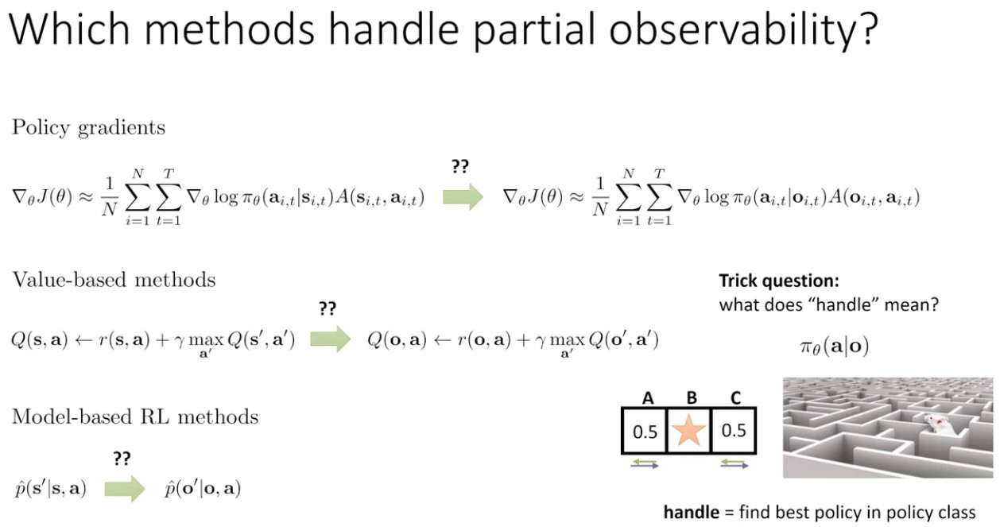

POMDP를 올바르게 처리할 수 있는 방법들을 3가지 알고리즘 관점에서 살펴보자.
이때, 과거 action을 메모리에 저장하지 않는 reactive policy class만을 고려한다.
* 3-state 예시에서 왼쪽 오른쪽 50% 확률이 최적 policy이지만, A에서 시작했을 때 왼쪽으로 가면 아무것도 없다는 history를 알면 더 잘할 수 있게 된다.

단순히 state $s$를 observation $o$로 대체한다고 하자.
* 결론만 말하자면, state에 의존하지 않는 advantage를 활용한 policy gradient는 활용할 수 있다.

  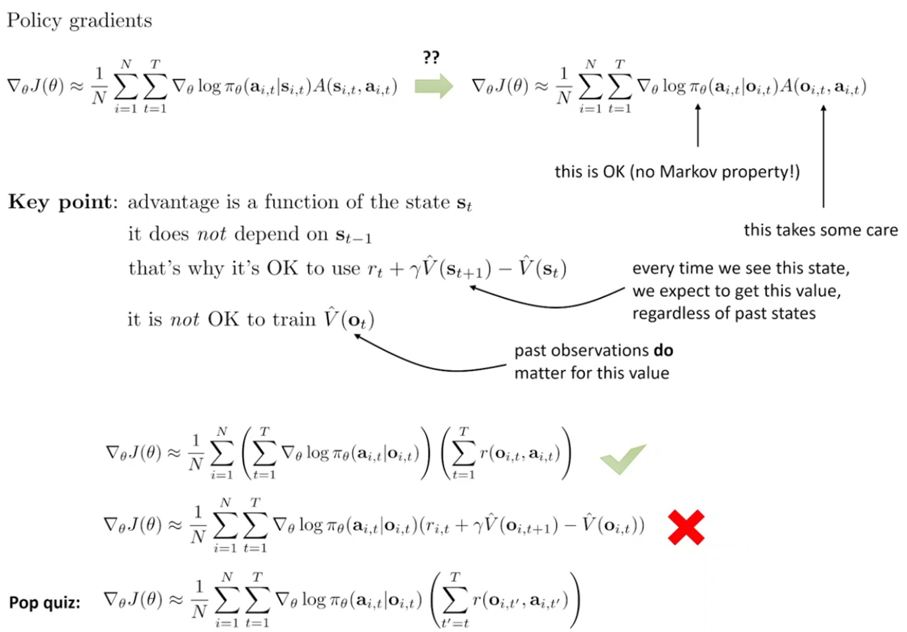

Policy gradient는 markov property를 가정하지 않고, 확률의 chain rule이 적용될 수 있도록 분포가 인수분해된다고 가정한다.
* $p(\tau) = p(s_1) \cdot \pi(a_1|s_1) \cdot p(s_2|s_1, a_1) \cdots$ 라고 가정하지만, $p(s_t|s_{t-1}, a_{t-1}) = p(s_t|s_{t- 1:1}, a_{t-1:1})$라고 가정하지 않는다.
* $p(\tau) = p(s_1) \cdot \pi(a_1|s_1) \cdot p(s_2|s_1, a_1) \cdots$ 는 항상 참이다.

하지만 advantage를 추정하는 방법에 따라 문제가 발생할 수 있다.
* $r_t + V(s_{t+1}) - V(s_t)$ 구조는 $s_{t-1}$에 의존하지 않아 괜찮아 보일 수 있다.
* 하지만, $s_t$를 $o_t$로 대체하면 $V(o_t)$는 실제 value를 제대로 측정하지 못하기 때문에 문제가 생긴다.
* 같은 $o_t$라고 어떻게 거기까지 도달했냐에 따라 실제 value가 달라질 수 있다.
* 반면, policy gradient에서 일반 Monte Calro estimator를 사용하는 경우, 즉 advantage 대신 단순히 reward의 합을 대입하는 경우는 괜찮다.

Causality trick을 사용하는 것은 markov property를 활용하지 않기 때문에 괜찮다.
또한 baseline으로 $\hat{V}(o_t)$를 사용하는 것도 괜찮다.
원하는 만큼 variance를 줄이지 못할 수 있지만, baseline은 항상 unbiased이기 때문에 괜찮다.

$$
\begin{aligned}
\mathbb{E}_{a_t \sim \pi(a_t|o_t)} \left[\nabla\log \pi(a_t|o_t) \cdot \left(r_t - \hat{V}(o_t)\right)\right]
&= \mathbb{E}_{a_t \sim \pi(a_t|o_t)} \left[\nabla\log \pi(a_t|o_t) \cdot r_t \right] - \mathbb{E}_{a_t \sim \pi(a_t|o_t)} \left[\nabla\log \pi(a_t|o_t) \cdot \hat{V}(o_t)\right] \\
&= \mathbb{E}_{a_t \sim \pi(a_t|o_t)} \left[\nabla\log \pi(a_t|o_t) \cdot r_t \right] - \sum_{a_t} \pi(a_t|o_t) \cdot \nabla\log \pi(a_t|o_t) \cdot \left(r_t - \hat{V}(o_t)\right) \\
&= \mathbb{E}_{a_t \sim \pi(a_t|o_t)} \left[\nabla\log \pi(a_t|o_t) \cdot r_t \right] - \sum_{a_t} \nabla\pi(a_t|o_t) \cdot \hat{V}(o_t) \quad \left(\because \nabla\log\pi = \frac{\nabla\pi}{\pi}\right) \\
&= \mathbb{E}_{a_t \sim \pi(a_t|o_t)} \left[\nabla\log \pi(a_t|o_t) \cdot r_t \right] - \hat{V}(o_t) \cdot \nabla \sum_{a_t} \pi(a_t|o_t) \\
&= \mathbb{E}_{a_t \sim \pi(a_t|o_t)} \left[\nabla\log \pi(a_t|o_t) \cdot r_t \right] - \hat{V}(o_t) \cdot \nabla 1 \\
&= \mathbb{E}_{a_t \sim \pi(a_t|o_t)} \left[\nabla\log \pi(a_t|o_t) \cdot r_t \right]
\end{aligned}
$$

  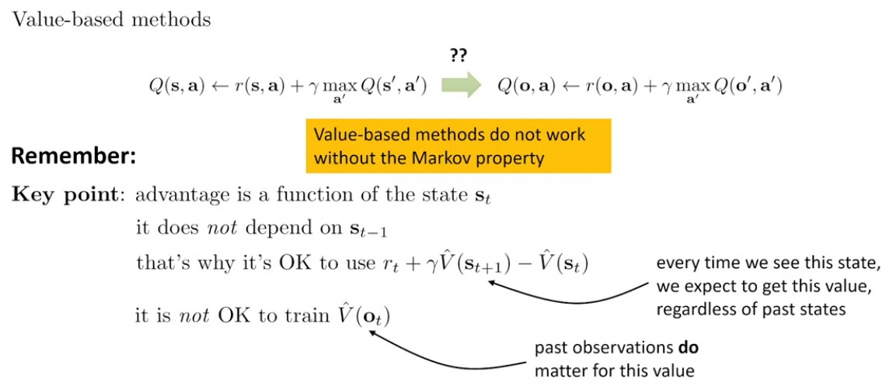

Value function과 Q function에서 state 대신 observation만 사용하는 것은 괜찮지 않다.
* 기본적으로 두 개의 function 모두 동일한 state $s$에서 각 행동에 대한 가치가 동일할 것이라는 가정에 의존한다.
* 하지만, 주어진 partial obseravtion $o$에 대해서는 이전의 observation이 영향을 주기 때문에 단순 대체만으로 두 개의 function을 활용할 수 없다.
* 직관적으로 Q function은 항상 deterministic policy를 가진다.
그리고 이는 3-state 예에서 최적의 policy를 찾을 수 없다.

Atari 게임처럼 관측이 markov state와 충분히 가까우면 결과가 괜찮을 수 있다.

  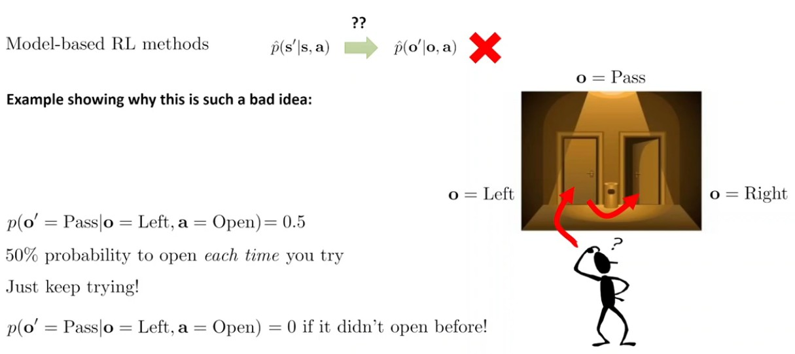

Model-based RL의 경우도 단순히 $s$를 $o$로 대체할 수 없다.

예를 들어 두 개의 문이 있다고 하자.
* 왼쪽/오른쪽 문 중 하나가 열려 있고, 어느 쪽인지는 에피소드마다 50% 확률로 무작위 결정된다.
* Agent는 어떤 문이 열려 있는지 관측 불가 (POMDP)능 하다.
* Observation: $o_{left}$ (왼쪽 문 앞), $o_{right}$ (오른쪽 문 앞), $o_{pass}$ (통과)

Markov dynamics model $p(o^\prime|o_t, a_t)$를 학습과정을 살펴 보자.
* 왼쪽 문이 열린 에피소드: 왼쪽 시도 → 통과
* 오른쪽 문이 열린 에피소드: 왼쪽 시도 → 실패
* 두 경우가 50/50이므로 모델이 학습하는 값: $p(o_{pass} | o_{left}, \text{open}) = 0.5$

이 markov dynamics model을 기반으로 planner는 "왼쪽 문을 열 확률이 매번 독립적으로 50%"라고 해석한다.
따라서 "계속 시도하면 언젠가 열린다"는 잘못된 결론을 내려 계속 왼쪽 문을 여는 시도를 할 수 있다.
하지만 실제로는 한 episode에서 왼쪽 문이 잠겨 있으면 아무리 시도해도 열리지 않는다.
* 한 번 실패했다면 통과 확률은 0.5가 아니라 0이지만, planner는 이를 알지 못한다.

즉, markov dynamics model은 이를 표현할 수 없기 때문에 non-markov observation과 함께 사용할 수 없다.
근본 원인은 dynamics model이 $p(o^\prime|o_t, a_t)$만 입력으로 받기 때문에, "이전에 이미 시도했다"는 history를 담을 수 없다는 것이다.

메모리 없는 policy는 꽤 인위적인 constraint이다.
실제로는 문을 시도했다는 것을 기억하여 미래에 다른 것을 해야 한다는 것을 안다.
그렇기 때문에 partial obseravtion MDP에 대한 좋은 해결책을 원한다면, 관측 history를 입력으로 받는 non-markov policy를 사용해야 한다.

# 2. Non Markovian Policy

Observation history를 입력으로 받는 non markovian policy 몇 가지를 살펴보자.

  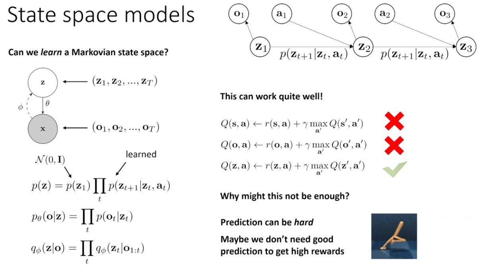

한 가지 방법은 observation으로 markovian state space를 학습하는 것이다.

Sequence VAE를 훈련한다고 가정하면, 입력은 observations의 sequence $o_1, \cdots, o_T$ 이고 hidden states는 latent state의 seuqence $z_1, \cdots, z_T$일 것이다.
* Encoder $q_\phi(z_t|o_1, \cdots, o_t)$
* Decoder $p_\theta(o_t|z_t)$
* Prior $p(z_1) = \mathcal{N}(0, I) \approx q_\phi(z_1|o_1)$
* Dynamics $p(z_t|z_{t-1}, a_{t-1})$ 학습
  * Dynamics는 어떻게 학습에 관해서 의문점이 있지만 일단 넘어가자...

이를 학습할 수 있다면 $z$가 markov property를 따르도록 학습됐기 때문에 $s$ 대신 $z$로 대체할 수 있다.
하지만, 경우에 따라 prediction model을 학습하기 매우 어렵기 때문에 모든 POMDP에 대한 충분한 해결책이 될 수 없다.  
* 많은 경우 RL을 실행하기 위해 모든 observation을 완전히 예측할 필요가 없다.
	* Mojoko environments의 예시에서 image를 직접 prediction $p_\theta(o_t|z_t)$할 수 있다면 hidden state를 markov state space로 사용할 수 있다.
	* 하지만, image의 모든 pixel을 올바르게 생성하는 것이 RL 문제를 푸는 것보다 더 어려울 수 있다.
	* 따라서 높은 reward를 얻기 위해 좋은 prediction이 필요하지 않을 수 있다.

  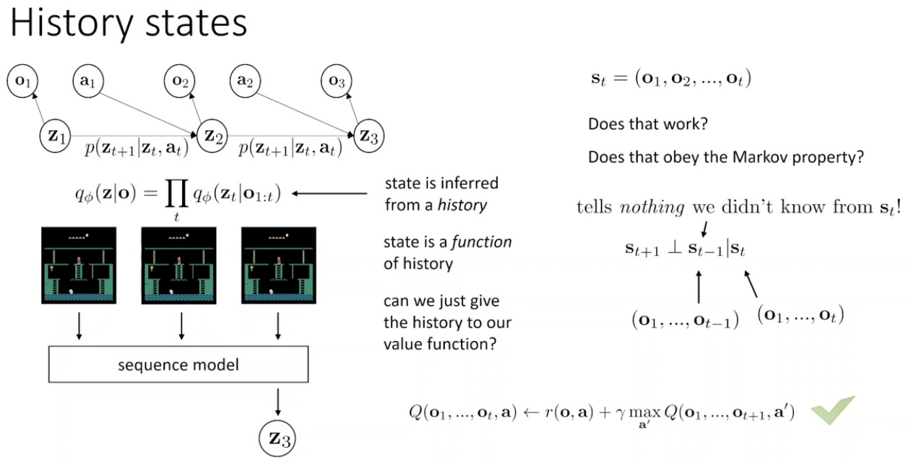

$z_t$를 추론의 어려움을 해결하기 위해 observation sequence 자체를 바로 state $s$로 활용하는 방법이 있다.
* $o_1 ~ o_t$가 $z_t$를 추론하기에 충분했다면, $o_1 ~ o_t$까지가 markov state를 얻는데 필요한 모든 것을 담고 있다는 것을 의미한다.

이미 $s_t$를 알고 있다면, 즉 $o_1 ~ o_t$까지를 안다면, $s_{t-1}$을 알아내는 것, 즉 $o_1 ~ o_{t-1}$을 알아내는 것은 새로운 것을 알려주지 않는다.
이것이 observation history가 마르코프 성질을 따르는 이유입니다.
* $o_{1:t}$가 현재 state $s_t$에 필요한 모든 정보를 담고있냐는 것과 별개로 markov property를 만족한다.

  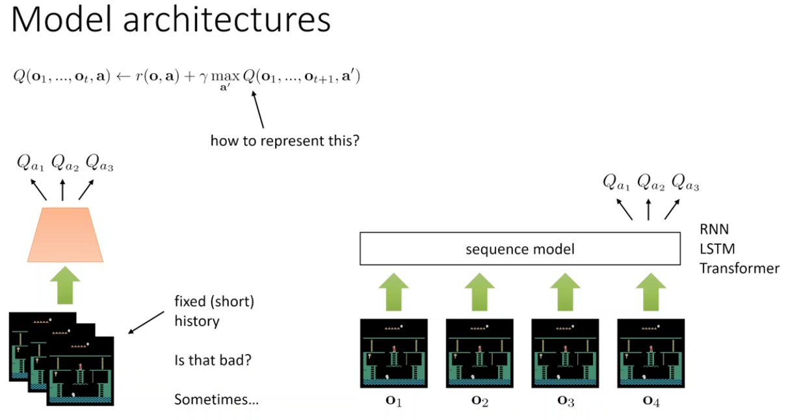

Observation history를 활용할 수 있는 model architecture를 살펴보자.

모든 observation은 concat할 지는 task에 따라 고민해야 한다.
* Atari 게임의 경우 고정된 짧은 observation history만으로 충분히 markov에 가까울 수 있다.
* 반면, 미로 찾기 처럼 모든 observation을 기억해야 할 수도 있다.

따라서 일반적으로 Q function의 일부로 가변 길이의 observation history를 입력으로 받는 sequence model을 사용해야 한다.
* RNN, LSTM, Transformer 등이 있다.
* 이 경우 Q function, policy, dynamics model이 sequence model로 표현되어야 한다.

  

Observation sequence를 state $s$고 고려할 때 효율성 문제가 발생한다.
* Q-learning에서 $(o_t, a_t, o_{t+1})$을 수집하여 replay buffer에 저장하면, batch sample할 때 concat 과정을 모든 observation, action, next observation의 history를 가져와야 한다.
Memory space 복잡도가 $O(T^2)$로 증가하게 된다.

이를 완화하는 방법은 sequence model을 사용해 observation history의 입력으로 얻은 hidden state를 전체 history 대신 저장하는 것이다.
따라서 history를 load할 때마다 전체 sequence를 가져오지 않고 중간 지점에서 시작하고 이전의 observation은 hidden state로 대신한다.

기본 아이디어는 sequential model의 hidden state를 시스템의 markov state처럼 사용하는 것이다.
단, model이 자체가 업데이트될 때 hidden state도 변한다는 주의 사항이 있다.
* RNN의 예시를 알고 싶다면, Recurrent Experience Replay in Distributed Reinforcement Learning 논문을 참고하자.
* Transformer는 전체 history를 넣어야 하는 구조이기 때문에 2023년 기준 적절한 방법론이 제안되지 않았다.

이는 Atari 게임에서 좋은 성능을 낸다.

# 3. Single Step RL and Language Models

Section 2에서는 RL에 sequential modle을 활용하는 방법을 살펴보았다.
이번 section에서는 RL이 더 나은 language sequential model을 훈련하는 데 도움을 주는 방법을 논의해보자.

오늘날 Language model은 supervised learning (SL)으로 입력 token의 다음 token을 예측하도록 훈련된다.
이때, 훈련 데이터에서 본 것과 같은 종류의 텍스트를 출력하는 것과 같이 데이터의 분포를 단순히 맞추는 것이 아니라, 어떤 reward function을 최대화하길 원한다면 RL로도 훈련할 수 있다.
* 사람들이 보고 싶어하는 종류의 텍스트를 생성, 데이터베이스나 계산기를 호출하는 방법, 더 잘 대화하고 대화 목표를 달성 등은 단순히 훈련 데이터를 맞추는 것과 다르다.

  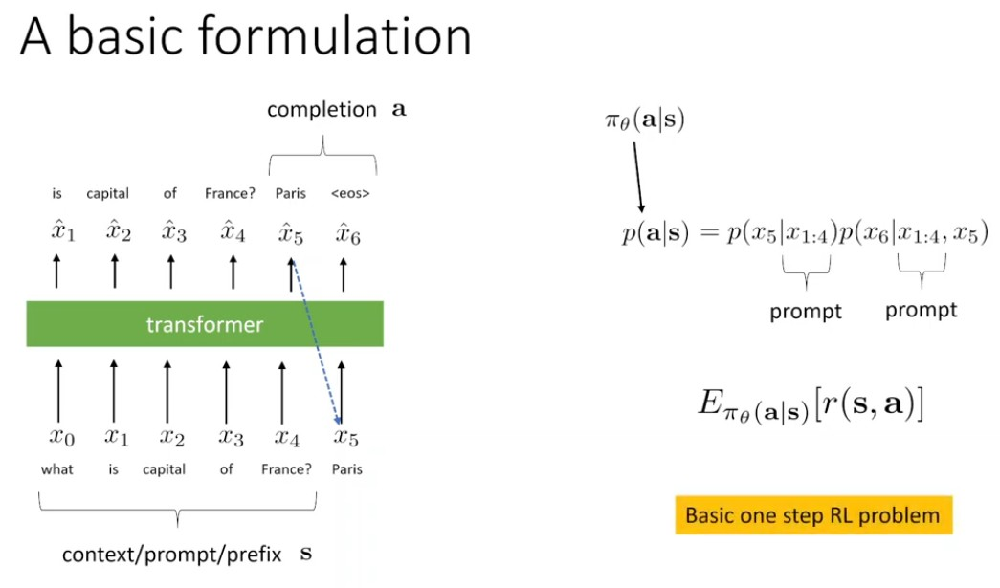

언어 생성 task에 해당하는 MDP 또는 POMDP를 정의하고 어떤 알고리즘을 활용할지 선택해야 한다.
먼저 ChatGPT 등 널리 활용되는 single step 문제에 대한 RL 응용을 살펴보자.

Language model은 prompt를 입력받고 그 뒤를 생성하는 conditional generation task이다.
* 즉, 입력된 prompt가 state $s$이고 생성되는 tokens가 action $a$이다.
* 예를 들어, state 'what is captial of France?'가 주어지면 'Paris \<eos>'라는 action을 해야 한다.
* Action 'Paris \<eos>'의 확률은 $p(x_5|x_{1:4})$와 $p(x_6|x_{1:4},x_5)$의 곱이고 학습해야 할 policy에 해당 한다.
	* 주의해야 할 점은 RL 알고리즘 관점에서 위의 과정은 하나의 time step이라는 것이다.
	* 일반 RL time step에서 항상 같은 것을 고려했지만, 위의 예시에서 language model의 RL에는 두 종류의 time step이 존재한다.
	* 즉, 언어 time step과 RL time step은 반드시 같지 않다.
* 즉, Policy 확률은 action에 대한 언어 time step 확률의 곱으로 표현된다.

위의 경우, 언어 생성 관점에서는 많은 time step이 있지만 RL 관점에서는 single step MDP로 bandit 문제와 같다.

기본적인 single step bandit RL 문제에서 action, state, policy를 정의했다.
Objective function은 일반 RL과 마찬가지로 policy 하에서 reward의 기댓값을 최대화하는 것으로 정의할 수 있다.

  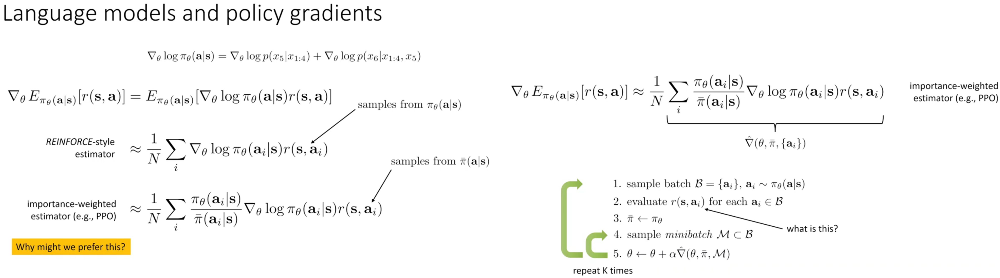

Policy gradient를 적용하면 위의 사진과 같다.
* 표쥰 REINFORCE estimator에서는 현재 policy $\pi_\theta$로 action을 sampling해야 한다.
  * 시작은 SL로 학습된 language model이지만, 계속 업데이트 된다.
* PPO와 같은 importance sampling estimator에서는 다른 policy의 샘플을 활용할 수 있다.
  * 하나의 고정된 language model ($\bar{\pi}$)이 생성한 샘플을 사용한다.

Language model의 추론 비용 그리고 특히 reward를 평가하는 비용이 비싸기 때문에 importance sampling estimator가 훨씬 더 선호된다.
Gradient step마다 미리 계산된 reward를 반복적으로 활용하는 것이다.

Importance sampling estimator로 single step RL 문제를 최적화하는 과정은 그림의 우측에서 살펴 볼 수 있다.
* 현재 policy $\pi_\theta$ (language model)로 completion (질문에 답이 있는 sample) batch를 생성하고 reward 평가를 진행한다.
* 이후 mini-batch로 importance sampling을 통해 policy를 업데이트한다.
* 이는 매우 전형적인 importance sampling policy gradient 또는 PPO style loop이며, RL로 언어 모델을 훈련하는 매우 인기 있는 방법이다.

  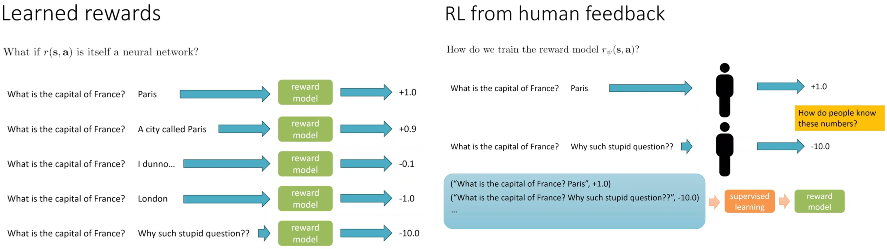

여기서 reward 평가를 해결해야 한다.
'What is the capital of France?'라는 질문에 policy는 다양한 답변을 생성할 것이고 이를 평가할 수 있어야 한다.
'잘 모름'이라는 것도 완전히 틀린 것은 아닐 수 있다.
* SL은 paris와 관련된 것만 생성하도록 language model을 학습한다.
* 반면, RL은 '잘 모름'은 neutral 하고 틀리거나 공격적인 언어 생성은 하면 안 된다는 것도 학습한다.

따라서 reward model은 올바른 답이 무엇인지 알아야 할 뿐만 아니라, 약간 틀린 답이나 질문의 범위를 벗어난 매우 다른 답에 reward를 할당하는 방법도 이해해야 한다.
이것은 매우 개방형 어휘 문제이므로 실제로 매우 강력한 reward model이 필요하다.

이때, 사람이 직접 숫자로 평가하여 label을 만들어 reward model $r_\psi$를 학습할 수 있다.
하지만, 질문에 대한 답이 주관적인 경우 사람들은 통일된 그리고 명확한 수치를 할당하기 어려울 것이다.

  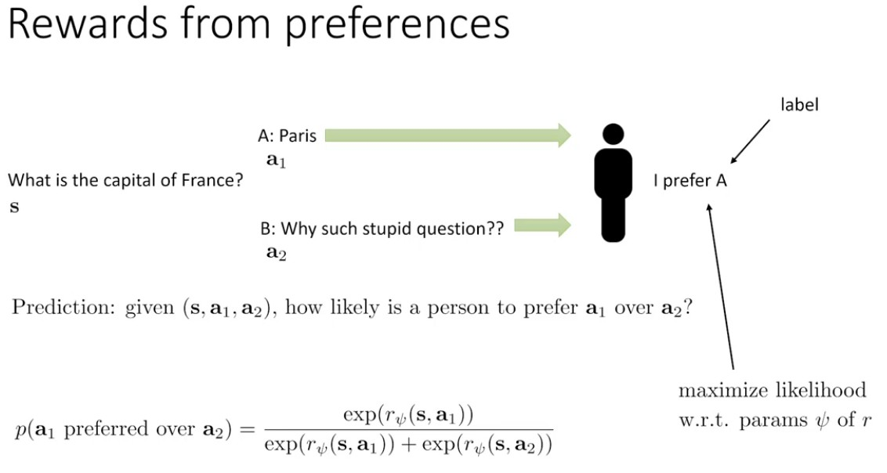

사람들에게 더 쉬울 수 있는 것은 두 답변을 비교하는 것이다.
답변 $a_2$보다 $a_1$이 더 선호될 확률을 단순히 모델링하고 학습할 수 있다.
그런데 결국 원하는 것은 reward function이므로 선호도 확률을 reward function으로 설명할 수 있어야 한다.
* Max-entropy inverse RL과 동일한 수학적 기반에서 파생된 매우 인기 있는 선택은 exponential of the reward를 사용하는 것이다.
* $a_1$이 $a_2$보다 선호될 확률은 그것의 exponential of the reward에 비례한다.
즉, 하나의 reward가 다른 것보다 명확히 더 좋다면 그것이 확실히 선호될 것이지만, reward가 거의 같다면 선호될 가능성도 거의 같다.
* Exponential 변환의 수학적 이유는 max-ent inverse RL 강의에서 본 것과 매우 유사하다.

학습은 $(s, a_1, a_2)$ tuple에 대해 선호도 확률의 log likelihood를 최대화하는 것이다.
* 선호도 확률은 위 그림에서 정의된 exponential of the reward에 관한 식을 사용한다.
* Reward model의 parameter $\psi$가 학습 parameter이다.

선호도 확률은 확장 가능하다.
* 4 개의 비교가 있고 선호하는 1가지를 선택하게 할 수 있다.
* 4 개의 비교가 있고 각 쌍별로 선호하는 답변을 선택하게 할 수 있다.

  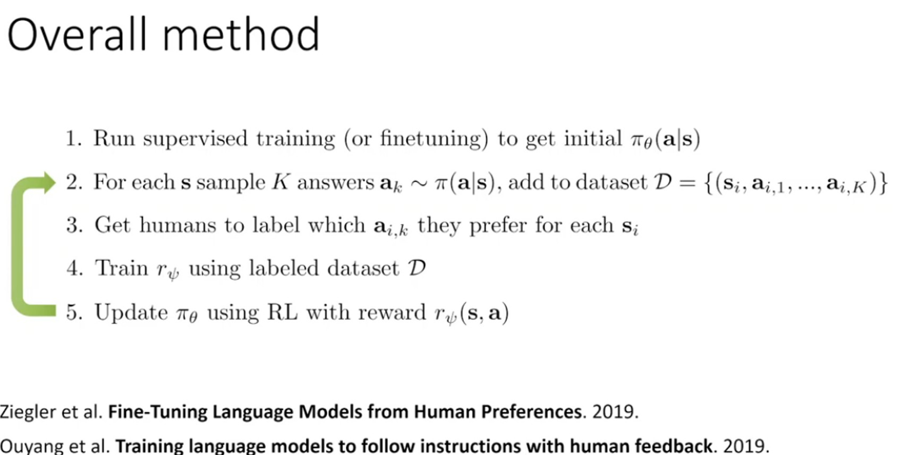

* 이것들은 기본적으로 InstructGPT, ChatGPT 등의 기반이 되는 기법이다.

  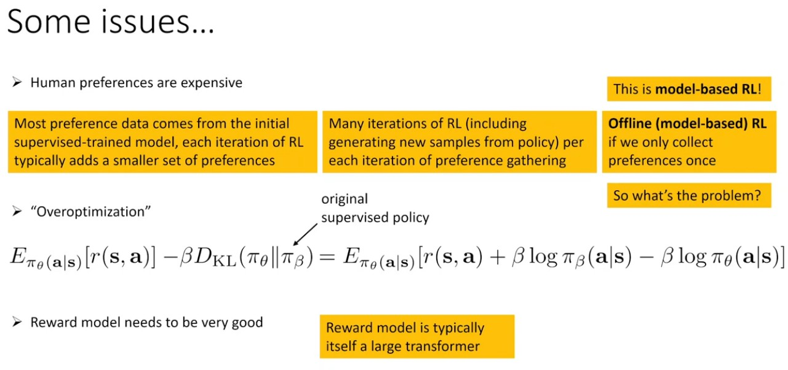

몇 가지 이슈가 존재한다.

인간의 선호도 평가는 시간/비용 측면에서 매우 비싸다.
* Policy 업데이트될 때마다 생성된 action에 대해 human feedback을 요청하고 reward model을 학습하는 대신 처음 한 번만 reward model 학습하고 이를 계속 활용할 수 있다.
* 외부 loop 없이 1 ~ 5 단계를 한 번만 수행할 수도 있다.

Model-based RL과 유사한 구조를 가지기 때문에 over-optimization 문제가 발생한다.
* Model-based RL은 dynamics model을 한 번 학습하고 model 기반으로 수렴할 때까지 RL policy 업데이트를 수행하는 과정을 반복한다.
* Language model에서는 human feedback으로 reward model을 한 번 학습하고 policy (language model)를 수렴할 때까지 업데이트하는 과정을 반복한다.
  * 즉, reward model이 dynamics model 역할을 한다.
* 문제는 model-based 기반 RL에서는 distribution shift 문제가 있었고 language model을 위한 RL에서는 이것을 over-optimization이라고 부른다.
  * 예를 들어, 정중히 답변이 높은 reward를 주도록 reward model이 학습됐을 때, policy가 본 적 없는 '매우매우매우 감사합니다'라는 답변을 생성할 수 있다.
  Reward model은 학습 시 그러한 답변을 보지 못했지만(OOD 문제) 높은 reward를 줄 수 있고 결국 policy 학습이 잘 되지 못한다.
* Over-optimization은 종종 간단한 방법으로 해결된다.
  * 문제의 원인은 policy가 처음의 supervised policy에서 너무 멀어지기 때문이다.
  * 이를 해결하기 위해 supervised policy에서 멀어지면 penalty를 주는 term을 추가할 수 있다.
  * $\mathcal{H}(\pi_\theta) = -\mathbb{E}_{\pi_theta}[\log \pi_\theat]$
  * 즉, entropy term을 최대화하는 것으로 policy가 다양한 답변을 생성하도록 유도한다.

마지막으로 reward model이 매우 좋아야 한다.
* 일반적으로 pre-trained language model (large transformer)을 fine-tuning하여 reward model을 학습한다.
* RL에서 policy가 reward model을 exploit하여 의도와 다르게 학습되는 것을 방지할 정도로 reward model의 generalization power가 강해야 한다.

  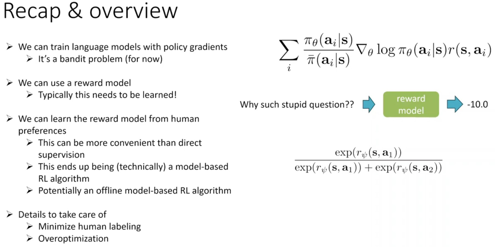

# 4. Multi Step RL and Language Models

POMDP를 사용해 multi step RL로 language model을 학습하는 것을 살펴 보자.

  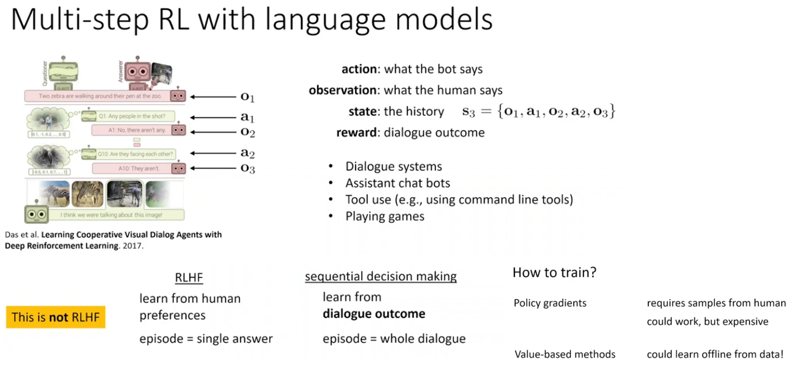

Multi step RL 문제의 예로 2017년 논문에서 소개된 벤치마크인 visual dialogue라는 task가 있다.
* Bot인 질문자와 environment로 고려되는 답변자가 있다.
* 답변자는 특정 사진을 염두에 두고 있으며, 질문자는 어떤 사진인지 알아내기 위해 질문을 해야 한다.
  * 이것은 질문자에게는 순수한 언어 작업이며, 질문자는 정보를 수집하기 위해 적절한 질문을 선택해야 한다.
* 이는 single step이 아닌 여러 time step이 있고 마지막에 reward를 얻는 multi step이다.

위의 task는 POMDP로 구조화할 수 있다.
* Observation: 답변자의 응답
* Action: 질문자의 질문 선택
* State: observation과 action의 history $o_{1:t}, a_{1:t}$
* Reward: 대화의 결과로 질문자의 정답 여부

질문자는 정답을 greedy하게 묻는 것 대신 정보를 얻어 정답을 추측할 수 있도록 전략적인 질문해야 하기 때문에 multi step 특성이 매우 중요하다.
* 단기 이득보다는 장기 목표를 위한 순차적 의사결정을 해야 한다.
* 이는 중간 action으론 즉각적인 reward를 얻지 못하지만, 미래 reward를 위해 최적의 action을 선택하는 RL 문자와 유사하다.
* 당연히 같은 질문을 여러 번 해서는 안 되며, 이미 수집한 정보와 아직 밝혀지지 않은 정보가 무엇인지 생각하고 그에 따라 진행해야 한다.

Multi step task는 다양한 곳의 시나리오에서 활용된다.
* Assistant 챗봇
* Database, Linux 같은 도구에 들어가는 텍스트를 출력하여 해당 도구를 사용하여 주어진 query에 대한 답을 생성하는 도구 사용 설정
* Text adventure game 등

Multi step task는 single step task에서 살펴 본 RLHF (RL for Human feedback)과 다르다.
* RLHF는 인간의 선호도를 기반으로 학습이 진행된 single turn bandit 문제였다.
* Multi step task에서는 전체 multi turn 상호 작용의 결과로 마지막에 나타나는 reward를 최대화해야 한다.

가장 최근 응답뿐만 아니라 이전의 모든 응답에도 주의를 기울여야 하기 때문에 partial observablity가 중요하다.
이전과는 다른 policy를 학습 체계가 필요하다.
* Policy gradient는 multi turn policy를 위한 방법으로 생각할 수 있다.
  * Policy gradient는 partial observability를 처리할 수 있다.
  * 하지만, 모든 roll out마다 인간으로부터 샘플을 얻어야 한다는 문제가 있기 때문에 인간과의 훨씬 더 많은 상호작요이 필요하다.
    * Sing step의 경우 인간의 선호도 데이터를 학습하는 reward model이 있기 때문에 인간과 비교적 덜 상호작용한다.
    * Multi step의 경우 모든 단일 episode가 인간과의 대화를 필요로 하는 task로 인간과 더 많은 상호작용을 해야 한다.
    * 사람 대신 tool(DB, Linux 등)과 상호작용하는 경우라면 훨씬 더 간단한다.
* Value-based methods가 매우 매력적인 선택이다.
  * Offline RL로 이미 있는 대화 데이터를 학습할 수 있기 때문에 훨씬 현실적이다.

Policy gradient를 활용하는 방법은 importance sampling으로 oiffline RL을 하는 single step RL과 동일하므로 이번에는 value-based methods에 초점을 맞추겠다.
* Policy gradient에서는 distribution shift 문제를 trust region을 강제하면서 다룬다.
  * PPO: clip, TRPO: KL constraint
* Valued-based에서는 Q값 과대추렁을 CQL/IQL로 억제한다.
* Policy gradient는 trust region을 지키는 한 off-policy 데이터를 쓸 수 있지만, multi-step 대화처럼 trajectory가 길어지면 각 step마다 importance ratio가 곱해져서 ($\prod_t \frac{\pi_\theta(a_t|s_t)}{\bar{\pi}(a_t|s_t)}$) 분산이 기하급수적으로 커진다.
Value-based는 이 ratio 곱셈 문제가 없어서 긴 horizon에서 더 안정적이다.

  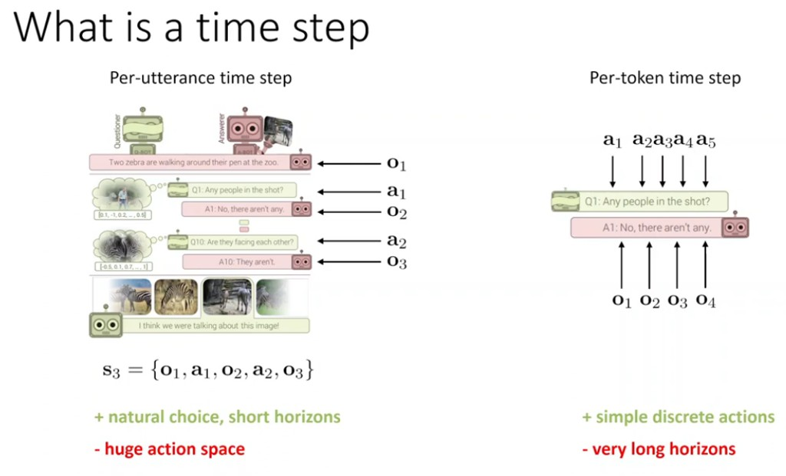

Language 문제를 MDP로 바꾸기 위해 action과 observation 단위를 정해야 한다.
즉, Value-based RL을 대화에 적용할 때 1 time step을 무엇으로 정의할 것인지 결정해야 한다.
1. Utterance(발화) 단위
  * 전체 문장을 action과 observation으로 고려한다.
  * 대화가 10번의 주고받는 질문과 답변이라면, 10개의 time step을 갖게 될 것이다.
  * 문제 action space가 bot이 말할 수 있는 전체 공간(token의 조합)으로 매우 거대하다는 것이다.
2. Token 단위
  * Action space가 거대한 문제를 완화하는 방법으로 token을 action으로 고려하는 것이다.
  * 발화의 모든 단일 token이 별도의 action time step 그리고 observation time step이 된다.
    * 이 경우 observation 없이 $a_t$ 이후 바로 $a_{t+1}$을 선택한다는 특성이 있다.
    * Observation도 마찬가지 이다.
  * 모든 시간 단계에서 단순한 discrete action space (token 집합)를 가지게 된다.
  * 하지만 horizon이 매우 길어진다는 단점이 있다.

어느 것이 더 낫다는 단일한 확립된 표준은 없으므로, 두 가지 모두에 대해 논의하고 장단점에 대해 살펴 보자.

## 4.1. Value-based RL with per Utterance Time Step

  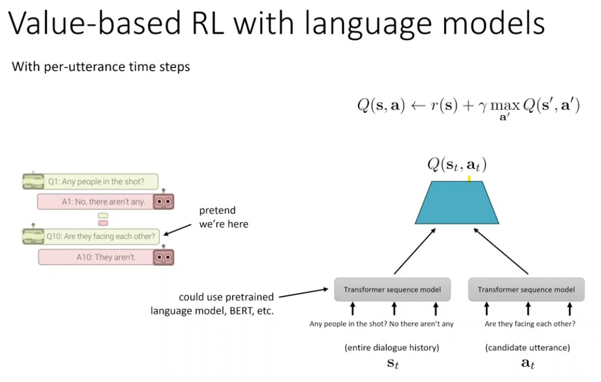

예를 들어, bot이 *Are they facing each other?* 라고 말하는 step에 있다고 가정하자.
해야 할 일은 state를 구성하기 위해 현재 step 이전 까지의 대화 history를 가져오는 것이다.
이 설계에서는 actor-critic 아키텍처를 사용할 수 있다.
* State는 pre-trained language model 등의 sequence model에 입력되고 특정한 embedding을 출력할 것이다.
* Actor
  * Candidate action인 *Are they facing each other?* 또한 sequence model에 입력해 embedding을 얻는다.
  * Actor space가 너무 크기 때문에 다음과 같은 actor를 구현하는 방법이 있다.
    * Q value를 reward 처럼 취급해 Q value를 높이는 방향으로 actor를 학습할 수 있다.
    * Actor 없이 beam search와 같이 Q value 자체를 이용해 가장 높은 Q를 가진 발화를 탐색하도록 할 수 있다.
    하지만, 발화 space가 너무 크기 때문에 까다롭다.
    * Pre-trained model에서 샘플링하여 가장 높은 Q 값을 가진 샘플을 취할 수 있다.
    이는 가장 실용적인 방법이다.
* Critic
  * 두 가지 embedding을 Q value를 출력하는 학습된 function 입력해 Q value를 얻는다.
  * Next time step에 대한 최대값의 추정치를 사용하여 이 Q function을 훈련한다.
    * Next time step에 대한 최대값은 beam search를 수행하여 얻을 수 있다.
    * Actor를 사용해 max Q value를 바로 얻을 수 있다.
    * Pre-trained model에서 샘플링하여 가장 높은 Q 값을 가진 샘플을 취해 최대값에 대한 근사치로 활용할 수 있다.

여러 가지 선택에 대한 많은 연구가 이뤄지고 있다.

## 4.2. Value-based RL with per Token Time Step

  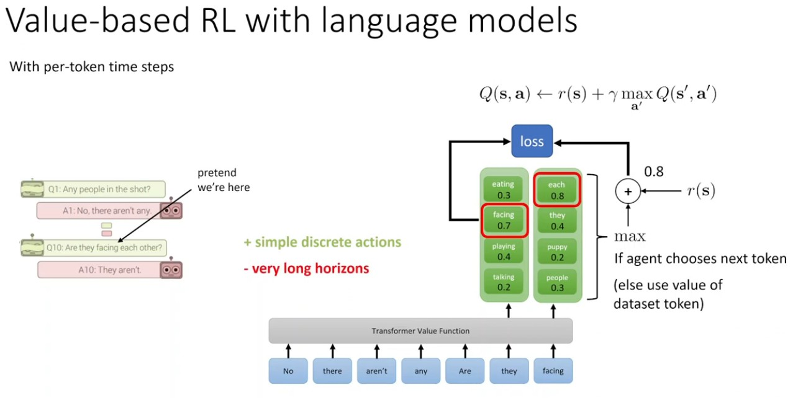

예를 들어, bot이 *Are they* 라고 말하는 step에 있고 *facing* token을 생성하고 있다고 하자.
* 간단함을 위해 token == word라고 가정한다.

개별 token에 대해 bellman backup을 수행할 것이고, 이 설계는 supervised learning과 유사하다.
현재 time step에서 가능한 모든 token에 대해 가능성 확률을 출력하고 그것이 곧 Q value가 된다.
이것은 token 단위 Q-learning가 같다.

Agent (질문자)가 token을 선택할 땐 reward에 모든 token에 대해 Q value의 max을 더한 것을 target value로 설정한다.

$$Q(\text{[..., Are, they]}, \text{facing}) \leftarrow = r(\text{[..., Are, they]}) + \gamma \max_{a^\prime} Q(\text{[..., Are, they, facing]}, a^\prime)$$

환경 (답변자)의 token은 단순히 선택한 token의 Q value reward를 터한 것을 target value로 설정한다.

$$Q(\text{[..., No]}, \text{there}) \leftarrow = r(\text{[..., No]}) + \gamma Q(\text{[..., No, there]}, \text{aren't})$$

어떤 면에서는 token 단위가 utterance 단위보다 더 간단하지만, horizon이 훨씬 더 길어진다는 것에 주의하자.
* Token 단위는 다룰 수 있는 discrete action space를 가지고, actor-critic을 다룰 필요가 없기 때문에 간단하다.

## 4.3. Putting it all together

  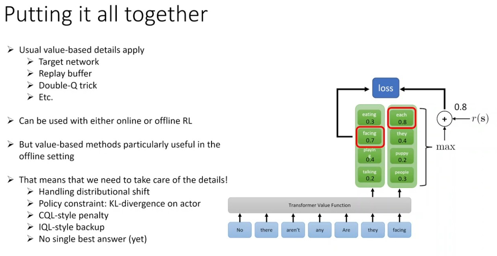

Utterance, token 단위 모두 일반적으로 Q value를 계산하는 target network가 필요하다.
* Replay buffer, Double Q trick 등 value-based 방법에서 고려했던 방법론이 동일하게 적용될 수 있다.

Online 또는 offline RL과 함께 사용할 수 있고, value-based 방법은 특히 offline setting에서 유용하다.
* CQL, IQL 등과 같은 것으로 distribution shift 문제를 완화해야 한다.
  * Token 단위의 경우 CQL은 supervised learning에 cross entropy loss를 사용하는 것과 동일하다.
* Actor가 있다면 policy constraints (KLD) 등을 사용해야 한다.

## 4.4. Examples

  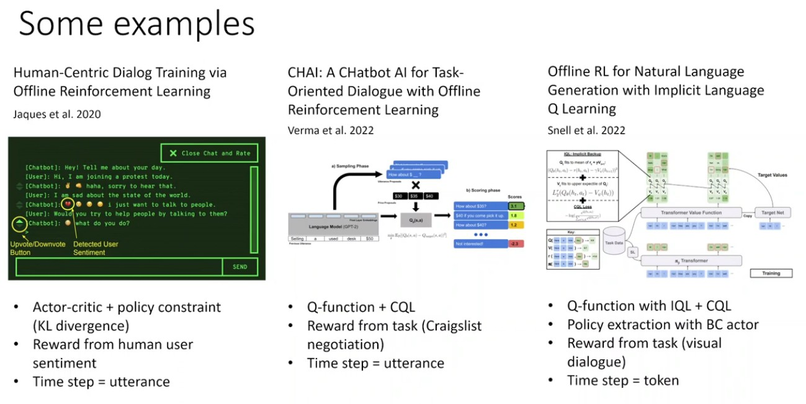

몇 가지 논문을 살펴 보자.

* 왼쪽은 utterance 단위로 actor-critic과 policy constraint 아키텍처를 사용한다.
* 가운데는 utterance 단위로 CQL과 유사한 penalty를 사용한다.
* 오른쪽은 IQL과 CQL의 조합으로 훈련된 Q 함수를 사용한다.
즉, CQL penalty와 IQL backup을 함께 사용한다. 

## 4.5. Summary

  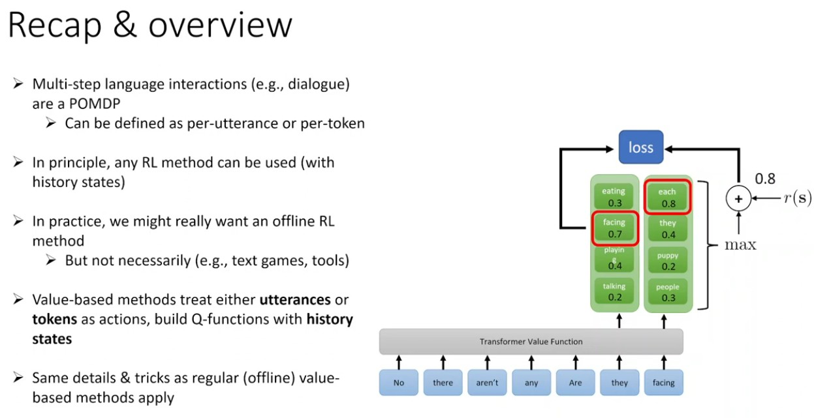

