# 1. Transfer Learning

특정 domain의 RL task의 경험을 새로운 downstream task에서 효율적으로 활용하는 방법을 살펴보자.

  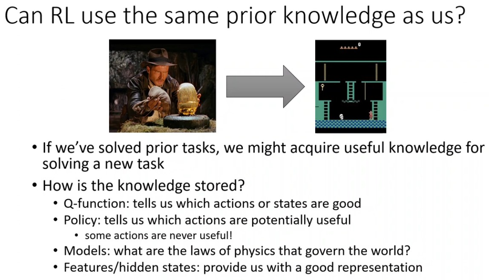

Montezuma's Revenge 처럼 model은 사람이 가진 사전 지식을 갖추고 있지 않기 때문에 reward 그 자체는 task를 어떻게 해결해야 하는지에 대한 좋은 가이드를 제공하지 않는다.
* 열쇠를 얻고, 문을 열면 reward를 준다.
* 하지만, 열쇠를 줍고 문을 여는 것이 반드시 게임을 이기는 올바른 방법이 아니다.
게임 후반에는 갈래 길로 인해 다른 장소로 이동할 수 있어, 결승점에 도달하기 위해 reward를 주는 모든 단계를 수행할 필요가 없을 수도 있다.
* 사람의 경우 사전 지식을 이용해 점수에 주의를 기울이지 않고 게임을 해결해나갈 수 있다.
  * 해골은 나쁜 것을 의미하고, 열쇠는 문을 여는 데 좋고, 사다리는 오르내릴 수 있다는 것을 알고 있다.
  * 새로운 방에 들어가는 것이 진전을 이루는 좋은 방법이라는 것도 알고 있다. 
  * 이는 세상에 대해 알고 있는 지식을 새로운 MDP로 transfer하는 일종의 transfer learning이다.

Lecture 13에서는 exploration 관점으로 얘기했다면 이번엔 transfer problem 관점에서 Montazuma's Revenge를 바라볼 것이다.

예를 들어 인디아나 존스 영화(source domain)를 보고 그것을 활용해 Montezuma's Revenge(target domain)를 해결하는 알고리즘을 만드는 상상을 할 수 있다.
이는 아주 원대한 목표로 현실적으로 아직 여기까지 도달하지 못했지만, 이를 해결하기 위한 transfer learning 알고리즘이 연구되고 있다.
* Q function, policy, dynamics/reward model 등을 transfer할 수 있다.
  * 물론 다리와 팔을 움직이는 것이 아니라 버튼을 눌러서 이동하는 것이기 때문에 유용하지 않은 actions을 배제하면 더 좋을 수 있다.
* 또한 feature나 hidden state를 transfer할 수 있다.
  * 시각적인 특징을 활용해 해골/사다리/열쇠 등 중요한 것들을 어느 정도 파악할 수 있다.
  * Visual pre-training은 실제로 큰 도움이 된다.

  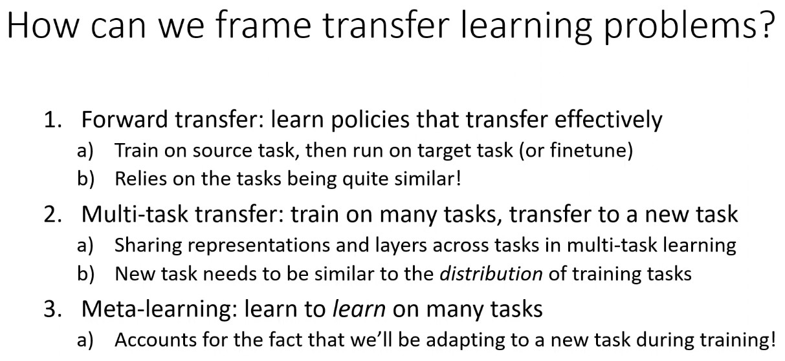

Transfer learning은 source와 target domain이 뭔지에 따라 활용해야 하는 알고리즘이 다르다.
* 예를 들어, 인디아나 존스 영화로 Montezuma's Revenge를 해결하는 알고리즘과 로봇이 많은 물체를 잡도록 학습시킨 후 새로운 물체를 잡도록 배포하는 알고리즘은 매우 다를 것이다.

하지만, 공통적으로 사용하는 몇 가지 아이어들이 있으며 이를 강의에서 다루겠다.
* Forward Transfer
  * 효과적으로 policy를 transfer하는 방법을 학습한다.
  * Source domain에서 학습 후 target domain에 바로 실행하거나 fine-tuning한다.
  * Source, target domain이 꽤 유사할 것을 요구한다.
  * 많은 연구들은 source domain을 target domain처럼 보이게 만들거나, source domain에서 학습된 policy가 traget domain으로 효율적으로 transfer할 방법을 찾는데 집중한다.
* Multi-task transfer
  * 여러 다른 tasks에서 학습 후 새로운 task로 전이한다.
  * 직관적으로 target domain이 source domains의 convex hull 안에 있는 것과 같다.
  * 하나의 물체에 대해서만 학습한 것보다 많은 다른 물체들로 학습했다면, 로봇이 잡아야 할 새로운 물체가 학습한 범위와 유사해 보일 수 있다.
  * Model의 특성 layer를 공유하거나 task representation을 학습해 새로운 task에 즉시 일반화하는 등 다양한 방법이 있다.
* Meta-learning
  * Transfer learning의 확장으로 나중에 새로운 target domain에 적응할 것이라는 사실을 인식하는 방식으로 source domain에서 특별한 방식으로 학습한다.
  * 종종 "Learning to Learn" 문제로 구성된다.

Meta-learning에 더 많은 원칙과 공통 알고리즘이 존재하기 때문에, 이번 강의에서는 forward transfer와 multi-task transfer는 간단하게 살펴보고 Meta-learning에 집중할 것이다.

Forward transfer와 multi-task transfer 연구들은 다소 산발적인 경향이 있어 소수의 원칙들로 정리하기 어렵다.
그렇기 때문에 광범위하게 적용 가능한 원칙들만 살펴 볼 것이다.

# 2. Forward Transfer

  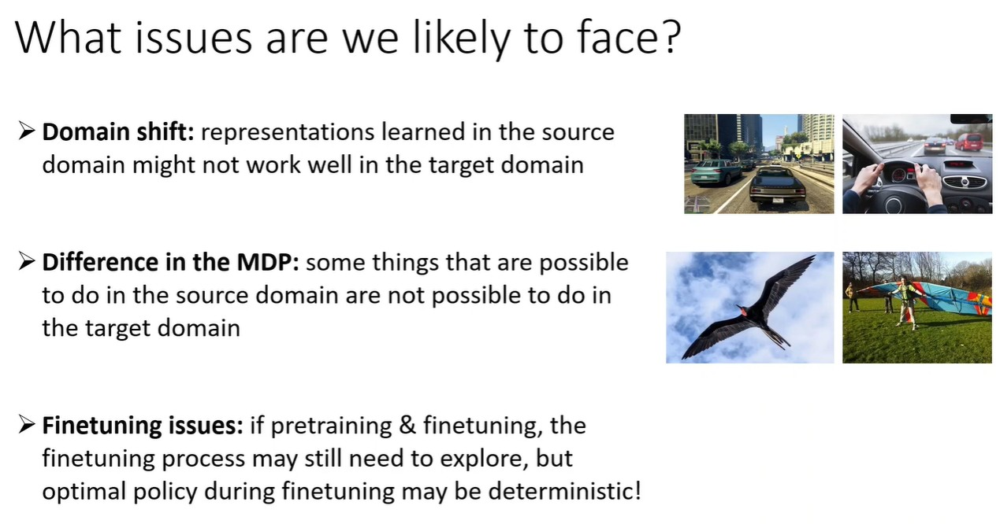

Transfer learning에서 마주칠 수 있는 문제는 위와 같다.
* Domain shift
  * 예를 들어, 시뮬레이터와 실제 환경의 시각적 차이(조명, 텍스처 등) 등이 있다.
  * Source domain에서 할 수 있는 것들이 target domain에서 전혀 불가능할 수도 있다.
* Difference in the MDP
  * Mechanism적으로 다르지만, source domain에서 상속을 받을 수 있을 만큼 구조적으로 유사한 경우를 다룬다.
    * Domain shift는 mechanism으로는 유사하다.
* Fine-tuning issues in RL
  * Source domain에서 학습된 optimal policy는 deterministic한 경향이 있어, target domain에서 exploration을 하지 않을 수 있다.
  * Exploration 부족으로 인해 새로운 환경에 적응하는 속도가 매우 느려지거나 실패할 수 있다.

  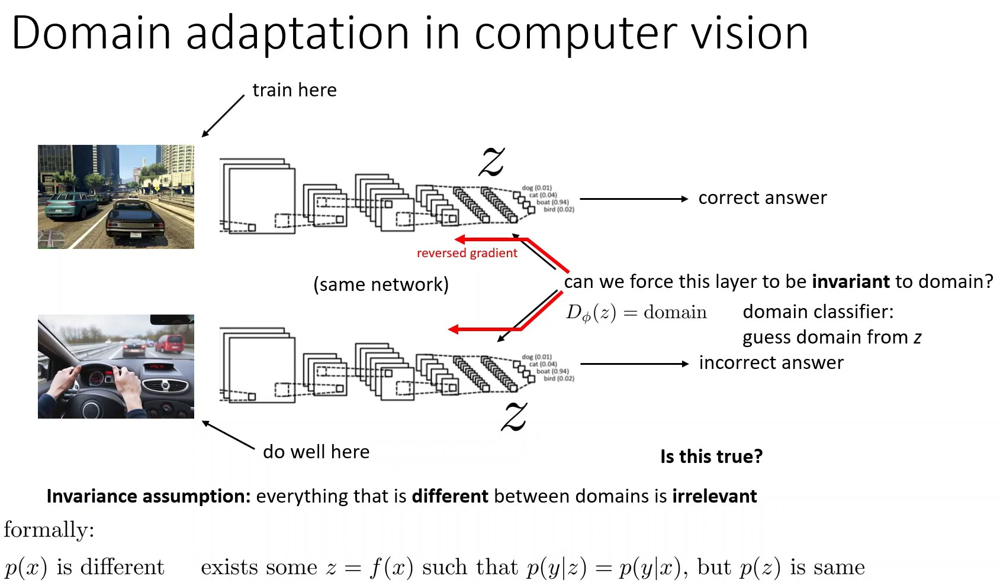

컴퓨터 비전에서의 domain shift의 예시를 살펴보자.
* Vision에 관한 것이지만, 고차원 representation에서의 일반적인 문제로 생각할 수 있다.

시뮬레이터 image로 학습하고 실제 세계의 image가 제시될 때 정책이 잘 작동하기를 원한다.
실제 세계의 image가 없을 수도 있지만, 몇 장의 image가 있다고 가정하자.
* 실제 세게의 action은 모르고 단지 image만 있다.

Domain shift가 존재하는 경우, 시뮬레이터에서 학습된 모델이 실제 세계에서 잘 작동하지 않을 수 있다.
이것을 완화하기 위해서 invariance assumption을 가정한다.
* Invariance assumption이란 두 domain에서 발생한 차이가 task를 수행하는 데 중요하지 않다는 가정이다.
  * 예를 들어, 현실 세계에서 비가 오더라도 근본적으로 운전하는 방법은 변하지 않는다.
* Invariance assumption을 수식으로 표현하면 다음과 같다.
  * $p(x_1) \neq p(x_2)$
  * $z = f(x_1) = f(x_2)$
  * $\therefore p(y|x_1) = p(y|z) = p(y|x_2)$
* Invariance assumption는 완벽하지 않을 수 있다.
  * 예를 들어, 현실 세계에서 비가 오면 좋은 운전 습관이 달라지기 때문에 완벽하게 invariance asssumption을 만족하지 않는다.

Invariance representation $z$를 얻는 방법은 Domain confusion, Domain adversarial neural networks 등 여러 가지가 있지만, 기본 아이디어는 유사하다.
* Neural networks에서 중간 layer를 가져온다. 주로 convolution layer의 출력을 사용한다.
* 그런 다음 그 layer를 invariance하게 만들기 위한 loss term을 추가한다.
  * 즉, $f(x_1) = z = f(x_2)$로 만든다.
  * 그렇기 때문에 실제 세계의 image가 몇 장 필요하다.
* 예를 들어, 그 layer 이후 descriminator $D_\phi(z)$를 도입해 두 domain을 구별 못하게 학습할 수 있다.
  * Invariance representation $z$를 만들기 위해 discriminator를 학습 하는 구조는 방법은 다양하다.
* 반드시 Target domain에서 RL을 실행할 필요는 없다.

위의 아이디어에서 주의할 점은 target domain의 데이터가 좋지 않을 경우이다.
* 예를 들어, 실제 환경에서 초보 운전자의 데이터만 있다고 하자.
* 그럼 $z$는 좋고 나쁨에 대해서도 invariance해지기 때문에 $z$에서 좋은 운전 데이터가 사라질 것이다.

  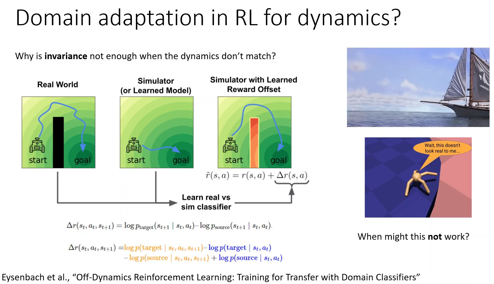

Dynamics가 다른 경우를 살펴보자.
이땐 invariance를 강제하는 것은 좋은 아이디어가 아니다.

한 가지 방법은 target domain에서 할 수 없는 일을 하는 source domain의 agent에 penalty를 주도록 reward function을 변경하는 것이다.
* 출발점에서 목표지접까지 갈 때 source domain에서는 벽에 막혀 있지 않지만, 실제 환경에서는 벽에 막혀 있다고 가정하자.
* Target domain에서의 경험을 기반으로 target domain에서 불가능한 일을 source domain에서 하는 것에 대해 매우 큰 음수 reward을 제공하도록 reward function을 변경할 수 있다.
* 이것은 domain adaptation과 매우 유사한 아이디어이지만, representation을 invariance하게 변경하는 대신 behavior를 invariance하게 변경한다.

이전의 invairance 기법과 매우 유사한 개념들이 실제로 reward function을 계산하는 데 사용될 수 있다. 
* 원하는 최적 action으로 이어지는 reward function은 target domain에서 transition이 발생할 확률의 로그 확률에서 source domain의 로그 확률을 뺀 것이다.
* 즉, target domain에서 발생할 가능성이 있는 transition의 확률을 높이는 것이다.
* 이 quantity를 근사하는 방법은 여러 가지가 있고 그 중 하는 discriminator를 학습하는 것이다.
  * 2개의 discriminator가 필요하다. 하나는 $(s, a, s^\prime)$에 대한 것이고, 다른 하나는 $(s, a)$에 대한 것이다.
  * Reward function은 $(s, a, s^\prime)$ discriminator의 출력값에서 $(s, a)$ discriminator의 출력값을 뺀 것이다.
  * 이는 조건부 확률 $p(s^\prime|s,a) = \frac{p(s,a,s^\prime)}{p(s,a)}$이기 때문에, 로그를 취하면 분모인 $p(s,a)$ term을 빼줘야 한다.
* 자세한 내용은 논문을 참고하자.

핵심은 invariance 아이디어를 기반으로 dynamics shift를 다룰 수 있다는 것이다.

하지만, source domain이 target domain에서 필요한 behavior를 허용하지 않을 수 있다.
* 예를 들어, source domain에서 벽에 막혀있지만, target domain은 뚫려 있는 경우를 다루지 못한다.
* 가장 이상적인 것은 두 domain의 교집합을 학습하는 것이다.

  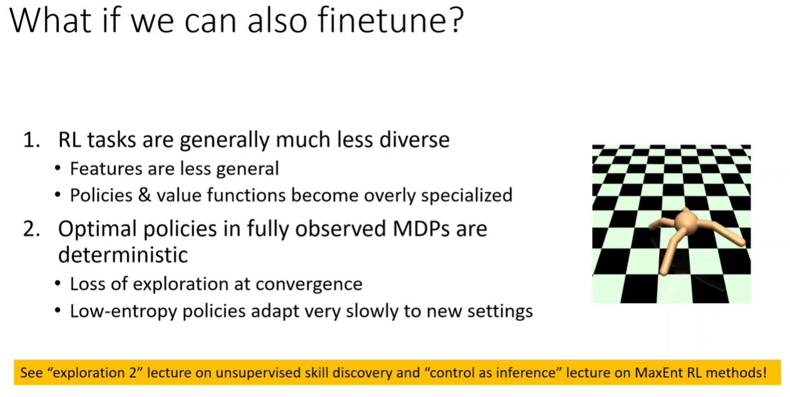

Supervised learning에서의 fine-tuning보다 RL에서의 fine-tuning을 더 어렵게 만드는 몇 가지 문제들이 있다.
* RL task는 일반적으로 덜 다양하다.
  * 컴퓨터 비전이나 자연어 처리에서의 pre-train 및 fine-tuning은 일반적으로 수백만 개의 image나 수십억 줄의 text와 같은 매우 광범위한 설정에서 pre-train하는 시나리오에 의존 후, 훨씬 더 좁은 domain에서 fine-tuning한다.
  * RL에서는 일반적으로 그렇게 작동하지 않는다. RL에서는 pre-train할 tasks가 훨씬 더 좁을 수 있다.
* 완전히 관찰된 MDP에서의 최적 정책은 결정론적인 경향이 있다.
  * 학습할수록 policy은 더 deterministic하게 된다.
  * 이것이 첫 번째 문제와 결합되면 큰 문제가 될 수 있다. 
    * 첫 번재에서 pre-train RL task가 더 좁기 때문에 overfitting이 발생할 가능성이 높고 이것에 policy가 deterministic하면 fine-tuning이 더 어려워질 것이다.
  * Policy가 더 결정론적이 될수록 exploration을 덜 하게 된다.
  * 따라서 새로운 설정에 매우 느리게 적응하게 된다.

위의 문제들로 SL에서의 방법을 그대로 적용하는 것은 효과적이지 않고, 더 다양한 것을 고려해야 한다.
* 이것을 위한 단 하나의 기법은 없다.
* 한 가지 가능한 것은 lecture 14 unsupervised skill discovery와 lecture 19 control inference에서의 max-ent RL 방법으로 사전에 다양한 task를 해결할 수 있도록 policy를 학습하는 방법이 있다.

하지만 안타깝게도 여기에 매우 일반적이고 광범위하게 적용 가능한 원칙들이 없기 때문에 이것에 대해 더 자세히 다루지는 않겠다.

  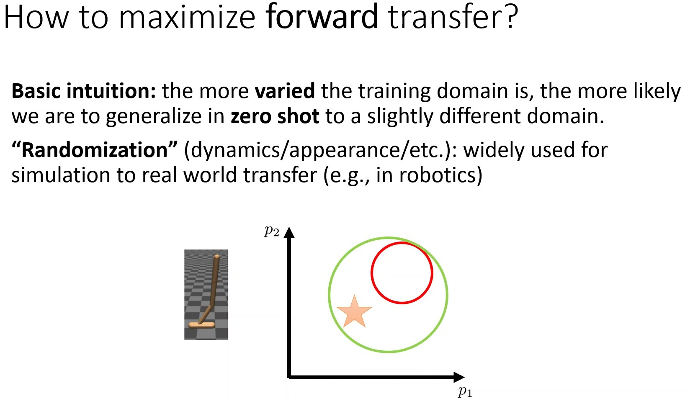

Transfer learning에서 다른 유용한 방법은 source domain을 약간 조작하는 것이다.
이것의 직관은 source domain의 다양성을 높여 target domain으로의 zero-shot generalization을 높이는 것이다.
* 항상 가능한 것은 아니지만, source domain에 어느 정도 제어권이 있다면 transfer를 효율적으로 하는 몇 가지 방법이 있다.

한 가지 방법은 randomization이다.
다양한 물리적 parameter의 변동성에 대한 policy의 robustness와 generalization을 높이기 위해 source domain에 더 많은 무작위성을 추가하는 것이다.

  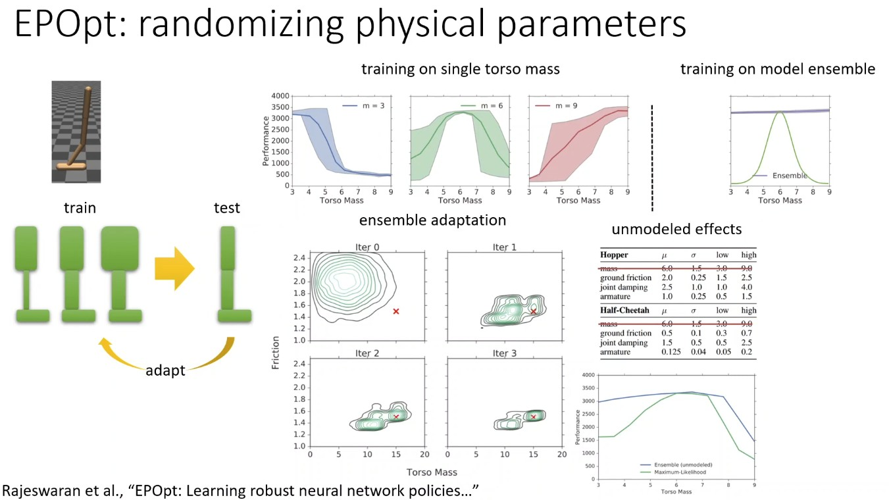

위의 논문은 deep RL에 물리적 parameter에 randomization을 적용한 연구이다.
* 한 hoper에서 학습하고 다른 질량 parameter를 가진 hopper에서 테스트 한다.
* 단일 setting으로 하면 transfer가 잘 안될 수 있으니 다양한 다른 parameter setting에서 학습하여 transfer를 더 효율적으로 한다.

실험 결과를 살펴 보자.
* 단일 질량으로만 학습하면 질량이 달라질수록 성능이 떨어진다.
* 여러 질량을 고려해 학습하면 성능이 유지된다. 즉, robust한 policy가 학습된다.

Robustness와 optimality 사이에 trade-off가 있을 것이라 생각할 수 있는데, 많은 경우에 그렇지 않다는 것을 살펴 볼 수 있다.
* 약간의 free lunch를 예상할 수 있는 이유 중 하나는 deep neural network가 강력하기 때문이다.

또 하나의 흥미로운 관찰은 충분한 parameters를 무작위화하면 실제로 무작위화되지 않은 다른 parameters들에 대한 robustness가 생긴다는 것이다.
* 위 연구에서는 4가지 물리적 parameter에 대해 하나를 제외하고 무작위화를 했다.
* 질량은 항상 동일하지만 마찰, 관절 감쇠 및 전기자를 변경했고, 그 결과 실제로 질량에 대해 꽤 robust한 것을 발견했다.
* 이는 물리적 parameter가 redundant effects를 가지기 때문이다.
  * 질량을 줄이는 것을 마찰을 줄이는 것과 같다.
  * 따라서 마찰을 변경하는 것이 질량을 변경하는 것과 정확히 같지는 않지만, 마찰을 무작위화하면 질량에 대해 조금 더 robust해진다.
* 따라서 충분한 parameters를 변화시키면, 변화시키지 않은 parameters들에 대해서도 여전히 약간 robust할 수 있다.

Target domain에서 약간의 경험을 얻으면 약간 적응하고, parameters 분포를 target domain에 더 가깝게 변경하면 더 잘 작동할 것이다. 
Radomization 아이디어는 RL transfer learning에서 매우 광범위하게 사용된다.
* 드론 날리기, 보행 policy 학습하기 등에서 인기 있다.

  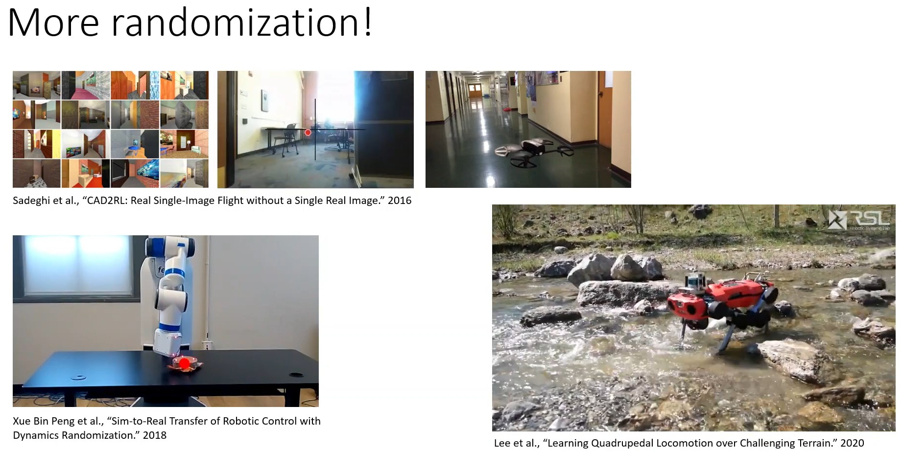

  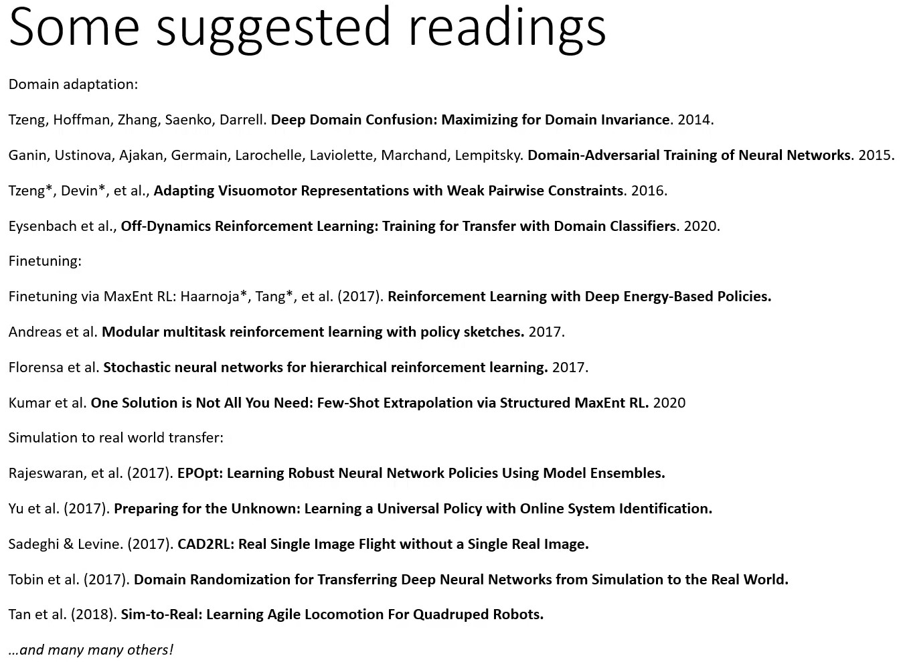

# 3. Multi-task Transfer

Multi-task transfer에 대한 간단한 아이디어를 살펴보자.
* 나중에 meta learning을 논의할 때 더 많이 논의할 것이다.

기본 아이디어는 여러 tasks를 학습함으로써 더 빠르게 학습하고 더 잘 transfer할 수 있다는 것이다. 
* Tasks를 개별적으로 학습할 수 있지만, tasks가 일부 공통 구조를 공유할 가능성이 매우 높다.
* Randomization과 유사한 직관으로, 더 다양한 학습 상황이 있을수록 테스트 상황이 어느 정도 익숙해 보일 가능성이 더 높다.

Multi-task transfer를 위한 다양한 기법들이 제안되었지만, 전반적으로 작동하는 단 하나의 킬러 기법은 없다.

  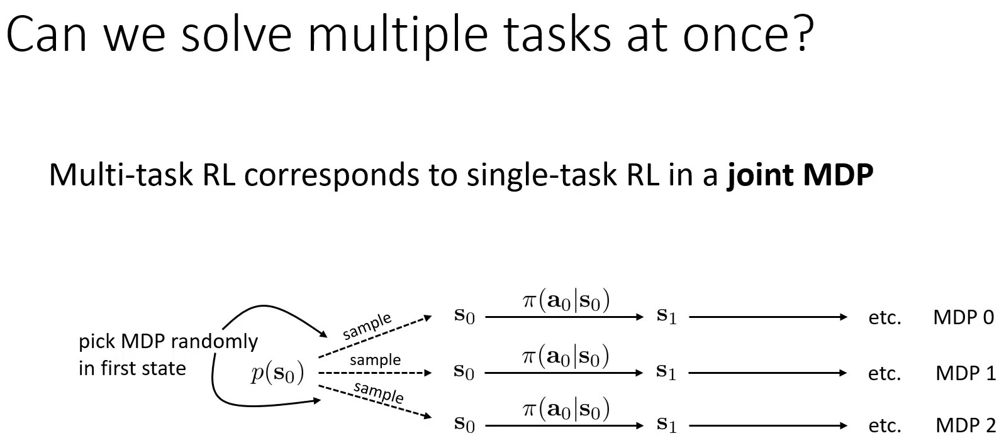

Multi-task RL은 joint MDP에서의 single-task RL에 해당한다.
* 표준 RL setting에서는 initial state $s_0$를 $p(s_0)$에서 샘플링하고 policy를 roll-out한다.
* Multi-task 문제에서는 initial state distribution만 변경하면 된다.
  * 예를 들어, 동일한 policy로 여러 다른 Atari 게임을 학습하는 경우, 일반 Atari 게임에서 initial state 분포는 그 게임의 시작이다. 
  * Multi-task Atari MDP에서 initial state 분포는 게임들의 분포이다.
  즉, 첫 번째 time step에서 게임을 샘플링(선택)하고, 그 이후에 그 게임을 플레이한다.

Atari 게임은 화면을 보면 어떤 게임을 하고 있는지 알 수 있다.
하지만, Multi-task learning을 표준 RL 문제로 인스턴스화하려면 agent에게 어떤 task를 해야 하는지 나타내기 위한 context를 할당해야 한다.
* 집에 로봇이 있고 로봇이 동일한 initial state에서 빨래를 하거나 설거지 등을 할 수 있다고 하자.
그러면 로봇이 수행해야 할 일을 context로 전달해야 한다.
* Context의 형태는 one-hot vector, discriminator, target image or text 등이 될 수 있다.
* 이를 contextual policy라고 한다.

  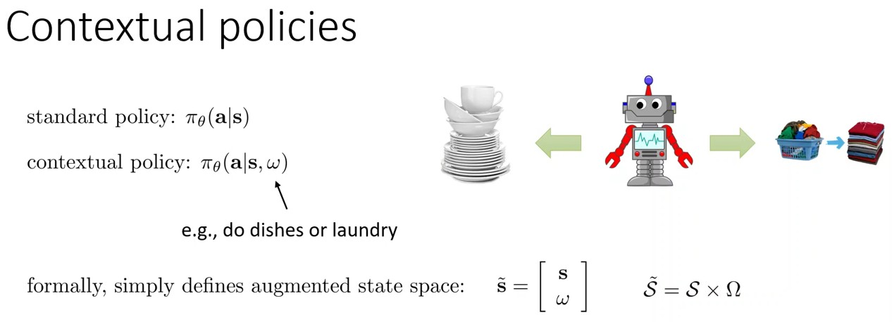

표준 policy가 $\pi(a|s)$라면 contextual policy는 $\pi(a|s, \omega)$이다.
* Actor-critic 방법이나 Q learning 방법으로 학습한다면 Q function도 omega $\omega$를 입력으로 받는다.
* Context를 state에 추가하기 위해 state space를 증강하기만 하면 된다.
  * $\omega$를 state에 추가하여 MDP 정의만 변경하면 기존 알고리즘을 변경할 필요가 없다.

  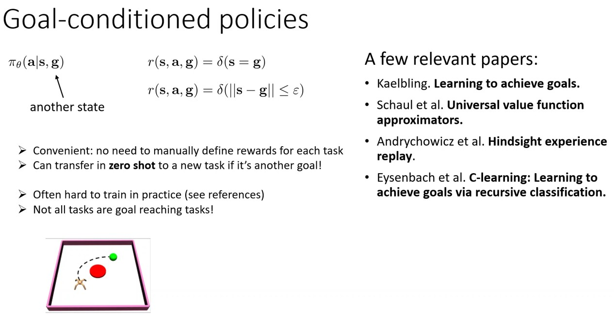

Contextual policy의 가장 일반적인 형태는 goal-conditioned policy이다.
* 여기서 context $\omega$는 goal state를 의미한다. 
* Reward는 현재 state가 목표 state(context)에 도달했는지 여부로 정의된다.
* 즉, 여러 task 중 원하는 task (goal state)를 하도록 policy를 학습하는 것이다.
* Reward를 수동으로 정의할 필요가 없기 때문에 특히 편리할 수 있다.
* 새로운 task가 다른 goal state로 표현되면 zero-shot transfer를 할 수 있다.

하지만 몇 가지 단점이 있다.
* 일반적으로 goal-conditioned policy를 학습하기 어렵다.
  * Lecture 14의 예시와 같이 빨간 원을 피하면서 초록 위치에 도달해야 할 경우, 이를 설명하는 single goal이 없다.
* 문제 정의는 간단하지만, 잘 작동하게 만들려면 다양한 트릭이 필요하다.
* 강의 범위를 벗어나므로 자세한 것은 다양한 논문을 참곻자.

# 4. Meta Learning

Meta learning은 multi-task learning의 확장된 개념이다.
* Multi-task learning은 단순히 여러 task를 잘 해결하는 방법을 학습한다.
* Meta learning은 여러 tasks를 활용해 새로운 task를 더 빠르게 학습하는 방법을 배운다.
 
## 4.1. Meta Learning in Supervised Learning

  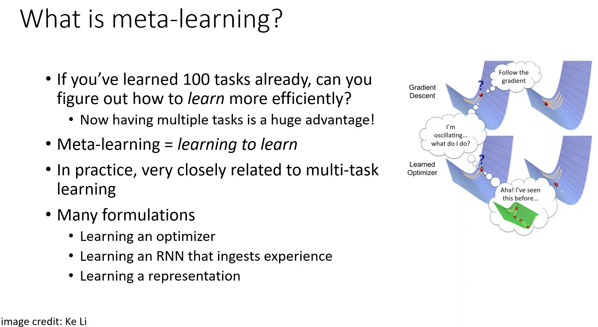

Meta learning은 여러 task를 학습 과정을 일반화해서 새로운 task 습득을 효율적으로 하는 것이다.
* 따라서 meta learning은 '학습하는 방법을 학습하는 것'이다.
* Optimzer 학습, 경험을 통해 새로운 task를 해결하는 RNN 학습, 새로운 task에 빠르게 fine-tuning될 수 있는 representation 학습 등이 있다.
  * 매우 다른 것처럼 보이지만, 동일한 원리에 서로 다른 아케틱처를 선택한 것이다.
* RL 관점에서는 새로운 task를 빠르게 습득하기 위한 exploration 방법을 학습할 수 있고, network가 새로운 task에 맞게 feature representation을 수정할 수 있도록 훈련되었다면 쓸모있는 또는 쓸모없는 behavior를 빠르게 파악할 수 있다.

  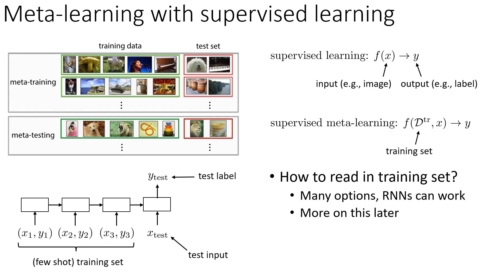

Computer vision에서의 task를 통해 supervised learning에서의 meta learning의 원리를 살펴보자.
* 매우 유사한 원리가 RL에서도 실제로 작동한다.

Meta-training dataset은 source domain이고 meta-testing dataset은 target domain이다.
* 각 task마다 classification 하는 종류가 다르다.
  * 첫 번째 task의 경우 클래스 0은 새, 클래스 1은 버섯, 클래스 2는 개, 클래스 3은 사람, 클래스 4는 피아노이고, 두 번째 task의 경우 클래스 0은 체조 선수, 클래스 1은 풍경, 클래스 2는 탱크, 클래스 3은 배럴 등 일 수 있다.
  * 이러한 할당은 수동으로 하거나 임의로 무작위화할 수 있으며, 위의 경우는 무작위이다.
* $\mathcal{D}^\text{tr}$은 meta-training와 meta-testing의 모든 trainin data를 의미한다.

Train set을 처리하기 위해 RNN, transformer와 같은 구조가 잘 작동할 수 있다.
* Few-shot으로 train image-label tuple을 입력하고 test image를 읽어 test label을 예측할 수 있다.
* 자세한 내용은 추후에 살펴 볼 것이다.

  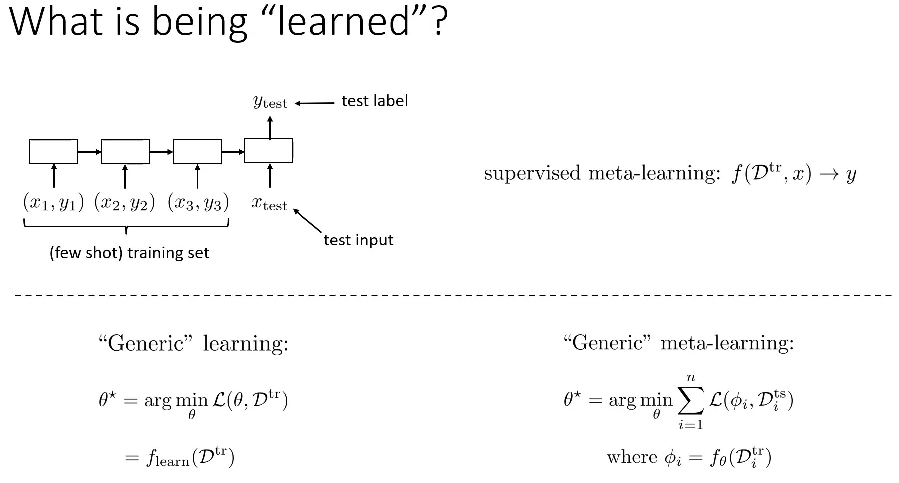

먼저, meta learning으로 무엇이 학습되고 있는지 좀 더 구체적으로 이야기 해보자.
학습하는 방법을 학습한다고 했을 때 '학습'이란 무엇일까?

일반적인 SL은 train set에서 loss function을 최소화하도록 parameter $\theta$를 학습한다.

일반적으로 meta learning은 parameter $\phi$에 대한 test set의 loss를 최소화하도록 parameter $\theta$를 학습한다.
* Train set를 입력으로 neural network $f_\theta$이 parameter $\phi$를 생성한다.
* 학습되는 parameter는 $\theta$이다.
* 즉, few-shot train set을 바탕으로 parameter $\phi$를 생성하고, 이 parameter $\phi$로 test set에 대해 예측을 진행한다.

  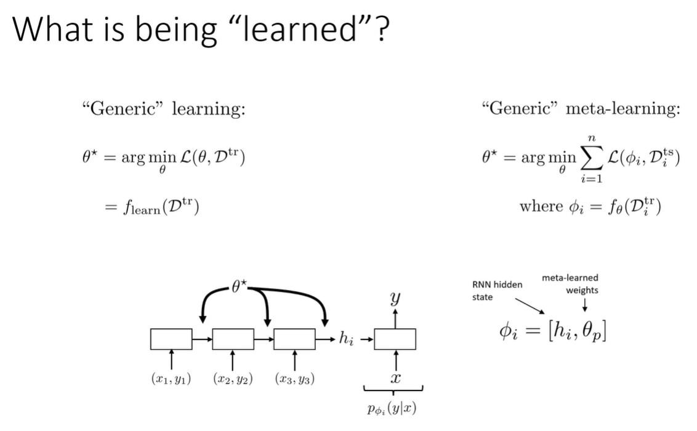

RNN의 구조에서 $\theta$는 RNN과 classifier parameter를 의미한다.
* $\phi$는 학습 데이터로 얻은 hidden state와 작은 classifier network의 parameter 인 $\theta_p$를 의미한다.
* Image와 label을 RNN encoder에 입력해 hidden state $h_i$를 얻고, label을 예측하는 작은 classifier에 전달된다.

Target domain에서도 유사하게, train data image (few-shot)를 바탕으로 target domain의 hidden state를 생성하고 classifier로 예측을 진행한다.

## 4.2. Meta Learning in RL

  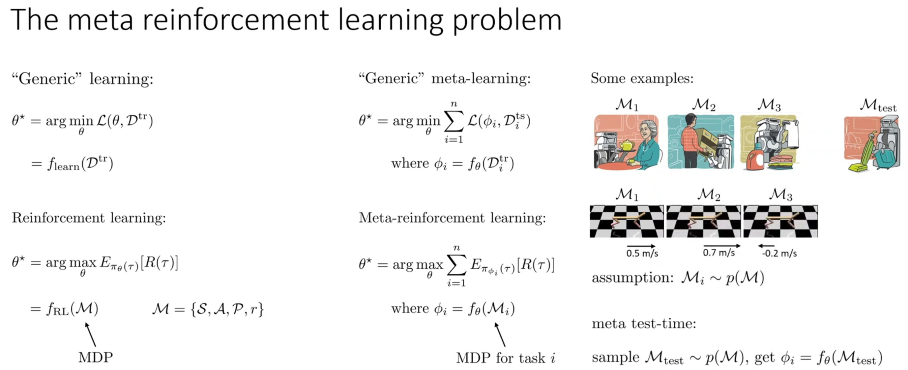

Supervised learning에서의 meta learning과 유사한 방법을 적용할 수 있다.
* 일반 RL은 policy $\pi_\theta$ 하에서 reward 기댓값을 최대화한다.
* Meta RL은 $\pi_\phi$하에서 reward 기댓값을 최대화한다.
  * Parameter $\phi_i$는 학습된 함수 $f_\theta$를 MDP $M_i$에 적용하여 얻는다.
  * 학습하는 parameter는 $\theta$이다.
* Meta train/test의 MDP는 동일한 $p(M)$에서 샘플링 된다고 가정한다.
  * Supervised learning과 같이 train/test가 같은 분포에 있을 때만 meta learning도 잘 작동한다.

  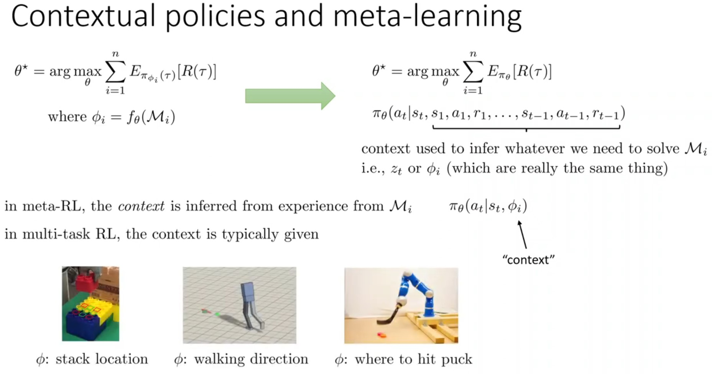

Meta learning을 test MDP에서의 모든 경험에 조건화된 policy $\pi_\theta$를 훈련하는 문제로 볼 수 있다.
* Test MDP 또는 현재 실행 중인 MDP에서의 경험을 받아 summary statistic으로 압축하고, 이를 policy의 action을 결정하는 데 활용한다.
* 이는 해당 MDP에서 경험한 모든 history 이력에 조건화된 policy를 갖는 것과 본질적으로 동일하다.
* 기본적으로 contextual policy와 같다.
  * Context가 MDP $M_i$에서의 모든 경험으로 정의된다.
  * $\omega$ 등으로 불리는 context를 $\phi_i$로 볼 수 있다.
* Multi-task RL에서는 context가 주어졌지만, meta-learning에서는 context를 추론하는 것이다.

  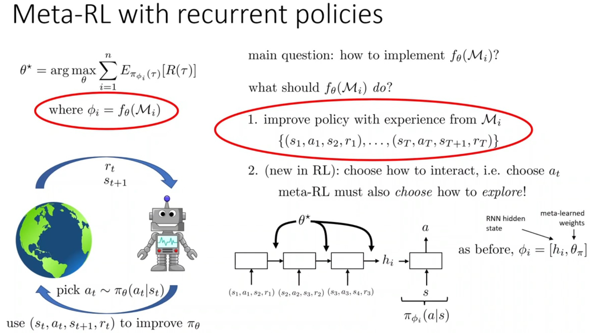

$f_\theta(M_i)$를 구현하는 방법을 조금 더 자세히 살펴 보자.
* $f_\theta(M_i)$가 하는 일은 경험으로부터 policy를 개선하고 exploration을 더 잘 하도록 돕는 것이다.

먼저 경험으로부터 policy를 개선하는 것에 대해 이야기 해보자.
* 경험은 transition $s, a, r, s^\prime$으로 구성된다.
* SL와 유사하게 RNN 등을 활용해 경험을 입력할 수 있다.
  * 동일한 MDP 하에 다양한 episode에서 샘플링된 transition을 함께 encoding하기 때문에 하나의 episode history에 의존하는 policy와 다르다.
  * 경험은 RNN의 hidden vector로 표현되고, hidden vector와 현재 state를 policy network에 전달해 action을 출력한다.

  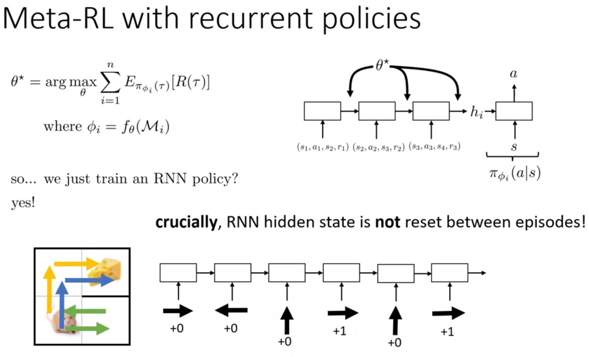

쥐가 치즈를 얻는 예시를 살펴 보자.
* Episode마다 벽과 치즈의 위치가 달라진다고 가정한다.
* 첫 번째 episode에서 오른쪽, 왼쪽, 위, 오른쪽으로 이동해 reward를 얻고 episode가 끝났다고 가정하자.
* 두 번째 episode가 시작할 때, 첫 번째 episode의 모든 경험을 유지하기 때문에 쥐는 위, 오른쪽으로 이동해 reward를 얻고 episode가 종료된다.
  * 새로운 episode가 시작될 때 RNN의 hidden state를 초기화하지 않으므로 RNN은 context를 가지고 있어 치즈의 위치를 파악할 수 있고, exploration 방법도 파악할 수 있다.

  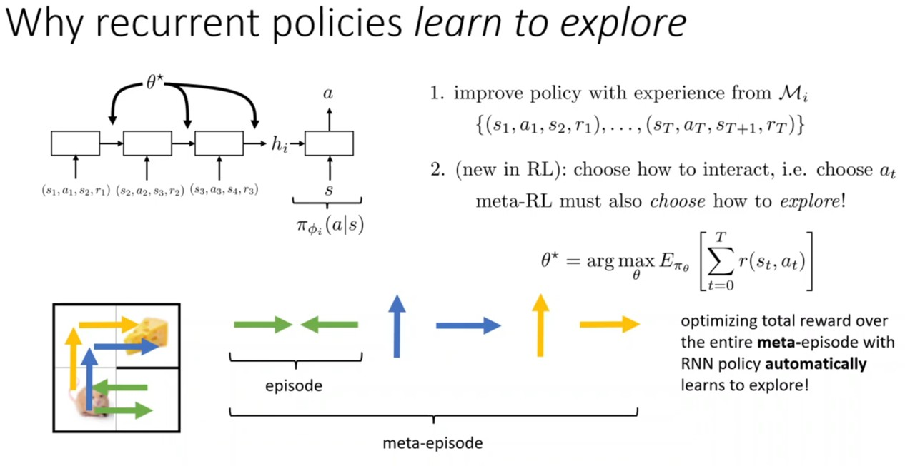

Reccurent policy가 exploration을 효과적으로 학습하는 이유에 대해 살펴 보자.
* 각 색상은 하나의 epiisode를 나타내며, episode 사이에 initial state로 초기화된다.
* 전체 sequence는 일종의 meta episode로, meta episode는 여러 epsiode의 연결로 구성된다.

RNN이 첫 번째 episode에서 오른쪽으로 가는 것에 대한 보상을 보지 못했다면, meta learning이 성공적으로 이루어졌다면, 두 번째 episode에서 오른쪽으로 가지 않고 다른 곳으로 가야 한다는 것을 알아야 한다.
다양한 MDP에서 meta learning이 이루어진다면 이러한 패턴이 명확해질 것이다.
* Exploration을 설계하는 것이 아니라 reward를 최대화 하도록 exploration을 학습할 수 있다.
* Meta episode가 주어졌을 때 전체 episode reward의 합을 최대화하기 위해, 초반 episode에서는 exploration하고 후반 episode에서는 그것을 활용하는 패턴을 자연스럽게 학습할 것이다.

  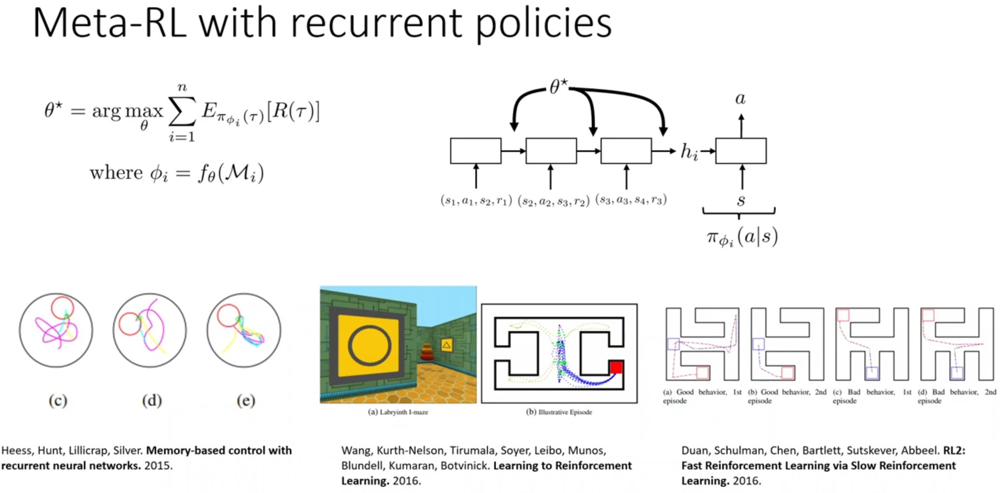

Actor-critic, policy gradient 등 다양한 방식으로 meta learning의 아이디어를 구현해왔다.

최근에는 RNN 대신 transformer가 사용되고 있지만, 원리는 동일하다.
* MDP와 전체 경험 history를 policy에 알려주면 같은 분포의 새로운 MDP에 대해 exploration하고 적응하는 방법을 스스로 파악하게 된다.

## 4.3. Gradient-based Meta Learning

Fine-tuning을 meta learning의 한 형태로 생각할 수 있다.
그리고 pre-train과 fine-tuning이 더 잘 작동하도록 meta learning을 수행할 수 있다.
이것이 gradient 기반 meta learning의 핵십 아이디어이다.
* 더 좋은 feature representation을 가질수록 새로운 task를 더 빠르게 학습할 수 있고, 새로운 task의 학습이 더 빠르게 이루어지도록 feature 자체를 최적화할 수 있다.

  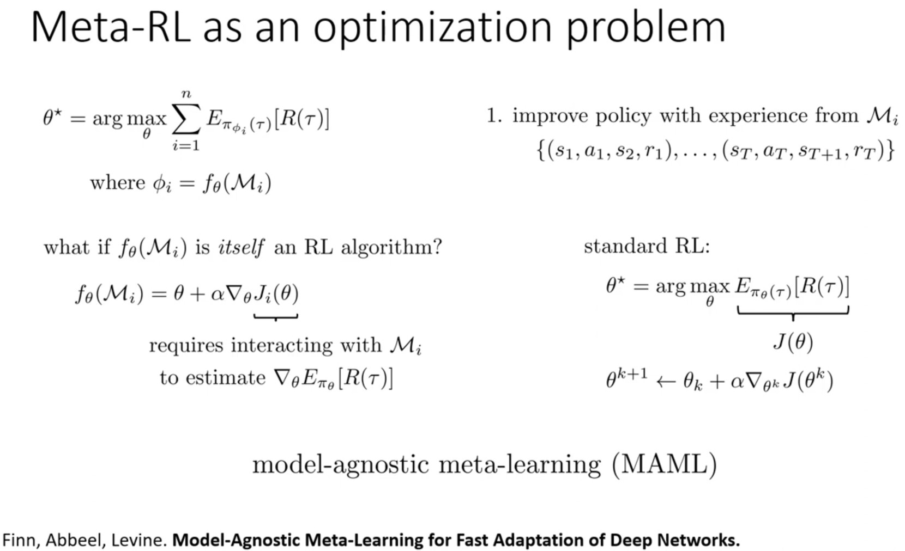

$f_\theta$를 meta learning하여 $f_\theta$가 meta tasks에서 높은 reward로 이끄는 $\phi$를 생성하도록 하였다.
이를 위해 $f_\theta$는 MDP $M_i$에서 지금까지 경험한 것들을 활용하여 $\phi_i$를 생성할 수 있어야 한다.

$f_\theta$ 자체가 모든 경험을 읽어들이는 RNN이 아니라 실제로 policy gradient처럼 작동하는 RL 알고리즘으로 생각할 수 있다.

일반적인 RL은 현재 task의 trajectory에 기반해 objective function $J(\theta)$를 계산하고 parameter를 업데이트한다.

$f_\theta$도 동일하게 $J_i(\theta)$로 parameter $\theta$를 업데이트한다고 하자.
$J_i(\theta)$의 gradient를 계산하려면 MDP $M_i$와 상호작용해야 한다.
이 최적화를 실제로 수행하는 것이 *MAML (Model-Agnostic Meta-Learning)*이다.
* MAML은 $f_\theta$가 RL 구조와 일치하는 특별한 parameterization을 가지는 meta learning의 한 종류이다.

  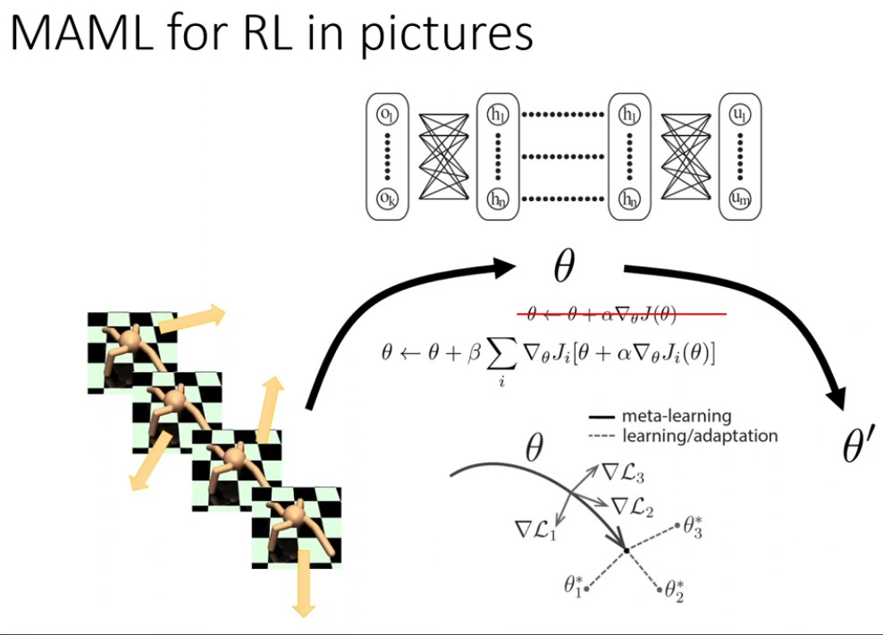

Gradient-based meta learning을 시각적으로 생각해보자.

본질적으로 모든 task에 대해 각 task의 gradient에 대해 업데이트된 parameter $\theta$가 reward를 최대화하길 원한다.
이것은 일종의 second-order 문제이다.
* MAML은 목표는 gradient step을 n번 밟은 이후의 성능(reward)을 최적화하고 싶은 것이다.
* $\theta_\text{new} \leftarrow \theta + \nabla_\theta J(\theta)$에서 업데이트된 $\theta$에 대한 reward를 최대화하는 것이다.
  * $\theta_\text{new}$ 자체가 $\theta$에 대한 함수이므로, $\theta_\text{new}$의 성능을 $\theta$에 대해 미분하면 $\nabla J(\theta)$를 다시 한 번 미분하게 되는 것이다.
  * 즉 $J$를 $\theta$로 두 번 미분하는 second-order인 것이다.

Parameter $\theta$의 space에서 각 task의 최적해 $\theta_1^\star, \theta_2^\star, \theta_3^\star$ 등이 n번의 gradient step 거리에 있는 지점을 찾는 것으로 시각화할 수 있다.
* Parameter space에서 task마다 최적 지점($\theta_1^\star, \theta_2^\star, \theta_3^\star$)이 지도 위에 흩어져 있다. 
* MAML은 그 모든 최적 지점들로부터 n 걸음 거리에 있는 공통 출발점 $\theta$를 찾는 것이다.
* 이 $\theta$가 MAML이 meta learning으로 찾으려는 좋은 초기값(다른 task로 쉽게 확장될 수 있는 균형 잡힌 초기값)이다.

Gradient-based meta learning을 활용하는 이유 다음과 가탇.
* Inductive bias를 가진다.
  * Inductive bias는 train data에 없는 새로운 data에 대해 일반화할 때 사용하는 assumption이다.
    * CNN의 inductive bias는 'image는 지역적 패턴이 중요하다'라는 가정이고, 이 덕분에 못 본 iamge도 잘 맞춘다.
  * RNN meta learning에서는 단순히 입력에 대한 답을 출력하는 것으로 어떤 방식으로 adaptation할지 구조적 제약이 없다.
  * 반면, MAML은 "adaptation = gradient step"이라는 구조를 처음부터 강제한다.
    * 즉, 새로운 task에 적응하는 방법은 gradient 업데이트라는 pre assumption인 inductive bias를 가진다.
* Neural network가 일반화되어 test set에서 학습 했을 때보다 더 많은 gradient tep을 수행할 수 있다.
  * RNN meta learning에서는 hidden vector를 기반으로 한 번의 forward pass로 새로운 task에 adaptation한다.
  * MAML의 adaptation은 gradient step을 수행하는 것이기 때문에, target domain에 대해 gradient step을 여러 번 더 수행해도 된다.
  즉, 초기 $\theta$에 대해 fine-tuning을 여러 번 수행해도 된다는 뜻이다.

  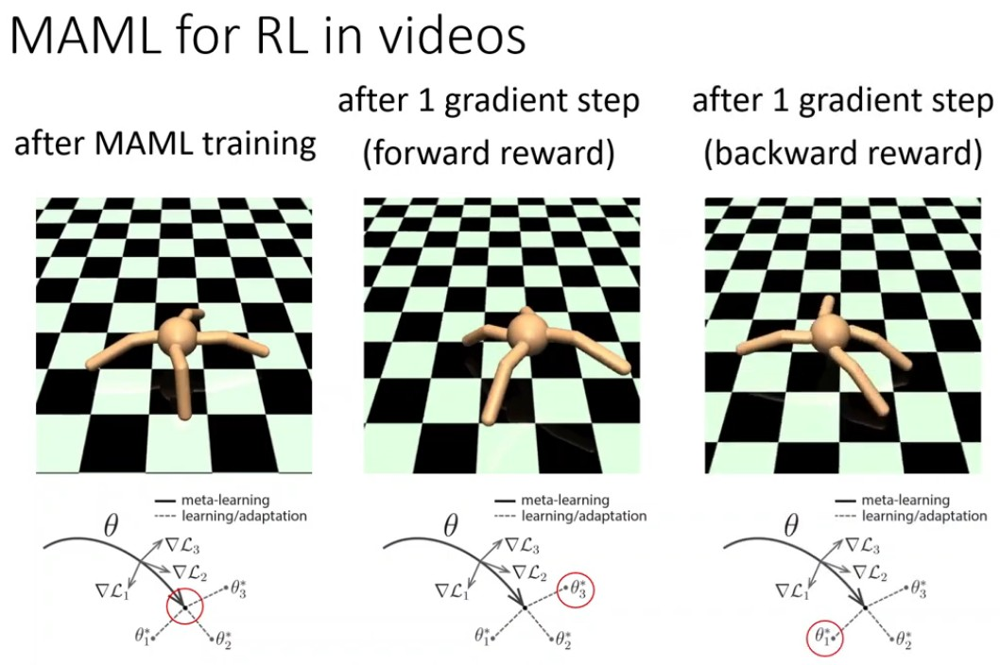

개미가 앞, 뒤, 왼쪽, 오른쪽으로 달리는 task 분포가 있다고 하자.
* Adaptation 전의 parameter의 policy인 경우, 개미가 제자리에서 달리는 것을 볼 수 있다.
* 하지만 앞으로 가는 reward로 한 번의 gradient step을 주면 앞으로 가고, 뒤로 가는 reward으로 한 번의 gradient step을 주면 뒤로 간다.

  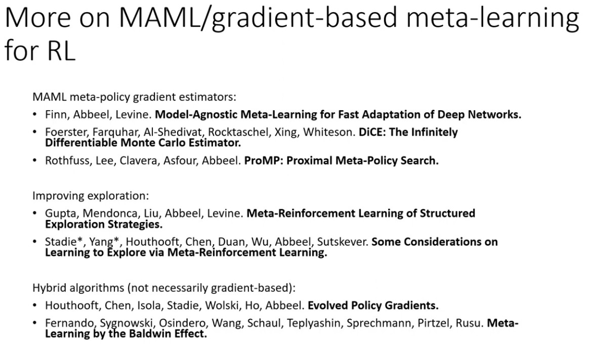

## 4.4. Meta-RL as a POMDP

History에 조건화하는 방식으로 meta learning을 수행하는 방식을 살펴보았다.
이는 observation history를 조건화하여 policy를 학습하는 POMDP 환경과 유사하다.
이 관점은 다양한 meta RL 방법들을 통합하는 더 나은 방식을 제공한다.

  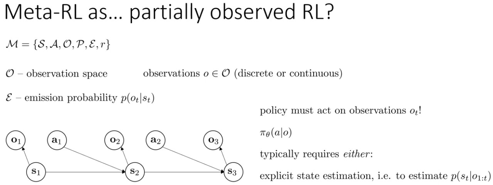

POMDP는 state와 action외에 overvation $\mathcal{O}$과 ovservation을 볼 확률인 emission 확률 $\mathcal{E}$이 추가된 것이다.
* Policy는 observation에 기반해 action을 선택한다.
* 이를 위해서 overvation history로부터 $p(s_t | o_{1:t})$를 추정하는 명시적 state 추정, 또는 메모리를 가진 policy가 필요하다.

  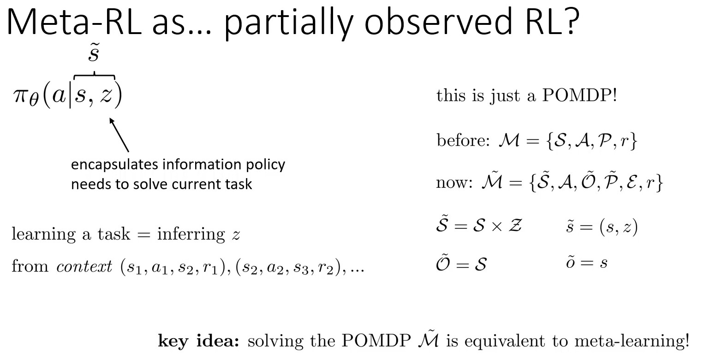

Policy $\pi_\theta(a|s,z)$를 생각해보자.
* $z$는 현재 task를 해결하는 데 필요한 정보를 담은 variable이다.
* Task를 학습한다는 것은 $z$가 무엇인지 추론하는 것과 같다.
  * Meta learning에서는 MDP $M_i$에서 수집한 경험 (transitions sequence)로 $z$를 추론한다.
* 이것은 POMDP 그 자체이다.
  * $z$가 무엇인지 모르는 상태에서 observation sequence로부터 $z$를 파악해야 하고, 그 뒤 task를 수행할 수 있다.
* 즉, state를 안다는 것은 $s, z$를 모두 아는 것을 의미한다.
  * 하지만, $z$는 관측되지 않고, $z, r$만 관측된다.

Task는 관측되지 않지만, state $s, z$가 관측되는 POMDP에서 높은 reward를 얻을 수 있다면, state와 reward만으로 새로운 task를 해결할 수 있게 된다.
* $z$는 task를 식별하는데 필요한 정보이다.
* Reward $r$를 활용하는 방법 중 하나는 state $s, z$와 함께 concate해서 RNN의 입력으로 넣는 것이다.

  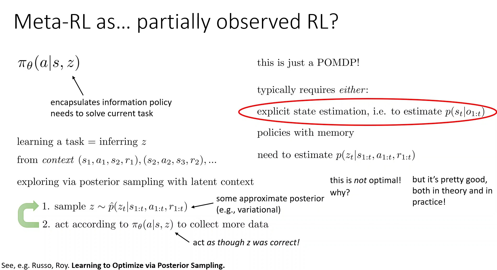

앞서 말했듯이, $z$를 추정하기 위해 observation sequence를 활용하는 명시적인 function $p(z_t|\{s, a, r\}_{1:t})$ 또는 메모리를 가진 policy가 필요하다.
메모리를 가진 policy는 RNN meta learner와 본질적으로 같다.
즉, task가 알려지지 않고 메모리로부터 추론되어야 하는 POMDP를 푸는 방법으로 볼 수 있다.

명시적으로 $z$를 추정하는 알고리즘 $p(z_t|\{s, a, r\}_{1:t})$을 살펴보자.
* 이 알고리즘은 어떤 특성을 가진 meta-learning 알고리즘의 한 종류로 해석된다.
* 알지 못하는 $z$를 일종의 latent variable로두면, variational inference를 활용해 task의 representation을 얻을 수 있다.
* 학습 후, posterior sampling (thmpson sampling)으로 exploration을 진행한다.
  * 처음에는 task가 무엇인지 모르기 때문에 $z$를 무작위로 선택하고, 더 많은 정보를 수집하면서 올바른 task로 수렴한다.

1. History가 주어졌을 때 $z$에 대한 belief에서 $z$를 샘플링
* Variational inference로 학습된 approximate posterior를 사용한다.
2. $\pi_\theta(a | s, z)$에 따라 행동하여 더 많은 데이터를 수집

위의 2 단계를 반복하고, meta learning은 $\pi_\theta$와 state estimator에 대한 variational approximation을 함께 학습하는 것으로 구성된다.
* 실제로 잘 작동하는 경향이 있다.
* 하지만, meta-learning에서 exploration 측면으론 posterior sampling이 최적이 아니다.
  * 뒤에서 좀 더 자세히 설명한다.

  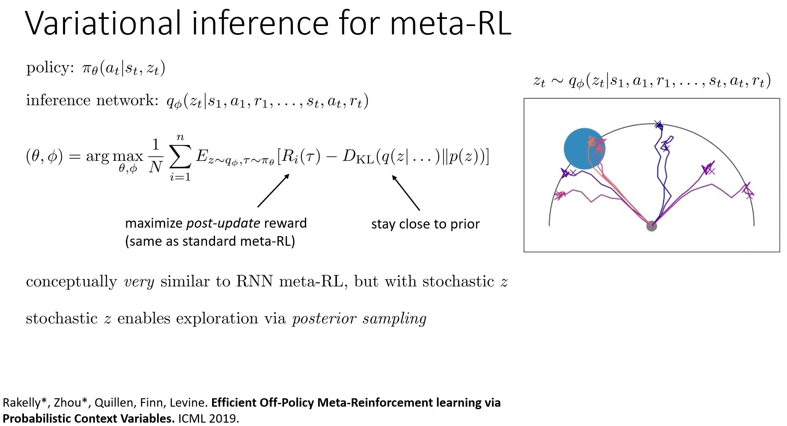

Meta-learning을 POMDP로 해석하는 아이디어를 기반으로 다양한 기법들이 제안되었다.
이번 강의에서는 PEARL 알고리즘을 다룬다.

PEARL은 state $s$와 $z$에 조건화된 정책을 학습한다.
그리고 history 기반으로 $z$를 예측하는 inference network $q_\phi(\{s, a, r\}_{1:t})$을 학습한다.
* 전체 시스템은 이전에 다뤘던 variational inference와 매우 유사하다.
* 일반적인 meta-RL 방법으로 reward를 최대화하면서, prior와 $q_\phi(\cdot)$의 KLD를 최소화한다.
  * KLD 최소화는 $z$가 최소한의 정보만 담도록 유도한다.

RNN meta-RL과 유사하지만, 차이점은 encoder가 stochastic인 latent variable $z$을 추론한다는 것이다.
* $z$를 posterior sampling으로 얻음으로써 exploration이 가능하게 된다.

우측 그림을 살펴보면 이 방법론이 sub-optimal임을 알 수 있다.
* 여러 task의 target이 항상 반원 위에 있고, 파란 원이 현재 task의 실제 target이라고 하자.
* Agent는 처음에 파란 원을 모르지만, 반원 위를 무작위로 exploration하다가 높은 reward가 있는 영역에 도달하면 계속 그곳으로 간다.
* 즉, reward가 높은 영역에 도달하면 계속 그 부분만 exploit하고 전혀 exploration하지 않는다.

이를 해결하기 위한 방법 중 하나는 agent가 반원을 전체적으로 훑어 보상이 어디 있는지 찾은 다음 계속 그곳을 방문하는 것이다.
* 관심 있으면 다른 논문들을 참고하자.

  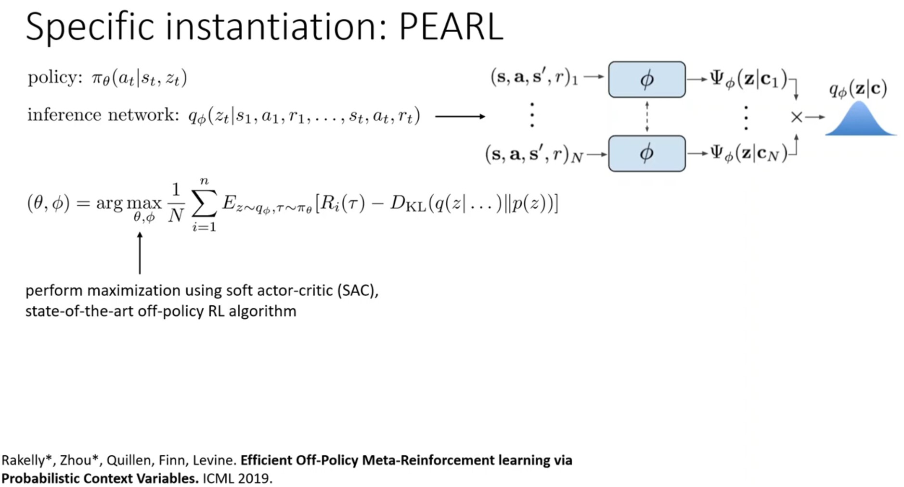

PEAL에서 구현할 때 선택해야 하는 것 중 하나는 encoder 설계이다.
* Encoder로 RNN을 사용할 수 있지만, 매우 단순한 encoder도 잘 작동한다.
* 모든 transtiion $s, t, a, s^\prime$에 대해 각각 featurize한 뒤, 그 features을 단순히 평균낸다.
  * 평균 feature representation으로 $z$ posterior의 평균과 분산을 생성한다.
  * Meta learning은 Soft Actor-Critic과 같은 off-policy Actor-Critic 알고리즘으로 수행되며, variational inference 절차와 잘 결합된다.
    * 차이점은 업데이트할 때 policy 뿐만 아니라 encoder도 함께 업데이트해야 한다는 것이다.
  * 대화, 시계열 등 순서에 의존해야 하는 것과 달리 전체적으로 어떤 패턴인지 파악만 하면 되기 때문에 평균으로도 충분하다.
* 이것으로 충분한 이유는, RNN과 달리 Q-learning 알고리즘처럼 transitions을 독립적으로 취급할 수 있기 때문이다. 
  * Q-learning은 transition의 순서를 신경 쓰지 않으므로, 여기서의 encoder도 순서를 신경 쓰지 않아도 된다.

  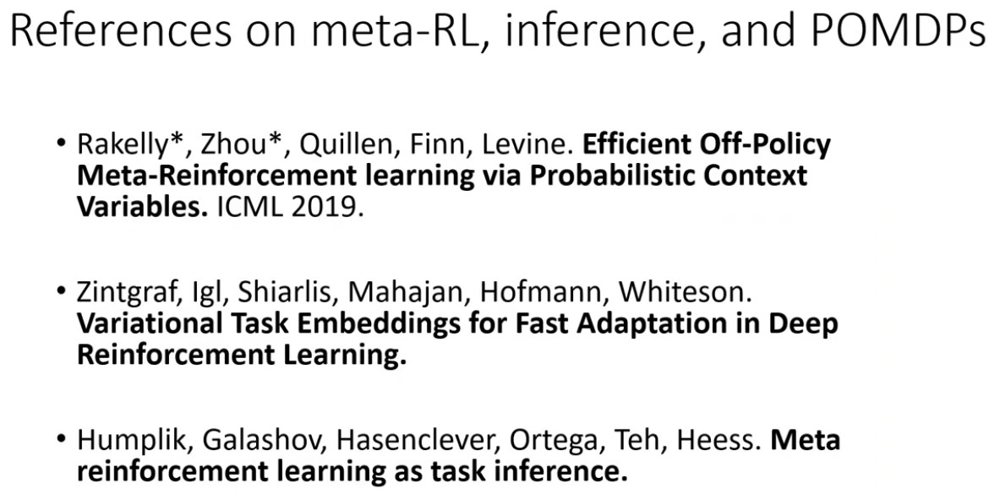

## 4.5. The three perspectives on Meta-RL

  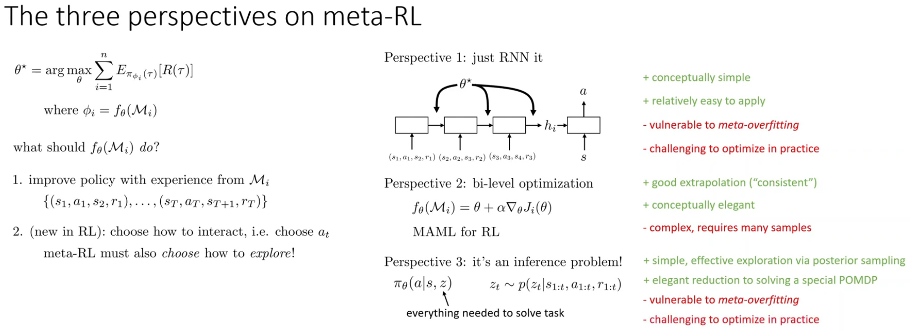

지금까지 Meta-RL을 3 가지 관점에서 살펴 보았다.
모두 MDP $M_i$를 입력받아 $f_\theta$로 표현하는 것으로, MDP에서 경험을 통해 policy를 개선하고 효과적으로 exploration하는 행동을 선택할 수 있어야 한다는 의미이다.
1. 경험 전체를 읽는 RNN
* 장점
  * 비교적 단순하고 적용하기 쉽다.
* 단점
  * Meta overfitting에 취약하다.
    * Test task가 train task 분포에서 약간만 벗어나도 좋은 결과를 내지 못할 수 있다.
  * Test task에서 더 이상 개선을 하지 않는다.
    * Test task에서 수집한 경험으로 RNN을 개선하지 않는다.
  * 최적화하기 어렵다.
    * Transformer와 같은 최신 sequence model이 최적화를 다소 쉽게 만들어 준다.
2. Gradient 기반 meta learning
* 장점
  * Test task에서 gradient step을 수행할 수 있기 때문에 좋은 extrapolation 능력을 가진다.
  * 개념적/수학적으로 우아하다.
* 단점
  * 구현하기 복잡할 수 있고, 많은 meta learning 샘플이 필요하다.
  * Policy gradient에서 actor-critic 방법 (TD 방법)으로 확장하기 어렵다.
3. Variational inference로 task에 대한 충분한 context를 가지는 $z$ 추론
* 장점
  * 단순하고 posterior sampling을 통한 효과적은 exploration을 제공한다.
  * 특수한 POMDP를 푸는 것으로 우아하게 환원된다.
* 단점
  * Meta overfitting에 취약하다.
  * 최적화하기 다소 까다롭다.

  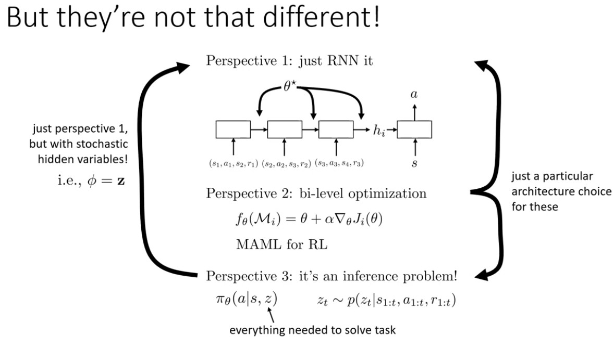

하지만 3 가지 방법은 크게 다르지 않다.
* Inference 바업에서 stochastic variable $z$를 사용한다는 점만 빼면 RNN 절차와 같다.
* Gradient 기반 접근법은 특정 아키텍처 선택을 통해 다른 두 방법으로 구현될 수 있다.
  * Gradient에 noise를 추가하면 MAML의 stochastic 버전을 만들 수 있고, 그러면 inference 과정과 매우 유사해진다.

## 4.6. Emergent phenomena

  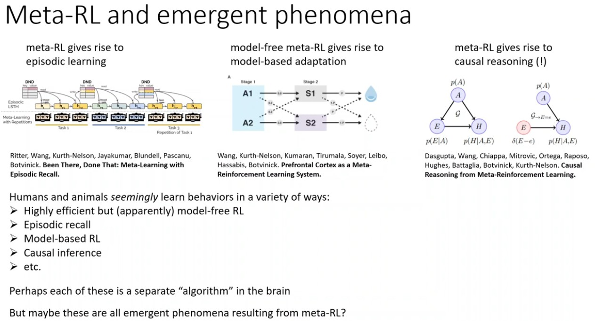

RL은 cognitive science(인지과학)의 겹치는 부분이 있다.
인간과 동물의 행동은 다양한 방식으로 행동을 학습한다.
* Model-free RL
  * 시행착오로 학습
* Episodic recall
  * 이전에 효과적이었던 기억을 즉시 떠올림
* model-based RL
  * 상황 모델링 후 계획

명확하지 않지만, 인간과 동물의 뇌는 위의 모든 방법을 특정한 시점에 하나씩 또는 동시에 실행하는 것처럼 보인다.
한 가지 가설은 이 각각의 것들이 '학습하는 방법을 학습'할 수 있는 어떤 포괄적인(overarching) 방법의 emergent property일 수 있다는 것이다.

많은 사람들이 meta learning이 어떻게 emergent learning을 이끌 수 있는지 연구했다.
1. Meta RL이 어떻게 episodic learning으로 이어질 수 있는지에 대한 연구
2. Model-free meta-RL이 어떻게 model-based adaptation으로 이어질 수 있는지에 대한 연구
3. Meta-RL이 어떻게 causal reasoning처럼 보이는 것으로 이어질 수 있는지에 대한 연구

자세한 연구는 각 논문들을 확인하자.